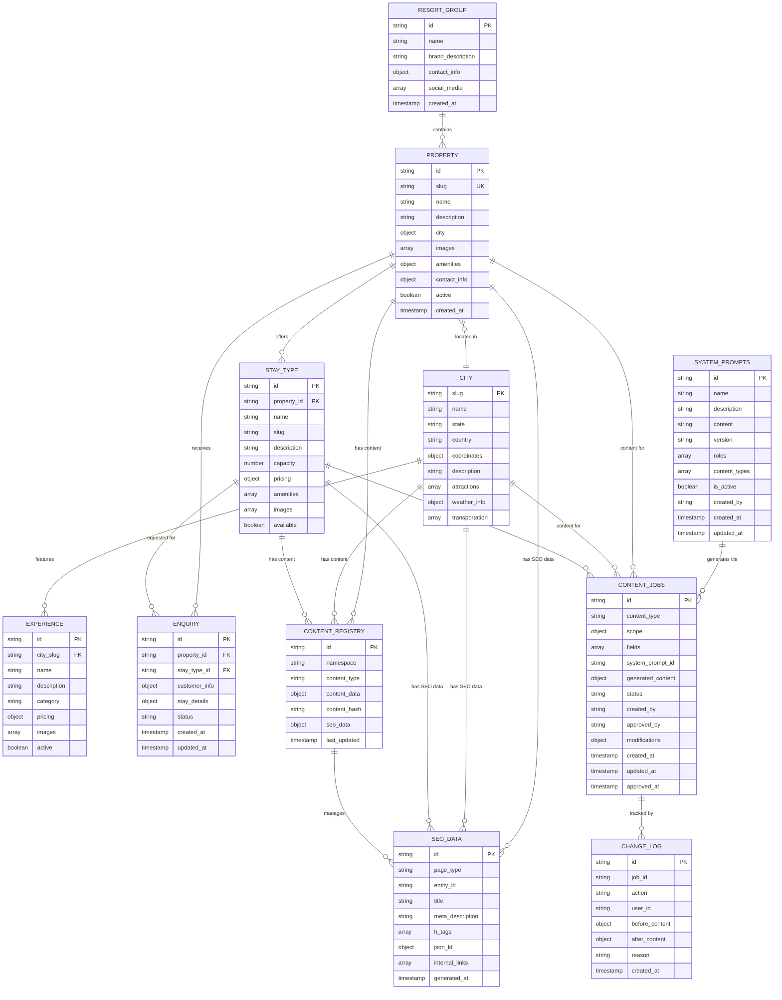

# Multi-Property Resort Group Platform - Technical Architecture Document

## 1. Architecture Design


## 2. Technology Description

- **Frontend**: React@18 + TypeScript + Tailwind CSS + Vite
- **Routing**: React Router v6 with dynamic route generation
- **Backend Services**: Firebase (Firestore Database + Authentication + Storage + Analytics + Cloud Functions)
- **AI Integration**: Google Gemini API via Cloud Functions for Firebase
- **Email Service**: Web3Forms (Free contact form API with property routing)
- **Deployment**: Vercel (Free tier with CDN and edge functions)
- **Search**: Client-side filtering with Firestore compound queries
- **SEO**: React Helmet Async + Schema-DTS + automated sitemap generation + AI-powered content generation
- **Analytics**: Google Analytics 4 + Firebase Analytics with property segmentation
- **Testing**: Jest + React Testing Library + Cypress with multi-property scenarios + AI content validation

## 3. Dynamic Route Definitions

### 3.1 Core Routes
| Route Pattern | Purpose | Dynamic Resolution |
|---------------|---------|--------------------|
| / | Group homepage | Static group content |
| /properties/:propertySlug | Property homepage | Resolve property from slug |
| /properties/:propertySlug/stays/:stayType | Stay type details | Resolve property + stay type |
| /locations/:citySlug | City landing page | Resolve city + properties |
| /locations/:citySlug/:stayType | City + stay type combo | Resolve city + stay type + properties |
| /experiences/:citySlug | City experiences | Resolve city + activities |
| /request-stay | Multi-property enquiry | Dynamic property selection |
| /request-stay/:propertySlug | Property-specific enquiry | Pre-selected property |

### 3.2 Admin Routes
| Route Pattern | Purpose | Access Level |
|---------------|---------|-------------|
| /admin | Admin dashboard login | All admin roles |
| /admin/group | Group-level management | Group Admin only |
| /admin/property/:propertyId | Property management | Property Manager + Group Admin |
| /admin/city/:citySlug | City management | City Manager + Group Admin |
| /admin/seo | SEO management | SEO Manager + Group Admin |
| /admin/seo/ai-system | AI SEO system management | SEO Manager + Group Admin |
| /admin/seo/system-prompt | System prompt editor | SEO Manager + Group Admin |
| /admin/seo/content-generation | AI content generation interface | SEO Manager + Content Editor + Group Admin |
| /admin/seo/drafts | Draft management and approval | SEO Manager + Group Admin |
| /admin/content-registry | Content management | Content Manager + Group Admin |
| /admin/analytics | Multi-property analytics | All admin roles (filtered by permissions) |

### 3.3 Route Resolution Logic
```typescript
interface RouteResolver {
  resolveProperty: (slug: string) => Promise<Property | null>;
  resolveCity: (slug: string) => Promise<City | null>;
  resolveStayType: (propertyId: string, stayType: string) => Promise<StayType | null>;
  generateSitemap: () => Promise<SitemapEntry[]>;
}
```

## 4. API Definitions

### 4.1 Multi-Property Web3Forms Integration

**Property-Specific Contact Form**
```
POST https://api.web3forms.com/submit
```

Request (Form Data):
| Param Name | Param Type | isRequired | Description |
|------------|------------|------------|-------------|
| access_key | string     | true       | Property-specific Web3Forms access key |
| property_id | string    | true       | Internal property identifier |
| property_name | string  | true       | Property display name |
| city | string          | true       | Property location city |
| stay_type | string     | false      | Preferred accommodation type |
| name | string          | true       | Customer name |
| email | string         | true       | Customer email |
| phone | string         | false      | Customer phone |
| message | string       | true       | Enquiry message |
| check_in | string      | false      | Check-in date |
| check_out | string     | false      | Check-out date |
| guests | number        | false      | Number of guests |

### 4.2 Cloud Functions for AI SEO

**System Prompt Management**
```
POST /api/seo/updateSystemPrompt
```

Request:
| Param Name | Param Type | isRequired | Description |
|------------|------------|------------|-------------|
| prompt_id | string | true | System prompt identifier |
| content | string | true | Updated prompt content |
| version | string | true | Version identifier |
| user_id | string | true | Admin user ID |

Response:
| Param Name | Param Type | Description |
|------------|------------|-------------|
| success | boolean | Update status |
| prompt_id | string | Updated prompt ID |
| version | string | New version number |

**AI Content Generation**
```
POST /api/seo/generate
```

Request:
| Param Name | Param Type | isRequired | Description |
|------------|------------|------------|-------------|
| content_type | string | true | Type of content to generate |
| scope | object | true | Property/city/stay_type context |
| fields | array | true | Specific fields to generate |
| system_prompt_id | string | true | System prompt to use |
| user_id | string | true | Requesting user ID |

Response:
| Param Name | Param Type | Description |
|------------|------------|-------------|
| success | boolean | Generation status |
| job_id | string | Content job identifier |
| generated_content | object | AI-generated content fields |
| status | string | Job status (draft/pending/approved) |

**Content Job Management**
```
POST /api/seo/applyJob
```

Request:
| Param Name | Param Type | isRequired | Description |
|------------|------------|------------|-------------|
| job_id | string | true | Content job identifier |
| action | string | true | approve/reject/edit |
| user_id | string | true | Admin user ID |
| modifications | object | false | Manual edits to content |

Response:
| Param Name | Param Type | Description |
|------------|------------|-------------|
| success | boolean | Action status |
| job_id | string | Updated job ID |
| final_content | object | Applied content |

### 4.3 Firebase Multi-Tenant Data Operations

**Property Management**
```javascript
// Get all properties
getDocs(collection(db, 'properties'))

// Get property by slug
getDocs(query(collection(db, 'properties'), where('slug', '==', propertySlug)))

// Get properties by city
getDocs(query(collection(db, 'properties'), where('city.slug', '==', citySlug)))

// Get stay types for property
getDocs(collection(db, 'properties', propertyId, 'stayTypes'))
```

**City-Based Content**
```javascript
// Get city information
getDoc(doc(db, 'cities', citySlug))

// Get city experiences
getDocs(collection(db, 'cities', citySlug, 'experiences'))

// Get properties in city
getDocs(query(collection(db, 'properties'), where('city.slug', '==', citySlug)))
```

**Content Registry Operations**
```javascript
// Add content with namespace
addDoc(collection(db, 'content'), {
  namespace: 'property:wayanad-treehouse',
  type: 'homepage',
  content: contentData,
  seoData: seoMetadata
})

// Check for duplicate content
getDocs(query(
  collection(db, 'content'),
  where('contentHash', '==', contentHash),
  where('namespace', '!=', currentNamespace)
))
```

**SEO Management**
```javascript
// Update SEO data
updateDoc(doc(db, 'seo', pageId), {
  title: 'Generated Title',
  metaDescription: 'Generated Description',
  h1: 'Main Heading',
  h2: ['Subheading 1', 'Subheading 2'],
  jsonLd: structuredData,
  internalLinks: suggestedLinks
})

// Track keyword rankings
addDoc(collection(db, 'seo-tracking'), {
  keyword: 'treehouses in wayanad',
  propertyId: 'wayanad-treehouse',
  city: 'wayanad',
  stayType: 'treehouse',
  ranking: 5,
  timestamp: serverTimestamp()
})
```

## 5. Multi-Tenant Data Model

### 5.1 Data Model Definition



### 5.2 Data Definition Language

**Resort Group Collection**
```javascript
// Collection: resort_group (single document)
{
  id: 'main-group',
  name: 'Luxury Nature Resorts',
  brandDescription: 'Premium eco-luxury accommodations across India',
  contactInfo: {
    email: 'info@luxurynatureresorts.com',
    phone: '+91-9876543210',
    address: 'Corporate Office Address'
  },
  socialMedia: {
    instagram: '@luxurynatureresorts',
    facebook: 'LuxuryNatureResorts',
    youtube: 'LuxuryNatureResorts'
  },
  createdAt: serverTimestamp()
}
```

**Properties Collection**
```javascript
// Collection: properties
{
  id: 'wayanad-treehouse-resort',
  slug: 'wayanad-treehouse',
  name: 'Wayanad Treehouse Resort',
  description: 'Luxury treehouses in pristine Western Ghats forests',
  city: {
    slug: 'wayanad',
    name: 'Wayanad',
    state: 'Kerala'
  },
  images: {
    hero: 'https://storage.googleapis.com/resort-images/wayanad/hero.jpg',
    gallery: ['image1.jpg', 'image2.jpg']
  },
  amenities: {
    wifi: true,
    pool: false,
    spa: true,
    restaurant: true,
    adventure: true
  },
  contactInfo: {
    email: 'wayanad@luxurynatureresorts.com',
    phone: '+91-9876543211',
    web3formsKey: 'property-specific-key'
  },
  active: true,
  createdAt: serverTimestamp()
}
```

**Stay Types Subcollection**
```javascript
// Subcollection: properties/{propertyId}/stayTypes
{
  id: 'luxury-treehouse',
  name: 'Luxury Treehouse',
  slug: 'luxury-treehouse',
  description: 'Elevated luxury accommodation with forest canopy views',
  capacity: 4,
  pricing: {
    basePrice: 8000,
    currency: 'INR',
    seasonal: {
      peak: 12000,
      offPeak: 6000
    }
  },
  amenities: ['balcony', 'ac', 'minibar', 'forest-view'],
  images: ['treehouse1.jpg', 'treehouse2.jpg'],
  available: true
}
```

**Cities Collection**
```javascript
// Collection: cities
{
  slug: 'wayanad',
  name: 'Wayanad',
  state: 'Kerala',
  country: 'India',
  coordinates: {
    lat: 11.6854,
    lng: 76.1320
  },
  description: 'Hill station in Western Ghats known for wildlife and spice plantations',
  attractions: [
    'Chembra Peak',
    'Banasura Sagar Dam',
    'Wayanad Wildlife Sanctuary'
  ],
  weatherInfo: {
    bestTime: 'October to May',
    climate: 'Tropical highland'
  },
  transportation: {
    nearestAirport: 'Calicut (90km)',
    nearestRailway: 'Kozhikode (85km)'
  }
}
```

**Content Registry Collection**
```javascript
// Collection: content_registry
{
  id: 'property-wayanad-treehouse-homepage',
  namespace: 'property:wayanad-treehouse',
  contentType: 'homepage',
  contentData: {
    heroTitle: 'Experience Luxury in Wayanad\'s Canopy',
    heroSubtitle: 'Elevated treehouses with panoramic forest views',
    sections: {
      about: 'Detailed property description...',
      amenities: ['Spa', 'Restaurant', 'Adventure Activities'],
      gallery: ['image1.jpg', 'image2.jpg']
    }
  },
  contentHash: 'sha256-hash-of-content',
  seoData: {
    title: 'Wayanad Treehouse Resort | Luxury Forest Accommodation',
    metaDescription: 'Book luxury treehouses in Wayanad with forest views...',
    h1: 'Wayanad Treehouse Resort',
    h2: ['Luxury Accommodations', 'Forest Experiences', 'Amenities'],
    jsonLd: { /* structured data */ },
    internalLinks: [
      { url: '/locations/wayanad', anchor: 'Explore Wayanad' },
      { url: '/locations/wayanad/treehouse', anchor: 'Treehouses in Wayanad' }
    ]
  },
  lastUpdated: serverTimestamp()
}
```

**SEO Tracking Collection**
```javascript
// Collection: seo_tracking
{
  id: 'keyword-tracking-entry',
  keyword: 'luxury treehouses wayanad',
  propertyId: 'wayanad-treehouse-resort',
  city: 'wayanad',
  stayType: 'treehouse',
  ranking: 3,
  searchVolume: 1200,
  competition: 'medium',
  timestamp: serverTimestamp()
}
```

**AI SEO System Prompts Collection**
```javascript
// Collection: system_prompts
{
  id: 'property-homepage-generator',
  name: 'Property Homepage Content Generator',
  description: 'Generates SEO-optimized homepage content for resort properties',
  content: 'You are an expert SEO content writer for luxury resort properties...',
  version: '1.0',
  roles: ['seo_manager', 'group_admin'],
  contentTypes: ['homepage', 'property_description', 'amenities'],
  isActive: true,
  createdBy: 'admin@luxurynatureresorts.com',
  createdAt: serverTimestamp(),
  updatedAt: serverTimestamp()
}
```

**AI Content Jobs Collection**
```javascript
// Collection: content_jobs
{
  id: 'job-wayanad-homepage-update',
  contentType: 'homepage',
  scope: {
    propertyId: 'wayanad-treehouse-resort',
    city: 'wayanad',
    stayTypes: ['luxury-treehouse', 'forest-villa']
  },
  fields: ['heroTitle', 'heroSubtitle', 'metaDescription', 'h1', 'h2'],
  systemPromptId: 'property-homepage-generator',
  generatedContent: {
    heroTitle: 'Experience Luxury Treehouses in Wayanad\'s Pristine Forests',
    heroSubtitle: 'Elevated accommodations with panoramic Western Ghats views',
    metaDescription: 'Book luxury treehouses in Wayanad with forest canopy views...',
    h1: 'Wayanad Treehouse Resort - Luxury Forest Accommodation',
    h2: ['Luxury Treehouses', 'Forest Experiences', 'Premium Amenities']
  },
  status: 'draft',
  createdBy: 'seo@luxurynatureresorts.com',
  approvedBy: null,
  modifications: null,
  createdAt: serverTimestamp(),
  updatedAt: serverTimestamp(),
  approvedAt: null
}
```

**AI Change Log Collection**
```javascript
// Collection: change_log
{
  id: 'log-wayanad-homepage-approval',
  jobId: 'job-wayanad-homepage-update',
  action: 'approved',
  userId: 'admin@luxurynatureresorts.com',
  beforeContent: {
    heroTitle: 'Old title...',
    metaDescription: 'Old description...'
  },
  afterContent: {
    heroTitle: 'Experience Luxury Treehouses in Wayanad\'s Pristine Forests',
    metaDescription: 'Book luxury treehouses in Wayanad with forest canopy views...'
  },
  reason: 'Approved AI-generated content with minor manual adjustments',
  createdAt: serverTimestamp()
}
```

## 6. Firebase Security Rules

### 6.1 Multi-Tenant Security Rules
```javascript
rules_version = '2';
service cloud.firestore {
  match /databases/{database}/documents {
    // Public read access for properties and cities
    match /properties/{propertyId} {
      allow read: if true;
      allow write: if isPropertyManager(propertyId) || isGroupAdmin();
      
      match /stayTypes/{stayTypeId} {
        allow read: if true;
        allow write: if isPropertyManager(propertyId) || isGroupAdmin();
      }
    }
    
    match /cities/{citySlug} {
      allow read: if true;
      allow write: if isCityManager(citySlug) || isGroupAdmin();
      
      match /experiences/{experienceId} {
        allow read: if true;
        allow write: if isCityManager(citySlug) || isGroupAdmin();
      }
    }
    
    // Content registry - admin only
    match /content_registry/{contentId} {
      allow read: if isAuthenticated();
      allow write: if isContentManager() || isGroupAdmin();
    }
    
    // SEO data - SEO managers and group admin
    match /seo_data/{seoId} {
      allow read: if isAuthenticated();
      allow write: if isSEOManager() || isGroupAdmin();
    }
    
    // AI SEO System Prompts - SEO managers and group admin only
    match /system_prompts/{promptId} {
      allow read: if isSEOManager() || isGroupAdmin();
      allow write: if isSEOManager() || isGroupAdmin();
    }
    
    // AI Content Jobs - role-based access
    match /content_jobs/{jobId} {
      allow read: if isSEOManager() || isContentEditor() || isGroupAdmin();
      allow create: if isSEOManager() || isContentEditor() || isGroupAdmin();
      allow update: if isSEOManager() || isGroupAdmin();
    }
    
    // AI Change Log - read-only for audit trail
    match /change_log/{logId} {
      allow read: if isSEOManager() || isGroupAdmin();
      allow create: if isSEOManager() || isContentEditor() || isGroupAdmin();
    }
    
    // Enquiries - property-specific access
    match /enquiries/{enquiryId} {
      allow read: if isPropertyManager(resource.data.propertyId) || isGroupAdmin();
      allow create: if true; // Allow public enquiry creation
      allow update: if isPropertyManager(resource.data.propertyId) || isGroupAdmin();
    }
    
    // Helper functions
    function isAuthenticated() {
      return request.auth != null;
    }
    
    function isGroupAdmin() {
      return isAuthenticated() && 
             request.auth.token.role == 'group_admin';
    }
    
    function isPropertyManager(propertyId) {
      return isAuthenticated() && 
             (request.auth.token.role == 'property_manager' && 
              request.auth.token.propertyId == propertyId);
    }
    
    function isCityManager(citySlug) {
      return isAuthenticated() && 
             (request.auth.token.role == 'city_manager' && 
              request.auth.token.citySlug == citySlug);
    }
    
    function isContentManager() {
      return isAuthenticated() && 
             request.auth.token.role in ['content_manager', 'group_admin'];
    }
    
    function isSEOManager() {
      return isAuthenticated() && 
             request.auth.token.role in ['seo_manager', 'group_admin'];
    }
    
    function isContentEditor() {
      return isAuthenticated() && 
             request.auth.token.role in ['content_editor', 'seo_manager', 'group_admin'];
    }
  }
}
```

## 7. SEO Technical Implementation

### 7.1 Dynamic Meta Generation
```typescript
interface SEOGenerator {
  generatePropertyMeta(property: Property): SEOData;
  generateCityMeta(city: City, properties: Property[]): SEOData;
  generateStayTypeMeta(property: Property, stayType: StayType): SEOData;
  generateComboMeta(city: City, stayType: string, properties: Property[]): SEOData;
}

interface SEOData {
  title: string;
  metaDescription: string;
  h1: string;
  h2: string[];
  jsonLd: object;
  internalLinks: InternalLink[];
  canonical?: string;
  noindex?: boolean;
}
```

### 7.2 Automated Sitemap Generation
```typescript
interface SitemapGenerator {
  generateMainSitemap(): Promise<SitemapEntry[]>;
  generatePropertiesSitemap(): Promise<SitemapEntry[]>;
  generateLocationsSitemap(): Promise<SitemapEntry[]>;
  generateExperiencesSitemap(): Promise<SitemapEntry[]>;
}

interface SitemapEntry {
  url: string;
  lastmod: string;
  changefreq: 'daily' | 'weekly' | 'monthly';
  priority: number;
}
```

### 7.3 Internal Linking Strategy
```typescript
interface InternalLinkingEngine {
  suggestLinks(pageType: string, entityId: string): Promise<InternalLink[]>;
  prioritizeSameCity(links: InternalLink[], currentCity: string): InternalLink[];
  prioritizeSameStayType(links: InternalLink[], currentStayType: string): InternalLink[];
}

interface InternalLink {
  url: string;
  anchor: string;
  relevanceScore: number;
  linkType: 'same-city' | 'same-stay-type' | 'related-property' | 'experience';
}
```

## 8. Performance Optimization

### 8.1 Multi-Property Caching Strategy
- **Static Assets**: Property-specific images and content cached at CDN level
- **Dynamic Content**: City and property data cached with 1-hour TTL
- **Search Results**: Filtered results cached client-side with invalidation
- **SEO Data**: Generated meta tags cached for 24 hours

### 8.2 Database Query Optimization
- **Compound Indexes**: city + stayType, propertyId + availability
- **Denormalized Data**: Property info embedded in enquiries for faster queries
- **Pagination**: Limit queries to 20 items with cursor-based pagination
- **Real-time Listeners**: Only for admin dashboards, not public pages

### 8.3 Bundle Optimization
- **Code Splitting**: Property-specific components loaded on demand
- **Route-Based Splitting**: Admin routes separated from public routes
- **Dynamic Imports**: SEO tools and analytics loaded asynchronously
- **Tree Shaking**: Remove unused Firebase modules and utilities