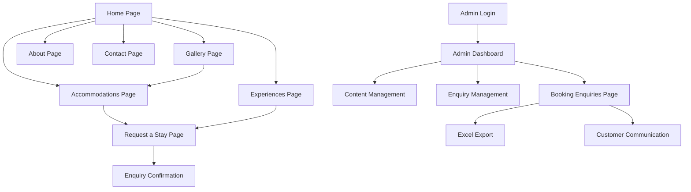

# Wayanad Tree House Resort Website - Product Requirements Document

## 1. Product Overview
A modern, mobile-first resort website for a tree house resort in Wayanad, Kerala, showcasing forest and nature attractions with comprehensive admin management capabilities.
- The website serves as the primary digital presence for guests to discover, explore, and book unique tree house accommodations surrounded by Wayanad's pristine forests.
- Target market: Nature enthusiasts, eco-tourists, and travelers seeking unique accommodation experiences in Kerala's Western Ghats.

## 2. Core Features

### 2.1 User Roles
| Role | Registration Method | Core Permissions |
|------|---------------------|------------------|
| Guest User | No registration required | Browse resort information, view galleries, check availability, submit booking enquiries |
| Resort Admin | Firebase Authentication | Full content management, enquiry management, customer communication, Excel export, analytics access |
| Staff Member | Admin-created Firebase accounts | Limited enquiry management, customer communication, activity updates |

### 2.2 Feature Module
Our resort website consists of the following main pages:
1. **Home Page**: Hero section with booking CTA, featured accommodations showcase, experience highlights, customer testimonials, contact information.
2. **Accommodations Page**: Tree house listings with detailed descriptions, image galleries, amenities, pricing, availability calendar.
3. **Experiences Page**: Activity listings, adventure packages, nature tours, wellness programs with descriptions and booking options.
4. **Gallery Page**: Photo collections of accommodations, experiences, resort grounds, and guest moments organized by categories.
5. **Request a Stay Page**: Customer enquiry form with Web3Forms integration, date selection, guest count, accommodation preferences, contact details, special requests.
6. **Contact Page**: Resort contact information, location map, Web3Forms contact form, social media links, directions.
7. **Admin Dashboard**: Firebase-powered booking enquiry management, content management system, analytics dashboard, customer communication tools.
8. **Admin Login Page**: Firebase Authentication for secure resort staff access to admin features.

### 2.3 Page Details
| Page Name | Module Name | Feature Description |
|-----------|-------------|---------------------|
| Home Page | Hero Section | Full-screen forest imagery carousel with tree house overlays, animated nature elements, call-to-action buttons for booking and exploration |
| Home Page | Navigation Menu | Sticky header with resort logo, hamburger menu for mobile, smooth scroll navigation, language selector |
| Home Page | Featured Tree Houses | Card-based layout showcasing 3-4 premium accommodations with hover effects, quick view modals, pricing display |
| Home Page | Resort Highlights | Icon-based feature grid highlighting unique selling points like forest location, eco-friendly practices, adventure activities |
| Home Page | Request a Stay Widget | Floating enquiry form with date pickers, guest selector, accommodation preferences, direct enquiry submission |
| Accommodations | Tree House Gallery | Masonry grid layout with high-quality images, filter options by type/price, lightbox view, 360-degree virtual tours |
| Accommodations | Room Details | Comprehensive descriptions with amenities list, floor plans, capacity information, special features, booking integration |
| Accommodations | Enquiry Calendar | Interactive calendar for date selection, seasonal information display, enquiry submission integration |
| Experiences | Activity Showcase | Visual cards for each experience with descriptions, duration, difficulty levels, booking options, photo galleries |
| Experiences | Nature Programs | Detailed information about guided forest walks, bird watching, plantation visits, cultural experiences |
| Experiences | Adventure Sports | Comprehensive listings of trekking, zip-lining, rock climbing with safety information and booking integration |
| Gallery | Photo Collections | Organized albums by categories (rooms, nature, activities, dining), infinite scroll, social sharing options |
| Gallery | Virtual Tours | 360-degree immersive experiences of tree houses and resort grounds, interactive hotspots, navigation controls |
| About | Resort Story | Compelling narrative about the resort's founding, mission, connection to nature, sustainability initiatives |
| About | Team Profiles | Staff introductions with photos, expertise areas, personal stories, contact information |
| Contact | Inquiry Forms | Multi-step contact forms for different purposes (booking, events, general inquiries), file upload capability |
| Contact | Location Integration | Interactive maps with resort location, nearby attractions, transportation options, weather information |
| Request a Stay | Customer Details Form | Web3Forms integration to collect customer details (name, email, phone, dates, guests, preferences) with built-in validation |
| Request a Stay | Enquiry Submission | Submit enquiry via Web3Forms API with confirmation message and redirect to thank you page |
| Admin Dashboard | Content Management | WYSIWYG editors for all page content, image upload and management, SEO optimization tools |
| Admin Dashboard | Enquiry Management | Real-time enquiry overview, customer communication tools, enquiry status tracking, Excel export functionality |
| Admin Dashboard | Analytics Overview | Key performance indicators, real-time visitor count, conversion rates, popular pages dashboard |
| Admin Booking Enquiries | Enquiry List View | Comprehensive table view with filtering, SLA timer indicators, priority sorting, status tracking |
| Admin Booking Enquiries | Excel Export | Download filtered enquiry data with customer details, preferences, contact information, enquiry status |
| Admin Booking Enquiries | Communication Tools | Templated SMS/email replies, call customer directly, update enquiry status, audit log for all changes |
| Admin Booking Enquiries | SLA Management | Time-to-first-response tracking, automated alerts for overdue enquiries, performance metrics |
| Admin Booking Enquiries | Audit Trail | Complete history of status changes, admin actions, customer communications with timestamps |
| Admin Analytics Dashboard | User Behavior Tracking | Page views, session duration, bounce rates, user journey mapping, device and browser analytics |
| Admin Analytics Dashboard | Conversion Analytics | Booking enquiry conversion rates, funnel analysis, source attribution, customer acquisition costs |
| Admin Analytics Dashboard | Performance Metrics | Page load times, Core Web Vitals, mobile performance scores, SEO ranking positions |
| Admin Analytics Dashboard | Customer Insights | Demographics analysis, popular accommodations, seasonal trends, repeat visitor tracking |
| SEO Management Panel (Phase 2) | Technical SEO | Meta tags management, schema markup implementation, sitemap generation, robots.txt configuration |
| SEO Management Panel (Phase 2) | Content Optimization | Keyword analysis, content scoring, readability checks, internal linking suggestions |
| SEO Management Panel (Phase 2) | Local SEO | Google My Business integration, local citations management, Wayanad location optimization |
| SEO Management Panel (Phase 2) | Performance Monitoring | Search rankings tracking, organic traffic analysis, keyword performance, competitor analysis |

## 3. Core Process

**Guest User Flow:**
Guests discover the resort through the homepage hero section, explore tree house accommodations via the gallery and detailed pages, submit stay requests through the simplified enquiry form without requiring registration or payment.

**Admin User Flow:**
Admins access the Firebase-authenticated dashboard to manage all website content, review customer enquiries, communicate with potential guests via phone, manually confirm bookings, and export enquiry data to Excel for analysis.

## 4. User Interface Design

### 4.1 Design Style
- **Primary Colors**: Forest Green (#2D5016), Earth Brown (#8B4513), Natural Beige (#F5F5DC)
- **Secondary Colors**: Sunset Orange (#FF8C00), Sky Blue (#87CEEB), Leaf Green (#90EE90)
- **Button Style**: Rounded corners with subtle shadows, gradient backgrounds, hover animations with nature-inspired transitions
- **Typography**: Primary font - Montserrat for headings, Open Sans for body text, sizes ranging from 14px (mobile) to 18px (desktop)
- **Layout Style**: Card-based design with organic shapes, asymmetrical layouts inspired by natural forms, generous white space
- **Icons**: Hand-drawn nature icons, leaf and tree motifs, minimalist line art style

### 4.2 Page Design Overview

| Page Name | Module Name | UI Elements |
|-----------|-------------|-------------|
| Home Page | Hero Section | Optimized static hero image with responsive srcset, preloaded critical images, deferred particle effects after first paint, centered call-to-action with organic button shapes |
| Home Page | Navigation | Transparent header with wood texture logo, slide-out mobile menu with forest background, smooth transitions, breadcrumb navigation |
| Home Page | Featured Tree Houses | Rectangular card layout with rounded corners, clear focus rings for accessibility, hover effects revealing booking options, nature-inspired borders, responsive grid system |
| Accommodations | Gallery Grid | Paginated gallery with lazy loading, filter tabs with leaf icons, modal overlays with proper keyboard navigation, ARIA labels for screen readers |
| Accommodations | Room Details | Split-screen layout with optimized image carousel, details on right, accordion-style amenities list, floating enquiry widget |
| Experiences | Activity Cards | Rectangular card shapes with hexagonal decorative masks, clear focus outlines, gradient overlays, icon-based categorization, expandable detail sections |
| Gallery | Photo Display | Paginated gallery with lazy loading, category filters with nature icons, accessible lightbox with keyboard navigation, social sharing buttons |
| Request a Stay | Enquiry Form | Multi-step wizard with progress indicators, date pickers with forest calendar styling, guest selector with tree icons |
| Admin Dashboard | Management Interface | Clean sidebar navigation, data visualization with nature color schemes, drag-and-drop content management, responsive tables |

### 4.3 Responsiveness
Mobile-first responsive design with breakpoints at 768px (tablet) and 1024px (desktop). Touch-optimized interactions for mobile devices including swipe gestures for galleries, tap-friendly button sizes (minimum 44px), and simplified navigation patterns. Desktop version enhances the experience with hover effects, larger imagery, and multi-column layouts while maintaining the core mobile functionality.

## 5. Analytics & Performance Requirements

### 5.1 User Analytics
- **Real-time Visitor Tracking**: Live visitor count, active pages, geographic distribution
- **User Behavior Analysis**: Page views, session duration, bounce rates, scroll depth, click heatmaps
- **Conversion Tracking**: Booking enquiry conversion rates, funnel analysis from homepage to enquiry submission
- **Customer Journey Mapping**: Multi-touch attribution, source tracking (organic, social, direct, referral)
- **Device & Browser Analytics**: Mobile vs desktop usage, browser preferences, screen resolutions
- **Performance Metrics**: Page load times, Core Web Vitals (LCP, INP, CLS), mobile performance scores

### 5.2 Business Intelligence
- **Booking Analytics**: Most popular accommodations, seasonal booking trends, average enquiry response time
- **Revenue Insights**: Enquiry-to-booking conversion rates, average booking value, customer lifetime value
- **Content Performance**: Most viewed pages, popular gallery images, effective call-to-action buttons
- **Customer Demographics**: Age groups, geographic origins, device preferences, booking patterns
- **Competitive Analysis**: Market positioning, keyword rankings, organic traffic growth

### 5.3 Admin Dashboard Analytics
- **KPI Dashboard**: Real-time metrics overview with customizable widgets and date range filters
- **Automated Reports**: Weekly/monthly analytics reports with insights and recommendations
- **Alert System**: Notifications for significant traffic changes, conversion drops, or technical issues
- **Export Capabilities**: CSV/Excel export for all analytics data with custom date ranges and filters

## 6. SEO Optimization Strategy

### 6.1 Technical SEO
- **Core Web Vitals Optimization**: Target LCP < 2.5s, INP < 200ms, CLS < 0.1 for all pages
- **Mobile-First Indexing**: Responsive design with mobile-optimized content and navigation
- **Site Speed Optimization**: Image compression, lazy loading, CDN implementation, code splitting
- **SSL Certificate**: HTTPS implementation across all pages with proper redirects
- **XML Sitemap**: Automated sitemap generation with proper priority and frequency settings
- **Robots.txt**: Optimized crawling instructions with proper disallow rules for admin areas
- **Structured Data**: Schema.org markup for resort, accommodations, reviews, and local business

### 6.2 On-Page SEO
- **Title Tags**: Unique, descriptive titles (50-60 characters) for each page with target keywords
- **Meta Descriptions**: Compelling descriptions (150-160 characters) with call-to-action elements
- **Header Structure**: Proper H1-H6 hierarchy with keyword optimization and semantic meaning
- **URL Structure**: Clean, descriptive URLs with hyphens and relevant keywords
- **Internal Linking**: Strategic linking between related pages with descriptive anchor text
- **Image Optimization**: Alt tags, descriptive filenames, WebP format, responsive images
- **Content Optimization**: Keyword-rich content with natural language and user intent focus

### 6.3 Local SEO (Wayanad Focus)
- **Google My Business**: Complete profile with photos, reviews, posts, and accurate business information
- **Local Keywords**: Target "tree house resort Wayanad", "eco resort Kerala", "forest accommodation Wayanad"
- **Location Pages**: Dedicated content about Wayanad attractions, local activities, and directions
- **Local Citations**: Consistent NAP (Name, Address, Phone) across directories and review sites
- **Review Management**: Encourage and respond to Google reviews, TripAdvisor, and booking platforms
- **Local Content**: Blog posts about Wayanad tourism, seasonal activities, and local partnerships

### 6.4 Content SEO Strategy
- **Keyword Research**: Target high-volume, low-competition keywords related to tree house resorts and Wayanad tourism
- **Content Calendar**: Regular blog posts about eco-tourism, wildlife, local attractions, and seasonal activities
- **Long-tail Keywords**: Target specific phrases like "luxury tree house resort Western Ghats", "eco-friendly accommodation Wayanad"
- **Featured Snippets**: Optimize content for "What is", "How to", "Best" queries related to Wayanad tourism
- **Semantic SEO**: Use related keywords and entities to improve topical authority
- **User-Generated Content**: Encourage guest reviews, photos, and testimonials for authentic content

### 6.5 Performance Monitoring
- **Search Console Integration**: Monitor search performance, indexing status, and technical issues
- **Keyword Ranking Tracking**: Track positions for target keywords with automated reporting (Phase 2)
- **Organic Traffic Analysis**: Monitor traffic growth, seasonal patterns, and conversion rates
- **Competitor Analysis**: Defer to external services or Phase 2 to avoid building crawler infrastructure
- **Technical SEO Audits**: Regular automated scans for broken links, duplicate content, and crawl errors

## 7. Performance Optimization Strategy

### 7.1 Core Web Vitals Optimization
- **Largest Contentful Paint (LCP)**: Target < 2.5s through optimized hero images with responsive srcset, preloading critical resources, and static first paint
- **Interaction to Next Paint (INP)**: Target < 200ms by deferring non-critical JavaScript, particle effects, and animations until after initial page load
- **Cumulative Layout Shift (CLS)**: Target < 0.1 by avoiding layout shifts from lazy-loaded images, setting explicit dimensions, and stable navigation

### 7.2 Visual Performance Strategy
- **Hero Section**: Replace parallax with optimized static images, implement responsive srcset, preload critical images
- **Particle Effects**: Defer fog, floating leaves, and animations until after first contentful paint
- **Gallery Loading**: Implement pagination instead of infinite scroll, aggressive lazy loading with intersection observer
- **Image Optimization**: WebP format with fallbacks, proper sizing, compression, and lazy loading for non-critical images

### 7.3 Accessibility Improvements
- **Card Design**: Use rectangular cards with clear focus rings instead of hexagonal shapes for better accessibility
- **Keyboard Navigation**: Ensure all interactive elements are keyboard accessible with proper tab order
- **ARIA Labels**: Implement comprehensive ARIA labels for carousels, lightboxes, and dynamic content
- **Alt Text**: Utilize existing alt_text data model for all images and decorative elements

### 7.4 PWA Caching Strategy
- **Static Assets**: Cache CSS, JS, images, and fonts with long-term caching strategy
- **Dynamic Content**: Avoid caching availability/pricing data to prevent stale information
- **Offline Experience**: Provide offline gallery teaser and contact CTA for network failures