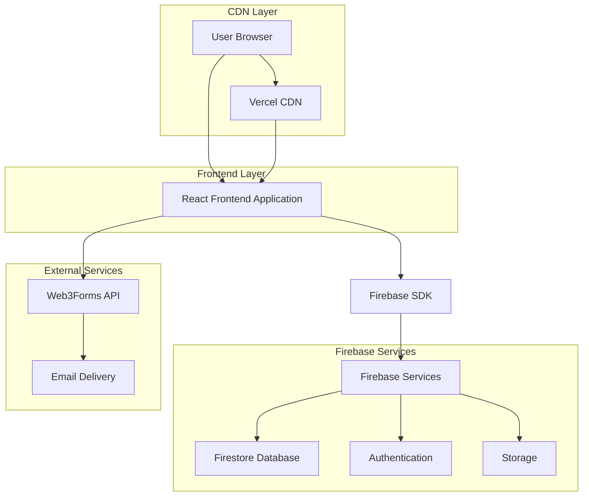
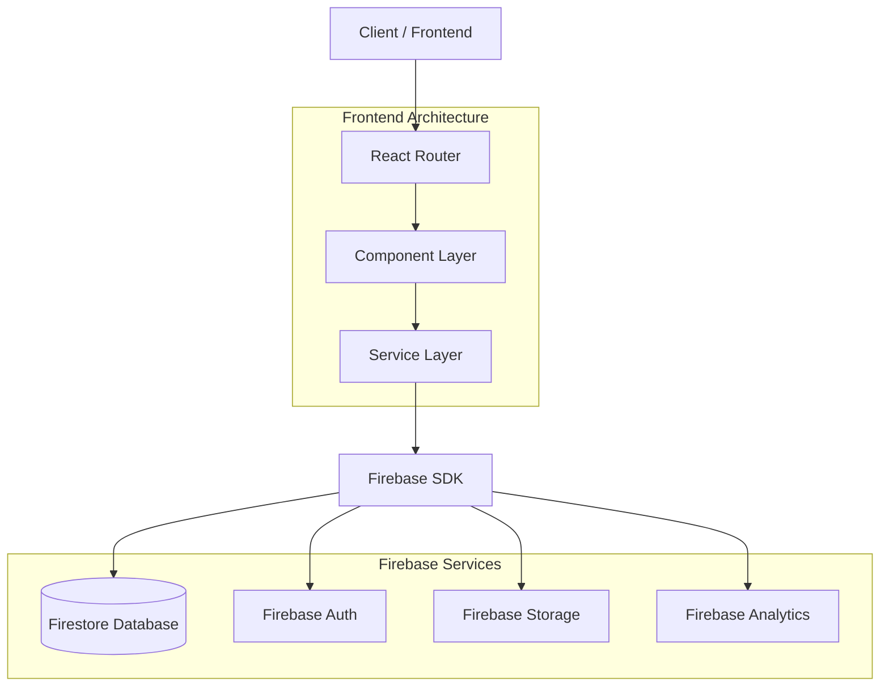
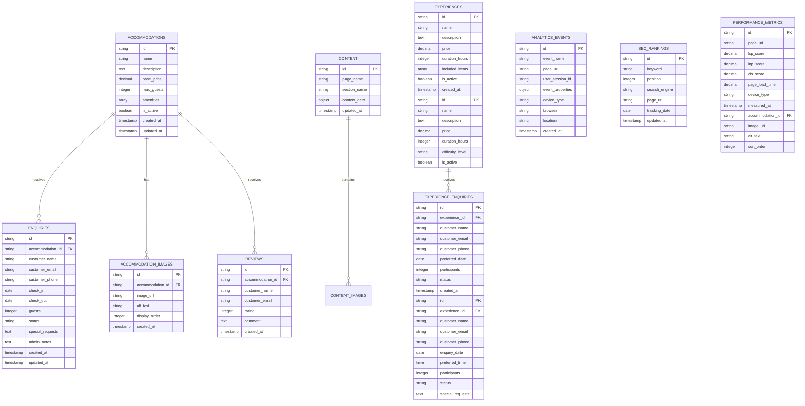

# Wayanad Tree House Resort Website - Technical Architecture Document

## 1. Architecture Design



## 2. Technology Description

- **Frontend**: React@18 + TypeScript + Tailwind CSS + Vite
- **Backend Services**: Firebase (Firestore Database + Authentication + Storage)
- **Email Service**: Web3Forms (Free contact form API)
- **Deployment**: Vercel (Free tier with CDN)
- **Analytics**: Google Analytics 4 + Firebase Analytics
- **Testing**: Jest + React Testing Library + Cypress

## 3. Route Definitions

| Route | Purpose |
|-------|----------|
| / | Home page with hero section, featured tree houses, and request a stay widget |
| /accommodations | Tree house listings with detailed information and availability |
| /accommodations/:id | Individual tree house details with booking integration |
| /experiences | Activities and experiences offered at the resort |
| /gallery | Photo galleries and virtual tours |
| /about | Resort information, story, and team details |
| /contact | Contact forms and location information |
| /request-stay | Customer details form and enquiry submission |
| /request-confirmation | Stay request submission confirmation message |
| /admin | Admin dashboard login |
| /admin/dashboard | Main admin overview with analytics |
| /admin/content | Content management for all pages |
| /admin/enquiries | Enquiry management and customer communication |
| /admin/enquiry-management | Dedicated enquiry management page with filtering and Excel export |
| /admin/accommodations | Tree house management and pricing |
| /admin/gallery | Image and media management |
| /admin/users | User and staff management |
| /admin/analytics | Comprehensive analytics dashboard with user behavior and performance metrics |
| /admin/seo (Phase 2) | SEO management panel with keyword tracking and optimization tools |
| /admin/reports | Automated reports and data export functionality |

## 4. API Definitions

### 4.1 Web3Forms Contact API

**Contact Form Submission**
```
POST https://api.web3forms.com/submit
```

Request (Form Data):
| Param Name | Param Type | isRequired | Description |
|------------|------------|------------|-------------|
| access_key | string     | true       | Web3Forms access key |
| name       | string     | true       | Customer name |
| email      | string     | true       | Customer email |
| phone      | string     | false      | Customer phone |
| message    | string     | true       | Enquiry message |
| check_in   | string     | false      | Check-in date |
| check_out  | string     | false      | Check-out date |
| guests     | number     | false      | Number of guests |

### 4.2 Firebase Authentication (Admin Only)

**Admin Login**
```javascript
import { signInWithEmailAndPassword } from 'firebase/auth';
```

### 4.3 Firestore Database Operations

**Enquiry Management**
```javascript
// Add enquiry
addDoc(collection(db, 'enquiries'), enquiryData)

// Get enquiries
getDocs(collection(db, 'enquiries'))

// Update enquiry status
updateDoc(doc(db, 'enquiries', id), { status: 'confirmed' })
```

**Content Management (Firebase)**
```javascript
// Get content
getDocs(collection(db, 'content'))

// Update content
updateDoc(doc(db, 'content', id), contentData)

// Add content
addDoc(collection(db, 'content'), contentData)
```

**Accommodation Management (Firebase)**
```javascript
// Get accommodations
getDocs(collection(db, 'accommodations'))

// Update accommodation
updateDoc(doc(db, 'accommodations', id), accommodationData)

// Add accommodation
addDoc(collection(db, 'accommodations'), accommodationData)
```

**Analytics APIs**
```
GET /analytics/visitors
GET /analytics/pageviews
GET /analytics/conversions
GET /analytics/performance
POST /analytics/events
```

Request (Track Custom Event):
| Param Name | Param Type | isRequired | Description |
|------------|------------|------------|-------------|
| event_name | string | true | Name of the custom event |
| page_url | string | true | URL where event occurred |
| user_id | string | false | Anonymous user identifier |
| properties | object | false | Additional event properties |

**SEO Management APIs**
```
GET /seo/rankings
GET /seo/sitemap
POST /seo/meta-tags
GET /seo/performance
```

**Performance Monitoring APIs**
```
GET /performance/core-web-vitals
GET /performance/page-speed
POST /performance/metrics
```

## 5. Frontend Architecture Diagram



## 6. Data Model

### 6.1 Data Model Definition



### 6.2 Firestore Collections Structure

**Accommodations Collection**
```javascript
// Collection: accommodations
{
  id: "treehouse_1",
  name: "Canopy Suite",
  description: "Luxury treehouse with panoramic forest views",
  capacity: 2,
  amenities: ["WiFi", "AC", "Balcony", "Forest View"],
  price_per_night: 8500,
  images: ["image1.jpg", "image2.jpg"],
  availability: true,
  created_at: timestamp,
  updated_at: timestamp
}
```

**Enquiries Collection (from Web3Forms)**
```javascript
// Collection: enquiries
{
  id: "enquiry_001",
  customer_name: "John Doe",
  customer_email: "john@example.com",
  customer_phone: "+91-9876543210",
  check_in: "2024-03-15",
  check_out: "2024-03-17",
  guests: 2,
  accommodation_preference: "Canopy Suite",
  message: "Looking for a peaceful weekend getaway",
  status: "new", // new, contacted, confirmed, cancelled
  source: "web3forms",
  created_at: timestamp,
  updated_at: timestamp
}
```

**Content Collection**
```javascript
// Collection: content
{
  id: "homepage_hero",
  type: "hero_section",
  title: "Escape to Nature's Embrace",
  subtitle: "Luxury Treehouses in Wayanad",
  image_url: "hero-image.jpg",
  cta_text: "Request a Stay",
  active: true,
  created_at: timestamp,
  updated_at: timestamp
}
```

**Enhanced Firestore Security Rules**
```javascript
rules_version = '2';
service cloud.firestore {
  match /databases/{database}/documents {
    // Public read access to accommodations and content
    match /accommodations/{document} {
      allow read: if true;
      allow write: if request.auth != null && request.auth.token.admin == true;
    }
    
    // Enquiries - public create, admin-only read
    match /enquiries/{document} {
      allow create: if validateEnquiryData(request.resource.data);
      allow read, update, delete: if request.auth != null && request.auth.token.admin == true;
    }
    
    // Content management - admin only
    match /content/{document} {
      allow read: if true;
      allow write: if request.auth != null && request.auth.token.admin == true;
    }
    
    // Validation functions
    function validateEnquiryData(data) {
      return data.keys().hasAll(['customer_name', 'customer_email', 'check_in', 'check_out', 'guests']) &&
             data.guests is number && data.guests > 0 && data.guests <= 10 &&
             data.check_in is timestamp && data.check_out is timestamp &&
             data.check_out > data.check_in;
    }
    
    match /content/{document} {
      allow read: if true;
      allow write: if request.auth != null;
    }
    
    // Enquiries only accessible by authenticated admin users
    match /enquiries/{document} {
      allow read, write: if request.auth != null;
    }
  }
}
```

**Enquiries Collection**
```javascript
// Collection: enquiries
// Document structure:
{
  id: "auto-generated-id",
  accommodation_id: "accommodation-doc-id",
  customer_name: "John Doe",
  customer_email: "john@example.com",
  customer_phone: "+91-9876543210",
  check_in: firebase.firestore.Timestamp,
  check_out: firebase.firestore.Timestamp,
  guests: 2,
  status: "new", // new, contacted, confirmed, cancelled
  special_requests: "Vegetarian meals preferred",
  admin_notes: "Called customer on 15th Jan",
  created_at: firebase.firestore.Timestamp,
  updated_at: firebase.firestore.Timestamp
}

// Firestore Security Rules
match /enquiries/{document} {
  allow read, write: if request.auth != null && request.auth.token.admin == true;
  allow create: if true; // Allow public enquiry creation
}
```

**Content Collection**
```javascript
// Collection: content
// Document structure:
{
  id: "home-hero",
  page_name: "home",
  section_name: "hero",
  content_data: {
    title: "Experience Nature in Luxury Tree Houses",
    subtitle: "Discover Wayanad's pristine forests from your elevated sanctuary",
    cta_text: "Request a Stay",
    background_image: "hero-forest.jpg"
  },
  updated_at: firebase.firestore.Timestamp
}

// Firestore Security Rules
match /content/{document} {
  allow read: if true; // Public read access
  allow write: if request.auth != null && request.auth.token.admin == true;
}
```

**Local Storage Structure (Initial Development Phase)**
```javascript
// Local Storage Keys and Structure

// Customer enquiries stored locally before Firebase integration
localStorage.setItem('resort_enquiries', JSON.stringify([
  {
    id: 'enq_001',
    accommodation_id: 'acc_001',
    customer_name: 'John Doe',
    customer_email: 'john@example.com',
    customer_phone: '+91-9876543210',
    check_in: '2024-02-15',
    check_out: '2024-02-18',
    guests: 2,
    status: 'new',
    special_requests: 'Vegetarian meals',
    created_at: '2024-01-15T10:30:00Z'
  }
]));

// Admin authentication (basic local auth for initial phase)
localStorage.setItem('admin_session', JSON.stringify({
  isAuthenticated: true,
  user: {
    email: 'admin@resort.com',
    role: 'admin'
  },
  loginTime: '2024-01-15T09:00:00Z'
}));

// Content management data
localStorage.setItem('resort_content', JSON.stringify({
  'home-hero': {
    title: 'Experience Nature in Luxury Tree Houses',
    subtitle: 'Discover Wayanad\'s pristine forests',
    cta_text: 'Enquire Now'
  }
}));
```

## 7. PWA Configuration (Selective Caching Strategy)

### 7.1 Service Worker Setup
```javascript
// vite.config.ts PWA configuration
import { VitePWA } from 'vite-plugin-pwa';

export default defineConfig({
  plugins: [
    react(),
    VitePWA({
      registerType: 'autoUpdate',
      workbox: {
        // Cache static assets only
        globPatterns: ['**/*.{js,css,html,ico,png,svg,jpg,jpeg,webp}'],
        // Exclude dynamic content from caching
        navigateFallbackDenylist: [/^\/api\//],
        runtimeCaching: [
          {
            // Cache Firebase Storage images (static content)
            urlPattern: /^https:\/\/firebasestorage\.googleapis\.com\/.*/i,
            handler: 'CacheFirst',
            options: {
              cacheName: 'firebase-images-cache',
              expiration: {
                maxEntries: 60,
                maxAgeSeconds: 30 * 24 * 60 * 60 // 30 days
              }
            }
          },
          {
            // Cache static pages only (avoid enquiry/booking pages)
            urlPattern: /^https:\/\/[^/]+\/(home|accommodations|experiences|gallery|about)\/?$/,
            handler: 'StaleWhileRevalidate',
            options: {
              cacheName: 'static-pages-cache',
              expiration: {
                maxEntries: 20,
                maxAgeSeconds: 24 * 60 * 60 // 1 day
              }
            }
          }
        ],
        // Exclude enquiry/booking endpoints from caching
        skipWaiting: true,
        clientsClaim: true
      },
      manifest: {
        name: 'Wayanad Tree House Resort',
        short_name: 'TreeHouse Resort',
        description: 'Luxury tree house accommodations in Wayanad',
        theme_color: '#2D5016',
        background_color: '#F5F5DC',
        display: 'standalone',
        scope: '/',
        start_url: '/',
        icons: [
          {
            src: 'pwa-192x192.png',
            sizes: '192x192',
            type: 'image/png'
          },
          {
            src: 'pwa-512x512.png',
            sizes: '512x512',
            type: 'image/png'
          }
        ]
      }
    })
  ]
});
```

### 7.2 Offline Strategy
```javascript
// Offline fallback for gallery and contact
const offlineStrategy = {
  // Provide offline gallery teaser
  '/gallery': {
    fallback: '/offline-gallery.html',
    content: 'Browse cached images and plan your visit'
  },
  // Offline contact CTA
  '/contact': {
    fallback: '/offline-contact.html', 
    content: 'Call +91-XXXX-XXXX or visit us directly'
  }
};
```

## 8. Analytics & SEO Implementation

### 7.1 Analytics Integration

**Google Analytics 4 Setup**
```javascript
// GA4 Configuration
const GA_MEASUREMENT_ID = 'G-XXXXXXXXXX';

// Enhanced E-commerce Tracking
gtag('config', GA_MEASUREMENT_ID, {
  custom_map: {
    'custom_parameter_1': 'accommodation_type',
    'custom_parameter_2': 'booking_source'
  }
});

// Custom Events for Resort Website
gtag('event', 'enquiry_submitted', {
  'accommodation_id': 'tree_house_deluxe',
  'check_in_date': '2024-02-15',
  'guests': 2,
  'value': 15000
});

gtag('event', 'gallery_view', {
  'image_category': 'tree_houses',
  'image_name': 'canopy_suite_exterior'
});
```

**Firebase Analytics Configuration**
```javascript
// Firebase Analytics Events
import { getAnalytics, logEvent } from 'firebase/analytics';

const analytics = getAnalytics();

// Track booking enquiry funnel
logEvent(analytics, 'begin_checkout', {
  currency: 'INR',
  value: 15000,
  items: [{
    item_id: 'tree_house_deluxe',
    item_name: 'Deluxe Tree House',
    category: 'accommodation',
    quantity: 1,
    price: 15000
  }]
});

// Track user engagement
logEvent(analytics, 'page_view', {
  page_title: 'Tree House Accommodations',
  page_location: '/accommodations',
  content_group1: 'accommodations'
});
```

### 7.2 Performance Monitoring

**Web Vitals Tracking**
```javascript
// Core Web Vitals Implementation
import { getCLS, getINP, getFCP, getLCP, getTTFB } from 'web-vitals';

function sendToAnalytics(metric) {
  gtag('event', metric.name, {
    event_category: 'Web Vitals',
    event_label: metric.id,
    value: Math.round(metric.name === 'CLS' ? metric.value * 1000 : metric.value),
    non_interaction: true
  });
}

getCLS(sendToAnalytics);
getINP(sendToAnalytics);
getFCP(sendToAnalytics);
getLCP(sendToAnalytics);
getTTFB(sendToAnalytics);
```

**Firebase Performance Monitoring**
```javascript
// Performance monitoring setup
import { getPerformance, trace } from 'firebase/performance';

const perf = getPerformance();

// Custom traces for key user journeys
const bookingTrace = trace(perf, 'booking_enquiry_flow');
bookingTrace.start();
// ... booking process
bookingTrace.stop();

// Network request monitoring
const accommodationLoadTrace = trace(perf, 'accommodation_data_load');
accommodationLoadTrace.start();
fetch('/api/accommodations')
  .then(response => {
    accommodationLoadTrace.putAttribute('response_size', response.headers.get('content-length'));
    accommodationLoadTrace.stop();
  });
```

### 7.3 SEO Implementation

**React Helmet Async for Meta Tags**
```javascript
// SEO Component for dynamic meta tags
import { Helmet } from 'react-helmet-async';

const AccommodationSEO = ({ accommodation }) => (
  <Helmet>
    <title>{accommodation.name} - Luxury Tree House Resort Wayanad</title>
    <meta name="description" content={`Book ${accommodation.name} at our eco-friendly tree house resort in Wayanad. Experience luxury accommodation surrounded by pristine Western Ghats forests.`} />
    <meta name="keywords" content="tree house resort wayanad, eco resort kerala, luxury forest accommodation, western ghats resort" />
    <meta property="og:title" content={`${accommodation.name} - Tree House Resort Wayanad`} />
    <meta property="og:description" content={accommodation.description} />
    <meta property="og:image" content={accommodation.featured_image} />
    <meta property="og:type" content="website" />
    <link rel="canonical" href={`https://wayanadetreehouse.com/accommodations/${accommodation.slug}`} />
  </Helmet>
);
```

**Schema.org Structured Data**
```javascript
// Resort Schema Markup
const resortSchema = {
  "@context": "https://schema.org",
  "@type": "Resort",
  "name": "Wayanad Tree House Resort",
  "description": "Luxury eco-friendly tree house resort in Wayanad, Kerala",
  "address": {
    "@type": "PostalAddress",
    "streetAddress": "Forest Road, Wayanad",
    "addressLocality": "Wayanad",
    "addressRegion": "Kerala",
    "postalCode": "673121",
    "addressCountry": "IN"
  },
  "telephone": "+91-9876543210",
  "url": "https://wayanadetreehouse.com",
  "priceRange": "₹₹₹",
  "amenityFeature": [
    {"@type": "LocationFeatureSpecification", "name": "Forest Location"},
    {"@type": "LocationFeatureSpecification", "name": "Eco-Friendly"},
    {"@type": "LocationFeatureSpecification", "name": "Tree House Accommodation"}
  ],
  "geo": {
    "@type": "GeoCoordinates",
    "latitude": "11.6854",
    "longitude": "76.1320"
  }
};

// Accommodation Schema
const accommodationSchema = {
  "@context": "https://schema.org",
  "@type": "Accommodation",
  "name": accommodation.name,
  "description": accommodation.description,
  "image": accommodation.images,
  "priceRange": `₹${accommodation.base_price} - ₹${accommodation.max_price}",
  "occupancy": {
    "@type": "QuantitativeValue",
    "maxValue": accommodation.max_guests
  }
};
```

**Sitemap Generation**
```javascript
// Automated sitemap generation
const generateSitemap = async () => {
  const accommodations = await getAccommodations();
  const experiences = await getExperiences();
  
  const sitemap = `<?xml version="1.0" encoding="UTF-8"?>
  <urlset xmlns="http://www.sitemaps.org/schemas/sitemap/0.9">
    <url>
      <loc>https://wayanadetreehouse.com/</loc>
      <lastmod>${new Date().toISOString()}</lastmod>
      <changefreq>weekly</changefreq>
      <priority>1.0</priority>
    </url>
    ${accommodations.map(acc => `
    <url>
      <loc>https://wayanadetreehouse.com/accommodations/${acc.slug}</loc>
      <lastmod>${acc.updated_at}</lastmod>
      <changefreq>monthly</changefreq>
      <priority>0.8</priority>
    </url>`).join('')}
    ${experiences.map(exp => `
    <url>
      <loc>https://wayanadetreehouse.com/experiences/${exp.slug}</loc>
      <lastmod>${exp.updated_at}</lastmod>
      <changefreq>monthly</changefreq>
      <priority>0.7</priority>
    </url>`).join('')}
  </urlset>`;
  
  return sitemap;
};
```

### 7.4 Analytics Data Models

**Analytics Events Collection**
```javascript
// Firestore collection: analytics_events
{
  id: "auto-generated-id",
  event_name: "enquiry_submitted",
  page_url: "/request-stay",
  user_session_id: "session_12345",
  event_properties: {
    accommodation_id: "tree_house_deluxe",
    check_in_date: "2024-02-15",
    guests: 2,
    source: "organic_search"
  },
  device_type: "mobile",
  browser: "Chrome",
  location: "Mumbai, India",
  created_at: firebase.firestore.Timestamp
}
```

**SEO Rankings Collection**
```javascript
// Firestore collection: seo_rankings
{
  id: "auto-generated-id",
  keyword: "tree house resort wayanad",
  position: 3,
  search_engine: "google",
  page_url: "/",
  tracking_date: "2024-01-15",
  updated_at: firebase.firestore.Timestamp
}
```

**Performance Metrics Collection**
```javascript
// Firestore collection: performance_metrics
{
  id: "auto-generated-id",
  page_url: "/accommodations",
  lcp_score: 2.1,
  inp_score: 85,
  cls_score: 0.05,
  page_load_time: 1.8,
  device_type: "desktop",
  measured_at: firebase.firestore.Timestamp
}
```