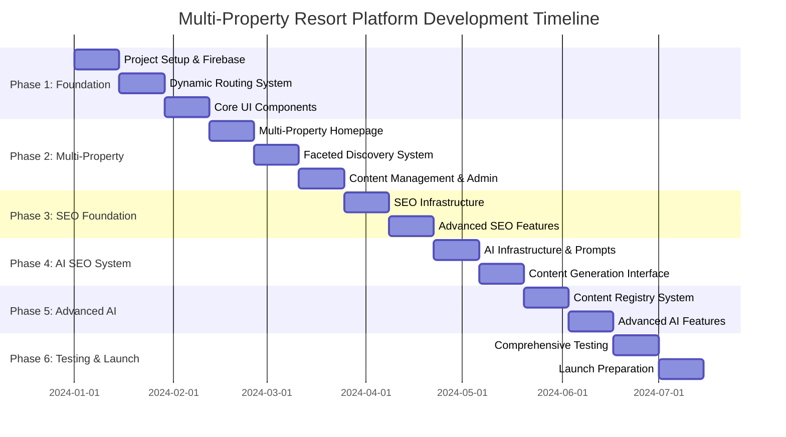
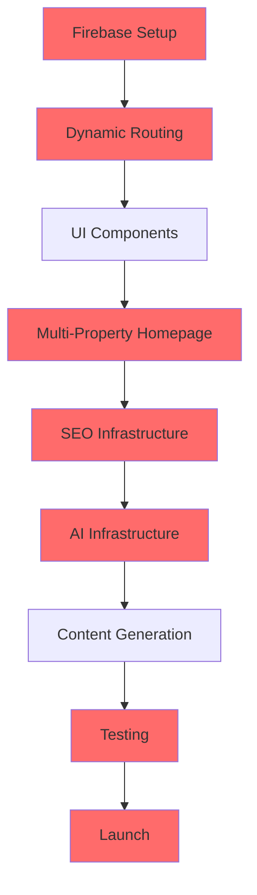
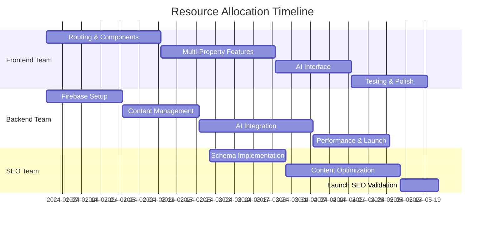
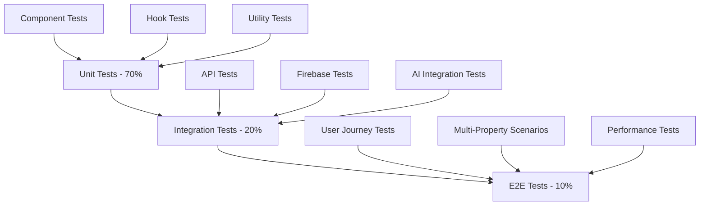

# Multi-Property Resort Platform - Development Chart & Roadmap

## Executive Summary

This development chart outlines a comprehensive 28-week roadmap for building a multi-property resort platform with AI-driven SEO capabilities. The project is structured in 6 phases with clear dependencies, milestones, and resource allocation strategies.

### Project Overview
- **Duration**: 28 weeks (7 months)
- **Team Size**: 4-6 developers + 1 project manager
- **Budget**: $0 (100% free tech stack)
- **Architecture**: React + Firebase + AI Integration
- **Deployment**: Vercel with CDN

## Development Timeline - Gantt Chart



## Phase-by-Phase Development Plan

### Phase 1: Foundation & Core Architecture (Weeks 1-6)

#### 1.1 Project Setup & Multi-Tenant Foundation (Weeks 1-2)
**Priority**: Critical Path
**Resources**: 2 Senior Developers + 1 DevOps

**Deliverables:**
- [ ] Firebase project setup with multi-tenant security rules
- [ ] React + TypeScript + Tailwind CSS project structure
- [ ] Core routing system with dynamic property/city resolution
- [ ] Basic authentication system with role-based access control

**Technical Tasks:**
```typescript
// Multi-tenant data structure implementation
interface Property {
  id: string;
  slug: string;
  name: string;
  city_slug: string;
  stay_types: string[];
  managers: { [userId: string]: boolean };
  active: boolean;
}

interface City {
  slug: string;
  name: string;
  state: string;
  properties: string[];
  seo_data: SEOData;
}
```

**Risk Mitigation:**
- Firebase quota monitoring setup
- Backup authentication strategy
- Security rules testing framework

#### 1.2 Dynamic Routing System (Weeks 3-4)
**Priority**: Critical Path
**Resources**: 2 Frontend Developers

**Deliverables:**
- [ ] Complete dynamic routing system
- [ ] Property and city resolution logic
- [ ] URL structure implementation
- [ ] 404 handling and redirects

**URL Structure:**
```typescript
const routes = [
  { path: '/', component: GroupHomepage },
  { path: '/properties/:propertySlug', component: PropertyPage },
  { path: '/properties/:propertySlug/stays/:stayType', component: StayTypePage },
  { path: '/locations/:citySlug', component: CityPage },
  { path: '/locations/:citySlug/:stayType', component: CityStayTypePage },
  { path: '/request-stay', component: EnquiryPage },
  { path: '/request-stay/:propertySlug', component: PropertyEnquiryPage }
];
```

#### 1.3 Core UI Components & Design System (Weeks 5-6)
**Priority**: High
**Resources**: 2 Frontend Developers + 1 UI/UX Designer

**Deliverables:**
- [ ] Tailwind CSS design system
- [ ] Reusable UI components
- [ ] Responsive layout system
- [ ] Property and city page templates

**Design System Implementation:**
```typescript
export const designTokens = {
  colors: {
    primary: {
      forest: '#1a3a0f',
      leaf: '#4a7c59',
      sage: '#8fbc8f'
    },
    accent: {
      sunset: '#ff8c00',
      sky: '#87ceeb',
      earth: '#d2b48c'
    }
  },
  typography: {
    fonts: {
      heading: 'Montserrat',
      body: 'Open Sans'
    }
  }
};
```

### Phase 2: Multi-Property Features & Content Management (Weeks 7-12)

#### 2.1 Multi-Property Homepage & Navigation (Weeks 7-8)
**Priority**: Critical Path
**Resources**: 2 Frontend Developers

**Deliverables:**
- [ ] Group homepage with property showcase
- [ ] Multi-property navigation system
- [ ] Property filtering and search
- [ ] Location-based property discovery

**Component Architecture:**
```typescript
// Hero Section with Property Carousel
interface HeroSectionProps {
  properties: Property[];
  onPropertySelect: (property: Property) => void;
  activeOffers: Offer[];
}

// Property Discovery Grid
interface PropertyGridProps {
  properties: Property[];
  filters: SearchFilters;
  onFilterChange: (filters: SearchFilters) => void;
}
```

#### 2.2 Faceted Discovery System (Weeks 9-10)
**Priority**: High
**Resources**: 2 Backend Developers + 1 Frontend Developer

**Deliverables:**
- [ ] Location → Property → Stay Type discovery flow
- [ ] Advanced filtering system
- [ ] Capacity and amenity filters
- [ ] Search result optimization

**Faceted Search Implementation:**
```typescript
interface SearchFilters {
  city?: string;
  stayType?: string;
  capacity?: number;
  amenities?: string[];
  priceRange?: [number, number];
}

const buildSearchQuery = (filters: SearchFilters) => {
  let query = collection(db, 'properties');
  
  if (filters.city) {
    query = query.where('city_slug', '==', filters.city);
  }
  
  if (filters.capacity) {
    query = query.where('max_capacity', '>=', filters.capacity);
  }
  
  return query;
};
```

#### 2.3 Content Management & Admin Interface (Weeks 11-12)
**Priority**: High
**Resources**: 2 Full-Stack Developers

**Deliverables:**
- [ ] Admin dashboard with role-based access
- [ ] Property management interface
- [ ] Content editing system
- [ ] User role management

### Phase 3: SEO Foundation & Schema Implementation (Weeks 13-16)

#### 3.1 SEO Infrastructure (Weeks 13-14)
**Priority**: Critical Path
**Resources**: 1 SEO Specialist + 1 Frontend Developer

**Deliverables:**
- [ ] React Helmet Async integration
- [ ] Dynamic meta tag generation
- [ ] Schema.org implementation
- [ ] Sitemap generation system

**Schema.org Implementation:**
```typescript
const generatePropertySchema = (property: Property) => {
  return {
    '@context': 'https://schema.org',
    '@type': 'Resort',
    name: property.name,
    description: property.description,
    address: {
      '@type': 'PostalAddress',
      addressLocality: property.city,
      addressRegion: property.state,
      addressCountry: 'IN'
    },
    amenityFeature: property.amenities.map(amenity => ({
      '@type': 'LocationFeatureSpecification',
      name: amenity
    }))
  };
};
```

#### 3.2 Advanced SEO Features (Weeks 15-16)
**Priority**: Medium
**Resources**: 1 SEO Specialist + 1 Backend Developer

**Deliverables:**
- [ ] Location-based SEO optimization
- [ ] Internal linking system
- [ ] Content duplication detection
- [ ] SEO performance tracking

### Phase 4: AI SEO System Development (Weeks 17-20)

#### 4.1 AI Infrastructure & System Prompt Manager (Weeks 17-18)
**Priority**: Critical Path
**Resources**: 2 Backend Developers + 1 AI Specialist

**Deliverables:**
- [ ] Google Gemini API integration via Cloud Functions
- [ ] System Prompt Manager interface
- [ ] Prompt versioning system
- [ ] AI service architecture

**Cloud Function Implementation:**
```javascript
exports.generateContent = functions.https.onCall(async (data, context) => {
  // Authenticate user
  if (!context.auth) {
    throw new functions.https.HttpsError('unauthenticated', 'User must be authenticated');
  }
  
  // Validate user role
  const userRole = await getUserRole(context.auth.uid);
  if (!['seo_manager', 'group_admin'].includes(userRole)) {
    throw new functions.https.HttpsError('permission-denied', 'Insufficient permissions');
  }
  
  // Generate content with Gemini API
  const response = await generateWithGemini(data.prompt, data.context);
  
  // Store as draft
  const jobId = await createContentJob({
    userId: context.auth.uid,
    generatedContent: response,
    status: 'draft'
  });
  
  return { jobId, content: response };
});
```

#### 4.2 Content Generation Interface & Quality Control (Weeks 19-20)
**Priority**: High
**Resources**: 2 Frontend Developers + 1 Content Specialist

**Deliverables:**
- [ ] AI content generation interface
- [ ] Draft management system
- [ ] Content quality validation
- [ ] Approval workflow

### Phase 5: Content Registry & Advanced AI Features (Weeks 21-24)

#### 5.1 Content Registry System (Weeks 21-22)
**Priority**: High
**Resources**: 2 Backend Developers

**Deliverables:**
- [ ] Content Registry implementation
- [ ] Duplication detection system
- [ ] Content hashing and mapping
- [ ] Brand consistency validation

**Content Registry Implementation:**
```typescript
interface ContentEntry {
  id: string;
  namespace: string;
  contentType: string;
  contentHash: string;
  fieldMapping: { [field: string]: string };
  duplicateOf?: string;
  qualityScore: number;
}

const detectDuplicateContent = async (content: string, namespace: string) => {
  const contentHash = generateHash(content);
  const existing = await db.collection('content_registry')
    .where('contentHash', '==', contentHash)
    .where('namespace', '!=', namespace)
    .get();
  
  return existing.docs.length > 0 ? existing.docs[0].data() : null;
};
```

#### 5.2 Advanced AI Features & Performance Optimization (Weeks 23-24)
**Priority**: Medium
**Resources**: 2 Full-Stack Developers

**Deliverables:**
- [ ] Scope-aware content generation
- [ ] Batch content processing
- [ ] Performance optimization
- [ ] AI content analytics

### Phase 6: Testing, Optimization & Launch (Weeks 25-28)

#### 6.1 Comprehensive Testing (Weeks 25-26)
**Priority**: Critical Path
**Resources**: 2 QA Engineers + All Developers

**Deliverables:**
- [ ] Unit and integration tests (85-90% coverage)
- [ ] E2E testing with Cypress
- [ ] AI content validation tests
- [ ] Performance testing

**Testing Strategy:**
```typescript
// Multi-property E2E test example
describe('Multi-Property Discovery Flow', () => {
  it('should navigate from city to property to stay type', () => {
    cy.visit('/locations/goa');
    cy.contains('Goa Properties').should('be.visible');
    
    cy.get('[data-testid="property-card"]').first().click();
    cy.url().should('include', '/properties/');
    
    cy.get('[data-testid="stay-type-card"]').first().click();
    cy.url().should('include', '/stays/');
    
    cy.get('[data-testid="request-stay-button"]').click();
    cy.url().should('include', '/request-stay');
  });
});
```

#### 6.2 Launch Preparation & Deployment (Weeks 27-28)
**Priority**: Critical Path
**Resources**: 1 DevOps + 1 Project Manager

**Deliverables:**
- [ ] Production deployment setup
- [ ] Performance monitoring
- [ ] SEO validation
- [ ] Launch checklist completion

## Dependency Mapping & Critical Path Analysis

### Critical Path Dependencies


### Parallel Development Opportunities
- **Weeks 3-6**: UI Components can be developed parallel to routing
- **Weeks 9-12**: Faceted search and admin interface can be parallel
- **Weeks 15-18**: Advanced SEO and AI infrastructure can overlap
- **Weeks 21-24**: Content registry and performance optimization parallel

## Resource Allocation Strategy

### Team Composition
| Role | Count | Key Responsibilities |
|------|-------|---------------------|
| Senior Frontend Developer | 2 | React components, routing, UI/UX |
| Senior Backend Developer | 2 | Firebase, Cloud Functions, AI integration |
| Full-Stack Developer | 1 | Admin interface, content management |
| SEO Specialist | 1 | Schema markup, content optimization |
| QA Engineer | 1 | Testing strategy, quality assurance |
| Project Manager | 1 | Timeline, coordination, risk management |

### Weekly Resource Distribution


## Risk Assessment & Mitigation Strategies

### High-Risk Areas

#### 1. Firebase Quota Limits
**Risk Level**: High
**Impact**: Service disruption, additional costs
**Mitigation**:
- Implement query optimization from day 1
- Set up monitoring and alerts at 80% quota usage
- Prepare scaling strategy with Firebase Blaze plan
- Implement caching layer to reduce database calls

#### 2. AI API Rate Limits & Costs
**Risk Level**: Medium
**Impact**: Content generation delays, unexpected costs
**Mitigation**:
- Implement request queuing and retry logic
- Set up daily/monthly spending limits
- Create fallback manual content creation workflow
- Batch AI requests to optimize API usage

#### 3. SEO Performance Impact
**Risk Level**: Medium
**Impact**: Search ranking drops during migration
**Mitigation**:
- Implement gradual rollout strategy
- Maintain 301 redirects for all existing URLs
- Monitor Core Web Vitals throughout development
- Create SEO rollback plan

#### 4. Multi-Property Data Complexity
**Risk Level**: Medium
**Impact**: Data inconsistency, performance issues
**Mitigation**:
- Implement comprehensive data validation
- Create data migration and cleanup scripts
- Set up automated data integrity checks
- Design clear data ownership and access patterns

### Risk Monitoring Dashboard
```typescript
interface RiskMetrics {
  firebaseQuotaUsage: number; // Percentage
  aiApiCosts: number; // Monthly spend
  coreWebVitals: {
    lcp: number; // Largest Contentful Paint
    inp: number; // Interaction to Next Paint
    cls: number; // Cumulative Layout Shift
  };
  dataConsistencyScore: number; // Percentage
}

const riskThresholds = {
  firebaseQuota: 80, // Alert at 80% usage
  aiApiCosts: 500, // Alert at $500/month
  lcp: 2.5, // Alert if > 2.5 seconds
  inp: 200, // Alert if > 200ms
  cls: 0.1, // Alert if > 0.1
  dataConsistency: 95 // Alert if < 95%
};
```

## Performance Optimization Checkpoints

### Week 6 Checkpoint: Foundation Performance
**Targets**:
- Initial page load < 3 seconds
- Bundle size < 500KB
- Lighthouse score > 80

**Optimizations**:
- Code splitting implementation
- Image optimization setup
- Critical CSS inlining

### Week 12 Checkpoint: Multi-Property Performance
**Targets**:
- Property page load < 2.5 seconds
- Search results < 1 second
- Mobile performance score > 85

**Optimizations**:
- Firestore query optimization
- Lazy loading for property images
- Service worker implementation

### Week 20 Checkpoint: AI Integration Performance
**Targets**:
- AI content generation < 10 seconds
- Admin interface responsiveness
- No performance regression

**Optimizations**:
- AI request caching
- Background job processing
- Progressive loading states

### Week 26 Checkpoint: Launch-Ready Performance
**Targets**:
- Core Web Vitals: LCP < 2.5s, INP < 200ms, CLS < 0.1
- Lighthouse score > 95
- Mobile-first performance optimization

**Optimizations**:
- CDN optimization
- Database indexing
- Final performance audit

## Testing Strategy Integration

### Testing Pyramid


### Testing Schedule
| Phase | Testing Focus | Coverage Target |
|-------|---------------|----------------|
| Phase 1 | Unit tests for core components | 80% |
| Phase 2 | Integration tests for multi-property features | 85% |
| Phase 3 | SEO validation and schema testing | 90% |
| Phase 4 | AI integration and content validation | 85% |
| Phase 5 | Performance and load testing | 90% |
| Phase 6 | Comprehensive E2E and user acceptance | 95% |

### Automated Testing Pipeline
```yaml
# GitHub Actions CI/CD Pipeline
name: Multi-Property Resort Platform CI/CD

on:
  push:
    branches: [main, develop]
  pull_request:
    branches: [main]

jobs:
  test:
    runs-on: ubuntu-latest
    steps:
      - uses: actions/checkout@v3
      - name: Setup Node.js
        uses: actions/setup-node@v3
        with:
          node-version: '18'
      - name: Install dependencies
        run: npm ci
      - name: Run unit tests
        run: npm run test:unit
      - name: Run integration tests
        run: npm run test:integration
      - name: Run E2E tests
        run: npm run test:e2e
      - name: Performance audit
        run: npm run lighthouse:ci
```

## Milestone Deliverables & Success Criteria

### Phase 1 Success Criteria
- [ ] Firebase project fully configured with security rules
- [ ] Dynamic routing resolves all property/city combinations
- [ ] Core UI components render consistently across devices
- [ ] Authentication system supports all user roles
- [ ] Performance: Initial load < 3 seconds

### Phase 2 Success Criteria
- [ ] Multi-property homepage showcases all properties
- [ ] Faceted search returns accurate results in < 1 second
- [ ] Admin interface supports all content management tasks
- [ ] Property filtering works across all dimensions
- [ ] Mobile responsiveness maintained

### Phase 3 Success Criteria
- [ ] All pages generate appropriate meta tags and schema
- [ ] Sitemap includes all dynamic routes
- [ ] SEO audit score > 90 on Lighthouse
- [ ] Internal linking system functional
- [ ] Core Web Vitals meet targets

### Phase 4 Success Criteria
- [ ] AI content generation produces quality content
- [ ] System prompt manager supports versioning
- [ ] Draft workflow prevents accidental overwrites
- [ ] Content approval process functional
- [ ] AI API costs within budget

### Phase 5 Success Criteria
- [ ] Content registry detects duplicates accurately
- [ ] Brand consistency validation works
- [ ] Advanced AI features enhance content quality
- [ ] Performance optimization maintains speed
- [ ] Analytics track AI content effectiveness

### Phase 6 Success Criteria
- [ ] Test coverage > 90% across all modules
- [ ] E2E tests cover all critical user journeys
- [ ] Performance meets all Core Web Vitals targets
- [ ] SEO validation confirms search engine readiness
- [ ] Launch checklist 100% complete

## Technology Stack Implementation Order

### Week 1-2: Core Infrastructure
1. **Vite + React + TypeScript**: Project foundation
2. **Firebase SDK**: Authentication, Firestore, Storage
3. **Tailwind CSS**: Design system and styling
4. **React Router**: Basic routing setup

### Week 3-4: Routing & Navigation
1. **React Router v6**: Advanced routing patterns
2. **Firebase Firestore**: Property/city data structure
3. **React Query**: Data fetching and caching
4. **Headless UI**: Accessible component primitives

### Week 5-6: UI Foundation
1. **React Helmet Async**: Meta tag management
2. **Framer Motion**: Animations and transitions
3. **React Hook Form**: Form handling
4. **React Hot Toast**: Notifications

### Week 7-12: Feature Development
1. **Firebase Cloud Functions**: Backend logic
2. **Algolia/Firestore**: Search implementation
3. **React Virtualized**: Performance optimization
4. **React Testing Library**: Testing setup

### Week 13-16: SEO & Schema
1. **Schema-DTS**: TypeScript schema generation
2. **React Helmet Async**: Advanced meta management
3. **Sitemap Generator**: Dynamic sitemap creation
4. **Google Analytics 4**: Analytics integration

### Week 17-20: AI Integration
1. **Google Gemini API**: AI content generation
2. **Firebase Cloud Functions**: AI service layer
3. **React Diff Viewer**: Content comparison
4. **Monaco Editor**: Code/prompt editing

### Week 21-24: Advanced Features
1. **Web Workers**: Background processing
2. **IndexedDB**: Client-side caching
3. **Service Workers**: Offline functionality
4. **WebP/AVIF**: Image optimization

### Week 25-28: Testing & Launch
1. **Cypress**: E2E testing framework
2. **Jest**: Unit testing framework
3. **Lighthouse CI**: Performance monitoring
4. **Vercel**: Production deployment

## Launch Readiness Checklist

### Technical Readiness
- [ ] All core features implemented and tested
- [ ] Performance targets met (Core Web Vitals)
- [ ] SEO implementation validated
- [ ] Security audit completed
- [ ] Backup and recovery procedures tested
- [ ] Monitoring and alerting configured

### Content Readiness
- [ ] All property data migrated and validated
- [ ] SEO content generated and approved
- [ ] Images optimized and uploaded
- [ ] Legal pages created (Privacy, Terms)
- [ ] Contact information updated
- [ ] Social media integration tested

### Operational Readiness
- [ ] Admin team trained on new system
- [ ] Content approval workflows established
- [ ] Customer support documentation updated
- [ ] Analytics and tracking configured
- [ ] Email templates and automation setup
- [ ] Domain and SSL certificates configured

### Marketing Readiness
- [ ] SEO strategy implemented
- [ ] Social media accounts updated
- [ ] Press release prepared
- [ ] Stakeholder communication plan
- [ ] Soft launch with limited audience
- [ ] Feedback collection mechanisms ready

## Post-Launch Optimization Plan

### Week 29-32: Performance Monitoring
- Monitor Core Web Vitals and user experience metrics
- Optimize based on real user data
- A/B test AI-generated vs manual content
- Refine SEO strategy based on search performance

### Week 33-36: Feature Enhancement
- Implement user feedback and feature requests
- Expand AI content generation capabilities
- Add advanced analytics and reporting
- Optimize conversion funnel based on data

### Week 37-40: Scale Preparation
- Prepare for increased traffic and usage
- Optimize database queries and caching
- Implement advanced monitoring and alerting
- Plan for additional property onboarding

This comprehensive development chart provides a structured approach to building the multi-property resort platform with clear milestones, dependencies, and success criteria. The modular approach allows for parallel development while maintaining system integration and quality standards.