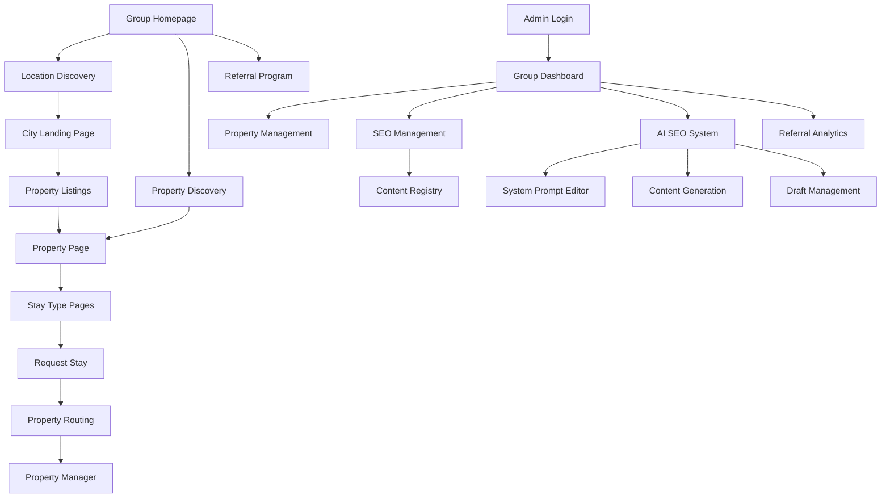

# Phase 2: Multi-Property Platform & AI-Powered SEO - Requirements Document

## 1. Product Overview

Phase 2 transforms the resort platform into a comprehensive multi-property group platform with AI-powered SEO, advanced referral systems, and sophisticated content management. This phase implements the core multi-tenant architecture, dynamic routing system, and Google Gemini integration for automated SEO content generation.

**Key Objectives:**
- Implement multi-property architecture with dynamic routing
- Build AI-powered SEO system with Google Gemini integration
- Create gamified referral system with reward tracking
- Establish role-based admin management for multi-property operations
- Implement promotional offers system with seasonal campaigns
- Build faceted discovery system for enhanced user experience

## 2. Core Features

### 2.1 User Roles

| Role | Registration Method | Core Permissions |
|------|---------------------|------------------|
| Guest User | No registration required | Browse all properties, filter by location/stay type, view galleries, submit enquiries, use referral codes |
| Registered Guest | Email/phone registration | Access referral dashboard, track referral rewards, view booking history |
| Group Admin | Firebase Authentication | Full platform management, all properties access, analytics, SEO management, AI system prompt editing, AI content approval, offers management, referral system |
| Property Manager | Admin-created Firebase accounts | Property-specific content management, enquiry management, local analytics, AI content generation for assigned properties, create offers |
| City Manager | Admin-created Firebase accounts | City-wide content management, location-based SEO, cross-property coordination, AI content generation for city pages |
| SEO Manager | Admin-created Firebase accounts | AI system prompt management, SEO content generation, performance tracking, content registry oversight |
| Content Editor | Admin-created Firebase accounts | AI content generation, draft review and editing, cannot apply changes to production |

### 2.2 Feature Modules

Our Phase 2 requirements consist of the following main modules:

1. **Multi-Property Architecture**: Dynamic routing for properties, cities, stay types, and combo pages with property resolution logic
2. **AI-Powered SEO System**: Google Gemini integration with system prompt management, content generation interface, and draft approval workflow
3. **Referral System**: Gamified booking experience with unique code generation, reward tracking, and comprehensive analytics
4. **Promotional Offers System**: Dynamic offer creation, seasonal campaigns, discount management with countdown timers
5. **Faceted Discovery System**: Multi-level filtering, curated collections, smart recommendations, and location-based search
6. **Admin Dashboard**: Multi-tenant management with property-specific and group-wide analytics, content registry, and user management
7. **Request Stay System**: Multi-property enquiry handling with automatic property routing and unified communication
8. **Content Management**: Centralized content registry with duplication detection, brand consistency checks, and version control

### 2.3 Page Details

| Page Name | Module Name | Feature Description |
|-----------|-------------|---------------------|
| Group Homepage | Hero Section | Dynamic property carousel with location-based filtering, unified brand messaging, promotional banner with active offers |
| Group Homepage | Property Discovery | Interactive map with property markers, filter by location/stay type/amenities, property comparison tools |
| Group Homepage | Referral Program | Referral code sharing interface, rewards explanation, referral program benefits display |
| Property Pages | Property Hero | Location-specific imagery, property branding, unique selling propositions, local weather integration |
| Property Pages | Stay Type Grid | Accommodation showcase with availability indicators, pricing ranges, promotional offers display |
| Property Pages | Local Experiences | Property-specific activities, nearby attractions, partnership integrations |
| Stay Type Pages | Accommodation Details | Comprehensive room information, 360° tours, amenity lists, capacity details, dynamic pricing with active offers |
| Stay Type Pages | Promotional Offers | Display active offers (percentage/fixed discounts), seasonal campaigns, limited-time deals with countdown timers |
| Stay Type Pages | Gamified Booking | Confetti animation on enquiry submission, celebration effects, progress indicators, success feedback |
| City Landing Pages | City Overview | Destination information, climate, attractions, transportation, property locations with SEO optimization |
| City Landing Pages | Property Listings | All group properties in city, comparison tools, unified booking flow |
| Combo Pages | Curated Collections | "Treehouses in Wayanad" with property comparisons, unique features, booking options |
| Request Stay System | Property Selection | Dynamic property dropdown based on location/dates, property-specific forms, referral code input |
| Request Stay System | Multi-Property Enquiry | Unified enquiry handling with automatic property routing, preference matching |
| Admin Dashboard | Group Analytics | Cross-property performance metrics, revenue analytics, occupancy trends, referral analytics |
| Admin Dashboard | Property Management | Individual property content management, local team coordination, offers management |
| Admin Dashboard | SEO Management | Location-based keyword tracking, content optimization, schema markup management |
| Admin Dashboard | AI SEO System | System prompt management with versioning, AI content generation interface, draft review and approval workflow |
| AI SEO Interface | System Prompt Editor | Rich markdown editor with token counter, version history, property-specific prompt templates, activation controls |
| AI SEO Interface | Content Generation | Scope picker for pages/sections, SEO input controls (keywords, audience, tone), context input, draft results with diff viewer |
| AI SEO Interface | Draft Management | Side-by-side content comparison, quality checks (readability, keyword density), manual editing capabilities, apply/discard controls |

## 3. Core Processes

### 3.1 Guest Discovery Flow
1. **Landing**: Guest arrives via SEO (city/property search) or direct navigation, sees active offers
2. **Discovery**: Browse properties by location, filter by stay type/amenities, view galleries, compare offers
3. **Selection**: Choose specific property and accommodation type, view promotional pricing
4. **Referral**: Optional referral code entry for additional benefits
5. **Enquiry**: Submit "Request Stay" with dates, preferences, contact information, referral code
6. **Celebration**: Confetti animation and success feedback upon enquiry submission
7. **Routing**: System routes enquiry to appropriate property manager with offer/referral context
8. **Follow-up**: Property manager responds with availability, final pricing (including offers), booking details

### 3.2 AI-Powered SEO Content Generation Flow
1. **System Prompt Management**: SEO Manager creates/updates versioned system prompts with property-specific context
2. **Content Generation**: Select scope (Group/Property/City/Stay Type/Combo), input SEO parameters (keywords, audience, tone)
3. **AI Processing**: Google Gemini generates content using active system prompt + site content context
4. **Draft Review**: Generated content appears in draft management interface with diff viewer
5. **Quality Checks**: Automated readability, keyword density, and brand consistency validation
6. **Manual Editing**: Content Editor can modify drafts before approval
7. **Approval**: SEO Manager or Group Admin approves changes for production deployment
8. **Content Registry**: All changes logged in centralized content management system

### 3.3 Referral System Flow
1. **Registration**: Guest registers with email/phone to access referral features
2. **Code Generation**: System generates unique referral code linked to user profile
3. **Sharing**: User shares referral code via social media, email, or direct link
4. **Usage**: New guest uses referral code during enquiry submission
5. **Tracking**: System tracks referral usage and attributes bookings to referrer
6. **Rewards**: Both referrer and referee receive benefits (discounts, credits, etc.)
7. **Analytics**: Admin dashboard shows referral performance and reward distribution

## 4. User Interface Design

### 4.1 Design Style
- **Primary Colors**: Forest Green (#1a3a0f) for nature theme, Leaf Green (#4a7c59) for accents
- **Secondary Colors**: Sunset Orange (#ff8c00) for CTAs, Sky Blue (#87ceeb) for info, Earth Tone (#d2b48c) for backgrounds
- **Button Style**: Rounded corners (8px), subtle shadows, hover animations, confetti effects for booking actions
- **Typography**: Montserrat for headings, Open Sans for body text, clear hierarchy with responsive sizing
- **Layout Style**: Card-based design, location-aware navigation, responsive grid system, mobile-first approach
- **Icons**: Lucide React icons, consistent 20px size, contextual colors, nature-themed iconography
- **Animations**: Confetti celebrations, smooth transitions, loading states, progress indicators

### 4.2 Page Design Overview

| Page Name | Module Name | UI Elements |
|-----------|-------------|-------------|
| Group Homepage | Hero Section | Full-screen carousel with property images, location-based filtering, promotional banner overlay, animated CTAs |
| Group Homepage | Property Discovery | Interactive map with custom markers, filter sidebar, property comparison cards, search autocomplete |
| Group Homepage | Referral Program | Referral code generator, social sharing buttons, rewards explanation cards, progress tracking |
| Property Pages | Property Hero | Location-specific hero images, property branding overlay, weather widget, local time display |
| Property Pages | Stay Type Grid | Accommodation cards with image galleries, pricing display, offer badges, availability indicators |
| Stay Type Pages | Promotional Offers | Offer cards with countdown timers, discount badges, seasonal campaign banners, urgency indicators |
| Stay Type Pages | Gamified Booking | Confetti animation library, celebration modals, progress bars, success feedback animations |
| City Landing Pages | City Overview | Destination hero images, information cards, attraction listings, property location map |
| Admin Dashboard | AI SEO Interface | Split-screen layout, markdown editor with syntax highlighting, diff viewer, approval workflow |
| Admin Dashboard | Analytics | Chart library integration, date range pickers, export options, filter controls, referral metrics |

### 4.3 Responsiveness
- **Mobile-first approach** with progressive enhancement for larger screens
- **Touch-optimized** interfaces for all interactive elements
- **Adaptive navigation** that transforms based on screen size
- **Consistent experience** across all devices with platform-specific optimizations

## 5. Technical Requirements

### 5.1 Architecture Requirements
- **Multi-Tenant Data Structure**: Property-specific collections with city-based organization
- **Dynamic Routing**: React Router v6 with property/city resolution logic
- **AI Integration**: Google Gemini API via Firebase Cloud Functions
- **Real-time Updates**: Firestore real-time listeners for content changes
- **CDN Optimization**: Vercel edge functions for global content delivery

### 5.2 Performance Targets
- **Page Load Time**: < 2 seconds for all public pages
- **AI Content Generation**: < 10 seconds for standard content blocks
- **Search Response**: < 500ms for property filtering
- **Real-time Updates**: < 100ms for admin interface changes
- **Concurrent Users**: Support 1000+ simultaneous visitors

### 5.3 SEO Requirements
- **Schema.org Implementation**: Resort, HotelRoom, TouristDestination schemas
- **Dynamic Meta Tags**: Property and location-specific optimization
- **Sitemap Generation**: Automated sitemap with property/city/stay type URLs
- **Internal Linking**: AI-powered contextual link suggestions
- **Content Quality**: Automated readability and keyword density checks

### 5.4 Security Requirements
- **Role-based Access Control**: Firebase Authentication with custom claims
- **Content Validation**: Input sanitization and XSS protection
- **API Security**: Rate limiting and request validation
- **Data Privacy**: GDPR compliance for user data handling
- **Audit Logging**: Comprehensive logging for all admin actions

## 6. Integration Requirements

### 6.1 External Services
- **Google Gemini API**: AI content generation with system prompt management
- **Web3Forms**: Multi-property contact form routing with security hardening
- **Firebase Services**: Firestore, Authentication, Storage, Analytics, Cloud Functions
- **Vercel Deployment**: CDN, edge functions, and automatic deployments
- **Google Analytics 4**: Property-segmented analytics with custom events

### 6.2 AI System Integration
- **System Prompt Versioning**: Version control for AI prompts with rollback capability
- **Content Registry**: Centralized content management with duplication detection
- **Draft Workflow**: All AI changes start as drafts with explicit approval process
- **Quality Assurance**: Automated content validation and brand consistency checks
- **Performance Monitoring**: AI response time and quality metrics tracking

## 7. Success Metrics

- **SEO Performance**: 300% increase in organic traffic within 6 months
- **Content Generation Efficiency**: 80% reduction in manual content creation time
- **Referral Program Success**: 25% of bookings through referral system
- **User Engagement**: 40% increase in time spent on property pages
- **Conversion Rate**: 35% improvement in enquiry-to-booking conversion
- **Admin Efficiency**: 60% reduction in property management time
- **System Performance**: 99.9% uptime with sub-2-second page loads
- **Content Quality**: 90% AI-generated content approval rate without manual editing