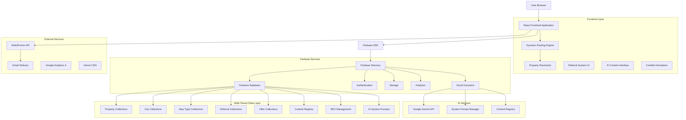
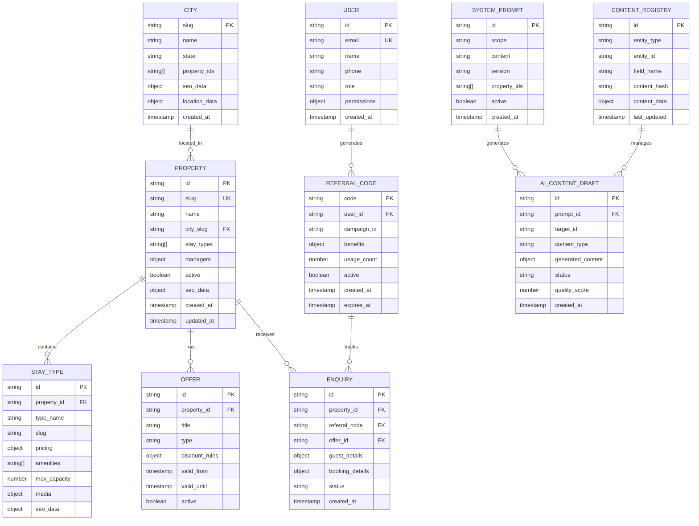
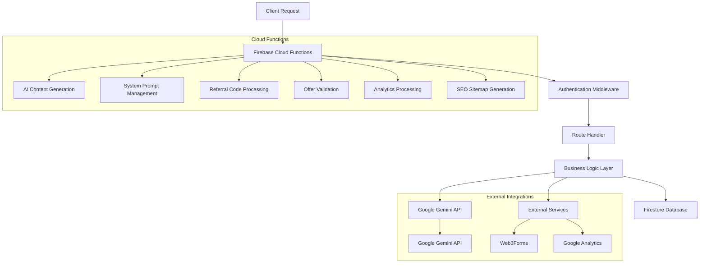

# Phase 2: Multi-Property Platform & AI-Powered SEO - Technical Architecture Document

## 1. Architecture Design



## 2. Technology Description

- **Frontend**: React@18 + TypeScript + Tailwind CSS + Vite
- **Routing**: React Router v6 with dynamic route generation and property resolution
- **Backend Services**: Firebase (Firestore Database + Authentication + Storage + Analytics + Cloud Functions)
- **AI Integration**: Google Gemini API via Cloud Functions for Firebase with system prompt management
- **Email Service**: Web3Forms with multi-property routing and security hardening
- **Deployment**: Vercel with CDN, edge functions, and automatic deployments
- **Search**: Client-side filtering with Firestore compound queries and faceted search
- **SEO**: React Helmet Async + Schema-DTS + automated sitemap generation + AI-powered content generation
- **Analytics**: Google Analytics 4 + Firebase Analytics with property segmentation and referral tracking
- **Animations**: Canvas Confetti for gamified booking experience
- **Testing**: Jest + React Testing Library + Cypress with multi-property scenarios + AI content validation

## 3. Dynamic Route Definitions

### 3.1 Core Routes
| Route Pattern | Purpose | Dynamic Resolution |
|---------------|---------|--------------------|
| / | Group homepage | Static group content with active offers |
| /properties/:propertySlug | Property homepage | Resolve property from slug with local offers |
| /properties/:propertySlug/stays/:stayType | Stay type details | Resolve property + stay type with pricing |
| /locations/:citySlug | City landing page | Resolve city + properties with SEO optimization |
| /locations/:citySlug/:stayType | City + stay type combo | Resolve city + stay type + properties |
| /experiences/:citySlug | City experiences | Resolve city + activities with local partnerships |
| /request-stay | Multi-property enquiry | Dynamic property selection with referral input |
| /request-stay/:propertySlug | Property-specific enquiry | Pre-selected property with offer context |
| /referral/:code | Referral landing page | Resolve referral code and apply benefits |

### 3.2 Admin Routes
| Route Pattern | Purpose | Access Level |
|---------------|---------|-------------|
| /admin | Admin dashboard login | All admin roles |
| /admin/group | Group-level management | Group Admin only |
| /admin/property/:propertyId | Property management | Property Manager + Group Admin |
| /admin/city/:citySlug | City management | City Manager + Group Admin |
| /admin/seo | SEO management | SEO Manager + Group Admin |
| /admin/seo/ai-system | AI SEO system management | SEO Manager + Group Admin |
| /admin/seo/system-prompt | System prompt editor | SEO Manager + Group Admin |
| /admin/seo/content-generation | AI content generation interface | SEO Manager + Content Editor + Group Admin |
| /admin/seo/drafts | Draft management and approval | SEO Manager + Group Admin |
| /admin/content-registry | Content management | Content Manager + Group Admin |
| /admin/analytics | Multi-property analytics | All admin roles (filtered by permissions) |
| /admin/referrals | Referral system management | Group Admin + Property Manager |
| /admin/offers | Promotional offers management | Group Admin + Property Manager |

### 3.3 Route Resolution Logic
```typescript
interface RouteResolver {
  resolveProperty: (slug: string) => Promise<Property | null>;
  resolveCity: (slug: string) => Promise<City | null>;
  resolveStayType: (propertyId: string, stayType: string) => Promise<StayType | null>;
  resolveReferralCode: (code: string) => Promise<ReferralCode | null>;
  generateSitemap: () => Promise<SitemapEntry[]>;
  validateOfferEligibility: (offerId: string, context: BookingContext) => Promise<boolean>;
}
```

## 4. API Definitions

### 4.1 Multi-Property Web3Forms Integration

**Property-Specific Contact Form with Referral Support**
```
POST https://api.web3forms.com/submit
```

Request (Form Data):
| Param Name | Param Type | isRequired | Description |
|------------|------------|------------|-------------|
| access_key | string | true | Property-specific Web3Forms access key |
| property_id | string | true | Internal property identifier |
| property_name | string | true | Property display name |
| city | string | true | Property location city |
| stay_type | string | false | Preferred accommodation type |
| name | string | true | Customer name |
| email | string | true | Customer email |
| phone | string | false | Customer phone |
| message | string | true | Enquiry message |
| check_in | string | false | Check-in date |
| check_out | string | false | Check-out date |
| guests | number | false | Number of guests |
| referral_code | string | false | Referral code for benefits |
| offer_id | string | false | Applied promotional offer ID |
| h-captcha-response | string | false | hCaptcha verification token |
| _honeypot | string | false | Honeypot field (must be empty) |

### 4.2 Cloud Functions for AI SEO

**System Prompt Management**
```
POST /api/seo/updateSystemPrompt
```

Request:
| Param Name | Param Type | isRequired | Description |
|------------|------------|------------|-------------|
| prompt_id | string | true | System prompt identifier |
| content | string | true | Updated prompt content |
| version | string | true | Version identifier |
| scope | string | true | Scope: group/property/city/stay_type |
| property_ids | string[] | false | Applicable property IDs |

Response:
| Param Name | Param Type | Description |
|------------|------------|-------------|
| success | boolean | Operation status |
| version_id | string | New version identifier |
| validation_errors | string[] | Content validation issues |

**AI Content Generation**
```
POST /api/seo/generateContent
```

Request:
| Param Name | Param Type | isRequired | Description |
|------------|------------|------------|-------------|
| scope | string | true | Content scope: group/property/city/stay_type/combo |
| target_id | string | true | Target entity ID |
| content_type | string | true | Content type: meta/heading/description/faq |
| seo_keywords | string[] | false | Target keywords |
| audience | string | false | Target audience |
| tone | string | false | Content tone |
| context | object | false | Additional context data |

Response:
| Param Name | Param Type | Description |
|------------|------------|-------------|
| draft_id | string | Generated draft identifier |
| content | object | Generated content by field |
| quality_score | number | Content quality assessment |
| seo_score | number | SEO optimization score |
| suggestions | string[] | Improvement suggestions |

### 4.3 Referral System API

**Generate Referral Code**
```
POST /api/referral/generate
```

Request:
| Param Name | Param Type | isRequired | Description |
|------------|------------|------------|-------------|
| user_id | string | true | Registered user ID |
| campaign_id | string | false | Specific campaign ID |

Response:
| Param Name | Param Type | Description |
|------------|------------|-------------|
| referral_code | string | Unique referral code |
| share_url | string | Shareable URL with code |
| benefits | object | Referrer and referee benefits |

**Track Referral Usage**
```
POST /api/referral/track
```

Request:
| Param Name | Param Type | isRequired | Description |
|------------|------------|------------|-------------|
| referral_code | string | true | Used referral code |
| enquiry_id | string | true | Associated enquiry ID |
| property_id | string | true | Target property |

### 4.4 Promotional Offers API

**Get Active Offers**
```
GET /api/offers/active
```

Query Parameters:
| Param Name | Param Type | isRequired | Description |
|------------|------------|------------|-------------|
| property_id | string | false | Filter by property |
| stay_type | string | false | Filter by accommodation type |
| check_in | string | false | Check-in date for availability |

Response:
| Param Name | Param Type | Description |
|------------|------------|-------------|
| offers | Offer[] | Active promotional offers |
| seasonal_campaigns | Campaign[] | Current seasonal campaigns |

## 5. Data Model

### 5.1 Data Model Definition



### 5.2 Data Definition Language

**Property Collection (properties)**
```javascript
// Firestore collection: properties
{
  id: "prop_wayanad_treehouse_resort",
  slug: "wayanad-treehouse-resort",
  name: "Wayanad Treehouse Resort",
  city_slug: "wayanad",
  stay_types: ["treehouse", "villa", "cottage"],
  managers: {
    "user_manager_1": true,
    "user_manager_2": true
  },
  active: true,
  seo_data: {
    title: "Luxury Treehouse Resort in Wayanad | Nature Stays",
    description: "Experience luxury treehouse accommodations in Wayanad...",
    keywords: ["wayanad resort", "treehouse stay", "luxury accommodation"]
  },
  location: {
    latitude: 11.6854,
    longitude: 76.1320,
    address: "Wayanad District, Kerala, India"
  },
  created_at: "2024-01-01T00:00:00Z",
  updated_at: "2024-01-15T10:30:00Z"
}

// Firestore Security Rules
rules_version = '2';
service cloud.firestore {
  match /databases/{database}/documents {
    // Properties - readable by all, writable by managers
    match /properties/{propertyId} {
      allow read: if true;
      allow write: if request.auth != null && 
        (hasRole('group_admin') || 
         resource.data.managers[request.auth.uid] == true);
    }
    
    // Cities - readable by all, writable by city managers
    match /cities/{citySlug} {
      allow read: if true;
      allow write: if request.auth != null && 
        (hasRole('group_admin') || hasRole('city_manager'));
    }
    
    // Referral codes - readable/writable by owner
    match /referral_codes/{code} {
      allow read, write: if request.auth != null && 
        request.auth.uid == resource.data.user_id;
    }
    
    // AI System Prompts - restricted to SEO managers
    match /system_prompts/{promptId} {
      allow read: if request.auth != null;
      allow write: if request.auth != null && 
        (hasRole('group_admin') || hasRole('seo_manager'));
    }
    
    function hasRole(role) {
      return request.auth.token.role == role;
    }
  }
}
```

**City Collection (cities)**
```javascript
// Firestore collection: cities
{
  slug: "wayanad",
  name: "Wayanad",
  state: "Kerala",
  property_ids: ["prop_wayanad_treehouse_resort", "prop_wayanad_eco_lodge"],
  seo_data: {
    title: "Luxury Resorts in Wayanad | Hill Station Accommodations",
    description: "Discover premium resorts and eco-lodges in Wayanad...",
    keywords: ["wayanad resorts", "hill station stays", "kerala tourism"]
  },
  location_data: {
    climate: "Tropical highland",
    attractions: ["Chembra Peak", "Soochipara Falls", "Banasura Sagar Dam"],
    best_time_to_visit: "October to May"
  },
  created_at: "2024-01-01T00:00:00Z"
}
```

**Referral System Collection (referral_codes)**
```javascript
// Firestore collection: referral_codes
{
  code: "NATURE2024",
  user_id: "user_registered_guest_1",
  campaign_id: "summer_2024",
  benefits: {
    referrer: {
      type: "discount",
      value: 500,
      description: "₹500 credit for next booking"
    },
    referee: {
      type: "percentage",
      value: 10,
      description: "10% discount on first booking"
    }
  },
  usage_count: 3,
  max_usage: 10,
  active: true,
  created_at: "2024-01-01T00:00:00Z",
  expires_at: "2024-12-31T23:59:59Z"
}
```

**AI System Prompts Collection (system_prompts)**
```javascript
// Firestore collection: system_prompts
{
  id: "prompt_property_seo_v2",
  scope: "property",
  content: "You are an expert SEO content writer for luxury resort properties...",
  version: "2.1.0",
  property_ids: ["prop_wayanad_treehouse_resort"],
  active: true,
  metadata: {
    token_count: 1250,
    last_tested: "2024-01-15T10:00:00Z",
    performance_score: 8.7
  },
  created_at: "2024-01-15T09:00:00Z"
}
```

**Content Registry Collection (content_registry)**
```javascript
// Firestore collection: content_registry
{
  id: "content_prop_wayanad_meta_title",
  entity_type: "property",
  entity_id: "prop_wayanad_treehouse_resort",
  field_name: "seo_data.title",
  content_hash: "sha256_hash_of_content",
  content_data: {
    current: "Luxury Treehouse Resort in Wayanad | Nature Stays",
    previous: "Wayanad Treehouse Resort | Luxury Accommodation",
    ai_generated: true,
    approved_by: "user_seo_manager_1",
    quality_score: 9.2
  },
  last_updated: "2024-01-15T14:30:00Z"
}
```

## 6. Server Architecture

### 6.1 Firebase Cloud Functions Architecture



### 6.2 AI Content Generation Pipeline

```typescript
// Cloud Function: AI Content Generation
export const generateAIContent = functions.https.onCall(async (data, context) => {
  // Authentication check
  if (!context.auth) {
    throw new functions.https.HttpsError('unauthenticated', 'User must be authenticated');
  }
  
  // Role-based authorization
  const userRole = context.auth.token.role;
  if (!['group_admin', 'seo_manager', 'content_editor'].includes(userRole)) {
    throw new functions.https.HttpsError('permission-denied', 'Insufficient permissions');
  }
  
  const { scope, target_id, content_type, seo_keywords, audience, tone, context: contentContext } = data;
  
  try {
    // Get active system prompt
    const systemPrompt = await getActiveSystemPrompt(scope, target_id);
    
    // Prepare context data
    const contextData = await prepareContentContext(scope, target_id, contentContext);
    
    // Generate content using Gemini API
    const generatedContent = await callGeminiAPI({
      systemPrompt: systemPrompt.content,
      context: contextData,
      parameters: {
        content_type,
        seo_keywords,
        audience,
        tone
      }
    });
    
    // Create draft entry
    const draftId = await createContentDraft({
      prompt_id: systemPrompt.id,
      target_id,
      content_type,
      generated_content: generatedContent,
      quality_score: calculateQualityScore(generatedContent),
      status: 'pending_review'
    });
    
    return {
      draft_id: draftId,
      content: generatedContent,
      quality_score: calculateQualityScore(generatedContent),
      seo_score: calculateSEOScore(generatedContent, seo_keywords)
    };
    
  } catch (error) {
    console.error('AI Content Generation Error:', error);
    throw new functions.https.HttpsError('internal', 'Content generation failed');
  }
});
```

## 7. Performance Optimization

### 7.1 Frontend Optimization
- **Code Splitting**: Route-based and component-based lazy loading
- **Image Optimization**: WebP format with fallbacks, lazy loading, responsive images
- **Caching Strategy**: Service worker for offline functionality, browser caching for static assets
- **Bundle Optimization**: Tree shaking, minification, compression

### 7.2 Database Optimization
- **Compound Indexes**: Optimized queries for faceted search
- **Data Denormalization**: Strategic duplication for read performance
- **Pagination**: Cursor-based pagination for large datasets
- **Real-time Listeners**: Selective subscriptions to minimize bandwidth

### 7.3 AI System Optimization
- **Prompt Caching**: Cache system prompts to reduce API calls
- **Content Batching**: Batch multiple content generation requests
- **Quality Scoring**: Pre-computed quality metrics for faster approval
- **Rate Limiting**: Intelligent rate limiting for AI API usage

## 8. Security Implementation

### 8.1 Authentication & Authorization
- **Firebase Authentication**: Email/password with custom claims for roles
- **Role-based Access Control**: Granular permissions for different admin levels
- **Session Management**: Automatic token refresh and secure logout
- **Multi-factor Authentication**: Optional 2FA for admin accounts

### 8.2 Data Security
- **Input Validation**: Comprehensive validation for all user inputs
- **XSS Protection**: Content sanitization and CSP headers
- **SQL Injection Prevention**: Parameterized queries and input escaping
- **Rate Limiting**: API rate limiting to prevent abuse

### 8.3 AI System Security
- **Prompt Injection Protection**: Input sanitization for AI prompts
- **Content Validation**: Automated checks for inappropriate content
- **Access Logging**: Comprehensive audit trail for AI operations
- **API Key Management**: Secure storage and rotation of API keys