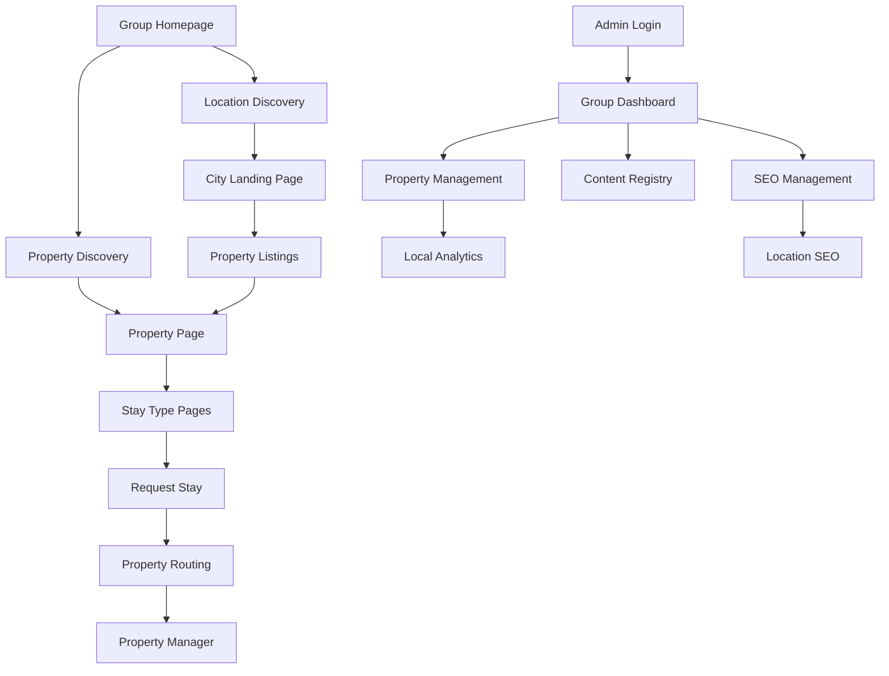

# Multi-Property Resort Group Platform - Product Requirements Document

## 1. Product Overview
A comprehensive multi-property resort group platform supporting multiple resort properties across different locations, each with distinct branding, stay types, and location-based SEO optimization.
- The platform serves as a unified digital presence for a resort group with properties in various cities, enabling guests to discover, explore, and request stays across the entire portfolio while maintaining property-specific branding and experiences.
- Target market: Resort groups, hospitality chains, and multi-location accommodation providers seeking centralized management with localized optimization.

## 2. Core Features

### 2.1 User Roles
| Role | Registration Method | Core Permissions |
|------|---------------------|------------------|
| Guest User | No registration required | Browse all properties, filter by location/stay type, view galleries, submit enquiries, use referral codes |
| Registered Guest | Email/phone registration | Access referral dashboard, track referral rewards, view booking history |
| Group Admin | Firebase Authentication | Full platform management, all properties access, analytics, SEO management, AI system prompt editing, AI content approval, offers management, referral system |
| Property Manager | Admin-created Firebase accounts | Property-specific content management, enquiry management, local analytics, AI content generation for assigned properties, create offers |
| City Manager | Admin-created Firebase accounts | City-wide content management, location-based SEO, cross-property coordination, AI content generation for city pages |
| SEO Manager | Admin-created Firebase accounts | AI system prompt management, SEO content generation, performance tracking, content registry oversight |
| Content Editor | Admin-created Firebase accounts | AI content generation, draft review and editing, cannot apply changes to production |

### 2.2 Multi-Property Architecture
Our resort group platform consists of the following hierarchical structure:
1. **Group Homepage**: Brand overview, property showcase, location-based discovery, unified search, active offers
2. **Property Pages**: Individual resort branding, accommodation showcase, property-specific experiences, local information, promotional offers
3. **Stay Type Pages**: Detailed accommodation types within properties (treehouses, villas, suites, etc.) with dynamic pricing and offers
4. **City Landing Pages**: Location-based discovery, all properties in city, local attractions, curated experiences
5. **Combo Pages**: City + stay type combinations ("Treehouses in Wayanad", "Villas in Goa")
6. **Request Stay System**: Multi-property enquiry handling with property routing and unified communication
7. **Admin Dashboard**: Multi-tenant management with property-specific and group-wide analytics, offers management, referral analytics
8. **Promotional Offers System**: Dynamic offer creation, seasonal campaigns, discount management
9. **Gamified Booking Experience**: Confetti animations, celebration effects, progress indicators
10. **Referral System**: Unique code generation, reward tracking, referral analytics

### 2.3 URL Strategy & SEO Architecture
| URL Pattern | Purpose | SEO Focus |
|-------------|---------|----------|
| / | Group homepage with property discovery | Brand keywords, "resort group", "luxury accommodations" |
| /properties/{property-slug} | Individual property homepage | Property name, location, unique features |
| /properties/{property-slug}/stays/{stay-type} | Specific accommodation types | Stay type + location combinations |
| /locations/{city-slug} | City-based landing pages | City tourism, "resorts in {city}", local attractions |
| /locations/{city-slug}/{stay-type} | Curated city + stay type pages | Long-tail: "treehouses in wayanad", "villas in goa" |
| /experiences/{city-slug} | Location-specific experiences | Activity-based keywords, adventure tourism |
| /request-stay | Multi-property enquiry form | Conversion-focused, minimal SEO |

### 2.4 Page Details
| Page Name | Module Name | Feature Description |
|-----------|-------------|---------------------|
| Group Homepage | Hero Section | Dynamic property carousel with location-based filtering, unified brand messaging, call-to-action for property discovery |
| Group Homepage | Promotional Banner | Display group-wide offers, seasonal campaigns, limited-time promotions with engaging CTAs |
| Group Homepage | Property Discovery | Interactive map with property markers, filter by location/stay type/amenities, property comparison tools |
| Group Homepage | Referral Program | Referral code sharing interface, rewards explanation, referral program benefits |
| Group Homepage | Location Showcase | Featured cities with property counts, seasonal highlights, curated travel guides |
| Property Pages | Property Hero | Location-specific imagery, property branding, unique selling propositions, local weather integration |
| Property Pages | Stay Type Grid | Accommodation showcase with availability indicators, pricing ranges, booking integration |
| Property Pages | Local Experiences | Property-specific activities, nearby attractions, partnership integrations |
| Stay Type Pages | Accommodation Details | Comprehensive room information, 360° tours, amenity lists, capacity details, dynamic pricing with offers |
| Stay Type Pages | Promotional Offers | Display active offers (percentage/fixed discounts), seasonal campaigns, limited-time deals with countdown timers |
| Stay Type Pages | Availability Calendar | Real-time availability display, seasonal information, enquiry integration with referral code input |
| Stay Type Pages | Gamified Booking | Confetti animation on enquiry submission, celebration effects, progress indicators, success feedback |
| City Landing Pages | City Overview | Destination information, climate, attractions, transportation, property locations |
| City Landing Pages | Property Listings | All group properties in city, comparison tools, unified booking flow |
| City Landing Pages | Local Experiences | City-wide activity recommendations, seasonal events, cultural highlights |
| Combo Pages | Curated Collections | "Treehouses in Wayanad" with property comparisons, unique features, booking options |
| Request Stay System | Property Selection | Dynamic property dropdown based on location/dates, property-specific forms |
| Request Stay System | Multi-Property Enquiry | Unified enquiry handling with automatic property routing, preference matching |
| Admin Dashboard | Group Analytics | Cross-property performance metrics, revenue analytics, occupancy trends |
| Admin Dashboard | Property Management | Individual property content management, local team coordination |
| Admin Dashboard | Offers Management | Create promotional campaigns, set discount rules, schedule seasonal offers, track offer performance |
| Admin Dashboard | Referral Analytics | View referral performance, track reward distribution, manage referral codes, user referral history |
| Admin Dashboard | SEO Management | Location-based keyword tracking, content optimization, schema markup management |
| Admin Dashboard | Content Registry | Centralized content management with duplication detection, brand consistency checks |
| Admin Dashboard | AI SEO System | System prompt management with versioning, AI content generation interface, draft review and approval workflow |
| AI SEO Interface | System Prompt Editor | Rich markdown editor with token counter, version history, property-specific prompt templates, activation controls |
| AI SEO Interface | Content Generation | Scope picker for pages/sections, SEO input controls (keywords, audience, tone), context input, draft results with diff viewer |
| AI SEO Interface | Draft Management | Side-by-side content comparison, quality checks (readability, keyword density), manual editing capabilities, apply/discard controls |

## 3. Core Process

### 3.1 Guest Discovery Flow
1. **Landing**: Guest arrives via SEO (city/property search) or direct navigation, sees active offers
2. **Discovery**: Browse properties by location, filter by stay type/amenities, view galleries, compare offers
3. **Selection**: Choose specific property and accommodation type, view promotional pricing
4. **Referral**: Optional referral code entry for additional benefits
5. **Enquiry**: Submit "Request Stay" with dates, preferences, contact information, referral code
6. **Celebration**: Confetti animation and success feedback upon enquiry submission
7. **Routing**: System routes enquiry to appropriate property manager with offer/referral context
8. **Follow-up**: Property manager responds with availability, final pricing (including offers), booking details

### 3.2 Admin Management Flow
1. **Content Creation**: Property managers create/update property content, stay types, media
2. **Offers Management**: Create promotional campaigns, set discount rules, schedule seasonal offers
3. **SEO Optimization**: AI-powered content generation for location-based SEO
4. **Referral Oversight**: Monitor referral program performance, manage reward distribution
5. **Analytics Review**: Monitor property performance, enquiry conversion, offer effectiveness, referral metrics
6. **User Management**: Group admins manage property manager accounts, referral system, and permissions
7. **System Maintenance**: Regular content audits, SEO performance tracking, system updates

### 3.3 Referral System Flow
1. **Registration**: Guest registers with email/phone to access referral features
2. **Code Generation**: System generates unique referral code linked to user profile
3. **Sharing**: User shares referral code via social media, email, or direct link
4. **Usage**: New guest uses referral code during enquiry submission
5. **Tracking**: System tracks referral usage and attributes bookings to referrer
6. **Rewards**: Both referrer and referee receive benefits (discounts, credits, etc.)
7. **Analytics**: Admin dashboard shows referral performance and reward distribution

**Multi-Property Enquiry Flow:**
Enquiries are automatically routed to appropriate property managers based on location and stay type preferences, with group-level oversight and cross-property recommendations when applicable.



## 4. Faceted Discovery System

### 4.1 Multi-Level Filtering
- **Primary Filters**: Location (city/region), Property (specific resort), Stay Type (treehouse, villa, suite)
- **Secondary Filters**: Capacity (guests), Amenities (pool, spa, adventure), Price Range, Availability
- **Advanced Filters**: Accessibility features, Pet-friendly, Eco-certified, Family-friendly

### 4.2 Curated Collections
- **Location-Based**: "Resorts in Kerala", "Hill Station Properties", "Coastal Accommodations"
- **Stay Type Collections**: "Luxury Treehouses", "Family Villas", "Romantic Suites"
- **Experience-Based**: "Adventure Resorts", "Wellness Retreats", "Cultural Experiences"
- **Seasonal Collections**: "Monsoon Getaways", "Winter Escapes", "Festival Destinations"

### 4.3 Smart Recommendations
- **Similar Properties**: Same stay type in different locations
- **Location Alternatives**: Different properties in same city
- **Upgrade Suggestions**: Premium stay types within selected property
- **Cross-Selling**: Complementary experiences and add-ons

## 5. SEO Strategy & Content Management

### 5.1 Location-Based SEO
- **City-Specific Optimization**: Target "resorts in {city}", "{stay-type} in {city}", "{city} accommodation"
- **Local Schema Markup**: Resort/Hotel for properties, HotelRoom for stay types, CollectionPage for city pages
- **Topical Clustering**: Internal linking prioritizes same-city and same-stay-type connections
- **Local Citations**: City-specific business listings, tourism board partnerships

### 5.2 AI-Powered Content Generation (Google Gemini Integration)

**Two-Level AI System:**
- **Level A - System Prompt Manager**: Versioned, property-aware system prompts reflecting latest resort updates (amenities, pricing, policies, seasonal offers, local highlights)
- **Level B - Generate Website Content**: AI-powered SEO content generation using active system prompt + site content for structured page updates

**AI Content Features:**
- **Scope-Aware Generation**: Multi-property system prompts targeting Group/Property/City/Stay Type/Combo levels with property-specific context
- **Content Registry**: Centralized content management with field-level mapping, duplication detection, and content hashing
- **Draft-First Workflow**: All AI changes start as drafts with diff viewer and explicit apply step (zero direct overwrites)
- **Field-Level Updates**: JSON patches for title/meta/H1-H3/FAQ/JSON-LD/internal links with validation
- **SEO Pack Generation**: Complete page-level SEO optimization including structured data, internal linking, and quality checks
- **Internal Linking Guardrails**: Enforce minimum 2 same-city links + 1 cross-stay upgrade per page with contextual relevance scoring
- **Version Control**: System prompt versioning with rollback capability and change audit logs

### 5.3 Schema.org Implementation

**Property Pages - Resort Schema**
```json
{
  "@type": "Resort",
  "name": "Property Name",
  "address": {
    "@type": "PostalAddress",
    "addressLocality": "City",
    "addressRegion": "State"
  },
  "hasAccommodation": [
    {
      "@type": "HotelRoom",
      "name": "Stay Type Name",
      "occupancy": {
        "@type": "QuantitativeValue",
        "maxValue": 4
      }
    }
  ]
}
```

**City Landing Pages - TouristDestination + ItemList Schema**
```json
{
  "@context": "https://schema.org",
  "@type": ["TouristDestination", "ItemList"],
  "name": "Resorts in {City Name}",
  "description": "Discover luxury resorts and unique accommodations in {City}",
  "address": {
    "@type": "PostalAddress",
    "addressLocality": "{City}",
    "addressRegion": "{State}",
    "addressCountry": "IN"
  },
  "touristType": ["Leisure", "Adventure", "Wellness"],
  "numberOfItems": 3,
  "itemListElement": [
    {
      "@type": "ListItem",
      "position": 1,
      "item": {
        "@type": "Resort",
        "name": "Property Name",
        "url": "/properties/property-slug",
        "address": {
          "@type": "PostalAddress",
          "addressLocality": "{City}"
        }
      }
    }
  ],
  "hasMap": "https://maps.google.com/maps?q={city}+resorts",
  "knowsAbout": [
    "Luxury Accommodations",
    "Nature Tourism", 
    "Adventure Activities",
    "Local Cuisine"
  ]
}
```

**Combo Pages - ItemList for Stay Types**
```json
{
  "@context": "https://schema.org",
  "@type": "ItemList",
  "name": "{Stay Type} in {City}",
  "description": "Premium {stay type} accommodations in {city}",
  "numberOfItems": 2,
  "itemListElement": [
    {
      "@type": "ListItem",
      "position": 1,
      "item": {
        "@type": "HotelRoom",
        "name": "{Stay Type} at {Property}",
        "url": "/properties/{property}/stays/{stay-type}",
        "occupancy": {
          "@type": "QuantitativeValue",
          "maxValue": 4
        }
      }
    }
  ],
  "mainEntity": {
    "@type": "TouristDestination",
    "name": "{City}"
  }
}
```

### 5.4 Canonical & Indexing Strategy
- **Property Pages**: Self-canonical, full indexing
- **Stay Type Pages**: Self-canonical, full indexing
- **City Pages**: Self-canonical, full indexing
- **Combo Pages**: Canonical to most relevant property if duplicate content
- **Filter Pages**: Noindex for dynamic filters, canonical for static collections

## 6. Data Model & Content Structure

### 6.1 Namespaced Content Architecture
```
pages/
├── group/home
├── property:{property-id}/home
├── property:{property-id}/stay:{stay-type-id}
├── city:{city-slug}/landing
├── city:{city-slug}/stay-type:{stay-type}
└── experiences/{city-slug}
```

### 6.2 Segmented Sitemaps
- **Main Sitemap**: Group homepage, primary navigation
- **Properties Sitemap**: All property pages and stay types
- **Locations Sitemap**: City pages and location-based content
- **Experiences Sitemap**: Activity and experience pages

### 6.3 Content Guardrails
- **Duplication Checker**: Cross-property content analysis
- **Brand Consistency**: Template enforcement with property customization
- **Manual Approval**: Review process for AI-generated content
- **Quality Scoring**: Content quality metrics and improvement suggestions

## 7. Performance & Analytics

### 7.1 Multi-Property Analytics
- **Group-Level KPIs**: Total enquiries, conversion rates, revenue attribution
- **Property Performance**: Individual property metrics, competitive analysis
- **Location Analytics**: City-based performance, seasonal trends
- **SEO Performance**: Keyword rankings, organic traffic, content effectiveness
- **AI Content Analytics**: Generation success rates, approval rates, performance impact

### 7.2 Core Web Vitals Optimization
- **Largest Contentful Paint (LCP)**: Target < 2.5s through optimized images, preloading
- **Interaction to Next Paint (INP)**: Target < 200ms by deferring non-critical JavaScript
- **Cumulative Layout Shift (CLS)**: Target < 0.1 by avoiding layout shifts

### 7.3 Testing Strategy
- **Unit Testing**: 85-90% coverage with Jest + React Testing Library
- **Integration Testing**: Multi-property scenarios, AI content validation
- **E2E Testing**: Cypress for critical user journeys across properties
- **Performance Testing**: Core Web Vitals monitoring, load testing