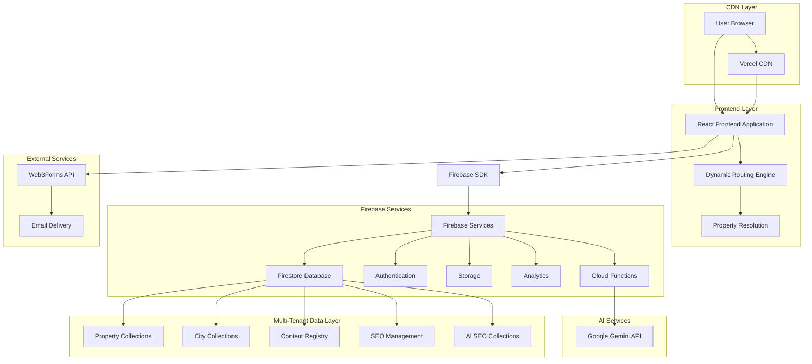
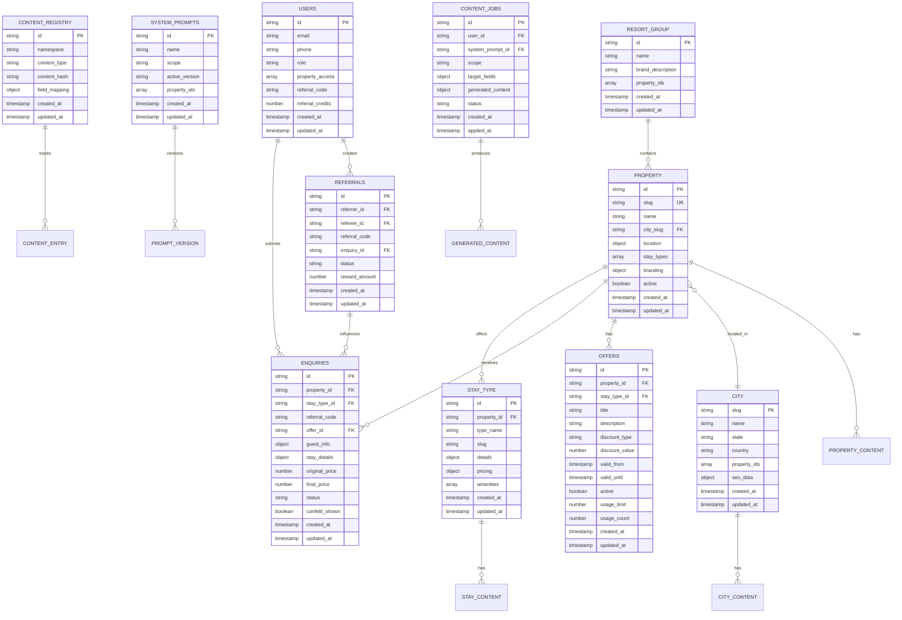
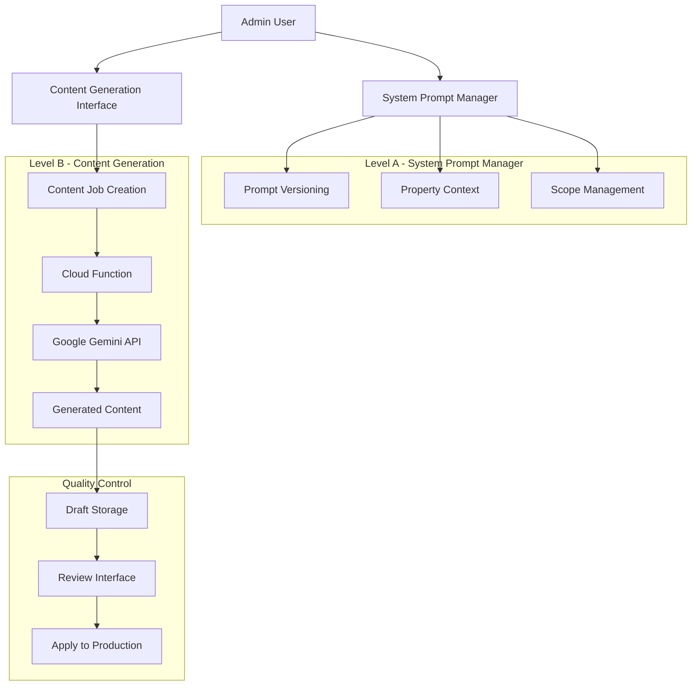

# Multi-Property Resort Group Platform - Technical Architecture Document

## 1. Architecture Design



## 2. Technology Description

- **Frontend**: React@18 + TypeScript + Tailwind CSS + Vite
- **Routing**: React Router v6 with dynamic route generation
- **Backend Services**: Firebase (Firestore Database + Authentication + Storage + Analytics + Cloud Functions)
- **AI Integration**: Google Gemini API via Cloud Functions for Firebase
- **Email Service**: Web3Forms (Free contact form API with property routing)
- **Deployment**: Vercel (Free tier with CDN and edge functions)
- **Search**: Client-side filtering with Firestore compound queries
- **SEO**: React Helmet Async + Schema-DTS + automated sitemap generation + AI-powered content generation
- **Analytics**: Google Analytics 4 + Firebase Analytics with property segmentation
- **Testing**: Jest + React Testing Library + Cypress with multi-property scenarios + AI content validation

## 3. Dynamic Route Definitions

### 3.1 Core Routes
| Route Pattern | Purpose | Dynamic Resolution |
|---------------|---------|--------------------||
| / | Group homepage | Static group content |
| /properties/:propertySlug | Property homepage | Resolve property from slug |
| /properties/:propertySlug/stays/:stayType | Stay type details | Resolve property + stay type |
| /locations/:citySlug | City landing page | Resolve city + properties |
| /locations/:citySlug/:stayType | City + stay type combo | Resolve city + stay type + properties |
| /experiences/:citySlug | City experiences | Resolve city + activities |
| /request-stay | Multi-property enquiry | Dynamic property selection |
| /request-stay/:propertySlug | Property-specific enquiry | Pre-selected property |

### 3.2 Admin Routes
| Route Pattern | Purpose | Access Level |
|---------------|---------|-------------|
| /admin | Admin dashboard login | All admin roles |
| /admin/group | Group-level management | Group Admin only |
| /admin/property/:propertyId | Property management | Property Manager + Group Admin |
| /admin/city/:citySlug | City management | City Manager + Group Admin |
| /admin/seo | SEO management | SEO Manager + Group Admin |
| /admin/seo/ai-system | AI SEO system management | SEO Manager + Group Admin |
| /admin/seo/system-prompt | System prompt editor | SEO Manager + Group Admin |
| /admin/seo/content-generation | AI content generation interface | SEO Manager + Content Editor + Group Admin |
| /admin/seo/drafts | Draft management and approval | SEO Manager + Group Admin |
| /admin/content-registry | Content management | Content Manager + Group Admin |
| /admin/analytics | Multi-property analytics | All admin roles (filtered by permissions) |

### 3.3 Route Resolution Logic
```typescript
interface RouteResolver {
  resolveProperty: (slug: string) => Promise<Property | null>;
  resolveCity: (slug: string) => Promise<City | null>;
  resolveStayType: (propertyId: string, stayType: string) => Promise<StayType | null>;
  generateSitemap: () => Promise<SitemapEntry[]>;
}
```

## 4. API Definitions

### 4.1 Multi-Property Web3Forms Integration

**Property-Specific Contact Form**
```
POST https://api.web3forms.com/submit
```

Request (Form Data):
| Param Name | Param Type | isRequired | Description |
|------------|------------|------------|-------------|
| access_key | string     | true       | Property-specific Web3Forms access key |
| property_id | string    | true       | Internal property identifier |
| property_name | string  | true       | Property display name |
| city | string          | true       | Property location city |
| stay_type | string     | false      | Preferred accommodation type |
| name | string          | true       | Customer name |
| email | string         | true       | Customer email |
| phone | string         | false      | Customer phone |
| message | string       | true       | Enquiry message |
| check_in | string      | false      | Check-in date |
| check_out | string     | false      | Check-out date |
| guests | number        | false      | Number of guests |
| h-captcha-response | string | false | hCaptcha verification token |
| _honeypot | string     | false      | Honeypot field (must be empty) |

**Security Hardening Configuration**

*Domain Allow-list Setup:*
1. Configure allowed domains in Web3Forms dashboard:
   - Production: `https://yourdomain.com`
   - Staging: `https://staging.yourdomain.com`
   - Development: `http://localhost:3000`, `http://localhost:5173`

*Spam Protection Implementation:*
```html
<!-- Honeypot field (hidden with CSS) -->
<input type="text" name="_honeypot" style="display:none" tabindex="-1" autocomplete="off">

<!-- hCaptcha integration -->
<div class="h-captcha" data-sitekey="your-hcaptcha-site-key"></div>
<script src="https://js.hcaptcha.com/1/api.js" async defer></script>
```

*Client-side Validation:*
```typescript
interface FormSecurityConfig {
  honeypotField: string; // Must remain empty
  hCaptchaRequired: boolean;
  rateLimitMs: number; // Minimum time between submissions
  maxSubmissionsPerHour: number;
}

const securityConfig: FormSecurityConfig = {
  honeypotField: '_honeypot',
  hCaptchaRequired: true,
  rateLimitMs: 30000, // 30 seconds
  maxSubmissionsPerHour: 5
};
```

*Environment Variables:*
```bash
# Web3Forms Configuration
VITE_WEB3FORMS_ACCESS_KEY=your_property_specific_key
VITE_HCAPTCHA_SITE_KEY=your_hcaptcha_site_key

# Security Settings
VITE_FORM_RATE_LIMIT_MS=30000
VITE_MAX_SUBMISSIONS_PER_HOUR=5
```

### 4.2 Cloud Functions for AI SEO

**System Prompt Management**
```
POST /api/seo/updateSystemPrompt
```

Request:
| Param Name | Param Type | isRequired | Description |
|------------|------------|------------|-------------|
| prompt_id | string | true | System prompt identifier |
| content | string | true | Updated prompt content |
| version | string | true | Version identifier |
| user_id | string | true | Admin user ID |

Response:
| Param Name | Param Type | Description |
|------------|------------|-------------|
| success | boolean | Update status |
| prompt_id | string | Updated prompt ID |
| version | string | New version number |

**AI Content Generation**
```
POST /api/seo/generate
```

Request:
| Param Name | Param Type | isRequired | Description |
|------------|------------|------------|-------------|
| content_type | string | true | Type of content to generate |
| scope | object | true | Property/city/stay_type context |
| fields | array | true | Specific fields to generate |
| system_prompt_id | string | true | System prompt to use |
| user_id | string | true | Requesting user ID |

Response:
| Param Name | Param Type | Description |
|------------|------------|-------------|
| success | boolean | Generation status |
| job_id | string | Content job identifier |
| generated_content | object | AI-generated content fields |
| json_patches | array | RFC-6902 JSON patch operations for field-level updates |
| status | string | Job status (draft/pending/approved) |

**JSON Patch Contract (RFC-6902)**
```typescript
interface JsonPatchOperation {
  op: 'add' | 'remove' | 'replace' | 'move' | 'copy' | 'test';
  path: string; // JSON Pointer (e.g., '/seo_data/meta_title')
  value?: any; // Required for add, replace, test operations
  from?: string; // Required for move, copy operations
}

// Example patch operations for content updates
const contentPatches: JsonPatchOperation[] = [
  {
    op: 'replace',
    path: '/seo_data/meta_title',
    value: 'Luxury Treehouse Resort in Wayanad | Book Your Stay'
  },
  {
    op: 'replace', 
    path: '/seo_data/meta_description',
    value: 'Experience luxury treehouse accommodation in Wayanad...'
  },
  {
    op: 'add',
    path: '/seo_data/keywords',
    value: ['wayanad treehouse', 'luxury resort', 'nature stay']
  }
];
```

**Content Job Management**
```
POST /api/seo/applyJob
```

Request:
| Param Name | Param Type | isRequired | Description |
|------------|------------|------------|-------------|
| job_id | string | true | Content job identifier |
| action | string | true | approve/reject/edit |
| user_id | string | true | Admin user ID |
| modifications | object | false | Manual edits to content |

Response:
| Param Name | Param Type | Description |
|------------|------------|-------------|
| success | boolean | Action status |
| applied_changes | object | Changes applied to production |
| audit_log_id | string | Audit trail identifier |

### 4.3 Firebase Authentication & Security

**Role-Based Access Control**
```javascript
// Firestore Security Rules
rules_version = '2';
service cloud.firestore {
  match /databases/{database}/documents {
    // Group Admin: Full access
    match /{document=**} {
      allow read, write: if hasRole('group_admin');
    }
    
    // Property Manager: Property-specific access
    match /properties/{propertyId} {
      allow read, write: if hasRole('property_manager') && 
        resource.data.managers[request.auth.uid] == true;
    }
    
    // SEO Manager: SEO collections access
    match /seo_management/{document} {
      allow read, write: if hasRole('seo_manager');
    }
    
    // Content Editor: Draft access only
    match /content_jobs/{jobId} {
      allow read, create: if hasRole('content_editor');
      allow write: if hasRole('seo_manager') || hasRole('group_admin');
    }
    
    // Offers: Property managers can create offers for their properties
    match /offers/{offerId} {
      allow read: if true; // Public read for displaying offers
      allow create, write: if hasRole('property_manager') && 
        resource.data.property_id in get(/databases/$(database)/documents/users/$(request.auth.uid)).data.property_access ||
        hasRole('group_admin');
    }
    
    // Referrals: Users can manage their own referrals
    match /referrals/{referralId} {
      allow read, write: if request.auth != null && 
        (resource.data.referrer_id == request.auth.uid || resource.data.referee_id == request.auth.uid) ||
        hasRole('group_admin');
      allow create: if request.auth != null;
    }
    
    // Enhanced Enquiries: Include referral and offer context
    match /enquiries/{enquiryId} {
      allow read: if hasRole('property_manager') && 
        resource.data.property_id in get(/databases/$(database)/documents/users/$(request.auth.uid)).data.property_access ||
        hasRole('group_admin');
      allow create: if true; // Allow anonymous enquiry creation
      allow write: if hasRole('property_manager') || hasRole('group_admin');
    }
  }
}
```

## 5. Data Model

### 5.1 Multi-Property Data Structure



### 5.2 Firestore Collections Structure

**Core Collections:**
```javascript
// Resort Group
resort_groups/
├── {group_id}
    ├── name: string
    ├── properties: array<property_id>
    ├── branding: object
    └── settings: object

// Properties
properties/
├── {property_id}
    ├── slug: string (unique)
    ├── name: string
    ├── city_slug: string
    ├── stay_types: array<stay_type_id>
    ├── location: geopoint
    ├── branding: object
    ├── managers: map<user_id, boolean>
    └── seo_data: object

// Cities
cities/
├── {city_slug}
    ├── name: string
    ├── state: string
    ├── country: string
    ├── property_ids: array<string>
    └── seo_data: object

// Offers
offers/
├── {offer_id}
    ├── property_id: string
    ├── stay_type_id: string (optional)
    ├── title: string
    ├── description: string
    ├── discount_type: string (percentage|fixed|bogo)
    ├── discount_value: number
    ├── valid_from: timestamp
    ├── valid_until: timestamp
    ├── active: boolean
    ├── usage_limit: number (optional)
    ├── usage_count: number
    ├── terms_conditions: string
    ├── created_at: timestamp
    └── updated_at: timestamp

// Referrals
referrals/
├── {referral_id}
    ├── referrer_id: string
    ├── referee_id: string (optional)
    ├── referral_code: string (unique)
    ├── enquiry_id: string (optional)
    ├── status: string (pending|completed|rewarded)
    ├── reward_amount: number
    ├── reward_type: string (discount|credit|points)
    ├── created_at: timestamp
    └── updated_at: timestamp

// Enhanced Enquiries
enquiries/
├── {enquiry_id}
    ├── property_id: string
    ├── stay_type_id: string
    ├── referral_code: string (optional)
    ├── offer_id: string (optional)
    ├── guest_info: object
    ├── stay_details: object
    ├── pricing: {
    │   ├── original_price: number
    │   ├── discount_amount: number
    │   ├── final_price: number
    │   └── currency: string
    │   }
    ├── status: string
    ├── source: string (direct|seo|referral|offer)
    ├── confetti_shown: boolean
    ├── created_at: timestamp
    └── updated_at: timestamp

// Enhanced Users
users/
├── {user_id}
    ├── email: string
    ├── phone: string (optional)
    ├── role: string (includes registered_guest)
    ├── property_access: array<string>
    ├── referral_code: string (unique)
    ├── referral_credits: number
    ├── total_referrals: number
    ├── permissions: object
    ├── created_at: timestamp
    └── updated_at: timestamp
    ├── state: string
    ├── properties: array<property_id>
    ├── seo_data: object
    └── content: object

// Stay Types (subcollection)
properties/{property_id}/stay_types/
├── {stay_type_id}
    ├── type_name: string
    ├── slug: string
    ├── details: object
    ├── pricing: object
    ├── amenities: array
    └── seo_data: object
```

**AI SEO Collections:**
```javascript
// System Prompts
system_prompts/
├── {prompt_id}
    ├── name: string
    ├── scope: string (group|property|city|stay_type)
    ├── active_version: string
    ├── property_filters: array<property_id>
    └── versions: subcollection
        └── {version_id}
            ├── content: string
            ├── token_count: number
            ├── created_by: string
            ├── created_at: timestamp
            └── is_active: boolean

// Content Jobs
content_jobs/
├── {job_id}
    ├── user_id: string
    ├── system_prompt_id: string
    ├── scope: object {type, entity_id}
    ├── target_fields: array<string>
    ├── generated_content: object
    ├── json_patches: array<JsonPatchOperation> // RFC-6902 patch operations
    ├── status: string (draft|pending|approved|rejected)
    ├── created_at: timestamp
    ├── applied_at: timestamp
    └── applied_by: string

// Content Registry
content_registry/
├── {content_id}
    ├── namespace: string
    ├── content_type: string
    ├── content_hash: string
    ├── field_mapping: object
    ├── duplicate_of: string (optional)
    ├── created_at: timestamp
    └── updated_at: timestamp

// Change Log
change_log/
├── {log_id}
    ├── user_id: string
    ├── action: string
    ├── entity_type: string
    ├── entity_id: string
    ├── changes: object
    ├── timestamp: timestamp
    └── ip_address: string
```

### 5.3 Security Rules

```javascript
rules_version = '2';
service cloud.firestore {
  match /databases/{database}/documents {
    // Helper functions
    function isAuthenticated() {
      return request.auth != null;
    }
    
    function hasRole(role) {
      return isAuthenticated() && 
        get(/databases/$(database)/documents/users/$(request.auth.uid)).data.role == role;
    }
    
    function isPropertyManager(propertyId) {
      return hasRole('property_manager') && 
        get(/databases/$(database)/documents/properties/$(propertyId)).data.managers[request.auth.uid] == true;
    }
    
    // Public read access for guest users
    match /resort_groups/{groupId} {
      allow read: if true;
      allow write: if hasRole('group_admin');
    }
    
    match /properties/{propertyId} {
      allow read: if true;
      allow write: if hasRole('group_admin') || isPropertyManager(propertyId);
      
      match /stay_types/{stayTypeId} {
        allow read: if true;
        allow write: if hasRole('group_admin') || isPropertyManager(propertyId);
      }
    }
    
    match /cities/{citySlug} {
      allow read: if true;
      allow write: if hasRole('group_admin') || hasRole('city_manager');
    }
    
    // AI SEO Collections
    match /system_prompts/{promptId} {
      allow read: if hasRole('seo_manager') || hasRole('group_admin');
      allow write: if hasRole('seo_manager') || hasRole('group_admin');
      
      match /versions/{versionId} {
        allow read: if hasRole('seo_manager') || hasRole('group_admin');
        allow create: if hasRole('seo_manager') || hasRole('group_admin');
      }
    }
    
    match /content_jobs/{jobId} {
      allow read: if hasRole('content_editor') || hasRole('seo_manager') || hasRole('group_admin');
      allow create: if hasRole('content_editor') || hasRole('seo_manager') || hasRole('group_admin');
      allow update: if hasRole('seo_manager') || hasRole('group_admin');
    }
    
    match /content_registry/{contentId} {
      allow read: if hasRole('content_editor') || hasRole('seo_manager') || hasRole('group_admin');
      allow write: if hasRole('seo_manager') || hasRole('group_admin');
    }
    
    match /change_log/{logId} {
      allow read: if hasRole('group_admin');
      allow create: if isAuthenticated();
    }
    
    // User management
    match /users/{userId} {
      allow read: if request.auth.uid == userId || hasRole('group_admin');
      allow write: if hasRole('group_admin');
    }
  }
}
```

## 6. AI SEO System Architecture

### 6.1 Two-Level AI System



### Two-Level AI SEO System

**Level A: System Prompt Manager**
- Versioned system prompts with property-specific context
- Multi-property awareness (Group/Property/City/Stay Type scopes)
- Template inheritance with property customization
- Activation controls with rollback capability
- **Prompt-Activation Hooks**: Auto-trigger content jobs for impacted namespaces

**Level B: Content Generation**
- Scope-aware AI content generation using Google Gemini
- Field-level JSON patch updates (RFC-6902)
- Draft-first workflow with manual approval
- Content registry integration for duplication prevention
- **Internal Linking Guardrails**: Automated link quality enforcement

**Internal Linking Rules & Guardrails**
```typescript
interface InternalLinkingRules {
  minimumLinks: {
    sameCityLinks: 2; // Minimum same-city property/stay links
    crossStayUpgrade: 1; // Minimum upgrade suggestion within property
    totalInternalLinks: 3; // Minimum total internal links per page
  };
  linkQualityScoring: {
    contextualRelevance: number; // 0-1 score based on content similarity
    geographicRelevance: number; // Same city = 1.0, same region = 0.7
    stayTypeRelevance: number; // Same type = 1.0, upgrade path = 0.8
  };
  linkPlacement: {
    maxLinksPerParagraph: 2;
    avoidConsecutiveLinks: true;
    prioritizeNaturalFlow: true;
  };
}

// Example link suggestions for "Treehouse in Wayanad" page
const linkSuggestions = {
  sameCityLinks: [
    "/locations/wayanad", // City landing page
    "/properties/wayanad-villa-resort" // Other property in same city
  ],
  crossStayUpgrade: [
    "/properties/wayanad-treehouse-resort/stays/luxury-treehouse" // Upgrade option
  ],
  contextualLinks: [
    "/experiences/wayanad" // Related experiences
  ]
};
```

### 6.2 AI Content Generation Flow

```typescript
// Content Generation Process
interface ContentGenerationRequest {
  systemPromptId: string;
  scope: {
    type: 'group' | 'property' | 'city' | 'stay_type' | 'combo';
    entityId: string;
  };
  targetFields: string[];
  context: {
    keywords?: string[];
    audience?: string;
    tone?: string;
    seasonality?: string;
  };
}

interface ContentGenerationResponse {
  jobId: string;
  generatedContent: {
    [fieldName: string]: {
      content: string;
      confidence: number;
      wordCount: number;
      keywordDensity: object;
    };
  };
  qualityChecks: {
    readabilityScore: number;
    seoScore: number;
    brandConsistency: number;
    duplicateContent: boolean;
  };
  status: 'draft' | 'pending_review' | 'approved' | 'rejected';
}
```

### 6.3 Content Registry System

```typescript
// Enhanced Content Deduplication with Semantic Analysis
interface ContentEntry {
  id: string;
  namespace: string; // 'property:wayanad-treehouse', 'city:goa'
  contentType: string; // 'title', 'meta_description', 'h1'
  contentHash: string; // Exact match detection
  contentEmbedding: number[]; // Vector embedding for semantic similarity
  semanticHash: string; // Hash of normalized/stemmed content
  fieldMapping: {
    [fieldName: string]: string; // Maps to actual content fields
  };
  duplicateOf?: string; // Reference to original content
  nearDuplicates: string[]; // Array of semantically similar content IDs
  similarityScore?: number; // 0-1 similarity score to original
  qualityScore: number;
  createdAt: Date;
  updatedAt: Date;
}

// Semantic Duplicate Detection
interface SemanticDuplicateDetection {
  exactMatch: {
    contentHash: string;
    threshold: 1.0; // Exact match
  };
  nearDuplicate: {
    semanticSimilarity: number; // Cosine similarity of embeddings
    threshold: 0.85; // High similarity threshold
  };
  semanticSimilar: {
    semanticSimilarity: number;
    threshold: 0.70; // Moderate similarity threshold
  };
}

// Content Similarity Analysis
const analyzeContentSimilarity = async (newContent: string, namespace: string) => {
  // Step 1: Check exact duplicates via hash
  const contentHash = generateHash(newContent);
  const exactDuplicate = await findByHash(contentHash, namespace);
  
  if (exactDuplicate) {
    return { type: 'exact', duplicateOf: exactDuplicate.id, score: 1.0 };
  }
  
  // Step 2: Generate embedding for semantic analysis
  const embedding = await generateEmbedding(newContent); // Using Google Gemini embeddings
  
  // Step 3: Find semantically similar content
  const similarContent = await findSimilarContent(embedding, namespace, {
    threshold: 0.70,
    limit: 10
  });
  
  // Step 4: Classify similarity level
  const highSimilarity = similarContent.filter(item => item.similarity >= 0.85);
  const moderateSimilarity = similarContent.filter(item => 
    item.similarity >= 0.70 && item.similarity < 0.85
  );
  
  return {
    type: highSimilarity.length > 0 ? 'near_duplicate' : 
          moderateSimilarity.length > 0 ? 'similar' : 'unique',
    nearDuplicates: highSimilarity.map(item => item.id),
    similarContent: moderateSimilarity.map(item => item.id),
    maxSimilarity: Math.max(...similarContent.map(item => item.similarity), 0)
  };
};

// Google Gemini Embedding Integration
const generateEmbedding = async (text: string): Promise<number[]> => {
  const response = await fetch('https://generativelanguage.googleapis.com/v1beta/models/embedding-001:embedContent', {
    method: 'POST',
    headers: {
      'Authorization': `Bearer ${process.env.GOOGLE_API_KEY}`,
      'Content-Type': 'application/json'
    },
    body: JSON.stringify({
      model: 'models/embedding-001',
      content: { parts: [{ text }] }
    })
  });
  
  const data = await response.json();
  return data.embedding.values;
};

// Prompt-Activation Hooks System
interface PromptActivationHook {
  promptId: string;
  version: string;
  scope: 'group' | 'property' | 'city' | 'stay_type';
  impactedNamespaces: string[]; // Auto-calculated based on scope
  triggerContentJobs: boolean;
  jobPriority: 'high' | 'medium' | 'low';
}

const activateSystemPrompt = async (promptId: string, version: string) => {
  // Step 1: Activate the prompt version
  await updateSystemPrompt(promptId, { activeVersion: version, status: 'active' });
  
  // Step 2: Calculate impacted namespaces
  const prompt = await getSystemPrompt(promptId);
  const impactedNamespaces = await calculateImpactedNamespaces(prompt.scope, prompt.entityId);
  
  // Step 3: Auto-trigger content jobs for all impacted namespaces
  const contentJobs = impactedNamespaces.map(namespace => ({
    id: generateId(),
    namespace,
    promptId,
    promptVersion: version,
    status: 'pending',
    priority: determineJobPriority(namespace),
    triggeredBy: 'prompt_activation',
    createdAt: new Date(),
    scheduledFor: new Date() // Immediate execution
  }));
  
  // Step 4: Batch create content jobs
  await createContentJobs(contentJobs);
  
  // Step 5: Log activation event
  await logPromptActivation({
    promptId,
    version,
    impactedNamespaces: impactedNamespaces.length,
    jobsCreated: contentJobs.length,
    timestamp: new Date()
  });
  
  return {
    success: true,
    impactedNamespaces: impactedNamespaces.length,
    jobsCreated: contentJobs.length
  };
};

// Calculate impacted namespaces based on prompt scope
const calculateImpactedNamespaces = async (scope: string, entityId: string): Promise<string[]> => {
  switch (scope) {
    case 'group':
      // All properties, cities, and stay types in the group
      const allProperties = await getPropertiesByGroup(entityId);
      const allCities = await getCitiesByGroup(entityId);
      const allStayTypes = await getStayTypesByGroup(entityId);
      return [
        ...allProperties.map(p => `property:${p.slug}`),
        ...allCities.map(c => `city:${c.slug}`),
        ...allStayTypes.map(s => `stay_type:${s.slug}`)
      ];
      
    case 'property':
      // Specific property and its stay types
      const property = await getProperty(entityId);
      const stayTypes = await getStayTypesByProperty(entityId);
      return [
        `property:${property.slug}`,
        ...stayTypes.map(s => `stay_type:${s.slug}`)
      ];
      
    case 'city':
      // Specific city and properties in that city
      const city = await getCity(entityId);
      const cityProperties = await getPropertiesByCity(entityId);
      return [
        `city:${city.slug}`,
        ...cityProperties.map(p => `property:${p.slug}`)
      ];
      
    case 'stay_type':
      // Specific stay type only
      const stayType = await getStayType(entityId);
      return [`stay_type:${stayType.slug}`];
      
    default:
      return [];
  }
};

// Determine job priority based on namespace importance
const determineJobPriority = (namespace: string): 'high' | 'medium' | 'low' => {
  if (namespace.startsWith('city:')) return 'high'; // City pages are SEO-critical
  if (namespace.startsWith('property:')) return 'medium'; // Property pages are important
  if (namespace.startsWith('stay_type:')) return 'medium'; // Stay type pages are important
  return 'low'; // Default priority
};
```

// Content Quality Validation
interface QualityCheck {
  readability: {
    fleschKincaid: number;
    averageWordsPerSentence: number;
    complexWords: number;
  };
  seo: {
    titleLength: number;
    metaDescriptionLength: number;
    keywordDensity: { [keyword: string]: number };
    headingStructure: boolean;
  };
  brand: {
    toneConsistency: number;
    brandTermUsage: number;
    styleGuideCompliance: number;
  };
}
```

## 7. Performance Optimization

### 7.1 Core Web Vitals Strategy

- **Largest Contentful Paint (LCP)**: Target < 2.5s
  - Optimized hero images with responsive srcset
  - Preload critical resources
  - CDN optimization with Vercel
  
- **Interaction to Next Paint (INP)**: Target < 200ms
  - Defer non-critical JavaScript
  - Optimize React component rendering
  - Minimize main thread blocking
  
- **Cumulative Layout Shift (CLS)**: Target < 0.1
  - Set explicit dimensions for images
  - Avoid layout shifts from dynamic content
  - Stable navigation and UI components

### 7.2 Multi-Property Performance Considerations

```typescript
// Route-based code splitting
const PropertyPage = lazy(() => import('./pages/PropertyPage'));
const CityPage = lazy(() => import('./pages/CityPage'));
const StayTypePage = lazy(() => import('./pages/StayTypePage'));

// Property-specific data caching
const usePropertyData = (propertySlug: string) => {
  return useQuery({
    queryKey: ['property', propertySlug],
    queryFn: () => getProperty(propertySlug),
    staleTime: 5 * 60 * 1000, // 5 minutes
    cacheTime: 30 * 60 * 1000, // 30 minutes
  });
};

// City-based content prefetching
const prefetchCityData = (citySlug: string) => {
  queryClient.prefetchQuery({
    queryKey: ['city', citySlug],
    queryFn: () => getCityData(citySlug),
  });
};
```

### 7.3 SEO Performance Monitoring

```typescript
// SEO Metrics Tracking
interface SEOMetrics {
  pageLoadTime: number;
  coreWebVitals: {
    lcp: number;
    inp: number;
    cls: number;
  };
  searchVisibility: {
    organicTraffic: number;
    keywordRankings: { [keyword: string]: number };
    clickThroughRate: number;
  };
  contentPerformance: {
    aiGeneratedContentCTR: number;
    manualContentCTR: number;
    conversionRate: number;
  };
}

// Performance Monitoring
const trackSEOPerformance = (pageType: string, entityId: string) => {
  // Track Core Web Vitals (2024+ standards)
  getCLS(onCLS);
  getINP(onINP); // Replaced deprecated getFID with getINP
  getFCP(onFCP);
  getLCP(onLCP);
  getTTFB(onTTFB);
  
  // Track SEO-specific metrics
  trackEvent('seo_page_view', {
    page_type: pageType,
    entity_id: entityId,
    timestamp: Date.now()
  });
};
```

### 7.4 SEO Performance Strategy

**React SPA + SEO Considerations**

For SEO-critical pages (city landing pages, stay type pages), consider pre-rendering or SSR:

**Option 1: Build-time Pre-rendering (Recommended)**
```javascript
// vite.config.ts - Add prerender plugin
import { defineConfig } from 'vite';
import { prerender } from '@prerenderer/rollup-plugin';

export default defineConfig({
  plugins: [
    // ... existing plugins
    prerender({
      routes: [
        '/', // Home page
        '/properties', // Properties listing
        '/locations/wayanad', // City pages
        '/locations/wayanad/treehouse', // Stay type pages
        '/properties/wayanad-treehouse-resort', // Property pages
        // Generate routes dynamically from Firebase
      ],
      renderer: '@prerenderer/renderer-puppeteer',
      rendererOptions: {
        headless: true,
        renderAfterTime: 2000, // Wait for Firebase data
      }
    })
  ]
});
```

**Option 2: Gradual SSR Migration**
```javascript
// For future consideration - Next.js migration path
// 1. Keep Vite for admin/dashboard (SPA)
// 2. Migrate public routes to Next.js (SSR)
// 3. Share components via npm workspace

// next.config.js example
module.exports = {
  async generateStaticParams() {
    // Fetch from Firebase to generate static paths
    const cities = await getCities();
    const properties = await getProperties();
    return [...cityPaths, ...propertyPaths];
  }
};
```

**SEO Route Priority (for pre-rendering)**
1. **High Priority**: City pages (`/locations/{city}`)
2. **High Priority**: Stay type pages (`/locations/{city}/{stay-type}`)
3. **Medium Priority**: Property pages (`/properties/{property}`)
4. **Low Priority**: Admin routes (keep as SPA)

## 8. Deployment & Infrastructure

### 8.1 Vercel Configuration

```json
{
  "builds": [
    {
      "src": "package.json",
      "use": "@vercel/static-build",
      "config": {
        "distDir": "dist"
      }
    }
  ],
  "routes": [
    {
      "src": "/properties/([^/]+)",
      "dest": "/index.html"
    },
    {
      "src": "/locations/([^/]+)",
      "dest": "/index.html"
    },
    {
      "src": "/admin/(.*)",
      "dest": "/index.html"
    }
  ],
  "redirects": [
    {
      "source": "/about",
      "destination": "/properties/wayanad-treehouse",
      "permanent": true
    }
  ],
  "headers": [
    {
      "source": "/(.*)",
      "headers": [
        {
          "key": "X-Content-Type-Options",
          "value": "nosniff"
        },
        {
          "key": "X-Frame-Options",
          "value": "DENY"
        }
      ]
    }
  ]
}
```

### 8.2 Firebase Configuration

```javascript
// Firebase configuration
const firebaseConfig = {
  apiKey: process.env.VITE_FIREBASE_API_KEY,
  authDomain: process.env.VITE_FIREBASE_AUTH_DOMAIN,
  projectId: process.env.VITE_FIREBASE_PROJECT_ID,
  storageBucket: process.env.VITE_FIREBASE_STORAGE_BUCKET,
  messagingSenderId: process.env.VITE_FIREBASE_MESSAGING_SENDER_ID,
  appId: process.env.VITE_FIREBASE_APP_ID,
  measurementId: process.env.VITE_FIREBASE_MEASUREMENT_ID
};

// Initialize Firebase
const app = initializeApp(firebaseConfig);
export const db = getFirestore(app);
export const auth = getAuth(app);
export const storage = getStorage(app);
export const analytics = getAnalytics(app);
```

### 8.3 Environment Variables

```bash
# Firebase Configuration
VITE_FIREBASE_API_KEY=your_api_key
VITE_FIREBASE_AUTH_DOMAIN=your_project.firebaseapp.com
VITE_FIREBASE_PROJECT_ID=your_project_id
VITE_FIREBASE_STORAGE_BUCKET=your_project.appspot.com
VITE_FIREBASE_MESSAGING_SENDER_ID=your_sender_id
VITE_FIREBASE_APP_ID=your_app_id
VITE_FIREBASE_MEASUREMENT_ID=your_measurement_id

# Google Gemini API (for Cloud Functions)
GEMINI_API_KEY=your_gemini_api_key

# Web3Forms Configuration
VITE_WEB3FORMS_ACCESS_KEY=your_web3forms_key

# Analytics
VITE_GA4_MEASUREMENT_ID=your_ga4_id
```