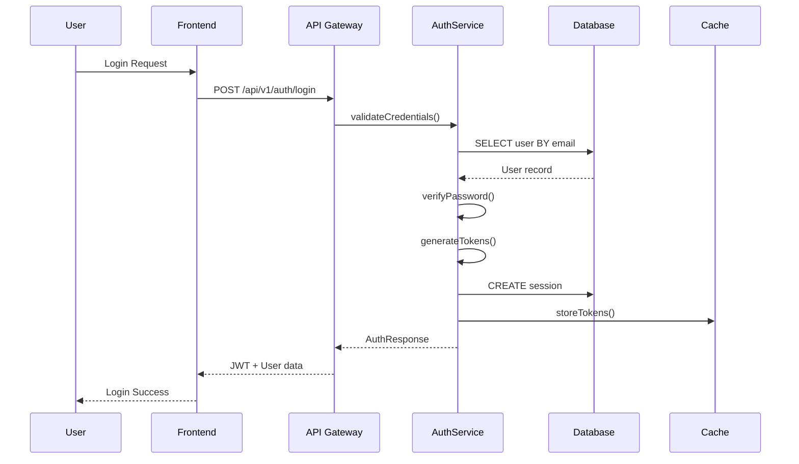
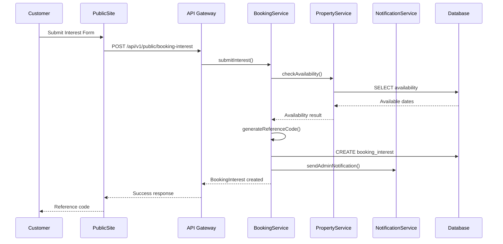
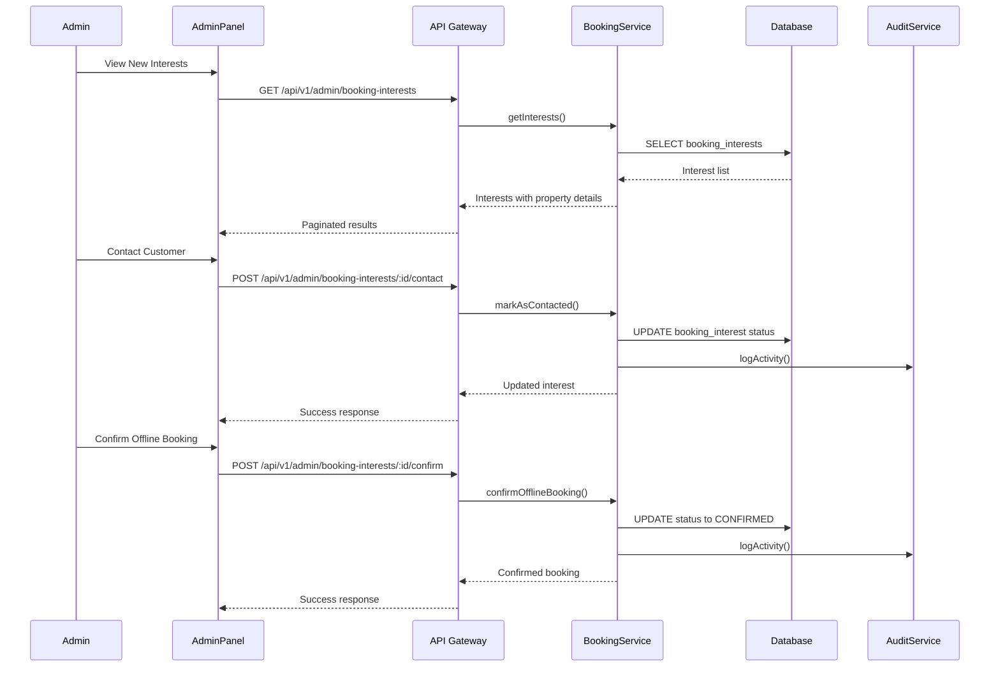
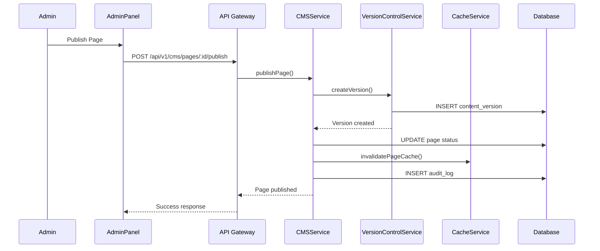
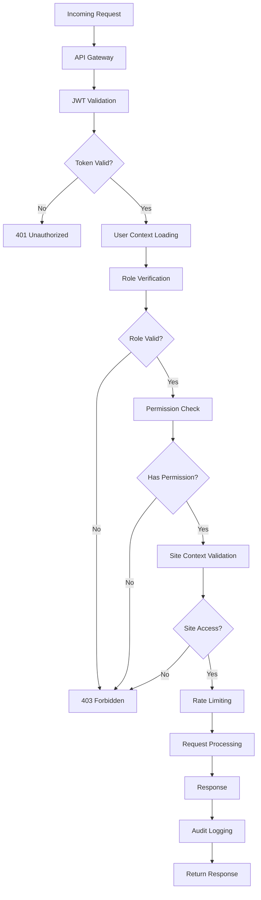

# Admin Panel Data Flow and API Connections Analysis

## Document References

This document uses internal citations to provide precise references to the original specifications and implementations. The citation system allows AI engines and developers to quickly locate the correct context from related documents.

### Citation Format

Citations in this document follow the format: `[Description](filename.md:line-number)`

- **filename.md** - The source document containing the original specification
- **line-number** - The specific line number where the referenced content is located

### Key Reference Documents

1. **[ADMIN_PANEL_BACKEND_SCOPE.md](ADMIN_PANEL_BACKEND_SCOPE.md)** - Contains the original backend specifications, feature definitions, and API endpoint definitions for all admin panel modules.

2. **Database Schema References** - References to database schema definitions are included where relevant to data flow analysis.

### How to Use Citations

When developing specific features or API endpoints:
1. Follow the citation link to locate the original specification
2. Review the referenced implementation details
3. Cross-reference with related features and dependencies
4. Ensure implementation aligns with the original requirements

## Table of Contents
1. [Overview](#overview)
2. [Module 1: Dashboard/Analytics](#module-1-dashboardanalytics)
3. [Module 2: Properties Management](#module-2-properties-management)
4. [Module 3: Booking Interest Management](#module-3-booking-interest-management)
5. [Module 4: Users & Roles Management](#module-4-users--roles-management)
6. [Module 5: Content Management (CMS)](#module-5-content-management-cms)
7. [Module 6: Media Management](#module-6-media-management)
8. [Module 7: Reports & Analytics](#module-7-reports--analytics)
9. [Module 8: Settings & Configuration](#module-8-settings--configuration)
10. [Module 9: System & Maintenance](#module-9-system--maintenance)
11. [Cross-Module Data Flow](#cross-module-data-flow)
12. [Authentication & Authorization Flow](#authentication--authorization-flow)

## Overview

This document provides a comprehensive analysis of data flow and API connections for the resort website admin panel, which consists of 9 core modules. The system follows a RESTful API architecture with JWT-based authentication and role-based access control.

### System Architecture
```
Frontend (React SPA) → API Gateway (Express.js) → Business Logic Services → Data Layer (PostgreSQL)
```

### API Response Format
```typescript
interface APIResponse<T> {
  success: boolean;
  data?: T;
  error?: {
    code: string;
    message: string;
    details?: any;
  };
  meta?: {
    pagination?: PaginationMeta;
    timestamp: string;
    requestId: string;
  };
}
```

---

## Module 1: Dashboard/Analytics

### Core Purpose
Provide basic operational insights for resort management through aggregated data visualization. [Original specification](ADMIN_PANEL_BACKEND_SCOPE.md:29)

### Features
1. Property availability overview [Feature definition](ADMIN_PANEL_BACKEND_SCOPE.md:39)
2. Basic booking interest statistics [Feature definition](ADMIN_PANEL_BACKEND_SCOPE.md:40)
3. Property view counts [Feature definition](ADMIN_PANEL_BACKEND_SCOPE.md:41)
4. Simple system health indicators [Feature definition](ADMIN_PANEL_BACKEND_SCOPE.md:42)

### API Endpoints
```
GET    /api/v1/admin/dashboard/metrics          // Basic operational KPIs
GET    /api/v1/admin/dashboard/recent-activity  // Recent booking activity
GET    /api/v1/admin/dashboard/export           // Export basic data
```
[API endpoint definitions](ADMIN_PANEL_BACKEND_SCOPE.md:32-36)

### Data Flow Analysis

#### 1. Dashboard Metrics Retrieval
**Frontend → Backend Flow:**
```
1. Frontend requests: GET /api/v1/admin/dashboard/metrics
2. API Gateway validates JWT token and user permissions
3. DashboardService.getMetrics(siteId) is called
4. Service aggregates data from multiple tables:
   - properties (COUNT, status filters)
   - booking_interests (COUNT by status)
   - property_views (COUNT, GROUP BY date)
   - system_health (latest status)
5. Returns aggregated DashboardMetrics object
```

**Request Structure:**
```typescript
// No request body required
// Headers: Authorization: Bearer <JWT_TOKEN>
// Query params: ?siteId=<siteId>&timeRange=<range>
```

**Response Structure:**
```typescript
interface DashboardMetrics {
  totalProperties: number;
  activeBookingInterests: number;
  propertyViews: number;
  recentActivity: Activity[];
  systemHealth: HealthStatus;
}
[DashboardMetrics interface definition](ADMIN_PANEL_BACKEND_SCOPE.md:51-56)

interface Activity {
  id: string;
  type: 'booking_interest' | 'property_view' | 'user_login';
  timestamp: Date;
  description: string;
  userId?: string;
  propertyId?: string;
}
```

**Database Operations:**
```sql
-- Property metrics
SELECT COUNT(*) as total, status FROM properties WHERE siteId = ? GROUP BY status;

-- Booking interests
SELECT COUNT(*) as total, status FROM booking_interests 
WHERE siteId = ? AND submittedAt >= ? GROUP BY status;

-- Property views (if tracking table exists)
SELECT COUNT(*) as views, DATE(viewDate) as date 
FROM property_views WHERE siteId = ? AND viewDate >= ? GROUP BY date;

-- Recent activity
SELECT * FROM audit_logs 
WHERE siteId = ? ORDER BY createdAt DESC LIMIT 10;
```

#### 2. Recent Activity Retrieval
**Frontend → Backend Flow:**
```
1. Frontend requests: GET /api/v1/admin/dashboard/recent-activity
2. API Gateway validates authentication
3. DashboardService.getRecentActivity(siteId) queries audit_logs table
4. Returns paginated activity list
```

**Request Structure:**
```typescript
// Query params: ?siteId=<siteId>&limit=<limit>&offset=<offset>
```

**Response Structure:**
```typescript
interface RecentActivityResponse {
  activities: Activity[];
  pagination: {
    total: number;
    limit: number;
    offset: number;
    hasMore: boolean;
  };
}
```

#### 3. Dashboard Data Export
**Frontend → Backend Flow:**
```
1. Frontend requests: GET /api/v1/admin/dashboard/export
2. API Gateway validates permissions
3. DashboardService.generateBasicReport(reportType) processes data
4. Returns file download URL or base64 encoded data
```

**Request Structure:**
```typescript
// Query params: ?reportType=<type>&format=<csv|excel>&dateRange=<range>
```

**Response Structure:**
```typescript
interface ExportResponse {
  downloadUrl: string;
  filename: string;
  mimeType: string;
  size: number;
  generatedAt: Date;
}
```

### Authentication Requirements
- **Required Role:** ADMIN, EDITOR, VIEWER
- **Permissions:** dashboard.read
- **Data Isolation:** Site-based filtering enforced
[Authentication requirements](ADMIN_PANEL_BACKEND_SCOPE.md:913-921)

---

## Module 2: Properties Management

### Core Purpose
Basic management of resort properties, rooms, amenities, and availability with full CRUD operations. [Original specification](ADMIN_PANEL_BACKEND_SCOPE.md:67)

### Features
1. Basic property management (resorts, hotels, villas) [Feature definition](ADMIN_PANEL_BACKEND_SCOPE.md:89)
2. Room inventory management with capacity and pricing [Feature definition](ADMIN_PANEL_BACKEND_SCOPE.md:90)
3. Simple availability management with calendar view [Feature definition](ADMIN_PANEL_BACKEND_SCOPE.md:91)
4. Amenity management and categorization [Feature definition](ADMIN_PANEL_BACKEND_SCOPE.md:92)
5. Photo gallery management [Feature definition](ADMIN_PANEL_BACKEND_SCOPE.md:93)
6. Basic property display features [Feature definition](ADMIN_PANEL_BACKEND_SCOPE.md:94)

### API Endpoints
```
GET    /api/v1/admin/properties                 // List properties
POST   /api/v1/admin/properties                 // Create new property
GET    /api/v1/admin/properties/:id             // Get property details
PUT    /api/v1/admin/properties/:id             // Update property
DELETE /api/v1/admin/properties/:id             // Delete property
GET    /api/v1/admin/properties/:id/rooms       // Get property rooms
POST   /api/v1/admin/properties/:id/rooms       // Add room to property
PUT    /api/v1/admin/properties/:id/rooms/:roomId // Update room
DELETE /api/v1/admin/properties/:id/rooms/:roomId // Delete room
GET    /api/v1/admin/properties/:id/availability // Get availability calendar
POST   /api/v1/admin/properties/:id/availability // Update availability
GET    /api/v1/admin/properties/:id/pricing     // Get pricing structure
PUT    /api/v1/admin/properties/:id/pricing     // Update pricing
POST   /api/v1/admin/properties/:id/photos      // Upload photos
DELETE /api/v1/admin/properties/:id/photos/:photoId // Delete photo
```
[API endpoint definitions](ADMIN_PANEL_BACKEND_SCOPE.md:69-86)

### Data Flow Analysis

#### 1. Property List Retrieval
**Frontend → Backend Flow:**
```
1. Frontend requests: GET /api/v1/admin/properties
2. API Gateway validates JWT and permissions
3. PropertyService.getProperties(siteId, filters) queries database
4. Applies pagination, sorting, and filtering
5. Returns paginated property list
```

**Request Structure:**
```typescript
// Query params: ?siteId=<siteId>&page=<page>&limit=<limit>&status=<status>&type=<type>
```

**Response Structure:**
```typescript
interface PropertyListResponse {
  properties: Property[];
  pagination: {
    total: number;
    page: number;
    limit: number;
    totalPages: number;
  };
}

interface Property {
  id: string;
  siteId: string;
  name: string;
  description: string;
  type: PropertyType;
  category: string;
  status: PropertyStatus;
  capacity: number;
  basePrice: number;
  currency: string;
  address: Address;
  coordinates?: Coordinates;
  images: string[];
  amenities: string[];
  policies?: Policies;
  checkInTime: string;
  checkOutTime: string;
  minStay: number;
  maxStay?: number;
  isActive: boolean;
  sortOrder?: number;
  createdAt: Date;
  updatedAt: Date;
}
```

**Database Operations:**
```sql
SELECT * FROM properties 
WHERE siteId = ? AND isActive = true 
ORDER BY sortOrder ASC, createdAt DESC 
LIMIT ? OFFSET ?;
```

#### 2. Property Creation
**Frontend → Backend Flow:**
```
1. Frontend submits: POST /api/v1/admin/properties
2. API Gateway validates authentication and permissions
3. PropertyService.createProperty(propertyData) validates input
4. Creates property record in database
5. Updates audit log
6. Returns created property with generated ID
```

**Request Structure:**
```typescript
interface CreatePropertyRequest {
  name: string;
  description: string;
  type: PropertyType;
  category: string;
  capacity: number;
  basePrice: number;
  currency: string;
  address: Address;
  coordinates?: Coordinates;
  amenities: string[];
  policies?: Policies;
  checkInTime: string;
  checkOutTime: string;
  minStay: number;
  maxStay?: number;
  sortOrder?: number;
}
```

**Response Structure:**
```typescript
interface CreatePropertyResponse {
  property: Property;
  message: string;
}
```

**Database Operations:**
```sql
INSERT INTO properties (
  id, siteId, name, description, type, category, status,
  capacity, basePrice, currency, address, coordinates,
  amenities, policies, checkInTime, checkOutTime,
  minStay, maxStay, isActive, sortOrder, createdAt, updatedAt
) VALUES (?, ?, ?, ?, ?, ?, ?, ?, ?, ?, ?, ?, ?, ?, ?, ?, ?, ?, ?, ?, NOW(), NOW());
```

#### 3. Room Management
**Frontend → Backend Flow:**
```
1. Frontend requests: GET /api/v1/admin/properties/:id/rooms
2. API Gateway validates property access permissions
3. RoomService.getPropertyRooms(propertyId) queries rooms table
4. Returns room list with property association
```

**Request Structure:**
```typescript
// Path params: :id (propertyId)
// Query params: ?active=<boolean>&type=<roomType>
```

**Response Structure:**
```typescript
interface RoomListResponse {
  rooms: Room[];
  propertyId: string;
}

interface Room {
  id: string;
  propertyId: string;
  name: string;
  type: string;
  capacity: number;
  basePrice: number;
  size?: number;
  bedType?: string;
  amenities: string[];
  images: string[];
  isActive: boolean;
  sortOrder?: number;
  createdAt: Date;
  updatedAt: Date;
}
```

**Database Operations:**
```sql
SELECT * FROM rooms 
WHERE propertyId = ? AND isActive = ? 
ORDER BY sortOrder ASC, name ASC;
```

#### 4. Availability Management
**Frontend → Backend Flow:**
```
1. Frontend requests: GET /api/v1/admin/properties/:id/availability
2. API Gateway validates property access
3. AvailabilityService.getPropertyAvailability(propertyId, dateRange)
4. Queries availability table and returns calendar data
5. For updates: POST /api/v1/admin/properties/:id/availability
6. Validates date ranges and updates availability records
```

**Request Structure:**
```typescript
// GET Query params: ?startDate=<date>&endDate=<date>
// POST Body:
interface UpdateAvailabilityRequest {
  propertyId: string;
  availability: AvailabilityEntry[];
}

interface AvailabilityEntry {
  date: string; // YYYY-MM-DD
  status: 'AVAILABLE' | 'OCCUPIED' | 'MAINTENANCE' | 'BLOCKED';
  roomId?: string;
  notes?: string;
}
```

**Response Structure:**
```typescript
interface AvailabilityResponse {
  propertyId: string;
  availability: AvailabilityEntry[];
  dateRange: {
    startDate: string;
    endDate: string;
  };
}
```

**Database Operations:**
```sql
-- Get availability
SELECT * FROM availability 
WHERE propertyId = ? AND date BETWEEN ? AND ? 
ORDER BY date ASC;

-- Update availability
INSERT INTO availability (propertyId, roomId, date, status, notes, createdAt, updatedAt)
VALUES (?, ?, ?, ?, ?, NOW(), NOW())
ON CONFLICT (propertyId, roomId, date) 
DO UPDATE SET status = ?, notes = ?, updatedAt = NOW();
```

#### 5. Photo Management
**Frontend → Backend Flow:**
```
1. Frontend uploads: POST /api/v1/admin/properties/:id/photos
2. API Gateway validates file size and type
3. MediaService.processPropertyUpload(propertyId, files)
4. Stores files, generates thumbnails, updates database
5. Returns uploaded photo metadata
```

**Request Structure:**
```typescript
// Content-Type: multipart/form-data
// Form fields: photos (File[]), propertyId (string)
```

**Response Structure:**
```typescript
interface PhotoUploadResponse {
  photos: Photo[];
  propertyId: string;
}

interface Photo {
  id: string;
  propertyId: string;
  url: string;
  thumbnailUrl: string;
  filename: string;
  mimeType: string;
  size: number;
  sortOrder: number;
  uploadedAt: Date;
}
```

### Authentication Requirements
- **Required Role:** ADMIN, EDITOR (for write operations)
- **Required Role:** VIEWER (for read operations)
- **Permissions:** properties.read, properties.write, properties.delete
- **Data Isolation:** Site-based filtering enforced for all operations
[Authentication requirements](ADMIN_PANEL_BACKEND_SCOPE.md:915-921)

---

## Module 3: Booking Interest Management

### Core Purpose
Simple lead generation system for customer booking inquiries and offline follow-up without complex booking workflows. [Original specification](ADMIN_PANEL_BACKEND_SCOPE.md:158)

### Simplified System Design
This module implements a simplified booking interest system that focuses on lead generation rather than full booking management. The system intentionally excludes complex booking features to maintain simplicity and focus on offline processing.

**Customer Flow:** Property browse → Check availability → Submit interest form → Receive reference code → Wait for admin contact [Customer flow definition](ADMIN_PANEL_BACKEND_SCOPE.md:161)

**Admin Flow:** Review booking interests → Contact customers offline → Confirm bookings offline → Update booking status [Admin flow definition](ADMIN_PANEL_BACKEND_SCOPE.md:164)

**Removed Complex Features:** The system explicitly excludes online payment processing, real-time booking confirmation, automated email communications, cancellation workflows, check-in/check-out processes, refund management, waitlist systems, group booking management, calendar integration, pricing calculations, tax calculations, and promotion/discount systems. [Removed features list](ADMIN_PANEL_BACKEND_SCOPE.md:228-240)

### Features
1. Simple customer interest form submission [Feature definition](ADMIN_PANEL_BACKEND_SCOPE.md:185)
2. Reference code generation for tracking [Feature definition](ADMIN_PANEL_BACKEND_SCOPE.md:186)
3. Basic availability checking [Feature definition](ADMIN_PANEL_BACKEND_SCOPE.md:187)
4. Admin dashboard for managing leads [Feature definition](ADMIN_PANEL_BACKEND_SCOPE.md:188)
5. Status tracking (New, Contacted, Confirmed, Archived) [Feature definition](ADMIN_PANEL_BACKEND_SCOPE.md:189)
6. Offline follow-up management [Feature definition](ADMIN_PANEL_BACKEND_SCOPE.md:190)
7. Basic lead statistics and export [Feature definition](ADMIN_PANEL_BACKEND_SCOPE.md:191)

### API Endpoints
```
// Customer-facing (Public API)
POST   /api/v1/public/booking-interest         // Submit booking interest form
GET    /api/v1/public/availability             // Check property availability
GET    /api/v1/public/properties               // Browse properties with basic info

// Admin Management
GET    /api/v1/admin/booking-interests         // List all booking interests
GET    /api/v1/admin/booking-interests/:id     // Get interest details
PUT    /api/v1/admin/booking-interests/:id     // Update interest status
POST   /api/v1/admin/booking-interests/:id/contact // Mark as contacted
POST   /api/v1/admin/booking-interests/:id/confirm // Mark as confirmed offline
DELETE /api/v1/admin/booking-interests/:id     // Archive/remove interest
GET    /api/v1/admin/booking-interests/stats   // Basic statistics
POST   /api/v1/admin/booking-interests/export  // Export for follow-up
```
[API endpoint definitions](ADMIN_PANEL_BACKEND_SCOPE.md:168-182)

### Business Logic Services
The booking interest system is implemented through a comprehensive service layer that handles all business logic:
- **BookingInterestService** - Core service managing the booking interest lifecycle [Service definition](ADMIN_PANEL_BACKEND_SCOPE.md:215-225)
- **submitInterest()** - Handles new booking interest submissions and reference code generation
- **checkAvailability()** - Validates property availability for requested dates
- **generateReferenceCode()** - Creates unique tracking codes for customer submissions
- **updateInterestStatus()** - Manages status transitions (NEW → CONTACTED → CONFIRMED → ARCHIVED)
- **markAsContacted()** - Records admin contact attempts and customer communications
- **confirmOfflineBooking()** - Finalizes bookings confirmed through offline channels
- **getInterestStats()** - Provides analytics and reporting on booking interests
- **exportForFollowUp()** - Generates export files for offline sales follow-up

### Data Flow Analysis

#### 1. Customer Booking Interest Submission
**Public Frontend → Backend Flow:**
```
1. Customer submits: POST /api/v1/public/booking-interest
2. API Gateway validates request (no authentication required)
3. BookingInterestService.submitInterest(interestData) validates input
4. Generates unique reference code
5. Creates booking_interest record
6. Sends notification email to admin
7. Returns confirmation with reference code
```

**Request Structure:**
```typescript
interface SubmitInterestRequest {
  customerName: string;
  customerEmail: string;
  customerPhone: string;
  propertyId: string;
  checkInDate: string; // YYYY-MM-DD
  checkOutDate: string; // YYYY-MM-DD
  numberOfGuests: number;
  specialRequests?: string;
}
```

**Response Structure:**
```typescript
interface SubmitInterestResponse {
  success: boolean;
  bookingInterest: BookingInterest;
  referenceCode: string;
  message: string;
  nextSteps: string;
}

interface BookingInterest {
  id: string;
  referenceCode: string;
  siteId: string;
  customerName: string;
  customerEmail: string;
  customerPhone: string;
  propertyId: string;
  checkInDate: Date;
  checkOutDate: Date;
  numberOfGuests: number;
  specialRequests?: string;
  status: InterestStatus;
  adminNotes?: string;
  submittedAt: Date;
  lastContactedAt?: Date;
  confirmedAt?: Date;
}
[BookingInterest interface definition](ADMIN_PANEL_BACKEND_SCOPE.md:195-211)
```

**Database Operations:**
```sql
INSERT INTO booking_interests (
  id, referenceCode, siteId, customerName, customerEmail, customerPhone,
  propertyId, checkInDate, checkOutDate, numberOfGuests, specialRequests,
  status, submittedAt, updatedAt
) VALUES (?, ?, ?, ?, ?, ?, ?, ?, ?, ?, ?, 'NEW', NOW(), NOW());
```
[Database schema reference](ADMIN_PANEL_BACKEND_SCOPE.md:244-282)

#### 2. Public Availability Check
**Customer Frontend → Backend Flow:**
```
1. Customer requests: GET /api/v1/public/availability
2. API Gateway validates request parameters
3. AvailabilityService.checkAvailability(propertyId, dateRange)
4. Queries availability table and returns available dates
5. No authentication required
```

**Request Structure:**
```typescript
// Query params: ?propertyId=<id>&startDate=<date>&endDate=<date>&guests=<number>
```

**Response Structure:**
```typescript
interface AvailabilityCheckResponse {
  propertyId: string;
  available: boolean;
  availableDates: string[];
  totalNights: number;
  estimatedPrice?: number;
  message: string;
}
```

**Database Operations:**
```sql
SELECT date, status FROM availability 
WHERE propertyId = ? AND date BETWEEN ? AND ? 
AND status = 'AVAILABLE' 
ORDER BY date ASC;
```

#### 3. Admin Booking Interest Management
**Admin Frontend → Backend Flow:**
```
1. Admin requests: GET /api/v1/admin/booking-interests
2. API Gateway validates JWT and admin permissions
3. BookingInterestService.getInterests(siteId, filters) queries database
4. Applies filtering by status, date range, property
5. Returns paginated list with property details
```

**Request Structure:**
```typescript
// Query params: ?siteId=<siteId>&status=<status>&propertyId=<id>&page=<page>&limit=<limit>
```

**Response Structure:**
```typescript
interface BookingInterestsResponse {
  interests: BookingInterest[];
  pagination: PaginationMeta;
  filters: {
    status?: InterestStatus;
    propertyId?: string;
    dateRange?: DateRange;
  };
}
```

**Database Operations:**
```sql
SELECT bi.*, p.name as propertyName, p.type as propertyType
FROM booking_interests bi
JOIN properties p ON bi.propertyId = p.id
WHERE bi.siteId = ? 
  AND (? IS NULL OR bi.status = ?)
  AND (? IS NULL OR bi.propertyId = ?)
  AND bi.submittedAt >= ? AND bi.submittedAt <= ?
ORDER BY bi.submittedAt DESC
LIMIT ? OFFSET ?;
```

#### 4. Status Update Operations
**Admin Frontend → Backend Flow:**
```
1. Admin submits: PUT /api/v1/admin/booking-interests/:id
2. API Gateway validates permissions and ownership
3. BookingInterestService.updateInterestStatus(id, status, notes)
4. Updates record with new status and timestamps
5. Logs activity in audit trail
6. Returns updated booking interest
```

**Request Structure:**
```typescript
interface UpdateInterestRequest {
  status: InterestStatus;
  adminNotes?: string;
  contactMethod?: 'phone' | 'email' | 'in-person';
  followUpDate?: string;
}
```

**Response Structure:**
```typescript
interface UpdateInterestResponse {
  bookingInterest: BookingInterest;
  message: string;
  activity: ActivityLog;
}
```

**Database Operations:**
```sql
UPDATE booking_interests 
SET status = ?, adminNotes = ?, lastContactedAt = ?, confirmedAt = ?, updatedAt = NOW()
WHERE id = ? AND siteId = ?;

INSERT INTO audit_logs (id, siteId, userId, action, entityType, entityId, details, createdAt)
VALUES (?, ?, ?, 'UPDATE_STATUS', 'booking_interest', ?, ?, NOW());
```

#### 5. Contact and Confirmation Operations
**Admin Frontend → Backend Flow:**
```
1. Admin submits: POST /api/v1/admin/booking-interests/:id/contact
2. API Gateway validates permissions
3. BookingInterestService.markAsContacted(id, contactDetails)
4. Updates status to CONTACTED with timestamp
5. Sends confirmation email to customer
6. Returns updated booking interest
```

**Request Structure:**
```typescript
interface MarkContactedRequest {
  contactMethod: 'phone' | 'email' | 'in-person';
  contactNotes: string;
  followUpDate?: string;
  sendCustomerNotification: boolean;
}
```

**Response Structure:**
```typescript
interface MarkContactedResponse {
  bookingInterest: BookingInterest;
  customerNotified: boolean;
  nextSteps: string[];
}
```

#### 6. Statistics and Export
**Admin Frontend → Backend Flow:**
```
1. Admin requests: GET /api/v1/admin/booking-interests/stats
2. API Gateway validates permissions
3. BookingInterestService.getInterestStats(siteId, filters)
4. Aggregates data from booking_interests table
5. Returns statistics and trends
```

**Request Structure:**
```typescript
// Query params: ?siteId=<siteId>&dateRange=<range>&groupBy=<day|week|month>
```

**Response Structure:**
```typescript
interface InterestStatsResponse {
  totalInterests: number;
  newInterests: number;
  contactedInterests: number;
  confirmedInterests: number;
  conversionRate: number;
  averageResponseTime: number; // hours
  trends: {
    date: string;
    count: number;
    status: InterestStatus;
  }[];
  topProperties: {
    propertyId: string;
    propertyName: string;
    interestCount: number;
  }[];
}
```

### Admin Workflow for Lead Generation
The booking interest system is specifically designed to support an offline sales process where admin staff convert leads into confirmed bookings through personal contact.

**Lead Management Process:**
1. **Lead Intake:** New booking interests appear in admin dashboard with "NEW" status [Lead tracking](ADMIN_PANEL_BACKEND_SCOPE.md:189)
2. **Lead Qualification:** Admin reviews interest details and customer contact information
3. **Customer Contact:** Admin contacts customer via phone/email to discuss booking requirements [Contact management](ADMIN_PANEL_BACKEND_SCOPE.md:190)
4. **Availability Confirmation:** Admin verifies actual availability and pricing
5. **Booking Confirmation:** Admin converts interest to confirmed booking through offline process [Confirmation process](ADMIN_PANEL_BACKEND_SCOPE.md:178)
6. **Status Updates:** Admin updates system to reflect offline booking outcomes

**Admin Tools for Lead Management:**
- **Dashboard Overview:** Quick view of new interests and conversion metrics [Dashboard metrics](ADMIN_PANEL_BACKEND_SCOPE.md:40)
- **Interest Details View:** Complete customer information and booking requirements [Interest management](ADMIN_PANEL_BACKEND_SCOPE.md:174-175)
- **Status Management:** Track progress through lead lifecycle [Status tracking](ADMIN_PANEL_BACKEND_SCOPE.md:176)
- **Contact Logging:** Record customer interactions and follow-up tasks [Contact tracking](ADMIN_PANEL_BACKEND_SCOPE.md:177)
- **Export Capabilities:** Generate lead lists for sales follow-up [Lead export](ADMIN_PANEL_BACKEND_SCOPE.md:181)
- **Analytics & Reporting:** Track conversion rates and sales performance [Interest statistics](ADMIN_PANEL_BACKEND_SCOPE.md:180)

**Offline Sales Integration:**
- System generates reference codes for customers to track their inquiries
- Admin can add detailed notes about customer conversations and requirements
- No payment processing or automated booking confirmations
- Focus on personal customer service and relationship building

### Authentication Requirements
**Public Access Endpoints (No Authentication Required):**
- `POST /api/v1/public/booking-interest` - Customer booking interest submission
- `GET /api/v1/public/availability` - Property availability checking
- `GET /api/v1/public/properties` - Basic property browsing

**Admin Access Endpoints (JWT Authentication Required):**
- All `/api/v1/admin/booking-interests/*` endpoints require valid JWT token
- **Required Roles:** ADMIN, EDITOR
- **Required Permissions:**
  - booking_interests.read (for viewing interests and stats)
  - booking_interests.write (for updating status and managing contacts)
  - booking_interests.delete (for archiving interests)

**Security Features:**
- **Data Isolation:** Site-based filtering enforced for all operations
- **Guest Submissions:** Public endpoints support customer submissions without account creation
- **Input Validation:** Comprehensive validation for all public submissions
- **Rate Limiting:** Public endpoints protected against abuse
[Authentication requirements](ADMIN_PANEL_BACKEND_SCOPE.md:915-921)

### Technical Implementation Summary

The simplified booking interest system provides a complete technical foundation for lead generation and offline sales management:

**System Characteristics:**
- **Simplified Architecture:** Focus on lead capture rather than automated booking processing
- **Public-Facing:** Customer submissions without authentication requirements
- **Admin-Managed:** Offline sales process with comprehensive admin tools
- **Reference Code System:** Unique tracking codes for all customer inquiries
- **Status-Based Workflow:** Clear progression from lead to confirmed booking
- **Integration-Ready:** Connects with Properties, CMS, Analytics, and Media modules

**Key Technical Components:**
1. **Public API Endpoints** for guest submissions
2. **Admin API Endpoints** for lead management
3. **Reference Code Generation** for tracking
4. **Status Management System** for workflow
5. **Analytics Integration** for performance tracking
6. **Export Functionality** for sales follow-up

**Implementation Benefits:**
- Lower complexity and maintenance overhead
- Focus on customer relationship building
- Flexible offline sales processes
- Comprehensive audit trail
- Scalable lead management system

This system serves as the definitive technical reference for implementing a simplified booking interest platform that prioritizes lead generation and personalized customer service over automated booking workflows.

---

## Module 4: Users & Roles Management

### Core Purpose
Basic user management with simple role-based access control for admin panel access. [Original specification](ADMIN_PANEL_BACKEND_SCOPE.md:285)

### Features
1. Basic user management [Feature definition](ADMIN_PANEL_BACKEND_SCOPE.md:305)
2. Simple role-based access control (ADMIN, EDITOR, VIEWER) [Feature definition](ADMIN_PANEL_BACKEND_SCOPE.md:306)
3. User activation/deactivation [Feature definition](ADMIN_PANEL_BACKEND_SCOPE.md:307)
4. Basic activity logging [Feature definition](ADMIN_PANEL_BACKEND_SCOPE.md:308)
5. Simple session management [Feature definition](ADMIN_PANEL_BACKEND_SCOPE.md:309)

### API Endpoints
```
GET    /api/v1/admin/users                    // List users
POST   /api/v1/admin/users                    // Create user
GET    /api/v1/admin/users/:id                // Get user details
PUT    /api/v1/admin/users/:id                // Update user
DELETE /api/v1/admin/users/:id                // Delete user
POST   /api/v1/admin/users/:id/activate       // Activate user
POST   /api/v1/admin/users/:id/deactivate     // Deactivate user
GET    /api/v1/admin/roles                    // List roles
POST   /api/v1/admin/roles                    // Create role
PUT    /api/v1/admin/roles/:id                // Update role
DELETE /api/v1/admin/roles/:id                // Delete role
```
[API endpoint definitions](ADMIN_PANEL_BACKEND_SCOPE.md:289-301)

### Data Flow Analysis

#### 1. User List Retrieval
**Admin Frontend → Backend Flow:**
```
1. Admin requests: GET /api/v1/admin/users
2. API Gateway validates JWT and admin permissions
3. UserService.getUsers(siteId, filters) queries database
4. Applies filtering by role, status, activity
5. Returns paginated user list without sensitive data
```

**Request Structure:**
```typescript
// Query params: ?siteId=<siteId>&role=<role>&status=<status>&page=<page>&limit=<limit>
```

**Response Structure:**
```typescript
interface UserListResponse {
  users: User[];
  pagination: PaginationMeta;
}

interface User {
  id: string;
  siteId: string;
  email: string;
  firstName: string;
  lastName: string;
  role: UserRole;
  isActive: boolean;
  lastLoginAt?: Date;
  createdAt: Date;
  updatedAt: Date;
  // Note: Password hash never returned
}
```

**Database Operations:**
```sql
SELECT id, siteId, email, firstName, lastName, role, isActive, lastLoginAt, createdAt, updatedAt
FROM users 
WHERE siteId = ? 
  AND (? IS NULL OR role = ?)
  AND (? IS NULL OR isActive = ?)
ORDER BY createdAt DESC
LIMIT ? OFFSET ?;
```

#### 2. User Creation
**Admin Frontend → Backend Flow:**
```
1. Admin submits: POST /api/v1/admin/users
2. API Gateway validates admin permissions
3. UserService.createUser(userData) validates input
4. Hashes password with bcrypt
5. Creates user record with default role
6. Sends activation email
7. Returns created user (without password)
```

**Request Structure:**
```typescript
interface CreateUserRequest {
  email: string;
  firstName: string;
  lastName: string;
  password: string;
  role: UserRole;
  sendInvitationEmail: boolean;
}
```

**Response Structure:**
```typescript
interface CreateUserResponse {
  user: User;
  message: string;
  invitationSent: boolean;
}
```

**Database Operations:**
```sql
INSERT INTO users (
  id, siteId, email, firstName, lastName, passwordHash, 
  role, isActive, emailVerified, createdAt, updatedAt
) VALUES (?, ?, ?, ?, ?, ?, ?, ?, false, NOW(), NOW());
```

#### 3. User Authentication Flow
**Login Frontend → Backend Flow:**
```
1. User submits: POST /api/v1/auth/login
2. API Gateway validates credentials
3. AuthService.authenticateUser(email, password)
4. Verifies password hash against database
5. Generates JWT access token and refresh token
6. Creates session record
7. Returns tokens and user profile
```

**Request Structure:**
```typescript
interface LoginRequest {
  email: string;
  password: string;
  rememberMe: boolean;
}
```

**Response Structure:**
```typescript
interface LoginResponse {
  user: User;
  accessToken: string;
  refreshToken: string;
  expiresIn: number;
  permissions: Permission[];
}
```

**Database Operations:**
```sql
-- Verify user
SELECT id, siteId, email, firstName, lastName, passwordHash, role, isActive
FROM users WHERE email = ? AND siteId = ?;

-- Create session
INSERT INTO sessions (id, userId, refreshToken, expiresAt, createdAt)
VALUES (?, ?, ?, ?, NOW());
```

#### 4. Role Management
**Admin Frontend → Backend Flow:**
```
1. Admin requests: GET /api/v1/admin/roles
2. API Gateway validates admin permissions
3. RoleService.getRoles(siteId) queries roles table
4. Returns role definitions with permissions
5. For role creation: POST /api/v1/admin/roles
6. Validates role data and creates new role
```

**Request Structure:**
```typescript
interface CreateRoleRequest {
  name: string;
  description: string;
  permissions: Permission[];
  isActive: boolean;
}

interface Permission {
  resource: string;
  actions: string[];
}
```

**Response Structure:**
```typescript
interface RoleResponse {
  role: Role;
}

interface Role {
  id: string;
  siteId: string;
  name: string;
  description: string;
  permissions: Permission[];
  isActive: boolean;
  createdAt: Date;
  updatedAt: Date;
}
```

**Database Operations:**
```sql
-- Get roles
SELECT * FROM roles WHERE siteId = ? AND isActive = true ORDER BY name;

-- Create role
INSERT INTO roles (id, siteId, name, description, permissions, isActive, createdAt, updatedAt)
VALUES (?, ?, ?, ?, ?, true, NOW(), NOW());
```

#### 5. User Status Management
**Admin Frontend → Backend Flow:**
```
1. Admin submits: POST /api/v1/admin/users/:id/activate
2. API Gateway validates permissions
3. UserService.activateUser(userId) updates status
4. Invalidates existing sessions if deactivating
5. Sends notification email
6. Returns updated user status
```

**Request Structure:**
```typescript
// Path params: :id (userId)
// Body: { reason?: string; notifyUser: boolean; }
```

**Response Structure:**
```typescript
interface UserStatusResponse {
  user: User;
  message: string;
  notificationSent: boolean;
}
```

**Database Operations:**
```sql
-- Activate/deactivate user
UPDATE users 
SET isActive = ?, updatedAt = NOW()
WHERE id = ? AND siteId = ?;

-- Invalidate sessions if deactivating
DELETE FROM sessions WHERE userId = ?;
```

### Authentication Requirements
- **Required Role:** ADMIN (for user management)
- **Required Role:** ADMIN, EDITOR (for user listing)
- **Permissions:** users.read, users.write, users.delete, roles.manage
- **Data Isolation:** Site-based filtering enforced
- **Security:** Password hashing, session management, JWT tokens
[Authentication requirements](ADMIN_PANEL_BACKEND_SCOPE.md:915-921)

---

## Module 5: Enhanced Content Management (CMS)

### Core Purpose
Comprehensive content management system with advanced resort branding, multi-language support, dynamic content blocks, and sophisticated workflow management for enterprise-level resort website operations. [Enhanced from original specification](ADMIN_PANEL_BACKEND_SCOPE.md:326)

### Enhanced Features

#### 1. Resort Branding Management
- **Brand Identity Management**: Logo, color schemes, typography, and visual identity [Brand configuration foundation](ADMIN_PANEL_BACKEND_SCOPE.md:524-530)
- **Multi-brand Support**: Manage multiple resort brands under single system
- **Brand Templates**: Pre-configured brand kits for different resort types
- **Dynamic Brand Application**: Real-time brand updates across all content
- **Brand Consistency Validation**: Automated brand guideline enforcement

#### 2. Enhanced Page Creation and Editing
- **Advanced Rich Text Editor**: WYSIWYG editor with custom components [Rich text editor foundation](ADMIN_PANEL_BACKEND_SCOPE.md:352)
- **Visual Page Builder**: Drag-and-drop interface for page layout
- **Responsive Design Tools**: Mobile-first design preview and editing
- **Content Preview**: Live preview with different device simulations
- **Collaborative Editing**: Real-time multi-user editing capabilities
- **Content Autosave**: Automatic draft saving with version tracking

#### 3. Specialized Page Templates
- **Resort-Specific Templates**: About Us, Contact, Gallery, Services, Amenities [Page management foundation](ADMIN_PANEL_BACKEND_SCOPE.md:353)
- **Property Showcase Templates**: Dynamic property display layouts
- **Booking Journey Templates**: Optimized templates for conversion
- **Landing Page Templates**: Marketing campaign specific templates
- **Custom Template Builder**: Create and modify template structures
- **Template Marketplace**: Pre-built templates for different resort types

#### 4. Dynamic Content Blocks and Components
- **Reusable Content Blocks**: Modular content components [Content block system foundation](ADMIN_PANEL_BACKEND_SCOPE.md:354)
- **Interactive Components**: Forms, galleries, maps, calendars
- **Property-Specific Blocks**: Dynamic property information displays
- **Booking Integration Blocks**: Real-time availability and booking forms
- **Social Media Integration**: Embedded social feeds and sharing
- **Custom Component Development**: Framework for creating custom blocks

#### 5. Advanced SEO Optimization Tools
- **SEO Analysis Engine**: Real-time SEO scoring and recommendations [SEO metadata foundation](ADMIN_PANEL_BACKEND_SCOPE.md:355)
- **Keyword Optimization**: Track and optimize for target keywords
- **Schema Markup Generation**: Automatic structured data creation
- **Sitemap Management**: Dynamic sitemap generation and submission
- **Performance Optimization**: Page speed and core web vitals monitoring
- **Local SEO**: Location-based optimization for resort properties

#### 6. Content Scheduling and Publishing
- **Advanced Publishing Workflow**: Scheduled publishing with timezone support [Content workflow foundation](ADMIN_PANEL_BACKEND_SCOPE.md:356)
- **Content Calendar**: Visual calendar for content planning
- **Automated Publishing**: Time-based and event-triggered publishing
- **Expiration Management**: Content archiving and removal scheduling
- **Publishing Rules**: Conditional publishing based on business rules
- **Bulk Publishing Operations**: Mass content updates and scheduling

#### 7. Multi-language Support
- **Comprehensive I18n**: Full internationalization support
- **Translation Management**: Professional translation workflow
- **Language-Specific Content**: Different content per language
- **Regional Variations**: Content adaptation for different regions
- **Translation Memory**: Reuse of translated content
- **Auto-Translation Integration**: Third-party translation service integration

#### 8. Content Versioning and Approval Workflow
- **Advanced Version Control**: Comprehensive version tracking [Version control foundation](ADMIN_PANEL_BACKEND_SCOPE.md:357)
- **Multi-stage Approval**: Customizable approval workflows
- **Role-Based Permissions**: Granular permissions for content operations
- **Content Review Process**: Structured review and feedback system
- **Change Tracking**: Detailed change history and comparison
- **Rollback Capabilities**: Quick rollback to previous versions

### Enhanced API Endpoints

#### Resort Branding Management
```typescript
// Brand Configuration
GET    /api/v1/cms/branding                    // Get brand configuration
PUT    /api/v1/cms/branding                    // Update brand configuration
POST   /api/v1/cms/branding/logo               // Upload brand logo
DELETE /api/v1/cms/branding/logo               // Remove brand logo
GET    /api/v1/cms/branding/colors             // Get brand color scheme
PUT    /api/v1/cms/branding/colors             // Update brand colors
GET    /api/v1/cms/branding/fonts              // Get brand typography
PUT    /api/v1/cms/branding/fonts              // Update brand typography
POST   /api/v1/cms/branding/validate           // Validate brand consistency

// Multi-Brand Management
GET    /api/v1/cms/brands                      // List all brands
POST   /api/v1/cms/brands                      // Create new brand
GET    /api/v1/cms/brands/:id                  // Get brand details
PUT    /api/v1/cms/brands/:id                  // Update brand
DELETE /api/v1/cms/brands/:id                  // Delete brand
POST   /api/v1/cms/brands/:id/clone            // Clone brand configuration
```

#### Enhanced Page Management
```typescript
// Page CRUD Operations
GET    /api/v1/cms/pages                      // List pages with advanced filtering
POST   /api/v1/cms/pages                      // Create page with templates
GET    /api/v1/cms/pages/:id                  // Get page details with full content
PUT    /api/v1/cms/pages/:id                  // Update page
DELETE /api/v1/cms/pages/:id                  // Delete page
POST   /api/v1/cms/pages/:id/duplicate        // Duplicate page
GET    /api/v1/cms/pages/:id/preview          // Preview page
POST   /api/v1/cms/pages/:id/publish          // Publish page
POST   /api/v1/cms/pages/:id/unpublish        // Unpublish page
POST   /api/v1/cms/pages/:id/schedule         // Schedule publishing

// Page Templates
GET    /api/v1/cms/templates                   // List page templates
POST   /api/v1/cms/templates                   // Create template
GET    /api/v1/cms/templates/:id               // Get template details
PUT    /api/v1/cms/templates/:id               // Update template
DELETE /api/v1/cms/templates/:id               // Delete template
POST   /api/v1/cms/templates/:id/clone         // Clone template
GET    /api/v1/cms/templates/categories        // Get template categories

// Collaborative Editing
GET    /api/v1/cms/pages/:id/collaborate       // Get collaborative editing session
POST   /api/v1/cms/pages/:id/collaborate       // Join editing session
PUT    /api/v1/cms/pages/:id/collaborate       // Send editing updates
DELETE /api/v1/cms/pages/:id/collaborate       // Leave editing session
GET    /api/v1/cms/pages/:id/history           // Get edit history
```

#### Dynamic Content Blocks
```typescript
// Content Block Management
GET    /api/v1/cms/blocks                      // List content blocks
POST   /api/v1/cms/blocks                      // Create content block
GET    /api/v1/cms/blocks/:id                  // Get block details
PUT    /api/v1/cms/blocks/:id                  // Update content block
DELETE /api/v1/cms/blocks/:id                  // Delete content block
POST   /api/v1/cms/blocks/:id/duplicate        // Duplicate block
GET    /api/v1/cms/blocks/categories           // Get block categories
POST   /api/v1/cms/blocks/bulk                 // Bulk operations on blocks

// Component Management
GET    /api/v1/cms/components                  // List available components
POST   /api/v1/cms/components                  // Create custom component
GET    /api/v1/cms/components/:id              // Get component details
PUT    /api/v1/cms/components/:id              // Update component
DELETE /api/v1/cms/components/:id              // Delete component
POST   /api/v1/cms/components/:id/test         // Test component

// Block Templates
GET    /api/v1/cms/block-templates             // List block templates
POST   /api/v1/cms/block-templates             // Create block template
GET    /api/v1/cms/block-templates/:id         // Get template details
PUT    /api/v1/cms/block-templates/:id         // Update template
DELETE /api/v1/cms/block-templates/:id         // Delete template
```

#### Advanced SEO Tools
```typescript
// SEO Analysis and Optimization
GET    /api/v1/cms/seo/analyze/:pageId         // Analyze page SEO
PUT    /api/v1/cms/seo/metadata/:pageId         // Update SEO metadata [Basic SEO foundation](ADMIN_PANEL_BACKEND_SCOPE.md:348)
GET    /api/v1/cms/seo/suggestions/:pageId     // Get SEO suggestions
POST   /api/v1/cms/seo/optimize/:pageId        // Auto-optimize page
GET    /api/v1/cms/seo/keywords                // Get keyword performance
POST   /api/v1/cms/seo/keywords                // Track keywords
GET    /api/v1/cms/seo/schema/:pageId          // Get schema markup
POST   /api/v1/cms/seo/schema/:pageId          // Generate schema markup

// Sitemap Management
GET    /api/v1/cms/seo/sitemap                 // Get sitemap
POST   /api/v1/cms/seo/sitemap/generate        // Generate sitemap
POST   /api/v1/cms/seo/sitemap/submit          // Submit to search engines
GET    /api/v1/cms/seo/sitemap/status          // Get sitemap status

// Performance Monitoring
GET    /api/v1/cms/seo/performance/:pageId     // Get page performance metrics
GET    /api/v1/cms/seo/performance/site        // Get site performance overview
POST   /api/v1/cms/seo/performance/audit       // Run performance audit
```

#### Content Scheduling and Publishing
```typescript
// Content Calendar
GET    /api/v1/cms/calendar                    // Get content calendar
POST   /api/v1/cms/calendar/events             // Create calendar event
GET    /api/v1/cms/calendar/events/:id         // Get event details
PUT    /api/v1/cms/calendar/events/:id         // Update event
DELETE /api/v1/cms/calendar/events/:id         // Delete event

// Scheduling
GET    /api/v1/cms/scheduled                   // List scheduled content
POST   /api/v1/cms/schedule                    // Schedule content publishing
GET    /api/v1/cms/schedule/:id                // Get schedule details
PUT    /api/v1/cms/schedule/:id                // Update schedule
DELETE /api/v1/cms/schedule/:id                // Cancel schedule
POST   /api/v1/cms/schedule/bulk               // Bulk scheduling operations

// Publishing Rules
GET    /api/v1/cms/publishing/rules            // Get publishing rules
POST   /api/v1/cms/publishing/rules            // Create publishing rule
GET    /api/v1/cms/publishing/rules/:id        // Get rule details
PUT    /api/v1/cms/publishing/rules/:id        // Update rule
DELETE /api/v1/cms/publishing/rules/:id        // Delete rule
```

#### Multi-language Support
```typescript
// Language Management
GET    /api/v1/cms/languages                   // Get supported languages
POST   /api/v1/cms/languages                   // Add language support
GET    /api/v1/cms/languages/:code             // Get language details
PUT    /api/v1/cms/languages/:code             // Update language settings
DELETE /api/v1/cms/languages/:code             // Remove language support

// Translation Management
GET    /api/v1/cms/translations                // Get translations
POST   /api/v1/cms/translations                // Create translation
GET    /api/v1/cms/translations/:id            // Get translation details
PUT    /api/v1/cms/translations/:id            // Update translation
DELETE /api/v1/cms/translations/:id            // Delete translation
POST   /api/v1/cms/translations/bulk           // Bulk translation operations
POST   /api/v1/cms/translations/auto           // Auto-translate content

// Regional Content
GET    /api/v1/cms/regions                     // Get supported regions
POST   /api/v1/cms/regions                     // Add region support
GET    /api/v1/cms/regions/:code/content       // Get regional content
PUT    /api/v1/cms/regions/:code/content       // Update regional content
```

#### Content Versioning and Workflow
```typescript
// Version Control
GET    /api/v1/cms/versions                    // Get version history
GET    /api/v1/cms/versions/:id                // Get version details
POST   /api/v1/cms/versions                    // Create new version
POST   /api/v1/cms/versions/:id/restore        // Restore to version
GET    /api/v1/cms/versions/:id/compare        // Compare versions
POST   /api/v1/cms/versions/merge              // Merge versions

// Approval Workflow
GET    /api/v1/cms/workflow                    // Get workflow items
POST   /api/v1/cms/workflow/submit             // Submit for approval
GET    /api/v1/cms/workflow/:id                // Get workflow item details
PUT    /api/v1/cms/workflow/:id/approve        // Approve content
PUT    /api/v1/cms/workflow/:id/reject         // Reject content
POST   /api/v1/cms/workflow/:id/comment        // Add comment
GET    /api/v1/cms/workflow/approval-queue     // Get approval queue

// Workflow Configuration
GET    /api/v1/cms/workflow/config             // Get workflow configuration
PUT    /api/v1/cms/workflow/config             // Update workflow configuration
POST   /api/v1/cms/workflow/stages             // Create workflow stage
GET    /api/v1/cms/workflow/stages/:id         // Get stage details
PUT    /api/v1/cms/workflow/stages/:id         // Update stage
DELETE /api/v1/cms/workflow/stages/:id         // Delete stage
```
[Enhanced API endpoint definitions based on original foundation](ADMIN_PANEL_BACKEND_SCOPE.md:330-348)

### Enhanced Data Flow Analysis

#### 1. Resort Branding Management
**Admin Frontend → Backend Flow:**
```
1. Admin requests: GET /api/v1/cms/branding
2. API Gateway validates JWT and branding permissions
3. BrandingService.getBrandConfiguration(siteId) queries brand_settings table
4. Includes brand assets, colors, fonts, and guidelines
5. Returns comprehensive brand configuration
6. For updates: PUT /api/v1/cms/branding
7. Validates brand data and updates database
8. Triggers brand consistency validation across all content
9. Returns updated brand configuration
```

**Request Structure:**
```typescript
// GET Query params: ?siteId=<siteId>
// PUT Body:
interface UpdateBrandingRequest {
  brandName: string;
  logoUrl?: string;
  faviconUrl?: string;
  primaryColor: string;
  secondaryColor: string;
  accentColor: string;
  fontFamily: string;
  customCSS?: string;
  brandGuidelines: BrandGuidelines;
  multiBrandConfig?: MultiBrandConfig;
}

interface BrandGuidelines {
  logoUsage: LogoUsageRules;
  colorPalette: ColorPalette;
  typography: TypographyRules;
  imagery: ImageryGuidelines;
  voice: BrandVoice;
}

interface MultiBrandConfig {
  enabled: boolean;
  defaultBrand: string;
  brandSwitching: BrandSwitchingConfig;
}
```

**Response Structure:**
```typescript
interface BrandingResponse {
  branding: BrandConfiguration;
  validation: BrandValidationResult;
  previewUrls: BrandPreviewUrls;
}

interface BrandConfiguration {
  id: string;
  siteId: string;
  brandName: string;
  logoUrl?: string;
  faviconUrl?: string;
  primaryColor: string;
  secondaryColor: string;
  accentColor: string;
  fontFamily: string;
  customCSS?: string;
  brandGuidelines: BrandGuidelines;
  isActive: boolean;
  createdAt: Date;
  updatedAt: Date;
}

interface BrandValidationResult {
  isValid: boolean;
  violations: BrandViolation[];
  recommendations: BrandRecommendation[];
  consistencyScore: number;
}
```

**Database Operations:**
```sql
-- Get brand configuration
SELECT * FROM brand_settings
WHERE siteId = ? AND isActive = true;

-- Update brand configuration
UPDATE brand_settings
SET brandName = ?, logoUrl = ?, primaryColor = ?,
    secondaryColor = ?, accentColor = ?, fontFamily = ?,
    customCSS = ?, brandGuidelines = ?, updatedAt = NOW()
WHERE siteId = ? AND id = ?;

-- Validate brand consistency across content
SELECT p.id, p.title, p.brandSettings
FROM pages p
WHERE p.siteId = ?
  AND p.brandSettings IS NOT NULL
  AND p.brandSettings != ?;

-- Multi-brand support
SELECT * FROM brands
WHERE siteId = ? AND isActive = true
ORDER BY isDefault DESC, name ASC;
```

#### 2. Enhanced Page Management with Templates
**Admin Frontend → Backend Flow:**
```
1. Admin requests: GET /api/v1/cms/pages
2. API Gateway validates JWT and CMS permissions
3. PageService.getPages(siteId, filters) queries pages with enhanced metadata
4. Includes template information, brand settings, and language variants
5. Returns paginated page list with full metadata
6. For creation: POST /api/v1/cms/pages
7. PageService.createPage(pageData) validates against template
8. Creates page with brand-aware content and SEO optimization
9. Generates initial version and sets up workflow
10. Returns created page with preview URLs
```

**Request Structure:**
```typescript
// GET Query params: ?siteId=<siteId>&status=<status>&type=<type>&template=<template>&language=<lang>&page=<page>&limit=<limit>
// POST Body:
interface CreatePageRequest {
  title: string;
  slug?: string;
  content: string;
  type: PageType;
  templateId?: string;
  brandId?: string;
  language: string;
  translations?: TranslationConfig[];
  metadata: EnhancedPageMetadata;
  seoData: AdvancedSEOData;
  publishSettings: PublishSettings;
  workflowSettings?: WorkflowSettings;
}

interface EnhancedPageMetadata extends PageMetadata {
  template?: string;
  brandId?: string;
  language: string;
  regionalVariants?: RegionalVariant[];
  customFields?: Record<string, any>;
  contentBlocks?: ContentBlockReference[];
}

interface AdvancedSEOData extends SEOData {
  keywords: string[];
  schemaMarkup?: SchemaMarkup;
  canonicalUrls?: CanonicalUrl[];
  hreflangTags?: HreflangTag[];
  pageSpeedOptimization?: PageSpeedConfig;
}

interface PublishSettings {
  publishImmediately: boolean;
  scheduledAt?: Date;
  expirationAt?: Date;
  publishingRules?: string[];
}
```

**Response Structure:**
```typescript
interface PageListResponse {
  pages: EnhancedPage[];
  pagination: PaginationMeta;
  filters: PageFilters;
  templates: TemplateSummary[];
}

interface EnhancedPage extends Page {
  template?: Template;
  brand?: BrandConfiguration;
  language: string;
  translations?: PageTranslation[];
  contentBlocks: ContentBlock[];
  workflowStatus?: WorkflowStatus;
  seoScore?: number;
  lastModifiedBy: string;
  previewUrls: PreviewUrls;
}

interface TemplateSummary {
  id: string;
  name: string;
  category: string;
  previewImage?: string;
  isDefault: boolean;
}
```

**Database Operations:**
```sql
-- Enhanced page query with templates and brands
SELECT p.*, t.name as templateName, t.category as templateCategory,
       b.brandName, b.primaryColor as brandColor,
       u.firstName || ' ' || u.lastName as authorName,
       w.status as workflowStatus
FROM pages p
LEFT JOIN templates t ON p.templateId = t.id
LEFT JOIN brand_settings b ON p.brandId = b.id
JOIN users u ON p.authorId = u.id
LEFT JOIN workflow_items w ON p.id = w.entityId AND w.entityType = 'page'
WHERE p.siteId = ?
  AND (? IS NULL OR p.status = ?)
  AND (? IS NULL OR p.type = ?)
  AND (? IS NULL OR p.templateId = ?)
  AND (? IS NULL OR p.language = ?)
ORDER BY p.updatedAt DESC
LIMIT ? OFFSET ?;

-- Create page with template support
INSERT INTO pages (
  id, siteId, title, slug, content, status, type, templateId, brandId,
  language, metadata, seoData, authorId, publishedAt, createdAt, updatedAt
) VALUES (?, ?, ?, ?, ?, 'DRAFT', ?, ?, ?, ?, ?, ?, ?, NOW(), NOW());

-- Create initial version
INSERT INTO content_versions (
  id, pageId, versionNumber, content, authorId, changeSummary, createdAt
) VALUES (?, ?, 1, ?, ?, 'Initial version with template', NOW());
```

#### 3. Dynamic Content Blocks and Components
**Admin Frontend → Backend Flow:**
```
1. Admin requests: GET /api/v1/cms/blocks
2. API Gateway validates permissions
3. ContentBlockService.getBlocks(siteId, filters) queries blocks with metadata
4. Includes component definitions, usage statistics, and brand compliance
5. Returns categorized block list with preview data
6. For creation: POST /api/v1/cms/blocks
7. Validates block structure and brand compliance
8. Creates reusable content block with version tracking
9. Updates block usage analytics
10. Returns created block with component definitions
```

**Request Structure:**
```typescript
interface CreateBlockRequest {
  name: string;
  type: BlockType;
  category: string;
  content: BlockContent;
  configuration: BlockConfiguration;
  brandId?: string;
  isReusable: boolean;
  isTemplate: boolean;
  tags: string[];
  customFields?: Record<string, any>;
  seoOptimization?: BlockSEOConfig;
}

interface BlockContent {
  html?: string;
  json?: any;
  components?: ComponentDefinition[];
  styles?: BlockStyles;
  scripts?: BlockScripts;
}

interface ComponentDefinition {
  id: string;
  type: ComponentType;
  props: Record<string, any>;
  children?: ComponentDefinition[];
  responsiveConfig?: ResponsiveConfig;
  brandCompliance?: BrandComplianceConfig;
}

interface BlockConfiguration {
  responsive: ResponsiveConfig;
  animations?: AnimationConfig;
  interactions?: InteractionConfig;
  seo: BlockSEOConfig;
  brand: BrandComplianceConfig;
}
```

**Response Structure:**
```typescript
interface BlockResponse {
  block: ContentBlock;
  components: ComponentDefinition[];
  usage: BlockUsageStats;
  brandCompliance: BrandComplianceResult;
}

interface ContentBlock {
  id: string;
  siteId: string;
  name: string;
  type: BlockType;
  category: string;
  content: BlockContent;
  configuration: BlockConfiguration;
  brandId?: string;
  isReusable: boolean;
  isTemplate: boolean;
  tags: string[];
  usageCount: number;
  seoScore?: number;
  brandComplianceScore?: number;
  createdAt: Date;
  updatedAt: Date;
}

interface BlockUsageStats {
  totalUsage: number;
  pageUsage: PageUsage[];
  lastUsed: Date;
  performanceMetrics: BlockPerformanceMetrics;
}
```

**Database Operations:**
```sql
-- Get content blocks with enhanced metadata
SELECT cb.*, c.name as categoryName, b.brandName,
       COUNT(pbi.id) as usageCount,
       MAX(pbi.createdAt) as lastUsed
FROM content_blocks cb
LEFT JOIN categories c ON cb.categoryId = c.id
LEFT JOIN brand_settings b ON cb.brandId = b.id
LEFT JOIN page_block_instances pbi ON cb.id = pbi.blockId
WHERE cb.siteId = ?
  AND (? IS NULL OR cb.category = ?)
  AND (? IS NULL OR cb.type = ?)
  AND (? IS NULL OR cb.brandId = ?)
GROUP BY cb.id
ORDER BY cb.usageCount DESC, cb.name ASC;

-- Create content block with component support
INSERT INTO content_blocks (
  id, siteId, name, type, category, content, configuration,
  brandId, isReusable, isTemplate, tags, usageCount, createdAt, updatedAt
) VALUES (?, ?, ?, ?, ?, ?, ?, ?, ?, ?, ?, 0, NOW(), NOW());

-- Track block usage
INSERT INTO page_block_instances (
  id, pageId, blockId, configuration, brandId, createdAt
) VALUES (?, ?, ?, ?, ?, NOW());

-- Update usage statistics
UPDATE content_blocks
SET usageCount = usageCount + 1, updatedAt = NOW()
WHERE id = ?;
```

#### 4. Advanced SEO Optimization Tools
**Admin Frontend → Backend Flow:**
```
1. Admin requests: GET /api/v1/cms/seo/analyze/:pageId
2. API Gateway validates permissions
3. SEOService.analyzePage(pageId) performs comprehensive SEO analysis
4. Analyzes content, structure, performance, and competition
5. Generates SEO score and actionable recommendations
6. Returns detailed analysis with optimization suggestions
7. For optimization: POST /api/v1/cms/seo/optimize/:pageId
8. Applies automated optimizations based on analysis
9. Updates page content and metadata
10. Generates schema markup and sitemap entries
```

**Request Structure:**
```typescript
interface SEOAnalysisRequest {
  pageId: string;
  analysisType: AnalysisType;
  targetKeywords?: string[];
  competitorUrls?: string[];
  includePerformanceAnalysis: boolean;
  includeAccessibilityCheck: boolean;
}

interface SEOOptimizationRequest {
  pageId: string;
  optimizations: SEOOptimization[];
  autoApply: boolean;
  generateSchemaMarkup: boolean;
  updateSitemap: boolean;
}

interface SEOOptimization {
  type: OptimizationType;
  target: string; // 'title', 'meta', 'content', 'structure'
  currentValue?: string;
  suggestedValue: string;
  impact: 'high' | 'medium' | 'low';
  effort: 'easy' | 'medium' | 'hard';
}
```

**Response Structure:**
```typescript
interface SEOAnalysisResponse {
  pageId: string;
  analysis: SEOAnalysis;
  score: SEOScore;
  recommendations: SEORecommendation[];
  competitorAnalysis: CompetitorAnalysis;
  performanceMetrics: SEOPerformanceMetrics;
}

interface SEOAnalysis {
  contentAnalysis: ContentAnalysis;
  technicalAnalysis: TechnicalAnalysis;
  performanceAnalysis: PerformanceAnalysis;
  accessibilityAnalysis: AccessibilityAnalysis;
  competitiveAnalysis: CompetitiveAnalysis;
}

interface SEOScore {
  overall: number;
  content: number;
  technical: number;
  performance: number;
  accessibility: number;
}

interface SEORecommendation {
  id: string;
  type: RecommendationType;
  title: string;
  description: string;
  impact: 'high' | 'medium' | 'low';
  effort: 'easy' | 'medium' | 'hard';
  priority: number;
  automatedFix: boolean;
}
```

**Database Operations:**
```sql
-- Get page content for SEO analysis
SELECT p.*, b.brandName, b.primaryColor,
       COUNT(cbi.id) as contentBlockCount
FROM pages p
LEFT JOIN brand_settings b ON p.brandId = b.id
LEFT JOIN page_block_instances cbi ON p.id = cbi.pageId
WHERE p.id = ? AND p.siteId = ?;

-- Store SEO analysis results
INSERT INTO seo_analyses (
  id, pageId, overallScore, contentScore, technicalScore,
  performanceScore, accessibilityScore, recommendations, createdAt
) VALUES (?, ?, ?, ?, ?, ?, ?, ?, NOW());

-- Get keyword performance data
SELECT kp.*, kp.searchVolume, kp.competition, kp.cpc
FROM keyword_performance kp
WHERE kp.siteId = ? AND kp.keyword = ANY(?)
ORDER BY kp.searchVolume DESC;

-- Update page with SEO optimizations
UPDATE pages
SET seoData = ?, content = ?, updatedAt = NOW()
WHERE id = ? AND siteId = ?;
```

#### 5. Content Scheduling and Publishing
**Admin Frontend → Backend Flow:**
```
1. Admin requests: GET /api/v1/cms/calendar
2. API Gateway validates permissions
3. ContentCalendarService.getCalendar(siteId, dateRange) queries scheduled content
4. Includes published, scheduled, and draft content
5. Returns visual calendar with content timeline
6. For scheduling: POST /api/v1/cms/schedule
7. Validates scheduling rules and conflicts
8. Creates scheduled publishing job
9. Sets up notifications and dependencies
10. Returns scheduling confirmation with calendar updates
```

**Request Structure:**
```typescript
interface CalendarRequest {
  siteId: string;
  dateRange: DateRange;
  filters?: CalendarFilters;
  view: 'month' | 'week' | 'day';
  includeDrafts: boolean;
  includeScheduled: boolean;
}

interface ScheduleRequest {
  entityId: string;
  entityType: 'page' | 'block' | 'template';
  action: 'publish' | 'unpublish' | 'expire';
  scheduledAt: Date;
  timezone: string;
  conditions?: SchedulingCondition[];
  notifications?: NotificationConfig[];
  dependencies?: SchedulingDependency[];
}

interface SchedulingCondition {
  type: 'time' | 'event' | 'dependency';
  value: any;
  operator: 'equals' | 'greater_than' | 'less_than';
}
```

**Response Structure:**
```typescript
interface CalendarResponse {
  calendar: ContentCalendar;
  events: CalendarEvent[];
  statistics: CalendarStatistics;
  conflicts: SchedulingConflict[];
}

interface ContentCalendar {
  siteId: string;
  dateRange: DateRange;
  view: CalendarView;
  filters: CalendarFilters;
  events: CalendarEvent[];
}

interface CalendarEvent {
  id: string;
  title: string;
  type: EventType;
  entityType: string;
  entityId: string;
  scheduledAt: Date;
  status: EventStatus;
  priority: Priority;
  assignedTo?: string;
  dependencies: string[];
  notifications: NotificationConfig[];
}

interface SchedulingConflict {
  id: string;
  type: ConflictType;
  description: string;
  entities: ConflictingEntity[];
  resolution?: ConflictResolution;
}
```

**Database Operations:**
```sql
-- Get calendar events
SELECT ce.*, e.title as entityTitle, e.type as entityType,
       u.firstName || ' ' || u.lastName as assignedToName
FROM calendar_events ce
JOIN entities e ON ce.entityId = e.id AND ce.entityType = e.type
LEFT JOIN users u ON ce.assignedTo = u.id
WHERE ce.siteId = ?
  AND ce.scheduledAt BETWEEN ? AND ?
  AND (? IS NULL OR ce.status = ?)
ORDER BY ce.scheduledAt ASC;

-- Create scheduled event
INSERT INTO calendar_events (
  id, siteId, title, type, entityType, entityId,
  scheduledAt, status, priority, assignedTo, conditions,
  notifications, dependencies, createdAt
) VALUES (?, ?, ?, ?, ?, ?, ?, ?, ?, ?, ?, ?, ?, NOW());

-- Check for scheduling conflicts
SELECT ce.id, ce.title, ce.scheduledAt
FROM calendar_events ce
WHERE ce.siteId = ?
  AND ce.scheduledAt BETWEEN ? AND ?
  AND ce.status != 'cancelled'
  AND ce.id != ?;

-- Execute scheduled publishing
UPDATE entities
SET status = 'published', publishedAt = NOW(), updatedAt = NOW()
WHERE id = ? AND type = ?;

INSERT INTO audit_logs (
  id, siteId, userId, action, entityType, entityId, details, createdAt
) VALUES (?, ?, ?, 'SCHEDULED_PUBLISH', ?, ?, NOW());
```

#### 6. Multi-language Support
**Admin Frontend → Backend Flow:**
```
1. Admin requests: GET /api/v1/cms/languages
2. API Gateway validates permissions
3. LanguageService.getSupportedLanguages(siteId) queries language configurations
4. Returns available languages with translation status
5. For translation: POST /api/v1/cms/translations
6. Creates or updates translation for specific content
7. Validates translation completeness and quality
8. Updates content with language variants
9. Returns translation status with completeness metrics
```

**Request Structure:**
```typescript
interface LanguageRequest {
  siteId: string;
  includeInactive: boolean;
}

interface CreateTranslationRequest {
  entityId: string;
  entityType: 'page' | 'block' | 'template';
  targetLanguage: string;
  translations: FieldTranslation[];
  autoTranslate: boolean;
  translationService?: string;
}

interface FieldTranslation {
  fieldName: string;
  sourceValue: string;
  translatedValue: string;
  confidence?: number;
  needsReview: boolean;
}
```

**Response Structure:**
```typescript
interface LanguageResponse {
  languages: Language[];
  defaultLanguage: string;
  translationProgress: TranslationProgress[];
}

interface Language {
  code: string;
  name: string;
  nativeName: string;
  isActive: boolean;
  isDefault: boolean;
  translationProgress: number;
  lastUpdated: Date;
}

interface TranslationProgress {
  entityType: string;
  entityId: string;
  language: string;
  completeness: number;
  fieldsTranslated: number;
  totalFields: number;
  lastUpdated: Date;
}
```

**Database Operations:**
```sql
-- Get supported languages
SELECT * FROM languages
WHERE siteId = ? AND isActive = true
ORDER BY isDefault DESC, name ASC;

-- Get translation progress
SELECT et.entityType, et.entityId, et.language,
       COUNT(CASE WHEN et.translatedValue IS NOT NULL THEN 1 END) as fieldsTranslated,
       COUNT(*) as totalFields,
       MAX(et.updatedAt) as lastUpdated
FROM entity_translations et
WHERE et.siteId = ? AND et.language = ?
GROUP BY et.entityType, et.entityId, et.language;

-- Create or update translation
INSERT INTO entity_translations (
  id, siteId, entityType, entityId, language, fieldName,
  sourceValue, translatedValue, confidence, needsReview, updatedAt
) VALUES (?, ?, ?, ?, ?, ?, ?, ?, ?, ?, NOW())
ON CONFLICT (siteId, entityType, entityId, language, fieldName)
DO UPDATE SET translatedValue = ?, confidence = ?, needsReview = ?, updatedAt = NOW();
```

#### 7. Content Versioning and Approval Workflow
**Admin Frontend → Backend Flow:**
```
1. Admin requests: GET /api/v1/cms/versions
2. API Gateway validates permissions
3. VersionControlService.getVersionHistory(entityId) queries version history
4. Returns detailed version information with change tracking
5. For approval: PUT /api/v1/cms/workflow/:id/approve
6. Updates workflow status and moves to next stage
7. Creates audit trail and notifications
8. Returns updated workflow status
9. For rollback: POST /api/v1/cms/versions/:id/restore
10. Restores content to specific version with validation
```

**Request Structure:**
```typescript
interface VersionHistoryRequest {
  entityId: string;
  entityType: 'page' | 'block' | 'template';
  includeDrafts: boolean;
  limit?: number;
}

interface ApproveContentRequest {
  workflowItemId: string;
  approvalNotes?: string;
  moveToNextStage: boolean;
  notifyNextReviewer: boolean;
}

interface RestoreVersionRequest {
  versionId: string;
  restoreReason: string;
  createBackup: boolean;
  notifyAuthor: boolean;
}
```

**Response Structure:**
```typescript
interface VersionHistoryResponse {
  versions: ContentVersion[];
  currentVersion: ContentVersion;
  canRollback: boolean;
  workflowStatus?: WorkflowStatus;
}

interface ContentVersion {
  id: string;
  entityId: string;
  entityType: string;
  versionNumber: number;
  content: any;
  changeSummary: string;
  authorId: string;
  authorName: string;
  createdAt: Date;
  isCurrent: boolean;
  changeType: 'major' | 'minor' | 'patch';
}

interface WorkflowStatus {
  id: string;
  entityId: string;
  entityType: string;
  currentStage: WorkflowStage;
  status: 'pending' | 'in_review' | 'approved' | 'rejected';
  assignedTo?: string;
  createdAt: Date;
  updatedAt: Date;
}
```

**Database Operations:**
```sql
-- Get version history
SELECT cv.*, u.firstName || ' ' || u.lastName as authorName
FROM content_versions cv
JOIN users u ON cv.authorId = u.id
WHERE cv.entityId = ? AND cv.entityType = ?
ORDER BY cv.versionNumber DESC
LIMIT ?;

-- Get workflow status
SELECT ws.*, ws.name as stageName, u.firstName || ' ' || u.lastName as assignedToName
FROM workflow_items wi
JOIN workflow_stages ws ON wi.currentStageId = ws.id
LEFT JOIN users u ON wi.assignedTo = u.id
WHERE wi.entityId = ? AND wi.entityType = ?;

-- Approve content
UPDATE workflow_items
SET status = 'approved', currentStageId = ?,
    approvedAt = NOW(), approvedBy = ?, approvalNotes = ?
WHERE id = ? AND siteId = ?;

-- Restore version
UPDATE entities
SET content = ?, currentVersion = ?, updatedAt = NOW()
WHERE id = ? AND siteId = ?;

INSERT INTO content_versions (
  id, entityId, entityType, versionNumber, content,
  authorId, changeSummary, createdAt
) VALUES (?, ?, ?, ?, ?, ?, ?, NOW());
```

### Authentication Requirements
- **Required Role:** ADMIN, EDITOR (for write operations)
- **Required Role:** VIEWER (for read operations)
- **Permissions:** cms.read, cms.write, cms.publish, cms.delete
- **Data Isolation:** Site-based filtering enforced
[Authentication requirements](ADMIN_PANEL_BACKEND_SCOPE.md:915-921)

---

## Module 6: Media Management

### Core Purpose
Media library with file management and basic optimization features for organized content asset handling. [Original specification](ADMIN_PANEL_BACKEND_SCOPE.md:383)

### Features
1. File upload with progress tracking [Feature definition](ADMIN_PANEL_BACKEND_SCOPE.md:416)
2. Basic image optimization and format conversion [Feature definition](ADMIN_PANEL_BACKEND_SCOPE.md:417)
3. Manual tagging and categorization [Feature definition](ADMIN_PANEL_BACKEND_SCOPE.md:418)
4. Text-based search functionality [Feature definition](ADMIN_PANEL_BACKEND_SCOPE.md:419)
5. Media organization with folders and tags [Feature definition](ADMIN_PANEL_BACKEND_SCOPE.md:420)
6. Basic thumbnail generation [Feature definition](ADMIN_PANEL_BACKEND_SCOPE.md:421)
7. Bulk operations and batch processing [Feature definition](ADMIN_PANEL_BACKEND_SCOPE.md:422)
8. Media usage analytics [Feature definition](ADMIN_PANEL_BACKEND_SCOPE.md:423)
9. Storage management and cleanup [Feature definition](ADMIN_PANEL_BACKEND_SCOPE.md:424)

### API Endpoints
```
// File Upload & Processing
POST   /api/v1/media/upload                   // Upload file
POST   /api/v1/media/upload/batch             // Batch upload
GET    /api/v1/media                          // List media files
GET    /api/v1/media/:id                      // Get media details
PUT    /api/v1/media/:id                      // Update media metadata
DELETE /api/v1/media/:id                      // Delete media file
POST   /api/v1/media/:id/optimize             // Optimize media
GET    /api/v1/media/:id/thumbnails           // Get thumbnails
POST   /api/v1/media/:id/transform            // Transform image/video

// Media Organization
GET    /api/v1/media/folders                  // List folders
POST   /api/v1/media/folders                  // Create folder
PUT    /api/v1/media/folders/:id              // Update folder
DELETE /api/v1/media/folders/:id              // Delete folder
POST   /api/v1/media/move                     // Move media to folder
POST   /api/v1/media/copy                     // Copy media file

// Search & Management
GET    /api/v1/media/search                   // Search media files
POST   /api/v1/media/bulk-tag                 // Bulk tag media
GET    /api/v1/media/stats                    // Media usage statistics
POST   /api/v1/media/cleanup                  // Cleanup unused media
```
[API endpoint definitions](ADMIN_PANEL_BACKEND_SCOPE.md:388-413)

### Data Flow Analysis

#### 1. File Upload
**Admin Frontend → Backend Flow:**
```
1. Admin uploads: POST /api/v1/media/upload
2. API Gateway validates file size and type
3. MediaService.processUpload(file, options)
4. Validates file, generates unique filename
5. Stores file in configured storage (local/S3)
6. Extracts metadata (dimensions, size, format)
7. Generates thumbnails for images
8. Creates media record in database
9. Returns media metadata with URLs
```

**Request Structure:**
```typescript
// Content-Type: multipart/form-data
// Form fields: file (File), folderId (string), tags (string[]), alt (string)
```

**Response Structure:**
```typescript
interface UploadResponse {
  media: Media;
  thumbnails: Thumbnail[];
  message: string;
}

interface Media {
  id: string;
  siteId: string;
  filename: string;
  originalName: string;
  mimeType: string;
  size: number;
  url: string;
  folderId?: string;
  tags: string[];
  alt?: string;
  metadata: MediaMetadata;
  isActive: boolean;
  createdAt: Date;
  updatedAt: Date;
}

interface MediaMetadata {
  width?: number;
  height?: number;
  duration?: number; // for videos
  format: string;
  colorSpace?: string;
  hasAlpha?: boolean;
}

interface Thumbnail {
  size: string;
  url: string;
  width: number;
  height: number;
}
```

**Database Operations:**
```sql
INSERT INTO media (
  id, siteId, filename, originalName, mimeType, size, url,
  folderId, tags, alt, metadata, isActive, createdAt, updatedAt
) VALUES (?, ?, ?, ?, ?, ?, ?, ?, ?, ?, ?, true, NOW(), NOW());

INSERT INTO media_thumbnails (
  id, mediaId, size, url, width, height, createdAt
) VALUES (?, ?, ?, ?, ?, ?, NOW());
```

#### 2. Media Library Listing
**Admin Frontend → Backend Flow:**
```
1. Admin requests: GET /api/v1/media
2. API Gateway validates permissions
3. MediaService.getMedia(siteId, filters) queries database
4. Applies filtering by type, folder, tags, date
5. Includes thumbnails and metadata
6. Returns paginated media list
```

**Request Structure:**
```typescript
// Query params: ?siteId=<siteId>&folderId=<id>&type=<image|video|document>&tags=<tags>&page=<page>&limit=<limit>
```

**Response Structure:**
```typescript
interface MediaListResponse {
  media: Media[];
  folders: Folder[];
  pagination: PaginationMeta;
  filters: MediaFilters;
}

interface Folder {
  id: string;
  siteId: string;
  name: string;
  parentId?: string;
  path: string;
  mediaCount: number;
  createdAt: Date;
  updatedAt: Date;
}
```

**Database Operations:**
```sql
-- Get media
SELECT m.*, f.name as folderName, f.path as folderPath
FROM media m
LEFT JOIN folders f ON m.folderId = f.id
WHERE m.siteId = ? 
  AND m.isActive = true
  AND (? IS NULL OR m.folderId = ?)
  AND (? IS NULL OR m.mimeType LIKE ?)
  AND (? IS NULL OR m.tags && ?)
ORDER BY m.createdAt DESC
LIMIT ? OFFSET ?;

-- Get folders
SELECT f.*, COUNT(m.id) as mediaCount
FROM folders f
LEFT JOIN media m ON f.id = m.folderId AND m.isActive = true
WHERE f.siteId = ? AND (? IS NULL OR f.parentId = ?)
GROUP BY f.id
ORDER BY f.name ASC;
```

#### 3. Media Search
**Admin Frontend → Backend Flow:**
```
1. Admin searches: GET /api/v1/media/search
2. API Gateway validates permissions
3. MediaService.searchMedia(siteId, query, filters)
4. Performs full-text search on filename, alt, tags
5. Applies additional filters
6. Returns ranked search results
```

**Request Structure:**
```typescript
// Query params: ?q=<query>&siteId=<siteId>&type=<type>&tags=<tags>&dateRange=<range>
```

**Response Structure:**
```typescript
interface MediaSearchResponse {
  results: Media[];
  total: number;
  query: string;
  filters: MediaFilters;
  suggestions?: string[];
}
```

**Database Operations:**
```sql
SELECT m.*, f.name as folderName,
  ts_rank_cd(search_vector, plainto_tsquery(?)) as rank
FROM media m
LEFT JOIN folders f ON m.folderId = f.id
WHERE m.siteId = ? 
  AND m.search_vector @@ plainto_tsquery(?)
  AND (? IS NULL OR m.mimeType LIKE ?)
  AND (? IS NULL OR m.tags && ?)
ORDER BY rank DESC, m.createdAt DESC
LIMIT ? OFFSET ?;
```

#### 4. Media Organization
**Admin Frontend → Backend Flow:**
```
1. Admin creates folder: POST /api/v1/media/folders
2. API Gateway validates permissions
3. FolderService.createFolder(folderData) validates path
4. Creates folder record
5. Updates folder paths for children if needed
6. Returns created folder
```

**Request Structure:**
```typescript
interface CreateFolderRequest {
  name: string;
  parentId?: string;
}
```

**Response Structure:**
```typescript
interface FolderResponse {
  folder: Folder;
  message: string;
}
```

**Database Operations:**
```sql
INSERT INTO folders (id, siteId, name, parentId, path, createdAt, updatedAt)
VALUES (?, ?, ?, ?, ?, NOW(), NOW());

-- Update child paths if needed
UPDATE folders SET path = ? || '/' || name WHERE parentId = ?;
```

#### 5. Bulk Operations
**Admin Frontend → Backend Flow:**
```
1. Admin performs bulk operation: POST /api/v1/media/bulk-tag
2. API Gateway validates permissions
3. MediaService.bulkTagMedia(mediaIds, tags)
4. Validates media ownership
5. Updates tags for all specified media
6. Returns operation results
```

**Request Structure:**
```typescript
interface BulkTagRequest {
  mediaIds: string[];
  tags: string[];
  operation: 'add' | 'remove' | 'replace';
}
```

**Response Structure:**
```typescript
interface BulkOperationResponse {
  success: boolean;
  processed: number;
  failed: number;
  errors: BulkError[];
  message: string;
}

interface BulkError {
  mediaId: string;
  error: string;
}
```

**Database Operations:**
```sql
UPDATE media 
SET tags = CASE 
  WHEN ? = 'add' THEN array_cat(tags, ?)
  WHEN ? = 'remove' THEN array_remove(tags, ?)
  WHEN ? = 'replace' THEN ?
  ELSE tags
END,
updatedAt = NOW()
WHERE id = ANY(?) AND siteId = ?;
```

### Authentication Requirements
- **Required Role:** ADMIN, EDITOR (for write operations)
- **Required Role:** VIEWER (for read operations)
- **Permissions:** media.read, media.write, media.delete, media.organize
- **Data Isolation:** Site-based filtering enforced
- **File Security:** File type validation, size limits, secure storage
[Authentication requirements](ADMIN_PANEL_BACKEND_SCOPE.md:915-921)

---

## Module 7: Reports & Analytics

### Core Purpose
Basic analytics and reporting for operational insights with data visualization and export capabilities. [Original specification](ADMIN_PANEL_BACKEND_SCOPE.md:445)

### Features
1. Real-time analytics dashboard [Feature definition](ADMIN_PANEL_BACKEND_SCOPE.md:483)
2. Basic custom report builder [Feature definition](ADMIN_PANEL_BACKEND_SCOPE.md:484)
3. Simple data visualization tools [Feature definition](ADMIN_PANEL_BACKEND_SCOPE.md:485)
4. Basic trend analysis [Feature definition](ADMIN_PANEL_BACKEND_SCOPE.md:486)
5. Data export in multiple formats [Feature definition](ADMIN_PANEL_BACKEND_SCOPE.md:487)
6. Scheduled report generation [Feature definition](ADMIN_PANEL_BACKEND_SCOPE.md:488)
7. Data quality assessment [Feature definition](ADMIN_PANEL_BACKEND_SCOPE.md:489)
8. Comparative analytics [Feature definition](ADMIN_PANEL_BACKEND_SCOPE.md:490)

### API Endpoints
```
// Analytics Data
GET    /api/v1/analytics/dashboard             // Dashboard metrics
GET    /api/v1/analytics/metrics              // Custom metrics
POST   /api/v1/analytics/events               // Track analytics events
GET    /api/v1/analytics/real-time            // Real-time analytics
GET    /api/v1/analytics/trends               // Trend analysis
GET    /api/v1/analytics/comparisons          // Comparative analytics

// Custom Reports
GET    /api/v1/analytics/reports              // List reports
POST   /api/v1/analytics/reports              // Create custom report
GET    /api/v1/analytics/reports/:id          // Get report details
PUT    /api/v1/analytics/reports/:id          // Update report
DELETE /api/v1/analytics/reports/:id          // Delete report
POST   /api/v1/analytics/reports/:id/run      // Execute report
GET    /api/v1/analytics/reports/:id/schedule // Report scheduling

// Data Visualization
GET    /api/v1/analytics/charts               // Get chart data
POST   /api/v1/analytics/visualizations       // Create visualization
GET    /api/v1/analytics/visualizations/:id   // Get visualization
PUT    /api/v1/analytics/visualizations/:id   // Update visualization
POST   /api/v1/analytics/visualizations/:id/export // Export visualization

// Export/Import
POST   /api/v1/analytics/export               // Export data
POST   /api/v1/analytics/import               // Import data
GET    /api/v1/analytics/schemas              // Get data schemas
POST   /api/v1/analytics/data-quality         // Data quality check
```
[API endpoint definitions](ADMIN_PANEL_BACKEND_SCOPE.md:449-480)

### Data Flow Analysis

#### 1. Analytics Dashboard
**Admin Frontend → Backend Flow:**
```
1. Admin requests: GET /api/v1/analytics/dashboard
2. API Gateway validates permissions
3. AnalyticsEngineService.getDashboardMetrics(siteId, timeRange)
4. Aggregates data from multiple sources
5. Calculates KPIs and trends
6. Returns dashboard data with visualizations
```

**Request Structure:**
```typescript
// Query params: ?siteId=<siteId>&timeRange=<range>&metrics=<metrics>
```

**Response Structure:**
```typescript
interface DashboardResponse {
  metrics: AnalyticsMetrics;
  charts: ChartData[];
  timeRange: TimeRange;
  lastUpdated: Date;
}

interface AnalyticsMetrics {
  totalViews: number;
  uniqueVisitors: number;
  bookingInterests: number;
  conversionRate: number;
  topPages: PageMetric[];
  topProperties: PropertyMetric[];
  trafficSources: TrafficSource[];
}

interface ChartData {
  id: string;
  type: 'line' | 'bar' | 'pie' | 'area';
  title: string;
  data: any[];
  config: ChartConfig;
}
```

**Database Operations:**
```sql
-- Page views
SELECT DATE_TRUNC('day', eventDate) as date, COUNT(*) as views
FROM analytics_events 
WHERE siteId = ? AND eventType = 'page_view' 
  AND eventDate BETWEEN ? AND ?
GROUP BY DATE_TRUNC('day', eventDate) 
ORDER BY date ASC;

-- Booking interests
SELECT COUNT(*) as total, status
FROM booking_interests 
WHERE siteId = ? AND submittedAt BETWEEN ? AND ?
GROUP BY status;

-- Top pages
SELECT pagePath, COUNT(*) as views
FROM analytics_events 
WHERE siteId = ? AND eventType = 'page_view'
  AND eventDate BETWEEN ? AND ?
GROUP BY pagePath 
ORDER BY views DESC 
LIMIT 10;
```

#### 2. Custom Report Builder
**Admin Frontend → Backend Flow:**
```
1. Admin creates: POST /api/v1/analytics/reports
2. API Gateway validates permissions
3. ReportBuilderService.createReport(reportDefinition)
4. Validates report definition and data sources
5. Creates report record
6. For execution: POST /api/v1/analytics/reports/:id/run
7. Executes report query and processes results
8. Returns formatted report data
```

**Request Structure:**
```typescript
interface CreateReportRequest {
  name: string;
  description: string;
  dataSource: string;
  query: ReportQuery;
  visualization: VisualizationConfig;
  schedule?: ReportSchedule;
  isPublic: boolean;
}

interface ReportQuery {
  tables: string[];
  filters: Filter[];
  groupBy: string[];
  aggregations: Aggregation[];
  orderBy: OrderBy[];
  limit?: number;
}
```

**Response Structure:**
```typescript
interface ReportResponse {
  report: Report;
  message: string;
}

interface Report {
  id: string;
  siteId: string;
  name: string;
  description: string;
  dataSource: string;
  query: ReportQuery;
  visualization: VisualizationConfig;
  schedule?: ReportSchedule;
  isPublic: boolean;
  createdBy: string;
  createdAt: Date;
  updatedAt: Date;
}
```

**Database Operations:**
```sql
-- Create report
INSERT INTO analytics_reports (
  id, siteId, name, description, dataSource, query,
  visualization, schedule, isPublic, createdBy, createdAt, updatedAt
) VALUES (?, ?, ?, ?, ?, ?, ?, ?, ?, ?, NOW(), NOW());

-- Execute report (dynamic query building)
-- The query is built dynamically based on ReportQuery definition
-- and executed with proper parameterization
```

#### 3. Real-time Analytics
**Admin Frontend → Backend Flow:**
```
1. Admin requests: GET /api/v1/analytics/real-time
2. API Gateway validates permissions
3. AnalyticsEngineService.getRealTimeMetrics(siteId)
4. Queries recent events from cache or database
5. Calculates real-time metrics
6. Returns current activity data
7. May use WebSocket for live updates
```

**Request Structure:**
```typescript
// Query params: ?siteId=<siteId>&window=<minutes>&metrics=<metrics>
```

**Response Structure:**
```typescript
interface RealTimeResponse {
  metrics: RealTimeMetrics;
  activeUsers: ActiveUser[];
  recentEvents: AnalyticsEvent[];
  timeWindow: number; // minutes
}

interface RealTimeMetrics {
  activeUsers: number;
  currentViews: number;
  recentInterests: number;
  averageSessionDuration: number;
}

interface ActiveUser {
  sessionId: string;
  currentPage: string;
  sessionStart: Date;
  lastActivity: Date;
}
```

**Database Operations:**
```sql
-- Real-time active users
SELECT DISTINCT sessionId, COUNT(*) as pageViews
FROM analytics_events 
WHERE siteId = ? AND eventType = 'page_view'
  AND eventDate >= NOW() - INTERVAL '30 minutes'
GROUP BY sessionId;

-- Recent events
SELECT * FROM analytics_events 
WHERE siteId = ? AND eventDate >= NOW() - INTERVAL '30 minutes'
ORDER BY eventDate DESC 
LIMIT 50;
```

#### 4. Data Export
**Admin Frontend → Backend Flow:**
```
1. Admin exports: POST /api/v1/analytics/export
2. API Gateway validates permissions
3. AnalyticsEngineService.exportData(exportRequest)
4. Validates export parameters
5. Executes data query
6. Formats data in requested format (CSV, Excel, JSON)
7. Generates download URL or returns file directly
8. Creates export log
```

**Request Structure:**
```typescript
interface ExportRequest {
  dataSource: string;
  dateRange: DateRange;
  format: 'csv' | 'excel' | 'json';
  filters?: Filter[];
  columns?: string[];
  includeHeaders: boolean;
}
```

**Response Structure:**
```typescript
interface ExportResponse {
  downloadUrl: string;
  filename: string;
  format: string;
  size: number;
  rowCount: number;
  generatedAt: Date;
  expiresAt: Date;
}
```

**Database Operations:**
```sql
-- Dynamic query based on export parameters
-- The query is built safely with parameterization
-- Results are formatted according to requested export format
```

#### 5. Event Tracking
**Frontend → Backend Flow:**
```
1. Frontend tracks: POST /api/v1/analytics/events
2. API Gateway validates request
3. AnalyticsEngineService.collectEvent(eventData)
4. Validates event data
5. Stores event in analytics_events table
6. Updates real-time metrics cache
7. Returns success response
```

**Request Structure:**
```typescript
interface TrackEventRequest {
  eventType: string;
  eventName: string;
  properties: Record<string, any>;
  sessionId?: string;
  userId?: string;
  timestamp?: Date;
}
```

**Response Structure:**
```typescript
interface TrackEventResponse {
  success: boolean;
  eventId: string;
  message: string;
}
```

**Database Operations:**
```sql
INSERT INTO analytics_events (
  id, siteId, sessionId, userId, eventType, eventName,
  properties, eventDate, createdAt
) VALUES (?, ?, ?, ?, ?, ?, ?, ?, NOW());
```

### Authentication Requirements
- **Required Role:** ADMIN, EDITOR (for report creation)
- **Required Role:** VIEWER (for report viewing)
- **Permissions:** analytics.read, analytics.write, analytics.export
- **Data Isolation:** Site-based filtering enforced
- **Privacy:** Data anonymization for user privacy
[Authentication requirements](ADMIN_PANEL_BACKEND_SCOPE.md:915-921)

---

## Module 8: Settings & Configuration

### Core Purpose
Centralized configuration management for all system settings and integrations with validation and backup capabilities. [Original specification](ADMIN_PANEL_BACKEND_SCOPE.md:510)

### Features
1. Basic site and brand configuration [Feature definition](ADMIN_PANEL_BACKEND_SCOPE.md:552)
2. Simple integration management [Feature definition](ADMIN_PANEL_BACKEND_SCOPE.md:553)
3. Basic security settings and session management [Feature definition](ADMIN_PANEL_BACKEND_SCOPE.md:554)
4. Configuration validation and testing [Feature definition](ADMIN_PANEL_BACKEND_SCOPE.md:555)
5. Essential backup functionality [Feature definition](ADMIN_PANEL_BACKEND_SCOPE.md:556)

### API Endpoints
```
// Site Settings
GET    /api/v1/settings/site                  // Get site settings
PUT    /api/v1/settings/site                  // Update site settings
POST   /api/v1/settings/site/reset            // Reset to defaults
GET    /api/v1/settings/site/backup           // Backup settings
POST   /api/v1/settings/site/restore          // Restore settings
GET    /api/v1/settings/site/preview          // Preview changes

// Brand Configuration
GET    /api/v1/settings/brand                 // Get brand settings
PUT    /api/v1/settings/brand                 // Update brand settings
POST   /api/v1/settings/brand/logo            // Upload brand logo
DELETE /api/v1/settings/brand/logo            // Remove brand logo
GET    /api/v1/settings/brand/colors          // Get brand colors
PUT    /api/v1/settings/brand/colors          // Update brand colors

// Integration Settings
GET    /api/v1/settings/integrations          // Get integrations
POST   /api/v1/settings/integrations          // Add integration
GET    /api/v1/settings/integrations/:id      // Get integration details
PUT    /api/v1/settings/integrations/:id      // Update integration
DELETE /api/v1/settings/integrations/:id      // Remove integration
POST   /api/v1/settings/integrations/:id/test // Test integration
GET    /api/v1/settings/integrations/catalog   // Integration catalog

// Security Settings
GET    /api/v1/settings/security              // Get security settings
PUT    /api/v1/settings/security              // Update security settings
POST   /api/v1/settings/security/2fa          // Configure 2FA
GET    /api/v1/settings/security/sessions     // Active sessions
DELETE /api/v1/settings/security/sessions/:id // Revoke session
```
[API endpoint definitions](ADMIN_PANEL_BACKEND_SCOPE.md:514-548)

### Data Flow Analysis

#### 1. Site Settings Management
**Admin Frontend → Backend Flow:**
```
1. Admin requests: GET /api/v1/settings/site
2. API Gateway validates permissions
3. SettingsService.getSettings(siteId, 'site') queries database
4. Returns current site configuration
5. For updates: PUT /api/v1/settings/site
6. Validates settings data
7. Updates configuration in database
8. Clears relevant caches
9. Logs configuration changes
```

**Request Structure:**
```typescript
// GET Query params: ?siteId=<siteId>
// PUT Body:
interface UpdateSiteSettingsRequest {
  siteName: string;
  siteDescription: string;
  defaultLanguage: string;
  timezone: string;
  contactEmail: string;
  contactPhone: string;
  address: Address;
  socialLinks: SocialLinks;
  seoDefaults: SEODefaults;
  maintenanceMode: boolean;
}
```

**Response Structure:**
```typescript
interface SiteSettingsResponse {
  settings: SiteSettings;
  validation: ValidationResult;
}

interface SiteSettings {
  siteId: string;
  siteName: string;
  siteDescription: string;
  defaultLanguage: string;
  timezone: string;
  contactEmail: string;
  contactPhone: string;
  address: Address;
  socialLinks: SocialLinks;
  seoDefaults: SEODefaults;
  maintenanceMode: boolean;
  updatedAt: Date;
}

interface ValidationResult {
  isValid: boolean;
  errors: ValidationError[];
  warnings: ValidationWarning[];
}
```

**Database Operations:**
```sql
-- Get settings
SELECT * FROM site_settings WHERE siteId = ? AND category = 'site';

-- Update settings
UPDATE site_settings 
SET settings = ?, updatedAt = NOW()
WHERE siteId = ? AND category = 'site';

-- Log changes
INSERT INTO settings_audit_log (
  id, siteId, userId, category, oldSettings, newSettings, createdAt
) VALUES (?, ?, ?, 'site', ?, ?, NOW());
```

#### 2. Brand Configuration
**Admin Frontend → Backend Flow:**
```
1. Admin requests: GET /api/v1/settings/brand
2. API Gateway validates permissions
3. SettingsService.getSettings(siteId, 'brand')
4. Returns brand configuration including logo URLs
5. For logo upload: POST /api/v1/settings/brand/logo
6. Processes file upload, stores in media library
7. Updates brand settings with new logo URL
8. Returns updated brand settings
```

**Request Structure:**
```typescript
interface UpdateBrandSettingsRequest {
  brandName: string;
  logoUrl?: string;
  faviconUrl?: string;
  primaryColor: string;
  secondaryColor: string;
  accentColor: string;
  fontFamily: string;
  customCSS?: string;
}

// Logo upload: Content-Type: multipart/form-data
// Form field: logo (File)
```

**Response Structure:**
```typescript
interface BrandSettingsResponse {
  settings: BrandSettings;
  previewUrls: {
    logoPreview?: string;
    faviconPreview?: string;
  };
}

interface BrandSettings {
  siteId: string;
  brandName: string;
  logoUrl?: string;
  faviconUrl?: string;
  primaryColor: string;
  secondaryColor: string;
  accentColor: string;
  fontFamily: string;
  customCSS?: string;
  updatedAt: Date;
}
```

**Database Operations:**
```sql
-- Update brand settings
UPDATE site_settings 
SET settings = ?, updatedAt = NOW()
WHERE siteId = ? AND category = 'brand';

-- For logo upload, also update media record
UPDATE media 
SET tags = array_append(tags, 'brand-logo')
WHERE id = ? AND siteId = ?;
```

#### 3. Integration Management
**Admin Frontend → Backend Flow:**
```
1. Admin requests: GET /api/v1/settings/integrations
2. API Gateway validates permissions
3. IntegrationService.getIntegrations(siteId)
4. Returns configured integrations with status
5. For adding: POST /api/v1/settings/integrations
6. Validates integration configuration
7. Tests connection if possible
8. Stores encrypted configuration
9. Returns integration details
```

**Request Structure:**
```typescript
interface AddIntegrationRequest {
  type: IntegrationType;
  name: string;
  configuration: IntegrationConfig;
  isEnabled: boolean;
}

interface IntegrationConfig {
  apiKey?: string;
  webhookUrl?: string;
  settings: Record<string, any>;
}
```

**Response Structure:**
```typescript
interface IntegrationResponse {
  integration: Integration;
  testResult?: TestResult;
}

interface Integration {
  id: string;
  siteId: string;
  type: IntegrationType;
  name: string;
  configuration: IntegrationConfig; // Encrypted sensitive data
  isEnabled: boolean;
  status: IntegrationStatus;
  lastSyncAt?: Date;
  createdAt: Date;
  updatedAt: Date;
}

interface TestResult {
  success: boolean;
  message: string;
  responseTime?: number;
  details?: any;
}
```

**Database Operations:**
```sql
-- Get integrations
SELECT id, type, name, isEnabled, status, lastSyncAt, createdAt, updatedAt
FROM integrations 
WHERE siteId = ? 
ORDER BY name ASC;

-- Add integration
INSERT INTO integrations (
  id, siteId, type, name, configuration, isEnabled, status, createdAt, updatedAt
) VALUES (?, ?, ?, ?, ?, true, 'ACTIVE', NOW(), NOW());
```

#### 4. Security Settings
**Admin Frontend → Backend Flow:**
```
1. Admin requests: GET /api/v1/settings/security
2. API Gateway validates admin permissions
3. SettingsService.getSettings(siteId, 'security')
4. Returns security configuration
5. For updates: PUT /api/v1/settings/security
6. Validates security settings
7. Updates configuration
8. May require re-authentication for sensitive changes
9. Returns updated settings
```

**Request Structure:**
```typescript
interface UpdateSecuritySettingsRequest {
  passwordPolicy: PasswordPolicy;
  sessionTimeout: number; // minutes
  requireTwoFactor: boolean;
  allowedIPRanges: string[];
  apiRateLimit: RateLimitConfig;
  securityHeaders: SecurityHeaders;
}
```

**Response Structure:**
```typescript
interface SecuritySettingsResponse {
  settings: SecuritySettings;
  activeSessions: ActiveSession[];
}

interface SecuritySettings {
  siteId: string;
  passwordPolicy: PasswordPolicy;
  sessionTimeout: number;
  requireTwoFactor: boolean;
  allowedIPRanges: string[];
  apiRateLimit: RateLimitConfig;
  securityHeaders: SecurityHeaders;
  updatedAt: Date;
}

interface ActiveSession {
  id: string;
  userId: string;
  userEmail: string;
  ipAddress: string;
  userAgent: string;
  createdAt: Date;
  lastActivity: Date;
  isCurrentSession: boolean;
}
```

**Database Operations:**
```sql
-- Update security settings
UPDATE site_settings 
SET settings = ?, updatedAt = NOW()
WHERE siteId = ? AND category = 'security';

-- Get active sessions
SELECT s.*, u.email as userEmail
FROM sessions s
JOIN users u ON s.userId = u.id
WHERE s.expiresAt > NOW() AND u.siteId = ?
ORDER BY s.lastActivity DESC;
```

#### 5. Settings Backup and Restore
**Admin Frontend → Backend Flow:**
```
1. Admin requests: GET /api/v1/settings/site/backup
2. API Gateway validates admin permissions
3. SettingsService.createBackup(siteId)
4. Collects all settings categories
5. Creates backup JSON file
6. Stores backup record
7. Returns download URL
8. For restore: POST /api/v1/settings/site/restore
9. Validates backup file
10. Restores settings with confirmation
11. Logs restore operation
```

**Request Structure:**
```typescript
// Restore: POST body contains backup file or backup ID
interface RestoreRequest {
  backupId?: string;
  backupFile?: File;
  categories?: string[]; // Specific categories to restore
  confirmRestore: boolean;
}
```

**Response Structure:**
```typescript
interface BackupResponse {
  backup: SettingsBackup;
  downloadUrl: string;
}

interface SettingsBackup {
  id: string;
  siteId: string;
  filename: string;
  size: number;
  categories: string[];
  createdAt: Date;
  createdBy: string;
}

interface RestoreResponse {
  success: boolean;
  restoredCategories: string[];
  message: string;
  warnings: string[];
}
```

**Database Operations:**
```sql
-- Create backup record
INSERT INTO settings_backups (
  id, siteId, filename, size, categories, createdBy, createdAt
) VALUES (?, ?, ?, ?, ?, ?, NOW());

-- Get backup for restore
SELECT * FROM settings_backups 
WHERE id = ? AND siteId = ?;
```

### Authentication Requirements
- **Required Role:** ADMIN (for most operations)
- **Required Role:** EDITOR (for brand settings)
- **Permissions:** settings.read, settings.write, settings.manage_integrations, settings.security
- **Data Isolation:** Site-based filtering enforced
- **Security:** Encrypted storage for sensitive data, audit logging
[Authentication requirements](ADMIN_PANEL_BACKEND_SCOPE.md:915-921)

---

## Module 9: System & Maintenance

### Core Purpose
Essential system administration and basic maintenance tools for monitoring system health and performing maintenance operations. [Original specification](ADMIN_PANEL_BACKEND_SCOPE.md:574)

### Features
1. Basic system health monitoring [Feature definition](ADMIN_PANEL_BACKEND_SCOPE.md:597)
2. Simple backup and recovery [Feature definition](ADMIN_PANEL_BACKEND_SCOPE.md:598)
3. Essential database maintenance [Feature definition](ADMIN_PANEL_BACKEND_SCOPE.md:599)
4. Basic log management [Feature definition](ADMIN_PANEL_BACKEND_SCOPE.md:600)

### API Endpoints
```
// System Health
GET    /api/v1/system/health                  // System health check
GET    /api/v1/system/logs                    // System logs
POST   /api/v1/system/logs/clear              // Clear logs

// Basic Backup
POST   /api/v1/system/backup                  // Create backup
GET    /api/v1/system/backups                 // List backups
POST   /api/v1/system/restore/:id             // Restore from backup

// Database Maintenance
POST   /api/v1/system/database/optimize        // Optimize database
GET    /api/v1/system/database/stats           // Database statistics
POST   /api/v1/system/database/migrate         // Run migrations
```
[API endpoint definitions](ADMIN_PANEL_BACKEND_SCOPE.md:578-593)

### Data Flow Analysis

#### 1. System Health Monitoring
**Admin Frontend → Backend Flow:**
```
1. Admin requests: GET /api/v1/system/health
2. API Gateway validates admin permissions
3. HealthMonitoringService.performHealthCheck()
4. Checks database connection
5. Monitors disk space and memory usage
6. Checks external service connectivity
7. Evaluates response times
8. Returns comprehensive health status
```

**Request Structure:**
```typescript
// Query params: ?detailed=<boolean>&checks=<checks[]>
```

**Response Structure:**
```typescript
interface HealthCheckResponse {
  status: 'healthy' | 'degraded' | 'unhealthy';
  timestamp: Date;
  uptime: number; // seconds
  checks: HealthCheck[];
  systemMetrics: SystemMetrics;
}

interface HealthCheck {
  name: string;
  status: 'pass' | 'warn' | 'fail';
  duration: number; // milliseconds
  message?: string;
  details?: any;
}

interface SystemMetrics {
  cpuUsage: number; // percentage
  memoryUsage: number; // percentage
  diskUsage: number; // percentage
  activeConnections: number;
  responseTime: number; // milliseconds
}
```

**Database Operations:**
```sql
-- Database connectivity check
SELECT 1 as health_check;

-- Database statistics
SELECT 
  schemaname,
  tablename,
  n_tup_ins as inserts,
  n_tup_upd as updates,
  n_tup_del as deletes,
  n_live_tup as live_tuples,
  n_dead_tup as dead_tuples
FROM pg_stat_user_tables 
WHERE schemaname = 'public';
```

#### 2. Log Management
**Admin Frontend → Backend Flow:**
```
1. Admin requests: GET /api/v1/system/logs
2. API Gateway validates admin permissions
3. LogService.getLogs(siteId, filters)
4. Queries system logs with filtering
5. Supports pagination and real-time streaming
6. Returns formatted log entries
7. For clearing: POST /api/v1/system/logs/clear
8. Validates permissions and date range
9. Removes old log entries
10. Returns clearance confirmation
```

**Request Structure:**
```typescript
// GET Query params: ?level=<level>&source=<source>&dateRange=<range>&page=<page>&limit=<limit>
// CLEAR Body: { level?: string; beforeDate?: Date; confirm: boolean; }
```

**Response Structure:**
```typescript
interface LogsResponse {
  logs: LogEntry[];
  pagination: PaginationMeta;
  filters: LogFilters;
  summary: LogSummary;
}

interface LogEntry {
  id: string;
  timestamp: Date;
  level: 'error' | 'warn' | 'info' | 'debug';
  message: string;
  source: string;
  userId?: string;
  sessionId?: string;
  metadata?: Record<string, any>;
}

interface LogSummary {
  totalEntries: number;
  errorCount: number;
  warningCount: number;
  infoCount: number;
  debugCount: number;
}
```

**Database Operations:**
```sql
-- Get logs
SELECT * FROM system_logs 
WHERE siteId = ? 
  AND (? IS NULL OR level = ?)
  AND (? IS NULL OR source = ?)
  AND timestamp BETWEEN ? AND ?
ORDER BY timestamp DESC
LIMIT ? OFFSET ?;

-- Clear logs
DELETE FROM system_logs 
WHERE siteId = ? 
  AND (? IS NULL OR level = ?)
  AND (? IS NULL OR timestamp < ?);
```

#### 3. Backup Management
**Admin Frontend → Backend Flow:**
```
1. Admin requests: POST /api/v1/system/backup
2. API Gateway validates admin permissions
3. BackupService.createBackup(backupOptions)
4. Initiates database backup process
5. Creates file system backup if configured
6. Stores backup metadata
7. Returns backup progress and details
```

**Request Structure:**
```typescript
interface CreateBackupRequest {
  type: 'full' | 'database' | 'files';
  description?: string;
  includeMedia: boolean;
  compressionEnabled: boolean;
  encryptionEnabled: boolean;
}
```

**Response Structure:**
```typescript
interface BackupResponse {
  backup: SystemBackup;
  job: BackupJob;
}

interface SystemBackup {
  id: string;
  siteId: string;
  type: BackupType;
  filename: string;
  size: number;
  description?: string;
  status: BackupStatus;
  createdAt: Date;
  completedAt?: Date;
  createdBy: string;
}

interface BackupJob {
  id: string;
  backupId: string;
  status: 'pending' | 'running' | 'completed' | 'failed';
  progress: number; // percentage
  message?: string;
  startedAt: Date;
  estimatedCompletion?: Date;
}
```

**Database Operations:**
```sql
-- Create backup record
INSERT INTO system_backups (
  id, siteId, type, filename, size, description, status, createdBy, createdAt
) VALUES (?, ?, ?, ?, 0, ?, 'pending', ?, NOW());

-- Update backup status
UPDATE system_backups 
SET status = ?, size = ?, completedAt = NOW()
WHERE id = ? AND siteId = ?;
```

#### 4. Database Maintenance
**Admin Frontend → Backend Flow:**
```
1. Admin requests: POST /api/v1/system/database/optimize
2. API Gateway validates admin permissions
3. DatabaseMaintenanceService.optimizeDatabase()
4. Runs VACUUM and ANALYZE operations
5. Rebuilds indexes if needed
6. Updates table statistics
7. Returns optimization results
```

**Request Structure:**
```typescript
interface OptimizeDatabaseRequest {
  operations: ('vacuum' | 'analyze' | 'reindex')[];
  tables?: string[];
  concurrency: number;
  confirmOperation: boolean;
}
```

**Response Structure:**
```typescript
interface OptimizeDatabaseResponse {
  success: boolean;
  operations: OptimizationResult[];
  duration: number; // milliseconds
  spaceFreed: number; // bytes
  message: string;
}

interface OptimizationResult {
  operation: string;
  table?: string;
  duration: number;
  spaceFreed?: number;
  status: 'success' | 'warning' | 'error';
  message?: string;
}
```

**Database Operations:**
```sql
-- VACUUM operation
VACUUM ANALYZE;

-- Reindex specific tables
REINDEX TABLE properties;
REINDEX TABLE booking_interests;

-- Update statistics
ANALYZE;
```

#### 5. Database Statistics
**Admin Frontend → Backend Flow:**
```
1. Admin requests: GET /api/v1/system/database/stats
2. API Gateway validates admin permissions
3. DatabaseMaintenanceService.getDatabaseStatistics()
4. Queries PostgreSQL system catalogs
5. Collects table sizes and row counts
6. Analyzes index usage
7. Returns comprehensive statistics
```

**Request Structure:**
```typescript
// Query params: ?detailed=<boolean>&tables=<tables[]>
```

**Response Structure:**
```typescript
interface DatabaseStatsResponse {
  overview: DatabaseOverview;
  tables: TableStats[];
  indexes: IndexStats[];
  queries: QueryStats[];
}

interface DatabaseOverview {
  totalSize: number;
  totalTables: number;
  totalIndexes: number;
  totalConnections: number;
  version: string;
  uptime: number;
}

interface TableStats {
  tableName: string;
  size: number;
  rowCount: number;
  indexSize: number;
  lastAnalyzed: Date;
  lastVacuumed: Date;
}
```

**Database Operations:**
```sql
-- Table statistics
SELECT 
  schemaname,
  tablename,
  pg_size_pretty(pg_total_relation_size(schemaname||'.'||tablename)) as size,
  n_tup_ins as inserts,
  n_tup_upd as updates,
  n_tup_del as deletes,
  n_live_tup as live_tuples,
  n_dead_tup as dead_tuples
FROM pg_stat_user_tables 
WHERE schemaname = 'public'
ORDER BY pg_total_relation_size(schemaname||'.'||tablename) DESC;

-- Index statistics
SELECT 
  schemaname,
  tablename,
  indexname,
  idx_scan as index_scans,
  idx_tup_read as tuples_read,
  idx_tup_fetch as tuples_fetched
FROM pg_stat_user_indexes 
WHERE schemaname = 'public'
ORDER BY idx_scan DESC;
```

### Authentication Requirements
- **Required Role:** SUPER_ADMIN (for most operations)
- **Required Role:** ADMIN (for read-only operations)
- **Permissions:** system.read, system.maintain, system.backup, system.logs
- **Security:** Additional authentication for sensitive operations, audit logging
[Authentication requirements](ADMIN_PANEL_BACKEND_SCOPE.md:915-921)

---

## Cross-Module Data Flow

### Inter-Module Dependencies

1. **Authentication Service Integration**
   - All modules depend on JWT authentication [Authentication system](ADMIN_PANEL_BACKEND_SCOPE.md:915-921)
   - User data flows from Users module to all other modules [User management](ADMIN_PANEL_BACKEND_SCOPE.md:285-311)
   - Role-based permissions enforced across all endpoints [Role-based access control](ADMIN_PANEL_BACKEND_SCOPE.md:306)

2. **Site Context Propagation**
   - All API calls include siteId for multi-tenant isolation [Multi-tenancy](ADMIN_PANEL_BACKEND_SCOPE.md:689-713)
   - Site settings from Settings module affect all module behaviors [Site settings](ADMIN_PANEL_BACKEND_SCOPE.md:514-521)
   - Brand configuration impacts content presentation [Brand configuration](ADMIN_PANEL_BACKEND_SCOPE.md:524-530)

3. **Media Integration**
   - Properties module uses Media module for property photos [Property photos](ADMIN_PANEL_BACKEND_SCOPE.md:240-241)
   - CMS module uses Media module for page images [Media integration](ADMIN_PANEL_BACKEND_SCOPE.md:383-424)
   - Media metadata flows across multiple modules [Media management](ADMIN_PANEL_BACKEND_SCOPE.md:388-413)

4. **Analytics Event Tracking**
   - User actions in all modules generate analytics events [Event tracking](ADMIN_PANEL_BACKEND_SCOPE.md:494-508)
   - Property views, page visits, and admin actions tracked [Analytics data](ADMIN_PANEL_BACKEND_SCOPE.md:449-456)
   - Analytics module aggregates data from all sources [Analytics engine](ADMIN_PANEL_BACKEND_SCOPE.md:494-508)

5. **Audit Trail Integration**
   - All write operations log to audit_logs table [Audit logging](ADMIN_PANEL_BACKEND_SCOPE.md:712-716)
   - System module manages audit log retention [System maintenance](ADMIN_PANEL_BACKEND_SCOPE.md:574-619)
   - Cross-module activity tracking for compliance [Audit system](ADMIN_PANEL_BACKEND_SCOPE.md:712-716)

6. **Booking Interest System Integration**
   - **Properties Module Integration:** Booking interests reference property details and availability data [Property references](ADMIN_PANEL_BACKEND_SCOPE.md:255)
   - **Public Website Integration:** Guest submissions flow from public website to booking interest system [Public API](ADMIN_PANEL_BACKEND_SCOPE.md:168-171)
   - **Analytics Integration:** Booking interest submissions and conversions tracked in analytics [Analytics tracking](ADMIN_PANEL_BACKEND_SCOPE.md:449-456)
   - **Notification Integration:** Admin notifications for new booking interests [Notification system](ADMIN_PANEL_BACKEND_SCOPE.md:679)
   - **CMS Integration:** Property pages embed booking interest forms and display availability [CMS content](ADMIN_PANEL_BACKEND_SCOPE.md:383-424)
   - **Lead Generation Focus:** System designed for offline sales follow-up rather than automated booking [Simplified system design](ADMIN_PANEL_BACKEND_SCOPE.md:158-164)

### Data Flow Diagrams

#### User Authentication Flow


#### Property Booking Interest Flow


**Note:** This flow demonstrates the simplified booking interest system where no payment processing or real-time confirmation occurs. The focus is on lead generation for offline follow-up. [Simplified system design](ADMIN_PANEL_BACKEND_SCOPE.md:158-164)

#### Admin Booking Interest Management Flow


#### Content Publishing Flow


---

## Authentication & Authorization Flow

### JWT Token Management
```typescript
interface JWTTokens {
  accessToken: string;
  refreshToken: string;
  expiresIn: number;
  tokenType: 'Bearer';
}

interface JWTPayload {
  userId: string;
  siteId: string;
  email: string;
  role: UserRole;
  permissions: Permission[];
  iat: number;
  exp: number;
}
```
[JWT authentication system](ADMIN_PANEL_BACKEND_SCOPE.md:915-921)

### Permission Matrix
| Module | READ | WRITE | DELETE | ADMIN |
|--------|------|-------|--------|-------|
| Dashboard | VIEWER+ | - | - | - |
| Properties | VIEWER+ | EDITOR+ | ADMIN | ADMIN |
| Booking Interests | VIEWER+ | EDITOR+ | EDITOR+ | ADMIN |
| Users | ADMIN | ADMIN | ADMIN | ADMIN |
| CMS | VIEWER+ | EDITOR+ | ADMIN | ADMIN |
| Media | VIEWER+ | EDITOR+ | EDITOR+ | ADMIN |
| Analytics | VIEWER+ | EDITOR+ | - | ADMIN |
| Settings | ADMIN | ADMIN | - | ADMIN |
| System | ADMIN | SUPER_ADMIN | - | SUPER_ADMIN |
[Role-based permissions](ADMIN_PANEL_BACKEND_SCOPE.md:915-921)

### Middleware Flow

[Authentication middleware flow](ADMIN_PANEL_BACKEND_SCOPE.md:625-658)

---

## Summary

This comprehensive analysis documents the data flow and API connections for all 9 admin panel modules:

1. **Dashboard/Analytics**: Aggregates operational metrics from multiple sources
2. **Properties Management**: Full CRUD operations for properties, rooms, and availability
3. **Booking Interest Management**: Lead generation system with public submission and admin management
4. **Users & Roles Management**: Authentication, authorization, and user lifecycle management
5. **Content Management (CMS)**: Page and content block management with version control
6. **Media Management**: File upload, organization, and optimization services
7. **Reports & Analytics**: Custom reporting, data visualization, and export capabilities
8. **Settings & Configuration**: Centralized configuration management with backup/restore
9. **System & Maintenance**: Health monitoring, backup, and database maintenance tools

### Key Technical Considerations

- **Multi-tenant Architecture**: All modules enforce site-based data isolation
- **Security**: JWT authentication with role-based permissions enforced at every level
- **Performance**: Optimized database queries with proper indexing and caching strategies
- **Scalability**: Modular design allows for independent scaling of components
- **Audit Trail**: Comprehensive logging of all operations across modules
- **Data Integrity**: Proper validation and error handling throughout the system

The system provides a solid foundation for resort management operations with clear separation of concerns and well-defined data flows between modules.