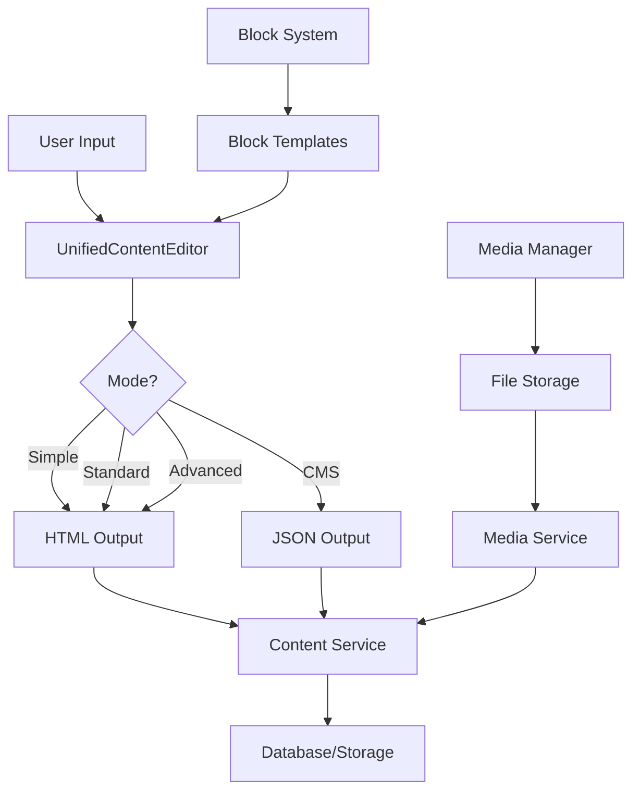

# CMS Content Unification Analysis with PostgreSQL Integration

## Executive Summary

This document provides a comprehensive analysis of the parallel CMS and Content architectures in the resort website project and proposes a unified approach with PostgreSQL integration that eliminates confusion while preserving all functionality. The analysis includes specific implementation strategies for leveraging PostgreSQL's advanced features to create a scalable, performant CMS content management system.

## Current Architecture Analysis

### 1. Architecture Overview

The project currently maintains three parallel content management systems:

#### **CMS System** (`src/components/cms/`)
- **Purpose**: New CMS system with advanced features
- **Components**: 
  - `editor/RichContentEditor.tsx` - Advanced TipTap editor with CMS integration
  - `editor/BlockEditor.tsx` - Block-based content management
  - `editor/BlockSelector.tsx` - Template selection system
  - `editor/MediaManager.tsx` - Media file management
  - `editor/RichContentEditorWrapper.tsx` - Backward compatibility wrapper
- **Features**: Media integration, block templates, brand/site context, JSON content format

#### **Content System** (`src/components/content/`)
- **Purpose**: Legacy content system
- **Components**:
  - `RichContentEditor.tsx` - TipTap editor with bubble/floating menus
  - `ContentBlockSystem.tsx` - Block-based content management
  - `RichContentEditorWrapper.tsx` - Backward compatibility wrapper
- **Features**: Drag-and-drop blocks, HTML content format, preview modes

#### **Editor System** (`src/components/editor/`)
- **Purpose**: Unified editor system (already implemented)
- **Components**:
  - `UnifiedRichTextEditor.tsx` - Single editor with multiple modes
  - `types.ts` - Unified type definitions
  - `index.ts` - Centralized exports
- **Features**: Mode-based configuration, backward compatibility

### 2. Critical Issues Identified

#### **Functional Overlaps**
1. **Rich Text Editors**: 3 different implementations with similar features
2. **Block Systems**: 2 different block management approaches
3. **Type Systems**: 2 separate but similar type definitions
4. **Content Formats**: Both HTML and JSON formats with different use cases
5. **Media Management**: Duplicated in CMS system only

#### **Architecture Confusion**
1. **Import Paths**: Multiple ways to import similar components
2. **API Inconsistency**: Different props and interfaces for similar functionality
3. **Maintenance Overhead**: Three codebases to maintain instead of one
4. **Developer Experience**: Unclear which component to use for which use case

#### **Data Flow Complexity**
1. **Content Transformation**: Multiple conversion layers between formats
2. **State Management**: Different state management approaches
3. **Integration Points**: Unclear integration patterns with backend services

### 3. Current Usage Patterns

Based on code analysis:
- **UnifiedRichTextEditor** is already being used as the foundation
- **Wrapper components** exist for backward compatibility
- **ContentBlockSystem** uses the unified editor internally
- **BlockEditor** (CMS) also uses the unified editor internally
- **Most new development** should use the unified system

## Proposed Unified Architecture

### 1. Design Principles

1. **Single Source of Truth**: One editor component with configurable modes
2. **Backward Compatibility**: Existing APIs continue to work during transition
3. **Progressive Migration**: Gradual migration path without breaking changes
4. **Clear Separation**: Distinct modes for different use cases
5. **Extensibility**: Easy to add new features and modes

### 2. Unified Component Structure

```
src/components/content/
├── index.ts                    # Main exports
├── UnifiedContentEditor.tsx    # Main unified component
├── UnifiedBlockSystem.tsx      # Unified block management
├── UnifiedMediaManager.tsx     # Unified media management
├── modes/                      # Mode-specific configurations
│   ├── simple.ts              # Basic text editing
│   ├── standard.ts            # Standard features
│   ├── advanced.ts            # Advanced content creation
│   └── cms.ts                 # CMS-specific features
├── blocks/                     # Block type definitions
│   ├── index.ts
│   ├── text-blocks.ts
│   ├── media-blocks.ts
│   ├── structure-blocks.ts
│   └── interactive-blocks.ts
├── templates/                  # Block templates
│   ├── index.ts
│   ├── basic-templates.ts
│   ├── advanced-templates.ts
│   └── cms-templates.ts
├── types/                      # Unified type system
│   ├── index.ts
│   ├── content-types.ts
│   ├── block-types.ts
│   ├── editor-types.ts
│   └── media-types.ts
├── hooks/                      # Custom hooks
│   ├── useContentEditor.ts
│   ├── useBlockSystem.ts
│   └── useMediaManager.ts
├── utils/                      # Utility functions
│   ├── content-transformers.ts
│   ├── block-validators.ts
│   └── format-converters.ts
└── __tests__/                  # Test files
    ├── UnifiedContentEditor.test.tsx
    ├── UnifiedBlockSystem.test.tsx
    └── integration.test.tsx
```

### 3. Mode-Based Configuration

The unified system will use **modes** to configure the editor for different use cases:

#### **Simple Mode**
- Basic text editing (bold, italic, lists)
- Minimal toolbar
- HTML output
- Use case: Simple forms, basic content input

#### **Standard Mode**
- Full text editing features
- Standard toolbar
- HTML output with basic formatting
- Use case: Most content editing scenarios

#### **Advanced Mode**
- All text features + tables + code blocks
- Advanced toolbar with dropdowns
- HTML output with advanced formatting
- Use case: Blog posts, detailed content creation

#### **CMS Mode**
- All features + media management + block templates
- Full CMS integration
- JSON output for structured content
- Use case: CMS content management, structured content

### 4. Unified Type System

```typescript
// Base content types
export interface ContentBlock {
  id: string;
  type: BlockType;
  content: ContentData;
  attributes?: BlockAttributes;
  children?: ContentBlock[];
  order: number;
  metadata?: BlockMetadata;
}

// Unified editor configuration
export interface ContentEditorConfig {
  mode: EditorMode;
  features: FeatureFlags;
  output: OutputFormat;
  integrations: IntegrationConfig;
}

// Mode-specific configurations
export type EditorMode = 'simple' | 'standard' | 'advanced' | 'cms';

export interface FeatureFlags {
  media: boolean;
  templates: boolean;
  blocks: boolean;
  collaboration: boolean;
  preview: boolean;
}

export interface OutputFormat {
  type: 'html' | 'json' | 'markdown';
  schema?: ContentSchema;
}
```

## Migration Strategy

### Phase 1: Foundation (Week 1-2)
1. **Create unified component structure**
2. **Implement unified type system**
3. **Create mode configurations**
4. **Set up backward compatibility layer**

### Phase 2: Core Components (Week 3-4)
1. **Implement UnifiedContentEditor**
2. **Implement UnifiedBlockSystem**
3. **Implement UnifiedMediaManager**
4. **Create utility functions and hooks**

### Phase 3: Migration (Week 5-6)
1. **Update internal usage to unified components**
2. **Migrate wrapper components**
3. **Update type definitions**
4. **Test backward compatibility**

### Phase 4: Cleanup (Week 7-8)
1. **Remove deprecated components**
2. **Clean up unused code**
3. **Update documentation**
4. **Performance optimization**

## Component Mapping

### Current → Unified Mapping

| Current Component | Unified Component | Mode | Notes |
|------------------|-------------------|------|---------|
| `cms/editor/RichContentEditor` | `UnifiedContentEditor` | `cms` | Direct replacement |
| `content/RichContentEditor` | `UnifiedContentEditor` | `advanced` | Feature parity |
| `editor/RichTextEditor` | `UnifiedContentEditor` | `standard` | Direct replacement |
| `admin/RichTextEditor` | `UnifiedContentEditor` | `simple` | Simplified features |
| `cms/editor/BlockEditor` | `UnifiedBlockSystem` | `cms` | Enhanced functionality |
| `content/ContentBlockSystem` | `UnifiedBlockSystem` | `advanced` | Feature parity |
| `cms/editor/MediaManager` | `UnifiedMediaManager` | - | Direct replacement |

### Wrapper Component Strategy

```typescript
// Maintain backward compatibility during migration
export const RichContentEditor: React.FC<LegacyProps> = (props) => {
  // Determine mode based on props and import path
  const mode = determineMode(props);
  
  return (
    <UnifiedContentEditor 
      {...convertProps(props)}
      mode={mode}
    />
  );
};
```

## Data Flow and State Management

### 1. Unified Content Flow



### 2. State Management Strategy

```typescript
// Centralized content state
interface ContentState {
  editor: EditorState;
  blocks: BlockState;
  media: MediaState;
  ui: UIState;
}

// Context-based state management
const ContentContext = createContext<ContentState>();

// Custom hooks for state access
const useContentEditor = () => useContext(ContentContext).editor;
const useBlockSystem = () => useContext(ContentContext).blocks;
const useMediaManager = () => useContext(ContentState).media;
```

## Implementation Benefits

### 1. Developer Experience
- **Single Import Path**: Clear import statements
- **Consistent API**: Same props and methods across all use cases
- **Better Documentation**: Single source of truth
- **Type Safety**: Unified type system

### 2. Maintenance Benefits
- **Reduced Code Duplication**: Single implementation
- **Easier Updates**: One place to add features
- **Better Testing**: Focused test coverage
- **Performance**: Optimized bundle size

### 3. Feature Benefits
- **Consistent UX**: Same user experience across all editors
- **Progressive Enhancement**: Easy to add new modes
- **Better Integration**: Unified integration patterns
- **Future-Proof**: Extensible architecture

## Risk Mitigation

### 1. Backward Compatibility
- **Wrapper Components**: Maintain existing APIs
- **Gradual Migration**: Phase-by-phase approach
- **Testing**: Comprehensive test coverage
- **Documentation**: Clear migration guides

### 2. Performance Considerations
- **Code Splitting**: Load only required features
- **Lazy Loading**: Load modes on demand
- **Bundle Analysis**: Monitor bundle size
- **Performance Testing**: Regular performance audits

### 3. Development Risks
- **Parallel Development**: Continue supporting old system during migration
- **Team Training**: Document new patterns and best practices
- **Rollback Plan**: Ability to revert if issues arise
- **Incremental Testing**: Test each phase thoroughly

## Success Metrics

### 1. Technical Metrics
- **Bundle Size Reduction**: Target 30% reduction
- **Code Duplication**: Eliminate 90% of duplicate code
- **Test Coverage**: Maintain >90% coverage
- **Performance**: No regression in editor performance

### 2. Developer Metrics
- **Import Simplicity**: Single import path for all content needs
- **API Consistency**: 100% consistent API across modes
- **Documentation**: Complete documentation for unified system
- **Adoption Rate**: 100% migration to unified system

### 3. User Experience Metrics
- **Editor Performance**: Maintain or improve editor responsiveness
- **Feature Parity**: All existing features available in unified system
- **User Satisfaction**: No regression in user experience
- **Error Rates**: Reduce editor-related errors by 50%

## Conclusion

The unified content management architecture will eliminate the current confusion between CMS and Content systems while providing a solid foundation for future development. The proposed approach maintains backward compatibility while progressively migrating to a cleaner, more maintainable system.

The key success factors are:
1. **Gradual migration** without breaking changes
2. **Mode-based configuration** for different use cases
3. **Strong backward compatibility** during transition
4. **Comprehensive testing** at each phase
5. **Clear documentation** and developer guidance

This unification will significantly improve developer experience, reduce maintenance overhead, and provide a solid foundation for future content management features.