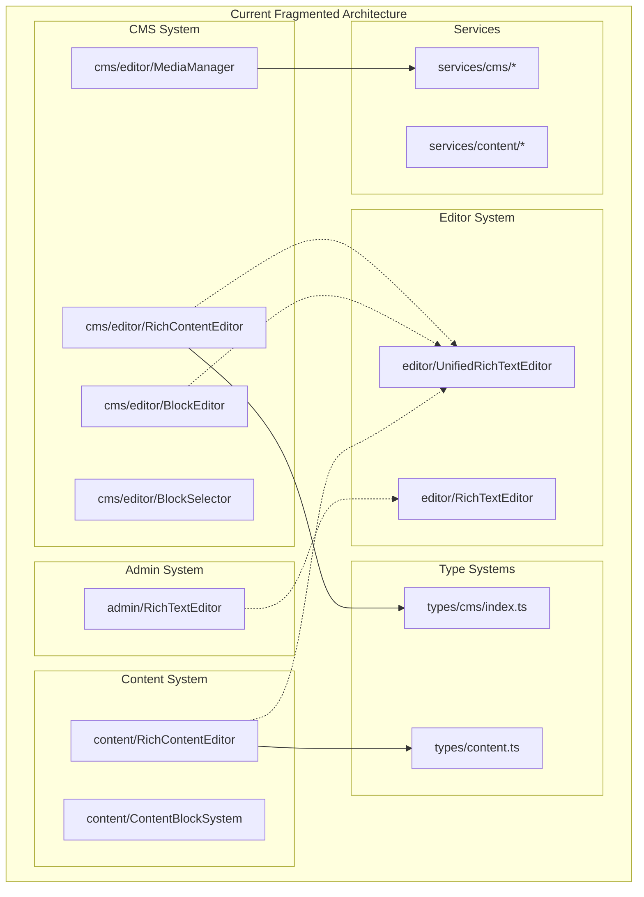
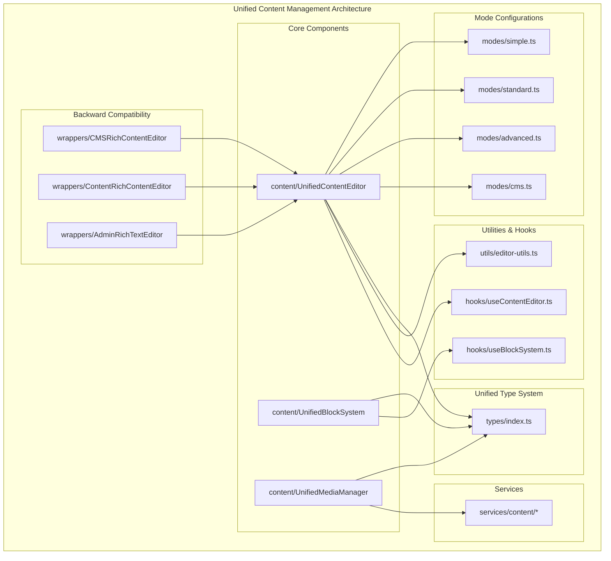
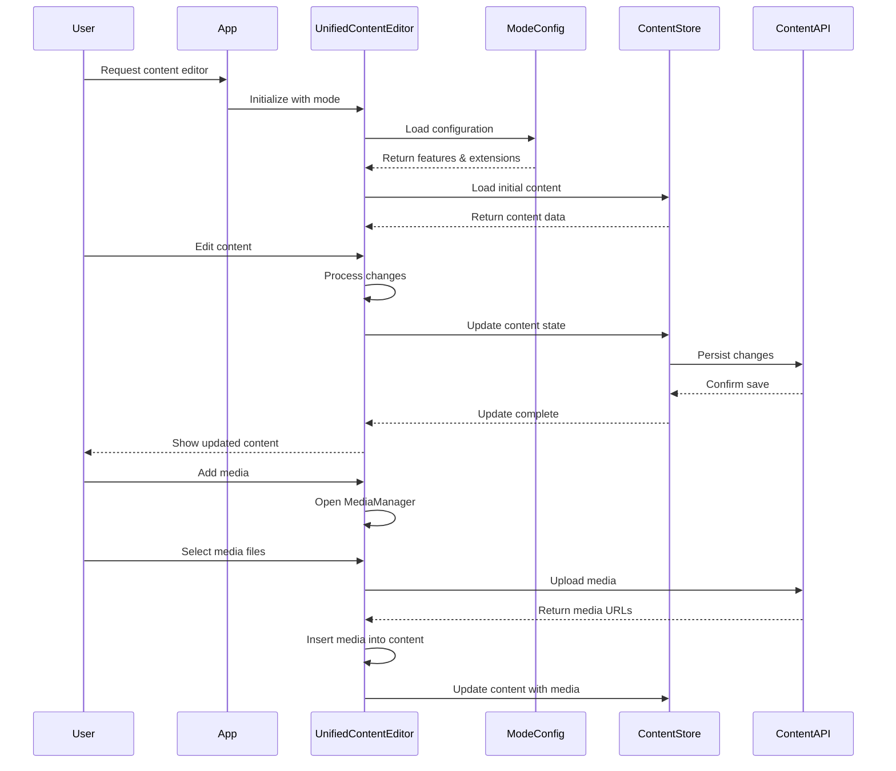
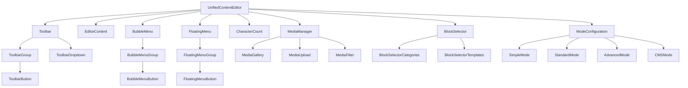
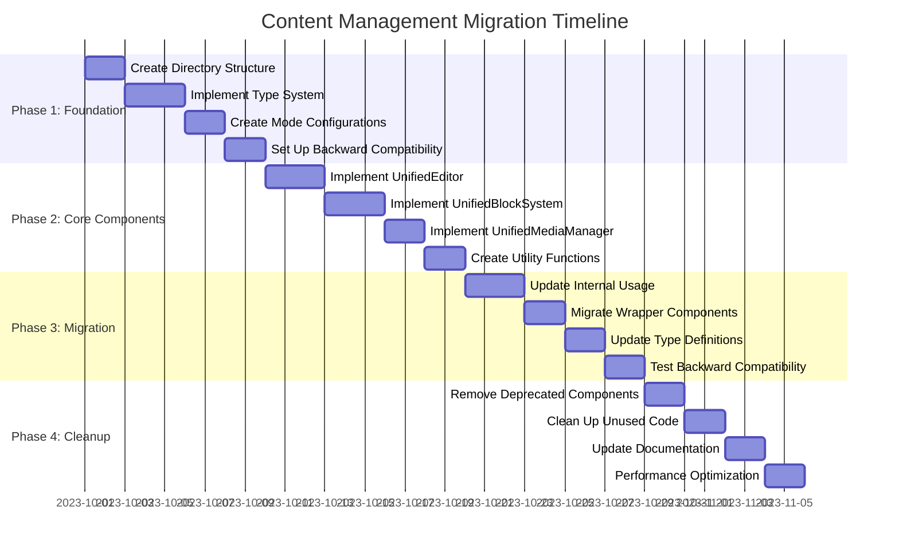
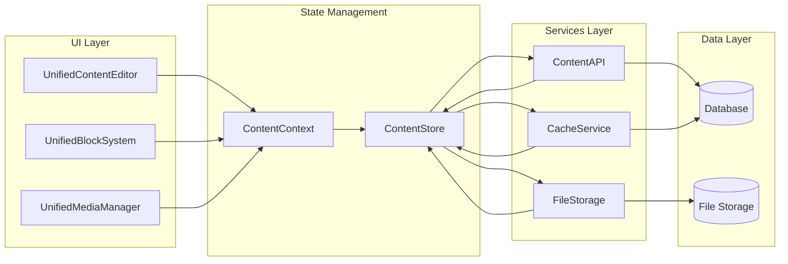
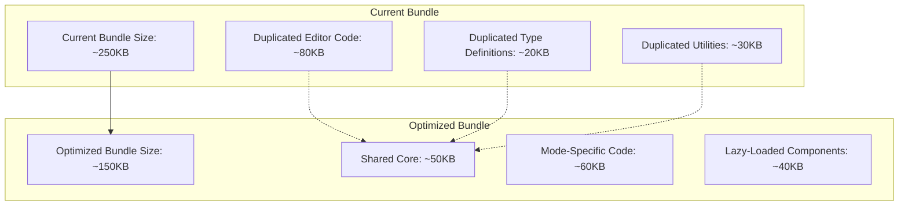
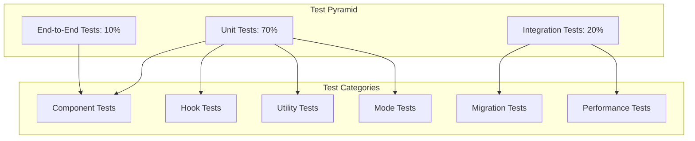
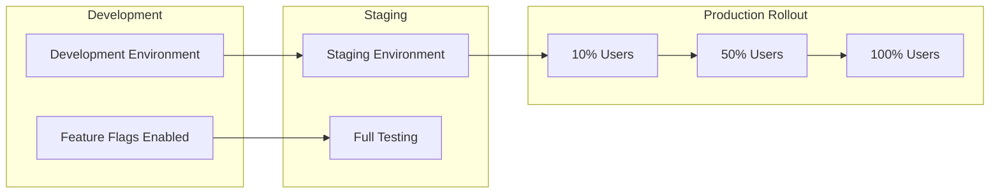
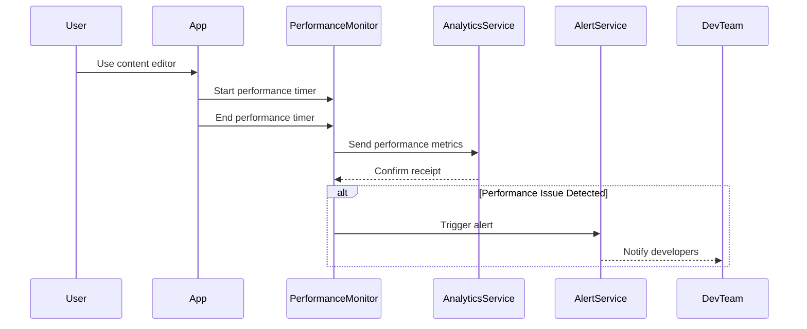

# Unified Content Management Architecture Diagrams

## Current vs. Unified Architecture Comparison

### Current Architecture (Fragmented)

### Unified Architecture (Consolidated)

## Data Flow Diagram

### Unified Content Management Flow

## Component Hierarchy

### Unified Content Editor Component Structure

## Mode-Based Feature Matrix

### Editor Modes and Features

| Feature | Simple | Standard | Advanced | CMS |
|---------|--------|----------|----------|-----|
| Basic Formatting | ✅ | ✅ | ✅ | ✅ |
| Advanced Formatting | ❌ | ✅ | ✅ | ✅ |
| Headings | ❌ | ✅ | ✅ | ✅ |
| Lists | ✅ | ✅ | ✅ | ✅ |
| Links | ❌ | ✅ | ✅ | ✅ |
| Images | ❌ | ✅ | ✅ | ✅ |
| Tables | ❌ | ❌ | ✅ | ✅ |
| Code Blocks | ❌ | ❌ | ✅ | ✅ |
| Media Manager | ❌ | ❌ | ❌ | ✅ |
| Block Templates | ❌ | ❌ | ❌ | ✅ |
| Character Count | ❌ | ❌ | ✅ | ✅ |
| Word Count | ❌ | ❌ | ✅ | ✅ |
| Preview Mode | ❌ | ❌ | ✅ | ✅ |
| HTML Output | ✅ | ✅ | ✅ | ❌ |
| JSON Output | ❌ | ❌ | ❌ | ✅ |
| Collaboration | ❌ | ❌ | ❌ | ❌ |

## Migration Path Visualization

### Phase-by-Phase Migration

## State Management Architecture

### Unified Content State Flow

## Performance Optimization

### Bundle Size Optimization

## Testing Strategy

### Test Coverage Architecture

## Deployment Strategy

### Feature Flag Rollout

## Monitoring and Analytics

### Performance Monitoring Flow

These diagrams provide a visual representation of the unified architecture, making it easier to understand the component relationships, data flow, and migration strategy.