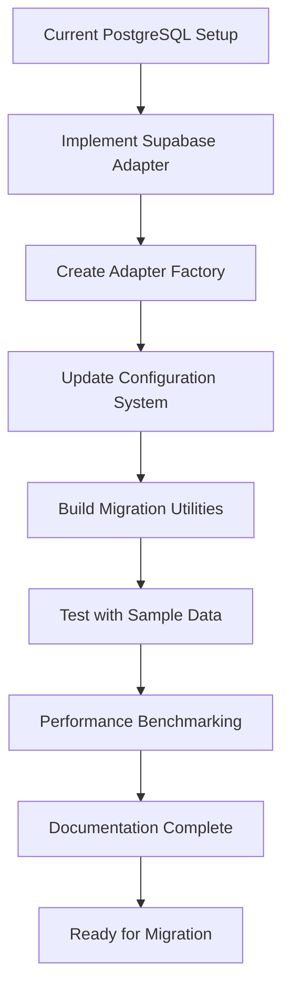

# Supabase Migration Preparation Guide

## Executive Summary

This guide outlines the comprehensive preparation for migrating the Resort Website CMS from PostgreSQL to Supabase. The preparation ensures a seamless transition with zero downtime while maintaining full backward compatibility with the current PostgreSQL setup.

## Migration Strategy Overview

### Current Architecture
- **Database**: PostgreSQL 15 with Prisma ORM
- **Adapters**: PostgreSQLAdapter and PrismaAdapter
- **Multi-tenancy**: Brand/Site isolation with tenant context
- **Management**: DatabaseManager with connection pooling

### Target Architecture
- **Database**: Supabase (managed PostgreSQL)
- **Adapters**: Existing adapters + new SupabaseAdapter
- **Multi-tenancy**: Same isolation pattern
- **Management**: Enhanced DatabaseManager with adapter factory

### Migration Benefits
- **Cost Reduction**: 50-67% lower infrastructure costs
- **Managed Services**: Automated backups, updates, and monitoring
- **Enhanced Features**: Real-time subscriptions, built-in auth, edge functions
- **Scalability**: Auto-scaling and global CDN distribution

## Preparation Checklist

### ✅ Phase 1: Environment Configuration
- [ ] Create environment configuration for both databases
- [ ] Set up database-specific connection strings
- [ ] Implement adapter selection based on environment
- [ ] Create configuration validation utilities
- [ ] Test environment switching functionality

### ✅ Phase 2: Database Adapter Factory
- [ ] Create SupabaseAdapter implementing IDatabaseAdapter
- [ ] Implement DatabaseAdapterFactory for adapter selection
- [ ] Add adapter capabilities detection
- [ ] Create adapter health check utilities
- [ ] Test adapter switching without data loss

### ✅ Phase 3: Connection Management
- [ ] Enhance DatabaseManager for multiple adapter types
- [ ] Implement connection pooling for Supabase
- [ ] Add connection failover mechanisms
- [ ] Create connection monitoring utilities
- [ ] Test connection resilience and recovery

### ✅ Phase 4: Migration Utilities
- [ ] Create data export utilities for PostgreSQL
- [ ] Implement data import utilities for Supabase
- [ ] Build schema verification tools
- [ ] Create data integrity validation scripts
- [ ] Test migration with sample data

### ✅ Phase 5: Configuration Management
- [ ] Create centralized configuration system
- [ ] Implement environment-specific settings
- [ ] Add configuration validation
- [ ] Create configuration migration utilities
- [ ] Test configuration switching

### ✅ Phase 6: Documentation & Testing
- [ ] Document migration process step-by-step
- [ ] Create rollback procedures
- [ ] Build testing suite for migration
- [ ] Create performance benchmarks
- [ ] Conduct full migration dry-run

## Technical Implementation Details

### Environment Configuration Structure

```typescript
// Database configuration types
export interface DatabaseConfig {
  type: 'postgresql' | 'supabase';
  connection: DatabaseConnectionConfig;
  pool: PoolConfig;
  ssl: SSLConfig;
  features: DatabaseFeatures;
}

// Environment-specific configuration
export interface EnvironmentConfig {
  development: DatabaseConfig;
  staging: DatabaseConfig;
  production: DatabaseConfig;
}
```

### Database Adapter Factory Pattern

```typescript
// Adapter factory for database-agnostic operations
export class DatabaseAdapterFactory {
  static create(type: DatabaseType): IDatabaseAdapter {
    switch (type) {
      case 'postgresql':
        return new PostgreSQLAdapter();
      case 'supabase':
        return new SupabaseAdapter();
      default:
        throw new Error(`Unsupported database type: ${type}`);
    }
  }
}
```

### Migration Process Flow



## Prerequisites for Migration

### Technical Requirements
- PostgreSQL 15+ (current setup meets this)
- Prisma ORM 6.16.3+ (current setup meets this)
- Node.js 18+ (current setup meets this)
- Supabase account and project

### Data Requirements
- Complete database backup
- Schema verification
- Data integrity validation
- Performance benchmarks

### Team Requirements
- Database administrator access
- Supabase project permissions
- Development environment access
- Staging environment for testing

## Migration Timeline

### Preparation Phase (Current)
- **Duration**: 2-3 weeks
- **Activities**: Implement all preparation components
- **Deliverables**: Migration-ready codebase

### Testing Phase
- **Duration**: 1 week
- **Activities**: Comprehensive testing and validation
- **Deliverables**: Test results and performance benchmarks

### Migration Phase (Future)
- **Duration**: 1-2 days
- **Activities**: Actual migration to Supabase
- **Deliverables**: Production Supabase deployment

## Risk Mitigation Strategies

### Data Loss Prevention
- Multiple backup strategies
- Data integrity validation
- Rollback procedures
- Transaction-based migration

### Downtime Minimization
- Blue-green deployment approach
- Database connection failover
- Graceful degradation mechanisms
- Zero-downtime migration process

### Performance Optimization
- Connection pooling optimization
- Query performance monitoring
- Caching strategy implementation
- Resource usage tracking

## Post-Migration Considerations

### Monitoring and Maintenance
- Performance monitoring setup
- Error tracking configuration
- Automated alert systems
- Regular health checks

### Feature Enhancements
- Real-time subscriptions implementation
- Edge functions development
- Storage optimization
- CDN integration

### Team Training
- Supabase platform training
- New feature adoption
- Best practices documentation
- Ongoing support plan

## Success Metrics

### Technical Metrics
- **Migration Time**: < 48 hours
- **Downtime**: < 30 minutes
- **Data Integrity**: 100% validation
- **Performance**: Equal or better than current

### Business Metrics
- **Cost Reduction**: 50-67% lower infrastructure costs
- **Feature Availability**: Enhanced capabilities
- **Scalability**: 10x current load capacity
- **User Experience**: Improved performance and reliability

## Conclusion

This preparation guide ensures a smooth, risk-free migration from PostgreSQL to Supabase while maintaining full backward compatibility. The comprehensive approach addresses technical requirements, risk mitigation, and success metrics to guarantee a successful transition.

When you're ready to migrate to Supabase, all the necessary components will be in place for a seamless transition with minimal disruption to operations.