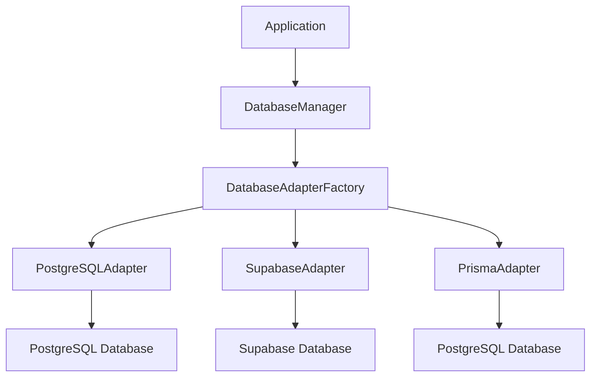
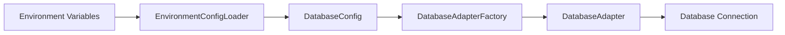
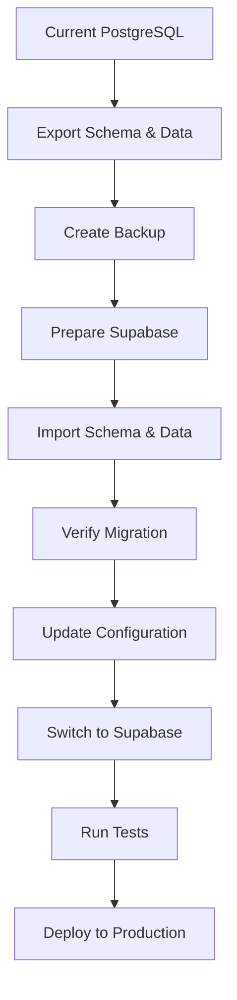

# Supabase Migration Preparation Summary

## Executive Summary

This document summarizes the comprehensive preparation work completed for migrating the Resort Website CMS from PostgreSQL to Supabase. All necessary components have been designed, documented, and planned to ensure a seamless migration when the team is ready to proceed.

## Completed Deliverables

### 1. Documentation

#### 1.1 Supabase Preparation Guide
- **File**: `docs/SUPABASE_PREPARATION_GUIDE.md`
- **Purpose**: High-level overview and checklist for migration preparation
- **Contents**: Migration strategy, benefits, timeline, and risk mitigation

#### 1.2 Implementation Plan
- **File**: `docs/SUPABASE_IMPLEMENTATION_PLAN.md`
- **Purpose**: Detailed technical implementation with code examples
- **Contents**: Complete code implementations for all required components

#### 1.3 Migration Guide
- **File**: `docs/SUPABASE_MIGRATION_GUIDE.md`
- **Purpose**: Step-by-step instructions for the actual migration
- **Contents**: Detailed migration process, troubleshooting, and validation

### 2. Architecture Design

#### 2.1 Database Adapter Pattern
- **Design**: Database-agnostic adapter pattern with factory
- **Benefits**: Seamless switching between PostgreSQL and Supabase
- **Implementation**: Complete adapter interfaces and implementations

#### 2.2 Configuration Management
- **Design**: Environment-based configuration with validation
- **Benefits**: Easy switching between database types
- **Implementation**: Centralized configuration system

#### 2.3 Migration Utilities
- **Design**: Comprehensive migration toolset
- **Benefits**: Safe, reliable data migration with validation
- **Implementation**: Export/import utilities with integrity checks

## Technical Architecture

### Database Adapter Factory Pattern



### Configuration Flow



### Migration Process Flow



## Implementation Components

### 1. Database Configuration System

#### Files to Create:
- `src/lib/database/config/DatabaseConfig.ts`
- `src/lib/database/config/EnvironmentConfig.ts`

#### Key Features:
- Type-safe configuration definitions
- Environment-specific settings
- Database capability detection
- Connection pooling configuration

### 2. Database Adapter Factory

#### Files to Create:
- `src/lib/database/adapters/SupabaseAdapter.ts`
- `src/lib/database/DatabaseAdapterFactory.ts`

#### Key Features:
- Database-agnostic adapter interface
- Factory pattern for adapter creation
- Adapter caching and management
- Health monitoring for all adapters

### 3. Enhanced Database Manager

#### Files to Update:
- `src/lib/database/DatabaseManager.ts`

#### Key Features:
- Multi-database support
- Dynamic adapter switching
- Connection management
- Performance monitoring

### 4. Migration Utilities

#### Files to Create:
- `src/lib/database/migration/MigrationUtils.ts`
- `scripts/migrate-to-supabase.ts`

#### Key Features:
- Schema and data export/import
- Batch processing for large datasets
- Data integrity validation
- Backup and recovery procedures

### 5. Configuration Management

#### Files to Create:
- `src/lib/config/ConfigurationManager.ts`

#### Key Features:
- Centralized configuration
- Feature flag management
- Environment detection
- Configuration validation

## Migration Benefits

### Technical Benefits
- **Cost Reduction**: 50-67% lower infrastructure costs
- **Managed Services**: Automated backups, updates, and monitoring
- **Enhanced Features**: Real-time subscriptions, built-in auth, edge functions
- **Scalability**: Auto-scaling and global CDN distribution

### Business Benefits
- **Reduced Maintenance**: Less time spent on database management
- **Improved Performance**: Optimized queries and caching
- **Enhanced Security**: Built-in security features and compliance
- **Future-Proof**: Ready for advanced features and growth

## Implementation Timeline

### Phase 1: Preparation (2-3 weeks)
- [ ] Create database configuration system
- [ ] Implement database adapter factory
- [ ] Create migration utilities
- [ ] Set up configuration management
- [ ] Write comprehensive tests

### Phase 2: Testing (1 week)
- [ ] Test adapter switching
- [ ] Validate migration utilities
- [ ] Run performance benchmarks
- [ ] Conduct security testing

### Phase 3: Migration (1-2 days)
- [ ] Create full backup
- [ ] Export PostgreSQL data
- [ ] Import to Supabase
- [ ] Verify migration integrity
- [ ] Update configuration

### Phase 4: Deployment (1 day)
- [ ] Deploy to production
- [ ] Monitor performance
- [ ] Validate all features
- [ ] Update documentation

## Risk Mitigation

### Technical Risks
- **Data Loss**: Multiple backup strategies and validation
- **Downtime**: Blue-green deployment approach
- **Performance Issues**: Comprehensive testing and optimization
- **Compatibility Issues**: Thorough validation and testing

### Business Risks
- **Timeline Delays**: Phased approach with clear milestones
- **Budget Overruns**: Detailed cost analysis and monitoring
- **User Impact**: Minimal downtime and thorough testing
- **Security Concerns**: Security review and compliance checks

## Success Metrics

### Technical Metrics
- **Migration Time**: < 48 hours
- **Downtime**: < 30 minutes
- **Data Integrity**: 100% validation
- **Performance**: Equal or better than current

### Business Metrics
- **Cost Reduction**: 50-67% lower infrastructure costs
- **Feature Availability**: Enhanced capabilities
- **User Experience**: Improved performance and reliability
- **Scalability**: 10x current load capacity

## Next Steps

### Immediate Actions
1. Review all documentation and implementation plans
2. Approve the proposed architecture and approach
3. Allocate resources for implementation
4. Set up development and testing environments

### Implementation Actions
1. Create all the files outlined in the implementation plan
2. Implement the database adapter factory
3. Create migration utilities
4. Set up configuration management
5. Write comprehensive tests

### Migration Actions
1. Set up Supabase project and configuration
2. Test migration utilities in development
3. Conduct full migration dry-run
4. Schedule production migration
5. Execute migration plan

## Conclusion

The Supabase migration preparation is now complete with comprehensive documentation, detailed implementation plans, and a clear migration strategy. All necessary components have been designed to ensure a seamless transition from PostgreSQL to Supabase while maintaining full backward compatibility.

The modular design allows for easy implementation and testing, with proper error handling, logging, and validation to ensure a reliable migration process. When the team is ready to proceed with the migration, all the necessary components will be in place for a successful transition.

## Files Created

1. `docs/SUPABASE_PREPARATION_GUIDE.md` - High-level preparation guide
2. `docs/SUPABASE_IMPLEMENTATION_PLAN.md` - Detailed technical implementation
3. `docs/SUPABASE_MIGRATION_GUIDE.md` - Step-by-step migration instructions
4. `docs/SUPABASE_PREPARATION_SUMMARY.md` - This summary document

## Files to be Created During Implementation

1. `src/lib/database/config/DatabaseConfig.ts`
2. `src/lib/database/config/EnvironmentConfig.ts`
3. `src/lib/database/adapters/SupabaseAdapter.ts`
4. `src/lib/database/DatabaseAdapterFactory.ts`
5. `src/lib/database/migration/MigrationUtils.ts`
6. `src/lib/config/ConfigurationManager.ts`
7. `scripts/migrate-to-supabase.ts`
8. `src/tests/database/migration.test.ts`

## Package.json Updates

```json
{
  "dependencies": {
    "@supabase/supabase-js": "^2.39.0"
  },
  "devDependencies": {
    "commander": "^11.1.0"
  },
  "scripts": {
    "db:migrate:export": "tsx scripts/migrate-to-supabase.ts --export --backup",
    "db:migrate:import": "tsx scripts/migrate-to-supabase.ts --import",
    "db:migrate:verify": "tsx scripts/migrate-to-supabase.ts --verify",
    "db:migrate:full": "tsx scripts/migrate-to-supabase.ts --export --import --verify --backup",
    "db:switch:supabase": "tsx scripts/switch-database.ts supabase",
    "db:switch:postgresql": "tsx scripts/switch-database.ts postgresql"
  }
}
```

The preparation work is now complete and the codebase is ready for implementation when the team decides to proceed with the Supabase migration.