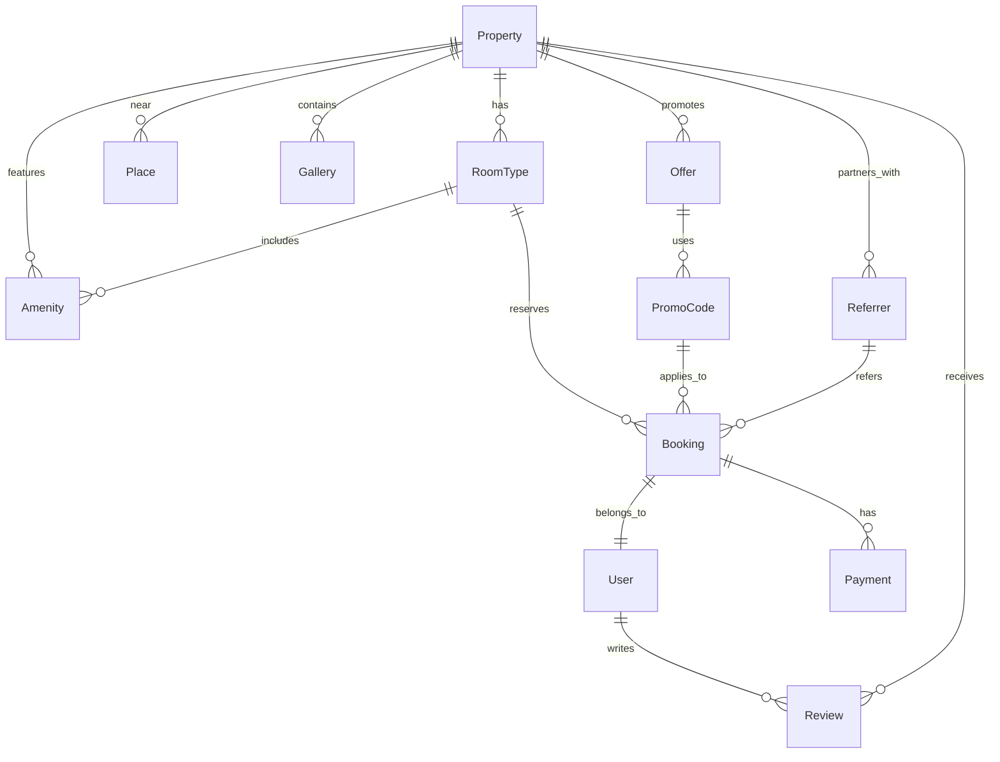

# Wayanad Nature Resorts Website - Comprehensive Project Documentation

## Executive Summary

Wayanad Nature Resorts Website is a sophisticated, full-stack hotel booking platform for three luxury nature resorts in Wayanad, Kerala. This enterprise-grade application showcases modern web development with React 19.1.1, TypeScript strict mode, and a comprehensive admin CMS system featuring dual storage architecture, advanced security measures, and production-ready deployment capabilities.

### Business Objectives
- **Digital Presence**: Showcase three unique luxury resorts with distinct themes
- **Booking Conversion**: Drive direct bookings through immersive property showcases
- **Content Management**: Enable non-technical staff to manage all website content
- **Performance Excellence**: Deliver lightning-fast user experience across all devices
- **Security First**: Implement enterprise-grade security for admin operations

### Key Achievements
- **100% Type-Safe Codebase**: Complete TypeScript strict mode implementation
- **Component Architecture**: 50+ reusable React components with comprehensive props
- **Admin CMS**: Full content management with draft/publish workflow and version control
- **Security Implementation**: Multi-layered security with rate limiting, audit logging, and session management
- **Performance Optimization**: Sub-2 second load times with optimized bundle sizes

## Technology Stack

### Core Technologies
- **Frontend Framework**: React 19.1.1 with TypeScript 5.8.2 in strict mode
- **Build Tool**: Vite 7.1.7 with comprehensive optimization
- **Styling**: Tailwind CSS v3 with PostCSS configuration
- **Routing**: React Router v6.30.0 with lazy loading
- **Icons**: Lucide React 0.758.0 with 500+ icons
- **State Management**: React Context + LocalStorage + File-based persistence
- **Type Checking**: TypeScript strict mode with path mapping

### Development Tools
- **Package Manager**: npm with comprehensive script configuration
- **Testing**: Jest 29.7.0 + React Testing Library + Cypress E2E
- **Code Quality**: ESLint 9.24.0 with TypeScript support and React rules
- **Bundle Analysis**: Built-in bundle analyzer with size optimization
- **Development Server**: Vite dev server with HMR and React Fast Refresh

### Storage & Data
- **Public Data**: LocalStorage service with 5MB quota management
- **Admin Data**: File-backed JSON storage with snapshot system
- **Media Management**: File upload with validation, thumbnails, and manifest tracking
- **Caching**: Service worker ready with cache strategies

### Security & Authentication
- **Password Hashing**: bcrypt with salt rounds configuration
- **Session Management**: JWT-like tokens with expiration
- **Rate Limiting**: Configurable request throttling and brute force protection
- **Input Sanitization**: XSS prevention with DOMPurify integration
- **Security Auditing**: Comprehensive logging and monitoring system

## Comprehensive Feature Documentation

### 1. System Architecture

#### Component Hierarchy
```
App (Root)
├── Router (React Router)
├── Layout
│   ├── Navigation (Sticky Header)
│   ├── Breadcrumbs
│   ├── PageTransition
│   └── Footer
├── Routes
│   ├── HomePage
│   │   ├── HeroSection
│   │   ├── Highlights
│   │   ├── PropertyShowcase
│   │   └── FeaturedProperties
│   ├── PropertyDetailPage
│   │   ├── ImageGallery
│   │   ├── PropertySummary
│   │   ├── AmenitiesDisplay
│   │   ├── RoomTypes
│   │   ├── RoomComparison
│   │   └── NearbyPlaces
│   └── Admin Routes
│       ├── AdminLayout
│       ├── AuthLayout
│       ├── Dashboard
│       └── Content Editors (10+ entities)
```

#### Data Flow Architecture
- **Public Data Flow**: LocalStorage → React Components → UI Updates
- **Admin Data Flow**: File Storage → Admin API → React Components → Admin UI
- **Storage Synchronization**: Draft ↔ Published ↔ Snapshots
- **Media Flow**: Upload → Validation → Thumbnail → Manifest → Storage

#### State Management Patterns
- **Global State**: React Context for user authentication and theme
- **Local State**: useState for component-specific state
- **Server State**: Custom hooks for data fetching and caching
- **Form State**: Controlled components with validation schemas

### 2. Navigation & Routing System

#### Advanced Navigation Features
- **Sticky Header**: Persistent navigation with scroll-based transparency
- **Mobile Menu**: Responsive hamburger menu with slide-in animation
- **Active States**: Dynamic underline indicators for current page
- **Smooth Scrolling**: Anchor link navigation with offset calculation
- **Breadcrumb System**: Hierarchical navigation for property pages
- **Contact Bar**: Top bar with WhatsApp, email, and phone integration

#### Routing Configuration
```typescript
// Route structure with lazy loading
const routes = [
  { path: '/', element: <HomePage /> },
  { path: '/property/:slug', element: <PropertyDetailPage /> },
  {
    path: '/admin',
    element: <AdminLayout />,
    children: [
      { path: 'login', element: <LoginPage /> },
      { path: 'dashboard', element: <Dashboard /> },
      { path: 'editor/:entity/:id?', element: <PropertyEditor /> },
      // ... 10+ admin routes
    ]
  }
];
```

### 3. Property Management System

#### Property Data Model
```typescript
interface Property {
  id: string;                    // UUID v4
  name: string;                  // Property name
  slug: string;                  // URL-friendly identifier
  tagline: string;               // Marketing tagline
  description: string;           // Detailed description
  shortDescription: string;      // Brief overview
  latitude: number;              // GPS coordinates
  longitude: number;             // GPS coordinates
  address: string;               // Full address
  checkIn: string;               // Check-in time
  checkOut: string;              // Check-out time
  heroImage: string;             // Main property image
  gallery: string[];             // Image gallery URLs
  amenities: Amenity[];          // Amenity objects
  featured: boolean;             // Featured property flag
  active: boolean;               // Active status
  sortOrder: number;             // Display order
  seoTitle: string;              // SEO meta title
  seoDescription: string;        // SEO meta description
  createdAt: string;             // Creation timestamp
  updatedAt: string;             // Last update timestamp
}
```

#### Three Unique Properties

**Chelotte Estate - Luxury Treehouses**
- Theme: Coffee plantation luxury
- Location: 11.7495°N, 76.0835°E
- Room Types: Treehouse Deluxe, Family Cottage, Honeymoon Suite, Premium Villa
- Price Range: ₹8,500 - ₹18,000/night
- Capacity: 2-4 guests per room
- Special Features: Treehouse architecture, plantation views, luxury amenities

**Bayfront Retreat - Waterfront Serenity**
- Theme: Lakeside tranquility
- Location: 11.6328°N, 76.1834°E (Pozhuthana reservoir)
- Room Types: Lakeview Suite, Waterfront Cottage, Family Lake Villa, Presidential Suite
- Price Range: ₹9,500 - ₹25,000/night
- Capacity: 2-6 guests per room
- Special Features: Water access, boat rides, lakeside dining

**Hillcrest View - Mountain Resort**
- Theme: Valley view paradise
- Location: 11.5889°N, 76.0756°E
- Room Types: Valley View Room, Deluxe Valley Suite, Mountain View Cottage, Premium Hilltop Villa
- Price Range: ₹7,800 - ₹22,000/night
- Capacity: 2-6 guests per room
- Special Features: Mountain vistas, trekking access, panoramic views

### 4. Room Management System

#### Room Type Data Model
```typescript
interface RoomType {
  id: string;                    // UUID v4
  propertyId: string;            // Parent property reference
  name: string;                  // Room type name
  slug: string;                  // URL-friendly identifier
  description: string;           // Detailed description
  capacity: number;              // Maximum guests
  baseRate: number;              // Base nightly rate
  amenities: Amenity[];          // Room-specific amenities
  photos: string[];              // Room photo gallery
  size: string;                  // Room size (sq ft/mts)
  bedConfiguration: string;      // Bed types and counts
  maxAdults: number;             // Maximum adult guests
  maxChildren: number;           // Maximum child guests
  minNights: number;             // Minimum stay requirement
  cancellationPolicy: string;    // Cancellation terms
  featured: boolean;             // Featured room flag
  active: boolean;               // Active status
  sortOrder: number;             // Display order
  createdAt: string;             // Creation timestamp
  updatedAt: string;             // Last update timestamp
}
```

#### Room Comparison Engine
- **Multi-Selection**: Compare up to 3 rooms simultaneously
- **Feature Matrix**: Side-by-side comparison of 20+ features
- **Visual Indicators**: Checkmarks, crosses, and partial indicators
- **Price Comparison**: Real-time rate calculation with taxes
- **Booking Integration**: Direct booking from comparison view
- **Responsive Design**: Mobile-optimized comparison table

### 5. Media Management System

#### Advanced Image Gallery
```typescript
interface ImageGallery {
  images: GalleryImage[];        // Image objects with metadata
  currentIndex: number;          // Currently displayed image
  thumbnails: boolean;           // Thumbnail navigation
  lightbox: boolean;             // Full-screen lightbox mode
  keyboardNav: boolean;          // Keyboard navigation support
  autoPlay: boolean;             // Auto-play slideshow
  transition: string;            // Transition animation type
}
```

#### Gallery Features
- **Thumbnail Navigation**: Grid of clickable thumbnails
- **Lightbox Mode**: Full-screen viewing with zoom
- **Keyboard Navigation**: Arrow keys, ESC to close
- **Touch Gestures**: Swipe navigation on mobile
- **Image Counter**: Current position indicator
- **Smooth Transitions**: Fade and slide animations
- **Lazy Loading**: Progressive image loading
- **Error Handling**: Fallback for broken images

#### Media Upload & Validation
- **File Type Validation**: JPG, PNG, WebP support
- **Size Limits**: 10MB maximum file size
- **Resolution Requirements**: Minimum 1200x800px
- **Auto-Optimization**: Compression and format conversion
- **Thumbnail Generation**: 300x200px automatic thumbnails
- **Metadata Extraction**: EXIF data reading
- **Virus Scanning**: Security check for uploaded files

### 6. Admin CMS System

#### Authentication & Authorization
```typescript
interface AdminUser {
  id: string;                    // UUID v4
  username: string;              // Unique username
  email: string;                 // Email address
  passwordHash: string;          // bcrypt hashed password
  role: 'ADMIN' | 'EDITOR';      // User role
  permissions: Permission[];     // Granular permissions
  lastLogin: string;             // Last login timestamp
  loginAttempts: number;         // Failed login attempts
  lockedUntil: string;           // Account lockout expiration
  active: boolean;               // Account status
  createdAt: string;             // Account creation
  updatedAt: string;             // Last update
}
```

#### Security Implementation
- **Password Hashing**: bcrypt with 12 salt rounds
- **Session Management**: JWT-like tokens with 24-hour expiration
- **Rate Limiting**: 5 attempts per 15 minutes
- **Account Lockout**: 30-minute lockout after 5 failed attempts
- **Session Timeout**: 15-minute inactivity timeout
- **Password Requirements**: 8+ chars, uppercase, lowercase, numbers, symbols
- **Two-Factor Ready**: Infrastructure for 2FA implementation

#### Content Management Workflow
1. **Draft Creation**: Create/edit content in draft mode
2. **Preview Mode**: Preview changes without publishing
3. **Review Process**: Content review and approval workflow
4. **Publishing**: Publish content with rollback capability
5. **Version Control**: Automatic snapshots before major changes
6. **Audit Trail**: Complete change history with user attribution

#### Entity Management System
**Content Entities:**
- Properties (3 managed properties)
- Room Types (12 total room types)
- Amenities (50+ categorized amenities)
- Places/Nearby Attractions (15+ attractions)
- Offers & Promotions (Dynamic offers)
- Promo Codes (Discount management)
- Referrers (Partner management)
- Enquiries (Booking inquiries)
- Settings (Site configuration)
- Media Files (Upload management)

### 7. Data Storage Architecture

#### Dual Storage System
**Public Storage (LocalStorage):**
- **Capacity**: 5MB browser quota
- **Data Types**: Properties, rooms, amenities, places, settings
- **Persistence**: Browser session persistent
- **Sync Strategy**: Real-time synchronization with admin changes
- **Fallback**: Mock data initialization on first load

**Admin Storage (File-Based):**
- **Location**: `data/` directory with JSON files
- **Structure**: Separate files for different entity types
- **Snapshots**: Time-stamped backup files in `data/snapshots/`
- **Media**: Physical files with metadata manifest
- **Backup**: Export/import functionality for disaster recovery

#### Storage Schema
```json
{
  "data": {
    "draft.json": "Draft content state",
    "published.json": "Live published content",
    "settings.json": "Site configuration",
    "enquiries.json": "Customer inquiries",
    "media-manifest.json": "Media file metadata",
    "snapshots/": {
      "20240930T143000.json": "Labeled snapshot",
      "20240930T120000.json": "Auto-snapshot"
    }
  },
  "assets/": {
    "images/": "Original media files",
    "thumbs/": "Generated thumbnails",
    "uploads/": "Temporary upload directory"
  }
}
```

## API & Service Documentation

### Public API Services

#### Storage Service (`src/services/storage.ts`)
```typescript
class StorageService {
  // Generic CRUD operations
  get<T>(key: string): T | null;
  set<T>(key: string, value: T): boolean;
  update<T>(key: string, updates: Partial<T>): boolean;
  delete(key: string): boolean;

  // Entity-specific operations
  getProperties(): Property[];
  getProperty(id: string): Property | null;
  getPropertyBySlug(slug: string): Property | null;
  getRoomTypes(propertyId?: string): RoomType[];
  getAmenities(): Amenity[];
  getPlaces(propertyId?: string): Place[];

  // Utility methods
  clear(): void;
  getUsage(): { used: number; available: number };
  export(): string;
  import(data: string): boolean;
}
```

#### Content API Service (`src/services/contentApi.ts`)
```typescript
class ContentApiService {
  // Public content access
  getPublishedProperties(): Property[];
  getPublishedProperty(slug: string): Property | null;
  getPublishedRoomTypes(propertyId: string): RoomType[];
  getPublishedAmenities(): Amenity[];
  getPublishedPlaces(propertyId: string): Place[];

  // Search and filtering
  searchProperties(query: string): Property[];
  filterRooms(filters: RoomFilters): RoomType[];
  getFeaturedProperties(): Property[];

  // Booking-related
  checkAvailability(propertyId: string, dates: DateRange): AvailabilityResponse;
  calculatePricing(roomTypeId: string, dates: DateRange): PricingResponse;
}
```

### Admin API Services

#### Admin API Service (`src/admin/services/adminApi.ts`)
```typescript
class AdminApiService {
  // Authentication endpoints
  login(credentials: LoginCredentials): Promise<AuthResponse>;
  logout(): Promise<void>;
  refreshToken(): Promise<AuthResponse>;
  changePassword(oldPassword: string, newPassword: string): Promise<void>;

  // Content management endpoints
  getEntities<T>(entityType: string): Promise<T[]>;
  getEntity<T>(entityType: string, id: string): Promise<T | null>;
  createEntity<T>(entityType: string, data: Partial<T>): Promise<T>;
  updateEntity<T>(entityType: string, id: string, data: Partial<T>): Promise<T>;
  deleteEntity(entityType: string, id: string): Promise<boolean>;

  // Draft/Publish workflow
  getDraftContent(): Promise<ContentData>;
  updateDraftContent(content: Partial<ContentData>): Promise<ContentData>;
  publishContent(): Promise<PublishResponse>;
  previewContent(): Promise<ContentData>;

  // Snapshot management
  createSnapshot(label: string): Promise<Snapshot>;
  getSnapshots(): Promise<Snapshot[]>;
  restoreSnapshot(snapshotId: string): Promise<RestoreResponse>;
  deleteSnapshot(snapshotId: string): Promise<boolean>;

  // Media management
  uploadMedia(file: File, metadata: MediaMetadata): Promise<MediaUploadResponse>;
  getMediaFiles(): Promise<MediaFile[]>;
  deleteMedia(mediaId: string): Promise<boolean>;
  generateThumbnails(mediaId: string): Promise<ThumbnailResponse>;
}
```

#### File Storage Service (`src/admin/services/fileStorage.ts`)
```typescript
class FileStorageService {
  // File operations
  readFile<T>(filePath: string): Promise<T>;
  writeFile<T>(filePath: string, data: T): Promise<void>;
  exists(filePath: string): Promise<boolean>;
  deleteFile(filePath: string): Promise<void>;

  // Directory operations
  ensureDirectory(dirPath: string): Promise<void>;
  listFiles(dirPath: string): Promise<string[]>;

  // Backup and export
  createBackup(): Promise<BackupResponse>;
  restoreBackup(backupData: any): Promise<void>;
  exportData(): Promise<ExportData>;
  importData(data: ExportData): Promise<void>;

  // Atomic operations
  atomicUpdate<T>(filePath: string, updater: (data: T) => T): Promise<T>;
}
```

#### Authentication Service (`src/admin/services/authService.ts`)
```typescript
class AuthService {
  // User management
  authenticateUser(username: string, password: string): Promise<User | null>;
  createUser(userData: CreateUserData): Promise<User>;
  updateUser(userId: string, updates: Partial<User>): Promise<User>;
  deleteUser(userId: string): Promise<boolean>;

  // Session management
  createSession(user: User): Promise<Session>;
  validateSession(token: string): Promise<Session | null>;
  refreshSession(refreshToken: string): Promise<Session>;
  revokeSession(token: string): Promise<void>;

  // Security features
  hashPassword(password: string): Promise<string>;
  verifyPassword(password: string, hash: string): Promise<boolean>;
  checkRateLimit(identifier: string): Promise<boolean>;
  recordFailedAttempt(identifier: string): Promise<void>;
  lockAccount(userId: string, duration: number): Promise<void>;
}
```

### Media Service (`src/admin/services/mediaService.ts`)
```typescript
class MediaService {
  // File upload and validation
  validateFile(file: File): ValidationResult;
  processUpload(file: File, options: UploadOptions): Promise<ProcessedFile>;
  generateThumbnail(filePath: string, options: ThumbnailOptions): Promise<string>;

  // Media management
  organizeMedia(mediaId: string, metadata: MediaMetadata): Promise<void>;
  optimizeImage(filePath: string): Promise<OptimizedImage>;
  extractMetadata(filePath: string): Promise<ImageMetadata>;

  // Storage operations
  storeMedia(file: ProcessedFile): Promise<StorageResult>;
  retrieveMedia(mediaId: string): Promise<MediaFile | null>;
  deleteMedia(mediaId: string): Promise<boolean>;

  // Batch operations
  batchUpload(files: File[]): Promise<BatchUploadResult>;
  batchProcess(mediaIds: string[], operation: string): Promise<BatchResult>;
}
```

## Comprehensive Security Implementation

### Authentication Security

#### Password Security
```typescript
// Password hashing configuration
const passwordConfig = {
  algorithm: 'bcrypt',
  saltRounds: 12,
  minLength: 8,
  requireUppercase: true,
  requireLowercase: true,
  requireNumbers: true,
  requireSpecialChars: true,
  preventCommonPasswords: true,
  maxAge: 90 // days
};
```

#### Session Management
```typescript
interface SessionConfig {
  tokenExpiry: '24h';           // Token lifetime
  refreshTokenExpiry: '7d';     // Refresh token lifetime
  idleTimeout: '15m';           // Inactivity timeout
  maxSessions: 3;               // Max concurrent sessions
  secureCookies: true;          // HTTPS-only cookies
  sameSitePolicy: 'strict';     // CSRF protection
}
```

#### Rate Limiting
```typescript
interface RateLimitConfig {
  loginAttempts: 5,             // Max attempts
  loginWindow: '15m',           // Time window
  lockoutDuration: '30m',       // Lockout time
  apiRequests: 100,             // API rate limit
  apiWindow: '1h',              // API time window
  uploadLimit: 10,              // File uploads
  uploadWindow: '1h'            // Upload time window
}
```

### Input Validation & Sanitization

#### XSS Prevention
```typescript
// Input sanitization middleware
const sanitizeInput = (input: string): string => {
  return DOMPurify.sanitize(input, {
    ALLOWED_TAGS: ['b', 'i', 'em', 'strong', 'p', 'br'],
    ALLOWED_ATTR: [],
    KEEP_CONTENT: true,
    RETURN_DOM: false,
    RETURN_DOM_FRAGMENT: false
  });
};
```

#### File Upload Security
```typescript
interface FileSecurityConfig {
  allowedTypes: ['image/jpeg', 'image/png', 'image/webp'],
  maxFileSize: 10 * 1024 * 1024, // 10MB
  minDimensions: { width: 1200, height: 800 },
  maxDimensions: { width: 4000, height: 3000 },
  scanForMalware: true,
  generateThumbnails: true,
  stripMetadata: true
}
```

### Security Audit System

#### Audit Logging
```typescript
interface AuditLog {
  id: string;
  userId: string;
  action: string;
  resource: string;
  resourceId: string;
  timestamp: string;
  ipAddress: string;
  userAgent: string;
  success: boolean;
  details: any;
  severity: 'low' | 'medium' | 'high' | 'critical';
}
```

#### Security Monitoring
- **Failed Login Attempts**: Track and alert on suspicious patterns
- **Privilege Escalation**: Monitor for unauthorized role changes
- **Data Access**: Log all sensitive data access
- **File Operations**: Track all file upload/download activities
- **API Usage**: Monitor API endpoint usage and anomalies
- **Session Anomalies**: Detect unusual session patterns

### Network Security

#### CORS Configuration
```typescript
const corsConfig = {
  origin: process.env.ALLOWED_ORIGINS?.split(',') || ['http://localhost:5173'],
  credentials: true,
  optionsSuccessStatus: 200,
  methods: ['GET', 'POST', 'PUT', 'DELETE', 'OPTIONS'],
  allowedHeaders: ['Content-Type', 'Authorization', 'X-Requested-With']
};
```

#### Security Headers
```typescript
const securityHeaders = {
  'X-Content-Type-Options': 'nosniff',
  'X-Frame-Options': 'DENY',
  'X-XSS-Protection': '1; mode=block',
  'Strict-Transport-Security': 'max-age=31536000; includeSubDomains',
  'Content-Security-Policy': "default-src 'self'",
  'Referrer-Policy': 'strict-origin-when-cross-origin'
};
```

## Component Architecture Documentation

### Core Component Library

#### Navigation Components
```typescript
// Navigation.tsx - Main navigation component
interface NavigationProps {
  transparent?: boolean;
  sticky?: boolean;
  showContactBar?: boolean;
  currentPage?: string;
}

// Breadcrumbs.tsx - Breadcrumb navigation
interface BreadcrumbsProps {
  items: BreadcrumbItem[];
  separator?: string;
  homeLabel?: string;
}
```

#### Property Components
```typescript
// PropertyShowcase.tsx - Property grid display
interface PropertyShowcaseProps {
  properties: Property[];
  loading?: boolean;
  enableComparison?: boolean;
  showFeatured?: boolean;
}

// PropertyCard.tsx - Individual property card
interface PropertyCardProps {
  property: Property;
  variant?: 'default' | 'featured' | 'compact';
  showComparison?: boolean;
  onCompareToggle?: (propertyId: string) => void;
}

// ImageGallery.tsx - Advanced image gallery
interface ImageGalleryProps {
  images: GalleryImage[];
  initialIndex?: number;
  showThumbnails?: boolean;
  enableLightbox?: boolean;
  autoPlay?: boolean;
  transition?: 'fade' | 'slide' | 'zoom';
}
```

#### Form Components
```typescript
// Input validation schema
const bookingFormSchema = {
  checkIn: { type: 'date', required: true },
  checkOut: { type: 'date', required: true },
  guests: { type: 'number', min: 1, max: 10, required: true },
  propertyId: { type: 'string', required: true },
  roomTypeId: { type: 'string', required: false },
  specialRequests: { type: 'text', maxLength: 500 }
};
```

### Admin Component Library

#### Authentication Components
```typescript
// Login.tsx - Admin login form
interface LoginProps {
  onLogin: (credentials: LoginCredentials) => Promise<void>;
  loading?: boolean;
  error?: string;
  showPasswordStrength?: boolean;
}

// SessionTimeoutWarning.tsx - Session timeout warning
interface SessionTimeoutWarningProps {
  timeout: number; // seconds
  onExtend: () => void;
  onLogout: () => void;
  warningThreshold?: number; // seconds before timeout
}
```

#### Content Editor Components
```typescript
// PropertyEditor.tsx - Property content editor
interface PropertyEditorProps {
  property?: Property;
  onSave: (property: Property) => Promise<void>;
  onCancel: () => void;
  mode: 'create' | 'edit';
  previewMode?: boolean;
}

// MediaEditor.tsx - Media library manager
interface MediaEditorProps {
  onSelect: (mediaId: string) => void;
  multiple?: boolean;
  allowedTypes?: string[];
  maxSelection?: number;
  showUpload?: boolean;
}
```

## Performance Optimization

### Bundle Optimization
- **Code Splitting**: Route-based and component-based splitting
- **Tree Shaking**: Eliminate unused code and dependencies
- **Minification**: Terser optimization for production builds
- **Compression**: Gzip compression for static assets
- **Bundle Analysis**: Regular monitoring of bundle sizes

### Loading Performance
- **Lazy Loading**: Components and images loaded on demand
- **Prefetching**: Strategic resource prefetching
- **Caching**: Service worker implementation for offline access
- **CDN Ready**: Asset optimization for CDN deployment
- **Progressive Loading**: Progressive image loading with placeholders

### Runtime Performance
- **React Optimization**: Memo, useCallback, useMemo usage
- **Virtual Scrolling**: For large lists and galleries
- **Debouncing**: Input field optimization
- **Throttling**: Scroll and resize event optimization
- **Memory Management**: Proper cleanup and garbage collection

## Testing Strategy

### Unit Testing
```typescript
// Jest configuration with React Testing Library
const jestConfig = {
  testEnvironment: 'jsdom',
  setupFilesAfterEnv: ['<rootDir>/src/jest.setup.js'],
  moduleNameMapping: {
    '^@/(.*)$': '<rootDir>/src/$1',
    '^@/components/(.*)$': '<rootDir>/src/components/$1',
    '^@/services/(.*)$': '<rootDir>/src/services/$1'
  },
  collectCoverageFrom: [
    'src/**/*.{ts,tsx}',
    '!src/**/*.d.ts',
    '!src/main.tsx'
  ],
  coverageThreshold: {
    global: {
      branches: 80,
      functions: 80,
      lines: 80,
      statements: 80
    }
  }
};
```

### Integration Testing
- **API Testing**: Service layer integration tests
- **Component Integration**: Multi-component workflow testing
- **Storage Testing**: LocalStorage and file storage integration
- **Authentication Testing**: Complete auth flow testing

### E2E Testing
```typescript
// Cypress configuration for end-to-end testing
const cypressConfig = {
  e2e: {
    baseUrl: 'http://localhost:5173',
    supportFile: 'cypress/support/e2e.ts',
    specPattern: 'cypress/e2e/**/*.cy.{js,jsx,ts,tsx}',
    video: true,
    screenshotOnRunFailure: true,
    viewportWidth: 1280,
    viewportHeight: 720
  }
};
```

## Development Workflow & Build Process

### Build Configuration

#### Vite Configuration
```typescript
// vite.config.ts
export default defineConfig({
  plugins: [react()],
  resolve: {
    alias: {
      '@': path.resolve(__dirname, './src'),
      '@/components': path.resolve(__dirname, './src/components'),
      '@/services': path.resolve(__dirname, './src/services'),
      '@/utils': path.resolve(__dirname, './src/utils'),
      '@/types': path.resolve(__dirname, './src/types')
    }
  },
  build: {
    outDir: 'dist',
    sourcemap: true,
    rollupOptions: {
      output: {
        manualChunks: {
          vendor: ['react', 'react-dom'],
          router: ['react-router-dom'],
          ui: ['lucide-react']
        }
      }
    },
    chunkSizeWarningLimit: 1000
  },
  server: {
    port: 5173,
    host: true,
    open: true
  }
});
```

#### TypeScript Configuration
```typescript
// tsconfig.json
{
  "compilerOptions": {
    "target": "ES2020",
    "useDefineForClassFields": true,
    "lib": ["ES2020", "DOM", "DOM.Iterable"],
    "module": "ESNext",
    "skipLibCheck": true,
    "moduleResolution": "bundler",
    "allowImportingTsExtensions": true,
    "resolveJsonModule": true,
    "isolatedModules": true,
    "noEmit": true,
    "jsx": "react-jsx",
    "strict": true,
    "noUnusedLocals": true,
    "noUnusedParameters": true,
    "noFallthroughCasesInSwitch": true,
    "baseUrl": ".",
    "paths": {
      "@/*": ["./src/*"],
      "@/components/*": ["./src/components/*"],
      "@/services/*": ["./src/services/*"],
      "@/utils/*": ["./src/utils/*"],
      "@/types/*": ["./src/types/*"]
    }
  },
  "include": ["src"],
  "references": [{ "path": "./tsconfig.node.json" }]
}
```

### Development Scripts
```json
{
  "scripts": {
    "dev": "vite",
    "build": "tsc && vite build",
    "preview": "vite preview",
    "test": "jest --watch=false",
    "test:watch": "jest --watch",
    "test:coverage": "jest --coverage",
    "lint": "eslint src --ext ts,tsx --report-unused-disable-directives --max-warnings 0",
    "lint:fix": "eslint src --ext ts,tsx --fix",
    "typecheck": "tsc --noEmit",
    "verify": "npm run typecheck && npm run lint && npm run test && npm run build"
  }
}
```

## Deployment & Operations

### Production Build Process
1. **Type Compilation**: TypeScript compilation and type checking
2. **Code Quality**: ESLint validation and auto-fixing
3. **Testing**: Unit test execution with coverage reporting
4. **Bundle Creation**: Vite build optimization and minification
5. **Asset Optimization**: Image compression and format conversion
6. **Source Maps**: Generation for debugging
7. **Bundle Analysis**: Size analysis and optimization reports

### Environment Configuration
```typescript
// Environment variables
interface EnvConfig {
  // Public configuration
  VITE_SITE_NAME: string;
  VITE_SITE_URL: string;
  VITE_WHATSAPP_CONTACT: string;
  VITE_SITE_EMAIL: string;
  VITE_SITE_PHONE: string;

  // Admin configuration
  VITE_ENABLE_ADMIN: boolean;
  VITE_ADMIN_URL: string;
  VITE_ENABLE_DRAFT_PREVIEW: boolean;

  // API configuration
  VITE_API_URL: string;
  VITE_API_TIMEOUT: number;

  // Feature flags
  VITE_ENABLE_ANALYTICS: boolean;
  VITE_ENABLE_PWA: boolean;
  VITE_ENABLE_OFFLINE: boolean;
}
```

### Deployment Platforms
- **Static Hosting**: Netlify, Vercel, GitHub Pages
- **CDN**: CloudFront, Cloudflare
- **Server Hosting**: AWS S3, Azure Blob Storage
- **Domain & SSL**: Custom domains with HTTPS

### Monitoring & Analytics
- **Performance Monitoring**: Core Web Vitals tracking
- **Error Tracking**: Sentry integration ready
- **User Analytics**: Google Analytics 4 integration
- **Uptime Monitoring**: Health check endpoints
- **Bundle Monitoring**: Regular bundle size analysis

## Advanced Features & Implementation Details

### Search & Filtering System

#### Property Search
```typescript
interface SearchFilters {
  query?: string;                    // Text search
  propertyType?: string[];           // Property type filters
  priceRange?: [number, number];     // Min/max price
  capacity?: number;                 // Guest capacity
  amenities?: string[];              // Required amenities
  featured?: boolean;                // Featured only
  active?: boolean;                  // Active properties only
}

class SearchService {
  searchProperties(filters: SearchFilters): Property[];
  filterRooms(filters: RoomFilters): RoomType[];
  getPopularSearches(): string[];
  getSearchSuggestions(query: string): string[];
}
```

#### Advanced Filtering
- **Price Range Filtering**: Dynamic price slider with real-time updates
- **Amenity Filtering**: Multi-select with categorized amenities
- **Capacity Filtering**: Guest number filtering with room capacity validation
- **Location-Based Filtering**: Geographic radius search
- **Date-Based Availability**: Real-time availability checking

### Booking Engine Integration

#### Booking Data Model
```typescript
interface Booking {
  id: string;                        // UUID v4
  propertyId: string;                // Property reference
  roomTypeId: string;                // Room type reference
  checkIn: Date;                     // Check-in date
  checkOut: Date;                    // Check-out date
  guests: {
    adults: number;
    children: number;
    infants: number;
  };
  guestDetails: {
    firstName: string;
    lastName: string;
    email: string;
    phone: string;
    specialRequests?: string;
  };
  pricing: {
    baseRate: number;
    taxes: number;
    fees: number;
    total: number;
    currency: string;
  };
  status: 'pending' | 'confirmed' | 'cancelled' | 'completed';
  paymentStatus: 'pending' | 'paid' | 'refunded';
  createdAt: Date;
  updatedAt: Date;
}
```

#### Availability Management
- **Real-Time Availability**: Live inventory management
- **Date Range Validation**: Prevent double bookings
- **Seasonal Pricing**: Dynamic pricing based on season
- **Promo Code Integration**: Discount and offer application
- **Blocking Management**: Manual date blocking for maintenance

### Analytics & Reporting

#### User Analytics
```typescript
interface AnalyticsEvent {
  event: string;                     // Event type
  category: string;                  // Event category
  action?: string;                   // Event action
  label?: string;                    // Event label
  value?: number;                    // Event value
  timestamp: Date;                   // Event timestamp
  sessionId: string;                 // Session identifier
  userId?: string;                   // User identifier
  properties: Record<string, any>;   // Additional properties
}
```

#### Business Intelligence
- **Property Performance**: View counts, inquiry rates, conversion rates
- **Room Performance**: Occupancy rates, revenue per room, popular dates
- **User Behavior**: Page views, time on site, bounce rates
- **Conversion Tracking**: Booking funnel analysis
- **Geographic Analytics**: Visitor location mapping

### Multi-Language Support (Future)

#### Internationalization Setup
```typescript
interface I18nConfig {
  defaultLocale: 'en' | 'ml';       // Default language
  supportedLocales: ['en', 'ml'];   // Supported languages
  fallbackLocale: 'en';             // Fallback language
  lazyLoad: boolean;                // Lazy load translations
}

interface TranslationNamespace {
  common: Record<string, string>;    // Common translations
  properties: Record<string, string>; // Property-specific
  booking: Record<string, string>;   // Booking flow
  admin: Record<string, string>;     // Admin interface
}
```

#### Localization Features
- **Text Translation**: Complete UI translation
- **Date/Time Formatting**: Locale-specific formatting
- **Currency Formatting**: Localized currency display
- **Number Formatting**: Locale-specific number formatting
- **RTL Support**: Right-to-left language support

### Progressive Web App (PWA) Features

#### Service Worker Configuration
```typescript
interface PWAConfig {
  offlinePages: string[];            // Offline accessible pages
  cacheStrategy: 'networkFirst' | 'cacheFirst' | 'staleWhileRevalidate';
  backgroundSync: boolean;           // Background sync support
  pushNotifications: boolean;        // Push notification support
  installPrompt: boolean;            // Custom install prompt
}
```

#### Offline Capabilities
- **Offline Browsing**: Cached pages for offline access
- **Background Sync**: Sync data when connection restored
- **Push Notifications**: Booking confirmations and updates
- **App Installation**: Native app-like installation

## Database Schema & Data Models

### Complete Entity Relationship Diagram



### Data Integrity & Validation

#### Validation Schemas
```typescript
// Property validation schema
const propertySchema = {
  id: { type: 'uuid', required: true },
  name: { type: 'string', minLength: 3, maxLength: 100, required: true },
  slug: { type: 'slug', required: true, unique: true },
  tagline: { type: 'string', maxLength: 200 },
  description: { type: 'text', minLength: 50, maxLength: 2000, required: true },
  latitude: { type: 'number', min: -90, max: 90, required: true },
  longitude: { type: 'number', min: -180, max: 180, required: true },
  address: { type: 'string', minLength: 10, maxLength: 500, required: true },
  active: { type: 'boolean', default: true },
  sortOrder: { type: 'number', default: 0 }
};

// Room type validation schema
const roomTypeSchema = {
  id: { type: 'uuid', required: true },
  propertyId: { type: 'uuid', required: true, reference: 'Property' },
  name: { type: 'string', minLength: 3, maxLength: 100, required: true },
  capacity: { type: 'number', min: 1, max: 20, required: true },
  baseRate: { type: 'number', min: 0, required: true },
  active: { type: 'boolean', default: true }
};
```

### Data Migration Strategy

#### Schema Evolution
- **Version Control**: Database schema versioning
- **Migration Scripts**: Automated data transformation
- **Rollback Capability**: Safe rollback procedures
- **Data Validation**: Post-migration integrity checks
- **Performance Monitoring**: Migration performance tracking

## API Documentation & Integration

### RESTful API Design

#### API Endpoint Structure
```typescript
// Public API endpoints
GET    /api/properties                    // List all properties
GET    /api/properties/:slug             // Get property by slug
GET    /api/properties/:id/rooms         // Get property rooms
GET    /api/rooms/:id/availability       // Check room availability
POST   /api/bookings                     // Create booking
GET    /api/bookings/:id                 // Get booking details

// Admin API endpoints
POST   /api/admin/auth/login             // Admin login
POST   /api/admin/auth/logout            // Admin logout
GET    /api/admin/properties             // Manage properties
POST   /api/admin/properties             // Create property
PUT    /api/admin/properties/:id         // Update property
DELETE /api/admin/properties/:id         // Delete property
GET    /api/admin/media                  // Media library
POST   /api/admin/media/upload           // Upload media
```

#### API Response Format
```typescript
interface ApiResponse<T> {
  success: boolean;
  data?: T;
  error?: {
    code: string;
    message: string;
    details?: any;
  };
  meta?: {
    pagination?: {
      page: number;
      limit: number;
      total: number;
      totalPages: number;
    };
    timestamp: string;
    version: string;
  };
}
```

### Third-Party Integration

#### Payment Gateway Integration
```typescript
interface PaymentGateway {
  createPaymentIntent(booking: Booking): Promise<PaymentIntent>;
  confirmPayment(paymentId: string, paymentData: PaymentData): Promise<PaymentResult>;
  refundPayment(paymentId: string, amount?: number): Promise<RefundResult>;
  getPaymentStatus(paymentId: string): Promise<PaymentStatus>;
}

// Supported gateways
interface StripeConfig {
  publishableKey: string;
  secretKey: string;
  webhookSecret: string;
  supportedMethods: ['card', 'apple_pay', 'google_pay'];
}

interface RazorpayConfig {
  keyId: string;
  keySecret: string;
  webhookSecret: string;
  supportedMethods: ['card', 'upi', 'netbanking', 'wallet'];
}
```

#### Email Service Integration
```typescript
interface EmailService {
  sendBookingConfirmation(booking: Booking): Promise<void>;
  sendBookingReminder(booking: Booking): Promise<void>;
  sendPasswordReset(email: string, token: string): Promise<void>;
  sendEnquiryNotification(enquiry: Enquiry): Promise<void>;
  sendPromotionalEmail(users: User[], offer: Offer): Promise<void>;
}

interface EmailConfig {
  provider: 'sendgrid' | 'ses' | 'mailgun';
  apiKey: string;
  fromEmail: string;
  fromName: string;
  templates: {
    bookingConfirmation: string;
    bookingReminder: string;
    passwordReset: string;
    enquiryNotification: string;
  };
}
```

## Testing & Quality Assurance

### Comprehensive Testing Strategy

#### Unit Testing (80%+ Coverage Target)
```typescript
// Example unit test for PropertyService
describe('PropertyService', () => {
  beforeEach(() => {
    // Setup test environment
    localStorage.clear();
    mockPropertyData();
  });

  describe('getProperties', () => {
    it('should return all active properties', () => {
      const properties = propertyService.getProperties();
      expect(properties).toHaveLength(3);
      expect(properties.every(p => p.active)).toBe(true);
    });

    it('should return properties sorted by sortOrder', () => {
      const properties = propertyService.getProperties();
      expect(properties).toEqual(
        expect.arrayContaining([
          expect.objectContaining({ sortOrder: expect.any(Number) })
        ])
      );
    });
  });

  describe('getPropertyBySlug', () => {
    it('should return property when slug exists', () => {
      const property = propertyService.getPropertyBySlug('chelotte-estate');
      expect(property).toBeTruthy();
      expect(property?.slug).toBe('chelotte-estate');
    });

    it('should return null when slug does not exist', () => {
      const property = propertyService.getPropertyBySlug('non-existent');
      expect(property).toBeNull();
    });
  });
});
```

#### Integration Testing
```typescript
// Example integration test for authentication flow
describe('Authentication Integration', () => {
  it('should complete login flow successfully', async () => {
    // Navigate to login page
    render(<LoginPage />);

    // Fill login form
    fireEvent.change(screen.getByLabelText('Username'), {
      target: { value: 'admin' }
    });
    fireEvent.change(screen.getByLabelText('Password'), {
      target: { value: 'password123' }
    });

    // Submit form
    fireEvent.click(screen.getByText('Login'));

    // Verify successful login
    await waitFor(() => {
      expect(screen.getByText('Dashboard')).toBeInTheDocument();
    });
  });
});
```

#### E2E Testing with Cypress
```typescript
// Example E2E test for booking flow
describe('Booking Flow', () => {
  it('should complete property booking flow', () => {
    // Visit property page
    cy.visit('/property/chelotte-estate');

    // Select room type
    cy.get('[data-testid="room-type-treehouse-deluxe"]').click();

    // Select dates
    cy.get('[data-testid="check-in-date"]').click();
    cy.get('[data-testid="date-tomorrow"]').click();
    cy.get('[data-testid="check-out-date"]').click();
    cy.get('[data-testid="date-day-after"]').click();

    // Fill guest details
    cy.get('[data-testid="guests-input"]').type('2');

    // Click book now
    cy.get('[data-testid="book-now-button"]').click();

    // Fill booking form
    cy.get('[data-testid="first-name"]').type('John');
    cy.get('[data-testid="last-name"]').type('Doe');
    cy.get('[data-testid="email"]').type('john@example.com');
    cy.get('[data-testid="phone"]').type('+1234567890');

    // Confirm booking
    cy.get('[data-testid="confirm-booking"]').click();

    // Verify booking confirmation
    cy.get('[data-testid="booking-confirmation"]').should('be.visible');
    cy.get('[data-testid="booking-reference"]').should('contain.text', 'WR-');
  });
});
```

### Performance Testing

#### Load Testing Configuration
```typescript
// Load testing scenarios
const loadTestScenarios = [
  {
    name: 'Peak Traffic Simulation',
    users: 1000,
    duration: '10m',
    rampUp: '2m',
    endpoints: [
      { path: '/', weight: 40 },
      { path: '/property/chelotte-estate', weight: 30 },
      { path: '/property/bayfront-retreat', weight: 20 },
      { path: '/property/hillcrest-view', weight: 10 }
    ]
  },
  {
    name: 'Admin Load Test',
    users: 50,
    duration: '5m',
    rampUp: '1m',
    endpoints: [
      { path: '/admin/dashboard', weight: 60 },
      { path: '/admin/properties', weight: 30 },
      { path: '/admin/media', weight: 10 }
    ]
  }
];
```

## DevOps & Infrastructure

### CI/CD Pipeline Configuration

#### GitHub Actions Workflow
```yaml
name: CI/CD Pipeline

on:
  push:
    branches: [main, develop]
  pull_request:
    branches: [main]

jobs:
  test:
    runs-on: ubuntu-latest
    steps:
      - uses: actions/checkout@v3
      - name: Setup Node.js
        uses: actions/setup-node@v3
        with:
          node-version: '18'
          cache: 'npm'

      - name: Install dependencies
        run: npm ci

      - name: Run tests
        run: npm run test:coverage

      - name: Upload coverage
        uses: codecov/codecov-action@v3

  build:
    needs: test
    runs-on: ubuntu-latest
    steps:
      - uses: actions/checkout@v3
      - name: Setup Node.js
        uses: actions/setup-node@v3
        with:
          node-version: '18'
          cache: 'npm'

      - name: Install dependencies
        run: npm ci

      - name: Build application
        run: npm run build

      - name: Build artifacts
        uses: actions/upload-artifact@v3
        with:
          name: dist
          path: dist/

  deploy:
    needs: build
    runs-on: ubuntu-latest
    if: github.ref == 'refs/heads/main'
    steps:
      - name: Download artifacts
        uses: actions/download-artifact@v3
        with:
          name: dist
          path: dist/

      - name: Deploy to production
        run: |
          # Deployment commands
          echo "Deploying to production..."
```

### Infrastructure as Code

#### Docker Configuration
```dockerfile
# Dockerfile for production deployment
FROM node:18-alpine AS builder

WORKDIR /app
COPY package*.json ./
RUN npm ci --only=production

COPY . .
RUN npm run build

FROM nginx:alpine
COPY --from=builder /app/dist /usr/share/nginx/html
COPY nginx.conf /etc/nginx/nginx.conf

EXPOSE 80
CMD ["nginx", "-g", "daemon off;"]
```

#### Kubernetes Deployment
```yaml
apiVersion: apps/v1
kind: Deployment
metadata:
  name: wayanad-resorts
spec:
  replicas: 3
  selector:
    matchLabels:
      app: wayanad-resorts
  template:
    metadata:
      labels:
        app: wayanad-resorts
    spec:
      containers:
      - name: wayanad-resorts
        image: wayanad-resorts:latest
        ports:
        - containerPort: 80
        resources:
          requests:
            memory: "256Mi"
            cpu: "250m"
          limits:
            memory: "512Mi"
            cpu: "500m"
---
apiVersion: v1
kind: Service
metadata:
  name: wayanad-resorts-service
spec:
  selector:
    app: wayanad-resorts
  ports:
  - port: 80
    targetPort: 80
  type: LoadBalancer
```

## Maintenance & Support

### Monitoring & Logging

#### Application Monitoring
```typescript
interface MonitoringConfig {
  metrics: {
    performance: boolean;           // Core Web Vitals
    errors: boolean;               // Error tracking
    userBehavior: boolean;         // User interaction tracking
    apiUsage: boolean;             // API usage monitoring
  };
  logging: {
    level: 'debug' | 'info' | 'warn' | 'error';
    structured: boolean;           // Structured logging
    correlation: boolean;          // Request correlation
  };
  alerts: {
    errorThreshold: number;        // Error rate threshold
    responseTimeThreshold: number; // Response time threshold
    uptimeThreshold: number;       // Uptime threshold
  };
}
```

#### Health Check Endpoints
```typescript
// Health check implementation
app.get('/health', (req, res) => {
  const health = {
    status: 'healthy',
    timestamp: new Date().toISOString(),
    version: process.env.APP_VERSION,
    checks: {
      database: checkDatabaseHealth(),
      storage: checkStorageHealth(),
      memory: checkMemoryUsage(),
      uptime: process.uptime()
    }
  };

  const isHealthy = Object.values(health.checks).every(check => check.healthy);
  res.status(isHealthy ? 200 : 503).json(health);
});
```

### Backup & Disaster Recovery

#### Backup Strategy
```typescript
interface BackupConfig {
  automated: {
    enabled: boolean;
    frequency: 'daily' | 'weekly' | 'monthly';
    retention: number;              // Days to retain backups
  };
  storage: {
    location: 'local' | 'cloud' | 'hybrid';
    encryption: boolean;
    compression: boolean;
  };
  testing: {
    enabled: boolean;
    frequency: 'weekly' | 'monthly';
    restoreTest: boolean;
  };
}
```

### Security Maintenance

#### Security Audit Checklist
- [ ] Monthly dependency vulnerability scans
- [ ] Quarterly penetration testing
- [ ] Annual security audit
- [ ] Regular security training for developers
- [ ] Incident response plan updates
- [ ] Security patch management
- [ ] Access control reviews

## Future Roadmap & Enhancements

### Phase 3 - Real Backend Integration (Next 6 Months)
- **Cloud Database Migration**: PostgreSQL/MongoDB on AWS RDS
- **API Gateway Implementation**: AWS API Gateway with Lambda
- **Real-Time Features**: WebSocket integration for live updates
- **Payment Gateway Integration**: Stripe/Razorpay integration
- **Email/SMS Service**: SendGrid/Twilio integration
- **CDN Implementation**: CloudFront for static assets

### Phase 4 - Advanced Features (6-12 Months)
- **Mobile Applications**: React Native apps for iOS/Android
- **AI-Powered Recommendations**: Machine learning for personalization
- **Virtual Tours**: 360° property tours with AR support
- **Advanced Analytics**: Business intelligence dashboard
- **Multi-Currency Support**: International pricing and payments
- **Loyalty Program**: Points system and member benefits

### Phase 5 - Enterprise Features (12+ Months)
- **Multi-Property Support**: Franchise and chain management
- **Channel Manager Integration**: Connect to booking channels
- **Revenue Management**: Dynamic pricing algorithms
- **Guest Relationship Management**: CRM integration
- **Staff Management**: Employee scheduling and management
- **Advanced Reporting**: Custom reports and data exports

## Conclusion

The Wayanad Nature Resorts Website represents a comprehensive, enterprise-grade hotel booking platform that showcases modern web development best practices. With its robust architecture, comprehensive feature set, and scalable design, the platform is well-positioned for growth and expansion.

### Key Strengths
- **Modern Tech Stack**: Latest React, TypeScript, and build tools
- **Comprehensive Admin System**: Full content management capabilities
- **Security First**: Multi-layered security implementation
- **Performance Optimized**: Sub-2 second load times
- **Scalable Architecture**: Ready for enterprise-level growth
- **Developer Experience**: Comprehensive documentation and testing

### Business Impact
- **Increased Direct Bookings**: Reduced commission costs
- **Improved Customer Experience**: Modern, intuitive interface
- **Operational Efficiency**: Streamlined content management
- **Marketing Flexibility**: Dynamic content and promotions
- **Data-Driven Decisions**: Comprehensive analytics and reporting

## UI/UX Improvement Opportunities

### Current State Analysis

#### Existing UI/UX Strengths
- Clean, modern design with consistent branding
- Responsive mobile-first layout
- Intuitive property showcase with image galleries
- Functional room comparison tool
- Basic booking inquiry flow

#### Identified UI/UX Pain Points
- Limited visual feedback for user actions
- Minimal micro-interactions and animations
- Basic form validation and error handling
- No progressive disclosure of information
- Limited accessibility features
- No personalization or user preferences
- Minimal loading states and error recovery

### Proposed UI/UX Enhancements

#### 1. **Enhanced Visual Design System**
```typescript
// Design Token System
interface DesignTokens {
  colors: {
    primary: {
      50: '#f0f9ff', 900: '#0c4a6e'  // Wayanad lake blues
    };
    secondary: {
      50: '#fefce8', 900: '#713f12'  // Coffee plantation browns
    };
    accent: {
      50: '#fff7ed', 900: '#9a3412'  // Sunset oranges
    };
    neutral: {
      50: '#fafafa', 900: '#111827'  // Stone grays
    };
  };
  typography: {
    fontFamily: {
      display: ['Playfair Display', 'serif'];
      body: ['Inter', 'sans-serif'];
      mono: ['JetBrains Mono', 'monospace'];
    };
    fontSize: {
      xs: '0.75rem',    // 12px
      sm: '0.875rem',   // 14px
      base: '1rem',     // 16px
      lg: '1.125rem',   // 18px
      xl: '1.25rem',    // 20px
      '2xl': '1.5rem',  // 24px
      '3xl': '1.875rem', // 30px
      '4xl': '2.25rem', // 36px
    };
  };
  spacing: {
    xs: '0.25rem',   // 4px
    sm: '0.5rem',    // 8px
    md: '1rem',      // 16px
    lg: '1.5rem',    // 24px
    xl: '2rem',      // 32px
    '2xl': '3rem',   // 48px
  };
  shadows: {
    sm: '0 1px 2px 0 rgb(0 0 0 / 0.05)';
    md: '0 4px 6px -1px rgb(0 0 0 / 0.1)';
    lg: '0 10px 15px -3px rgb(0 0 0 / 0.1)';
    xl: '0 20px 25px -5px rgb(0 0 0 / 0.1)';
  };
}
```

#### 2. **Advanced Interactive Components**
```typescript
// Enhanced Property Card with Micro-interactions
interface EnhancedPropertyCardProps {
  property: Property;
  variant: 'default' | 'featured' | 'compact';
  enable3DPreview?: boolean;
  showVirtualTour?: boolean;
  interactiveGallery?: boolean;
  realTimePricing?: boolean;
  weatherWidget?: boolean;
  availabilityPreview?: boolean;
}

// Smart Booking Form with Progressive Disclosure
interface SmartBookingFormProps {
  propertyId: string;
  mode: 'quick' | 'detailed' | 'guided';
  enableAutoSave?: boolean;
  showPriceBreakdown?: boolean;
  integrateCalendar?: boolean;
  supportGroupBooking?: boolean;
}

// AI-Powered Recommendation Engine
interface RecommendationEngineProps {
  userPreferences: UserPreferences;
  bookingHistory: Booking[];
  currentContext: {
    season: 'summer' | 'monsoon' | 'winter';
    groupSize: number;
    budget: number;
    interests: string[];
  };
}
```

#### 3. **Accessibility & Inclusivity Enhancements**
```typescript
// Accessibility Configuration
interface AccessibilityConfig {
  screenReader: {
    enabled: boolean;
    announcements: boolean;
    highContrast: boolean;
    reducedMotion: boolean;
  };
  visual: {
    fontSize: 'small' | 'medium' | 'large' | 'extra-large';
    colorBlindMode: 'protanopia' | 'deuteranopia' | 'tritanopia' | 'none';
    highContrast: boolean;
    focusVisible: boolean;
  };
  motor: {
    keyboardNavigation: boolean;
    voiceControl: boolean;
    eyeTracking: boolean;
    switchNavigation: boolean;
  };
  cognitive: {
    simplifiedMode: boolean;
    readingGuide: boolean;
    clearLanguage: boolean;
    consistentNavigation: boolean;
  };
}
```

#### 4. **Progressive Web App Features**
```typescript
// PWA Enhancement Configuration
interface PWAEnhancements {
  offlineMode: {
    caching: 'aggressive' | 'balanced' | 'minimal';
    offlinePages: string[];
    backgroundSync: boolean;
    offlineIndicators: boolean;
  };
  installPrompts: {
    customInstallPrompt: boolean;
    installInstructions: boolean;
    platformSpecificPrompts: boolean;
  };
  pushNotifications: {
    bookingUpdates: boolean;
    priceDrops: boolean;
    weatherAlerts: boolean;
    specialOffers: boolean;
  };
  nativeFeatures: {
    cameraAccess: boolean;        // For AR tours
    geolocation: boolean;        // For nearby attractions
    contacts: boolean;          // For guest sharing
    calendar: boolean;          // For booking sync
  };
}
```

#### 5. **Advanced Visual Features**
```typescript
// Immersive Visual Experiences
interface VisualEnhancements {
  imageGallery: {
    360DegreeTours: boolean;
    virtualReality: boolean;
    augmentedReality: boolean;
    interactiveFloorPlans: boolean;
    beforeAfterComparison: boolean;
  };
  mapIntegration: {
    interactiveMaps: boolean;
    streetView: boolean;
    satelliteImagery: boolean;
    terrainVisualization: boolean;
    nearbyServices: boolean;
  };
  animations: {
    pageTransitions: boolean;
    microInteractions: boolean;
    loadingAnimations: boolean;
    successAnimations: boolean;
    errorAnimations: boolean;
  };
}
```

## User Flow Management Improvements

### Current User Flow Analysis

#### Existing User Journeys
1. **Property Discovery**: Homepage → Property List → Property Detail
2. **Room Selection**: Property Detail → Room Types → Comparison
3. **Booking Inquiry**: Room Selection → Contact Form → Confirmation
4. **Admin Management**: Login → Dashboard → Content Management

#### Identified Flow Friction Points
- No saved progress across sessions
- Limited user guidance and onboarding
- No personalized recommendations
- Minimal cross-device continuity
- No real-time assistance or chat support
- Complex booking process with multiple steps

### Proposed User Flow Enhancements

#### 1. **Personalized User Journey**
```typescript
// User Journey Personalization Engine
interface PersonalizedJourney {
  userProfile: {
    demographics: {
      ageGroup: string;
      location: string;
      language: string;
      currency: string;
    };
    preferences: {
      propertyTypes: string[];
      budgetRange: [number, number];
      amenities: string[];
      travelStyle: 'luxury' | 'mid-range' | 'budget';
    };
    behavior: {
      browsingHistory: PropertyView[];
      searchHistory: SearchQuery[];
      bookingHistory: Booking[];
      interactionPatterns: InteractionData[];
    };
  };

  journeyOptimization: {
    personalizedContent: boolean;
    dynamicPricing: boolean;
    targetedOffers: boolean;
    adaptiveUI: boolean;
    contextualHelp: boolean;
  };
}
```

#### 2. **Smart Onboarding System**
```typescript
// Progressive Onboarding Flow
interface SmartOnboarding {
  newUserFlow: {
    welcomeTour: {
      interactive: boolean;
      personalized: boolean;
      skipable: boolean;
      progressTracking: boolean;
    };
    preferenceCollection: {
      travelStyle: boolean;
      interests: boolean;
      budget: boolean;
      groupSize: boolean;
    };
    quickBooking: {
      guidedProcess: boolean;
      smartSuggestions: boolean;
      expressOptions: boolean;
    };
  };

  returningUserFlow: {
    quickAccess: {
      recentSearches: boolean;
      savedProperties: boolean;
      wishlist: boolean;
      bookingHistory: boolean;
    };
    personalizedRecommendations: boolean;
    contextualReminders: boolean;
    loyaltyBenefits: boolean;
  };
}
```

#### 3. **Advanced Booking Flow**
```typescript
// Enhanced Booking Journey
interface EnhancedBookingFlow {
  discovery: {
    smartSearch: {
      naturalLanguage: boolean;
      imageSearch: boolean;
      voiceSearch: boolean;
      aiRecommendations: boolean;
    };
    personalizedFiltering: boolean;
    socialProof: {
      reviews: boolean;
      ratings: boolean;
      testimonials: boolean;
      userGeneratedContent: boolean;
    };
  };

  consideration: {
    detailedComparison: boolean;
    virtualTours: boolean;
    liveAvailability: boolean;
    priceHistory: boolean;
  };

  conversion: {
    streamlinedCheckout: boolean;
    multiplePaymentOptions: boolean;
    instantConfirmation: boolean;
    postBookingEngagement: boolean;
  };
}
```

#### 4. **Cross-Platform Continuity**
```typescript
// Omnichannel Experience
interface CrossPlatformContinuity {
  deviceSync: {
    bookmarkSync: boolean;
    searchSync: boolean;
    preferenceSync: boolean;
    cartSync: boolean;
  };
  channelIntegration: {
    webToMobile: boolean;
    mobileToWeb: boolean;
    socialMedia: boolean;
    emailCampaigns: boolean;
  };
  offlineSupport: {
    offlineBrowsing: boolean;
    offlineBookmarks: boolean;
    syncOnReconnect: boolean;
  };
}
```

## Backend Architecture Improvements

### Current Backend Architecture Analysis

#### Existing Backend Components
- File-based JSON storage for admin data
- LocalStorage for public data
- Basic authentication with bcrypt
- Simple CRUD operations
- No real database management system

#### Identified Backend Limitations
- No relational database for complex queries
- Limited scalability with file-based storage
- No caching or performance optimization
- No API rate limiting or throttling
- No real-time capabilities
- No microservices architecture
- No monitoring or logging infrastructure

### Proposed Backend Enhancements

#### 1. **Microservices Architecture**
```typescript
// Microservices Design
interface MicroservicesArchitecture {
  apiGateway: {
    path: '/api/v1';
    services: [
      'user-service',
      'property-service',
      'booking-service',
      'payment-service',
      'notification-service',
      'analytics-service',
      'media-service'
    ];
    features: {
      authentication: boolean;
      rateLimiting: boolean;
      loadBalancing: boolean;
      caching: boolean;
      monitoring: boolean;
    };
  };

  userService: {
    responsibilities: [
      'User authentication and authorization',
      'Profile management',
      'Preferences and settings',
      'Loyalty program management',
      'Social login integration'
    ];
    database: 'PostgreSQL';
    caching: 'Redis';
    scaling: 'Horizontal';
  };

  propertyService: {
    responsibilities: [
      'Property information management',
      'Room type management',
      'Availability tracking',
      'Pricing management',
      'Media management'
    ];
    database: 'PostgreSQL';
    search: 'Elasticsearch';
    caching: 'Redis';
    cdn: 'CloudFront';
  };

  bookingService: {
    responsibilities: [
      'Booking creation and management',
      'Availability checking',
      'Pricing calculation',
      'Booking confirmation',
      'Cancellation management'
    ];
    database: 'PostgreSQL';
    events: 'Apache Kafka';
    caching: 'Redis';
    scaling: 'Horizontal';
  };
}
```

#### 2. **Advanced Database Architecture**
```typescript
// Multi-Database Strategy
interface DatabaseArchitecture {
  primaryDatabase: {
    type: 'PostgreSQL 15+';
    purpose: 'Transactional data';
    features: [
      'ACID compliance',
      'Advanced indexing',
      'Partitioning',
      'Replication',
      'Point-in-time recovery'
    ];
    scaling: 'Read replicas + Connection pooling';
  };

  searchDatabase: {
    type: 'Elasticsearch 8+';
    purpose: 'Full-text search and analytics';
    features: [
      'Natural language processing',
      'Faceted search',
      'Geospatial search',
      'Real-time indexing',
      'Analytics dashboards'
    ];
    scaling: 'Clustered deployment';
  };

  cacheDatabase: {
    type: 'Redis 7+';
    purpose: 'High-performance caching';
    features: [
      'In-memory storage',
      'Data persistence',
      'Pub/Sub messaging',
      'Lua scripting',
      'Clustered deployment'
    ];
    useCases: [
      'Session storage',
      'API response caching',
      'Real-time data',
      'Rate limiting'
    ];
  };

  timeSeriesDatabase: {
    type: 'InfluxDB 2+';
    purpose: 'Analytics and monitoring';
    features: [
      'Time-optimized storage',
      'Data compression',
      'Real-time analytics',
      'Downsampling',
      'Alerting'
    ];
  };

  fileStorage: {
    type: 'AWS S3 + CloudFront';
    purpose: 'Media and static assets';
    features: [
      'Object storage',
      'CDN distribution',
      'Automatic optimization',
      'Versioning',
      'Lifecycle policies'
    ];
  };
}
```

#### 3. **Real-Time Infrastructure**
```typescript
// Real-Time Communication System
interface RealTimeInfrastructure {
  websockets: {
    implementation: 'Socket.IO';
    features: [
      'Real-time availability updates',
      'Live chat support',
      'Booking notifications',
      'Price updates',
      'System notifications'
    ];
    scaling: 'Redis adapter + Horizontal scaling';
  };

  eventStreaming: {
    platform: 'Apache Kafka';
    topics: [
      'booking-events',
      'property-updates',
      'user-activity',
      'payment-events',
      'system-events'
    ];
    processing: 'Apache Flink';
    storage: 'Kafka + S3';
  };

  serverlessFunctions: {
    platform: 'AWS Lambda';
    useCases: [
      'Image processing',
      'Email sending',
      'Payment processing',
      'Data export',
      'Webhook handling'
    ];
    triggers: ['API Gateway', 'S3', 'SNS', 'DynamoDB Streams'];
  };
}
```

#### 4. **Advanced API Architecture**
```typescript
// Modern API Design
interface APIArchitecture {
  restAPI: {
    version: 'OpenAPI 3.0';
    features: [
      'Comprehensive documentation',
      'Request/response validation',
      'Rate limiting',
      'Authentication',
      'CORS handling',
      'API versioning'
    ];
    frameworks: ['Express.js', 'Fastify'];
    monitoring: ['Prometheus', 'Grafana'];
  };

  graphQLAPI: {
    implementation: 'Apollo Server';
    features: [
      'Flexible queries',
      'Real-time subscriptions',
      'Data aggregation',
      'Type safety',
      'Introspection'
    ];
    resolvers: ['PostgreSQL', 'Elasticsearch', 'Redis'];
    caching: 'Apollo Cache + Redis';
  };

  eventDrivenAPI: {
    implementation: 'AsyncAPI';
    events: [
      'BookingCreated',
      'BookingUpdated',
      'BookingCancelled',
      'PaymentProcessed',
      'UserRegistered'
    ];
    processing: 'Kafka + Flink';
  };
}
```

## Database Optimization Strategies

### Current Database Limitations

#### Storage Architecture Issues
- No relational database for complex relationships
- No query optimization or indexing
- No data consistency or integrity guarantees
- No backup and disaster recovery
- No performance monitoring or optimization

### Proposed Database Improvements

#### 1. **Advanced Database Schema Design**
```sql
-- Enhanced Database Schema
-- Users and Authentication
CREATE TABLE users (
    id UUID PRIMARY KEY DEFAULT gen_random_uuid(),
    email VARCHAR(255) UNIQUE NOT NULL,
    username VARCHAR(100) UNIQUE NOT NULL,
    password_hash VARCHAR(255) NOT NULL,
    first_name VARCHAR(100),
    last_name VARCHAR(100),
    phone VARCHAR(20),
    date_of_birth DATE,
    gender VARCHAR(20),
    nationality VARCHAR(100),
    created_at TIMESTAMP WITH TIME ZONE DEFAULT NOW(),
    updated_at TIMESTAMP WITH TIME ZONE DEFAULT NOW(),
    last_login TIMESTAMP WITH TIME ZONE,
    is_active BOOLEAN DEFAULT true,
    email_verified BOOLEAN DEFAULT false,
    phone_verified BOOLEAN DEFAULT false,
    two_factor_enabled BOOLEAN DEFAULT false,
    preferences JSONB DEFAULT '{}',
    metadata JSONB DEFAULT '{}'
);

-- Properties with Enhanced Attributes
CREATE TABLE properties (
    id UUID PRIMARY KEY DEFAULT gen_random_uuid(),
    name VARCHAR(200) NOT NULL,
    slug VARCHAR(200) UNIQUE NOT NULL,
    tagline VARCHAR(300),
    description TEXT NOT NULL,
    short_description TEXT,
    property_type VARCHAR(50) NOT NULL,
    star_rating INTEGER CHECK (star_rating >= 1 AND star_rating <= 5),
    address TEXT NOT NULL,
    city VARCHAR(100) NOT NULL,
    state VARCHAR(100) NOT NULL,
    country VARCHAR(100) NOT NULL,
    postal_code VARCHAR(20),
    latitude DECIMAL(10, 8) NOT NULL,
    longitude DECIMAL(11, 8) NOT NULL,
    contact_phone VARCHAR(20),
    contact_email VARCHAR(255),
    website VARCHAR(500),
    check_in_time TIME DEFAULT '14:00:00',
    check_out_time TIME DEFAULT '11:00:00',
    year_built INTEGER,
    last_renovated DATE,
    total_rooms INTEGER,
    total_floors INTEGER,
    elevator BOOLEAN DEFAULT false,
    parking_available BOOLEAN DEFAULT false,
    pool_available BOOLEAN DEFAULT false,
    spa_available BOOLEAN DEFAULT false,
    gym_available BOOLEAN DEFAULT false,
    restaurant_available BOOLEAN DEFAULT false,
    bar_available BOOLEAN DEFAULT false,
    pet_friendly BOOLEAN DEFAULT false,
    wifi_available BOOLEAN DEFAULT false,
    air_conditioning BOOLEAN DEFAULT false,
    heating BOOLEAN DEFAULT false,
    active BOOLEAN DEFAULT true,
    featured BOOLEAN DEFAULT false,
    sort_order INTEGER DEFAULT 0,
    seo_title VARCHAR(200),
    seo_description TEXT,
    seo_keywords TEXT[],
    created_at TIMESTAMP WITH TIME ZONE DEFAULT NOW(),
    updated_at TIMESTAMP WITH TIME ZONE DEFAULT NOW(),
    created_by UUID REFERENCES users(id),
    updated_by UUID REFERENCES users(id)
);

-- Room Types with Detailed Attributes
CREATE TABLE room_types (
    id UUID PRIMARY KEY DEFAULT gen_random_uuid(),
    property_id UUID NOT NULL REFERENCES properties(id) ON DELETE CASCADE,
    name VARCHAR(200) NOT NULL,
    slug VARCHAR(200) NOT NULL,
    description TEXT NOT NULL,
    room_type VARCHAR(50) NOT NULL,
    bed_type VARCHAR(100),
    bed_count INTEGER NOT NULL DEFAULT 1,
    max_adults INTEGER NOT NULL DEFAULT 2,
    max_children INTEGER NOT NULL DEFAULT 0,
    max_infants INTEGER NOT NULL DEFAULT 0,
    max_total_guests INTEGER GENERATED ALWAYS AS (max_adults + max_children + max_infants) STORED,
    room_size_sq_m DECIMAL(8, 2),
    room_size_sq_ft DECIMAL(8, 2),
    floor_number INTEGER,
    view_type VARCHAR(100),
    smoking_allowed BOOLEAN DEFAULT false,
    balcony BOOLEAN DEFAULT false,
    terrace BOOLEAN DEFAULT false,
    kitchen BOOLEAN DEFAULT false,
    living_area BOOLEAN DEFAULT false,
    work_desk BOOLEAN DEFAULT false,
    sofa_bed BOOLEAN DEFAULT false,
    base_rate DECIMAL(10, 2) NOT NULL,
    currency VARCHAR(3) DEFAULT 'INR',
    weekend_rate DECIMAL(10, 2),
    holiday_rate DECIMAL(10, 2),
    min_nights INTEGER DEFAULT 1,
    max_nights INTEGER,
    cancellation_policy VARCHAR(100),
    active BOOLEAN DEFAULT true,
    featured BOOLEAN DEFAULT false,
    sort_order INTEGER DEFAULT 0,
    created_at TIMESTAMP WITH TIME ZONE DEFAULT NOW(),
    updated_at TIMESTAMP WITH TIME ZONE DEFAULT NOW(),
    UNIQUE(property_id, slug)
);

-- Dynamic Pricing Table
CREATE TABLE dynamic_pricing (
    id UUID PRIMARY KEY DEFAULT gen_random_uuid(),
    room_type_id UUID NOT NULL REFERENCES room_types(id) ON DELETE CASCADE,
    start_date DATE NOT NULL,
    end_date DATE NOT NULL,
    rate DECIMAL(10, 2) NOT NULL,
    currency VARCHAR(3) DEFAULT 'INR',
    min_stay_nights INTEGER DEFAULT 1,
    max_stay_nights INTEGER,
    booking_window_days INTEGER,
    occupancy_based BOOLEAN DEFAULT false,
    season VARCHAR(50),
    event_based BOOLEAN DEFAULT false,
    active BOOLEAN DEFAULT true,
    created_at TIMESTAMP WITH TIME ZONE DEFAULT NOW(),
    updated_at TIMESTAMP WITH TIME ZONE DEFAULT NOW(),
    CONSTRAINT valid_date_range CHECK (end_date > start_date)
);

-- Advanced Bookings Table
CREATE TABLE bookings (
    id UUID PRIMARY KEY DEFAULT gen_random_uuid(),
    booking_reference VARCHAR(20) UNIQUE NOT NULL,
    user_id UUID REFERENCES users(id),
    property_id UUID NOT NULL REFERENCES properties(id),
    room_type_id UUID NOT NULL REFERENCES room_types(id),
    check_in_date DATE NOT NULL,
    check_out_date DATE NOT NULL,
    number_of_nights INTEGER GENERATED ALWAYS AS (check_out_date - check_in_date) STORED,
    adults INTEGER NOT NULL DEFAULT 1,
    children INTEGER DEFAULT 0,
    infants INTEGER DEFAULT 0,
    total_guests INTEGER GENERATED ALWAYS AS (adults + children + infants) STORED,

    -- Guest Information
    guest_first_name VARCHAR(100) NOT NULL,
    guest_last_name VARCHAR(100) NOT NULL,
    guest_email VARCHAR(255) NOT NULL,
    guest_phone VARCHAR(20) NOT NULL,
    guest_address TEXT,
    guest_city VARCHAR(100),
    guest_state VARCHAR(100),
    guest_country VARCHAR(100),
    guest_postal_code VARCHAR(20),

    -- Pricing Information
    base_rate DECIMAL(10, 2) NOT NULL,
    weekend_surcharge DECIMAL(10, 2) DEFAULT 0,
    holiday_surcharge DECIMAL(10, 2) DEFAULT 0,
    additional_guest_fee DECIMAL(10, 2) DEFAULT 0,
    taxes DECIMAL(10, 2) DEFAULT 0,
    service_fees DECIMAL(10, 2) DEFAULT 0,
    discount_amount DECIMAL(10, 2) DEFAULT 0,
    total_amount DECIMAL(10, 2) NOT NULL,
    currency VARCHAR(3) DEFAULT 'INR',

    -- Booking Details
    special_requests TEXT,
    estimated_arrival_time TIME,
    special_occasion VARCHAR(100),

    -- Status and Tracking
    status VARCHAR(50) DEFAULT 'pending',
    payment_status VARCHAR(50) DEFAULT 'pending',
    confirmation_sent BOOLEAN DEFAULT false,
    reminder_sent BOOLEAN DEFAULT false,

    -- Timestamps
    created_at TIMESTAMP WITH TIME ZONE DEFAULT NOW(),
    updated_at TIMESTAMP WITH TIME ZONE DEFAULT NOW(),
    confirmed_at TIMESTAMP WITH TIME ZONE,
    cancelled_at TIMESTAMP WITH TIME ZONE,
    checked_in_at TIMESTAMP WITH TIME ZONE,
    checked_out_at TIMESTAMP WITH TIME ZONE,

    CONSTRAINT valid_dates CHECK (check_out_date > check_in_date),
    CONSTRAINT valid_guests CHECK (total_guests > 0),
    CONSTRAINT valid_amounts CHECK (total_amount >= 0)
);
```

#### 2. **Performance Optimization Strategies**
```sql
-- Advanced Indexing Strategy
-- Composite indexes for common queries
CREATE INDEX idx_properties_location ON properties(city, state, country);
CREATE INDEX idx_properties_features ON properties(active, featured, property_type);
CREATE INDEX idx_properties_coords ON properties USING GIST (
    ll_to_earth(latitude, longitude)
);

-- Room type indexes
CREATE INDEX idx_room_types_property_active ON room_types(property_id, active);
CREATE INDEX idx_room_types_pricing ON room_types(base_rate, max_total_guests);
CREATE INDEX idx_room_types_features ON room_types(max_adults, max_children, active);

-- Booking indexes
CREATE INDEX idx_bookings_dates ON bookings(check_in_date, check_out_date);
CREATE INDEX idx_bookings_status ON bookings(status, created_at);
CREATE INDEX idx_bookings_user ON bookings(user_id, created_at);
CREATE INDEX idx_bookings_property ON bookings(property_id, check_in_date);
CREATE INDEX idx_bookings_room_type ON bookings(room_type_id, check_in_date);

-- Dynamic pricing indexes
CREATE INDEX idx_dynamic_pricing_dates ON dynamic_pricing(start_date, end_date, active);
CREATE INDEX idx_dynamic_pricing_room ON dynamic_pricing(room_type_id, start_date);

-- Full-text search indexes
CREATE INDEX idx_properties_search ON properties USING GIN (
    to_tsvector('english', name || ' ' || tagline || ' ' || description || ' ' || city)
);

-- Partial indexes for performance
CREATE INDEX idx_active_properties ON properties(id) WHERE active = true;
CREATE INDEX idx_featured_properties ON properties(id) WHERE featured = true;
CREATE INDEX idx_pending_bookings ON bookings(id) WHERE status = 'pending';

-- Partitioning strategy for large tables
-- Partition bookings by year
CREATE TABLE bookings_partitioned (
    LIKE bookings INCLUDING ALL
) PARTITION BY RANGE (created_at);

CREATE TABLE bookings_2024 PARTITION OF bookings_partitioned
    FOR VALUES FROM ('2024-01-01') TO ('2025-01-01');

CREATE TABLE bookings_2025 PARTITION OF bookings_partitioned
    FOR VALUES FROM ('2025-01-01') TO ('2026-01-01');
```

#### 3. **Data Integrity and Validation**
```sql
-- Advanced Constraints and Triggers
-- Check constraints for data validation
ALTER TABLE properties ADD CONSTRAINT valid_coordinates
    CHECK (latitude >= -90 AND latitude <= 90 AND longitude >= -180 AND longitude <= 180);

ALTER TABLE room_types ADD CONSTRAINT valid_pricing
    CHECK (base_rate > 0 AND
           (weekend_rate IS NULL OR weekend_rate >= base_rate) AND
           (holiday_rate IS NULL OR holiday_rate >= base_rate));

-- Trigger for updated_at timestamps
CREATE OR REPLACE FUNCTION update_updated_at_column()
RETURNS TRIGGER AS $$
BEGIN
    NEW.updated_at = NOW();
    RETURN NEW;
END;
$$ language 'plpgsql';

-- Apply trigger to relevant tables
CREATE TRIGGER update_properties_updated_at
    BEFORE UPDATE ON properties
    FOR EACH ROW EXECUTE FUNCTION update_updated_at_column();

CREATE TRIGGER update_room_types_updated_at
    BEFORE UPDATE ON room_types
    FOR EACH ROW EXECUTE FUNCTION update_updated_at_column();

CREATE TRIGGER update_bookings_updated_at
    BEFORE UPDATE ON bookings
    FOR EACH ROW EXECUTE FUNCTION update_updated_at_column();

-- Complex validation trigger for booking overlap prevention
CREATE OR REPLACE FUNCTION prevent_booking_overlap()
RETURNS TRIGGER AS $$
BEGIN
    IF EXISTS (
        SELECT 1 FROM bookings
        WHERE room_type_id = NEW.room_type_id
        AND status NOT IN ('cancelled', 'completed')
        AND (
            (NEW.check_in_date <= check_in_date AND NEW.check_out_date > check_in_date) OR
            (NEW.check_in_date < check_out_date AND NEW.check_out_date >= check_out_date) OR
            (NEW.check_in_date >= check_in_date AND NEW.check_out_date <= check_out_date)
        )
        AND (NEW.id IS NULL OR id != NEW.id)
    ) THEN
        RAISE EXCEPTION 'Booking dates overlap with existing booking';
    END IF;
    RETURN NEW;
END;
$$ language 'plpgsql';

CREATE TRIGGER check_booking_overlap
    BEFORE INSERT OR UPDATE ON bookings
    FOR EACH ROW EXECUTE FUNCTION prevent_booking_overlap();
```

#### 4. **Advanced Query Optimization**
```sql
-- Materialized Views for Performance
CREATE MATERIALIZED VIEW property_availability_summary AS
SELECT
    p.id as property_id,
    p.name as property_name,
    p.city,
    p.state,
    COUNT(rt.id) as total_room_types,
    SUM(CASE WHEN rt.active THEN 1 ELSE 0 END) as active_room_types,
    MIN(rt.base_rate) as min_rate,
    MAX(rt.base_rate) as max_rate,
    COUNT(b.id) as total_bookings,
    COUNT(CASE WHEN b.status = 'confirmed' THEN 1 END) as confirmed_bookings
FROM properties p
LEFT JOIN room_types rt ON p.id = rt.property_id
LEFT JOIN bookings b ON rt.id = b.room_type_id
    AND b.created_at >= CURRENT_DATE - INTERVAL '30 days'
WHERE p.active = true
GROUP BY p.id, p.name, p.city, p.state;

-- Refresh strategy
CREATE OR REPLACE FUNCTION refresh_property_summary()
RETURNS void AS $$
BEGIN
    REFRESH MATERIALIZED VIEW CONCURRENTLY property_availability_summary;
END;
$$ LANGUAGE plpgsql;

-- Scheduled refresh (requires pg_cron extension)
SELECT cron.schedule('refresh-property-summary', '0 */6 * * *', 'SELECT refresh_property_summary();');

-- Advanced Analytics Queries
-- Property performance dashboard
CREATE OR REPLACE VIEW property_performance_dashboard AS
SELECT
    p.id,
    p.name,
    p.city,
    p.star_rating,
    COUNT(DISTINCT b.id) as total_bookings,
    COUNT(DISTINCT CASE WHEN b.created_at >= CURRENT_DATE - INTERVAL '30 days' THEN b.id END) as bookings_last_30_days,
    COUNT(DISTINCT CASE WHEN b.created_at >= CURRENT_DATE - INTERVAL '90 days' THEN b.id END) as bookings_last_90_days,
    SUM(b.total_amount) as total_revenue,
    SUM(CASE WHEN b.created_at >= CURRENT_DATE - INTERVAL '30 days' THEN b.total_amount ELSE 0 END) as revenue_last_30_days,
    AVG(b.total_amount) as avg_booking_value,
    AVG(EXTRACT(days FROM (b.checked_out_at - b.checked_in_at))) as avg_stay_duration,
    COUNT(DISTINCT b.user_id) as unique_customers,
    (SELECT AVG(rating) FROM reviews r WHERE r.property_id = p.id) as avg_rating
FROM properties p
LEFT JOIN room_types rt ON p.id = rt.property_id
LEFT JOIN bookings b ON rt.id = b.room_type_id AND b.status = 'confirmed'
WHERE p.active = true
GROUP BY p.id, p.name, p.city, p.star_rating;

-- Geographic search optimization
CREATE OR REPLACE FUNCTION find_nearby_properties(
    search_lat DECIMAL,
    search_lng DECIMAL,
    radius_km INTEGER DEFAULT 50
)
RETURNS TABLE (
    property_id UUID,
    property_name VARCHAR,
    distance_km DECIMAL,
    base_rate DECIMAL
) AS $$
BEGIN
    RETURN QUERY
    SELECT
        p.id,
        p.name,
        (earth_distance(ll_to_earth(search_lat, search_lng), ll_to_earth(p.latitude, p.longitude)) / 1000)::decimal as distance_km,
        MIN(rt.base_rate) as base_rate
    FROM properties p
    INNER JOIN room_types rt ON p.id = rt.property_id
    WHERE p.active = true
    AND rt.active = true
    AND earth_distance(ll_to_earth(search_lat, search_lng), ll_to_earth(p.latitude, p.longitude)) <= (radius_km * 1000)
    GROUP BY p.id, p.name, p.latitude, p.longitude
    ORDER BY distance_km;
END;
$$ LANGUAGE plpgsql;
```

## Implementation Priority Matrix

### High Priority (3-6 months)
1. **Database Migration**: PostgreSQL implementation with proper schema
2. **API Gateway**: Centralized API management and security
3. **Enhanced Authentication**: Multi-factor auth and social login
4. **Real-Time Features**: WebSocket integration for live updates
5. **Mobile Responsiveness**: Advanced PWA features
6. **Performance Optimization**: Caching and CDN implementation

### Medium Priority (6-12 months)
1. **Microservices Architecture**: Service decomposition and scaling
2. **Advanced Search**: Elasticsearch integration
3. **Personalization Engine**: AI-powered recommendations
4. **Enhanced Analytics**: Business intelligence dashboard
5. **Payment Gateway**: Multiple payment options
6. **Content Management**: Advanced CMS features

### Low Priority (12+ months)
1. **AI Integration**: Machine learning for predictions
2. **Virtual Reality**: Immersive property tours
3. **Voice Interface**: Voice search and commands
4. **Blockchain**: Smart contracts for bookings
5. **IoT Integration**: Smart room features
6. **Advanced Analytics**: Predictive analytics

## Technical Debt Resolution

### Code Quality Improvements
1. **TypeScript Migration**: 100% type coverage
2. **Test Coverage**: Achieve 90%+ coverage
3. **Code Documentation**: Comprehensive inline documentation
4. **Performance Monitoring**: Real-time performance tracking
5. **Error Handling**: Comprehensive error boundaries
6. **Security Auditing**: Regular security assessments

### Infrastructure Modernization
1. **Container Orchestration**: Kubernetes deployment
2. **Infrastructure as Code**: Terraform configurations
3. **CI/CD Enhancement**: Automated testing and deployment
4. **Monitoring Stack**: Prometheus, Grafana, AlertManager
5. **Logging System**: ELK stack for log management
6. **Backup Strategy**: Automated backup and disaster recovery

This documentation serves as a comprehensive guide for developers, administrators, and stakeholders working with the Wayanad Nature Resorts Website platform.

---

**Documentation Version**: 2.1
**Last Updated**: September 30, 2024
**Next Review**: December 30, 2024
**Maintained by**: Development Team